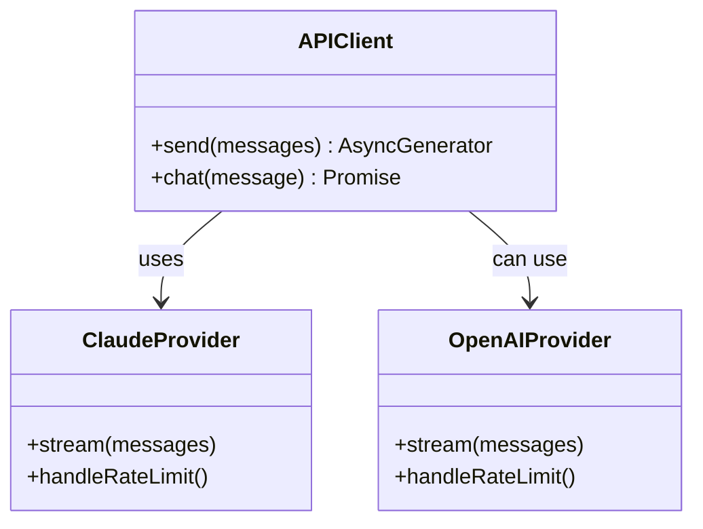
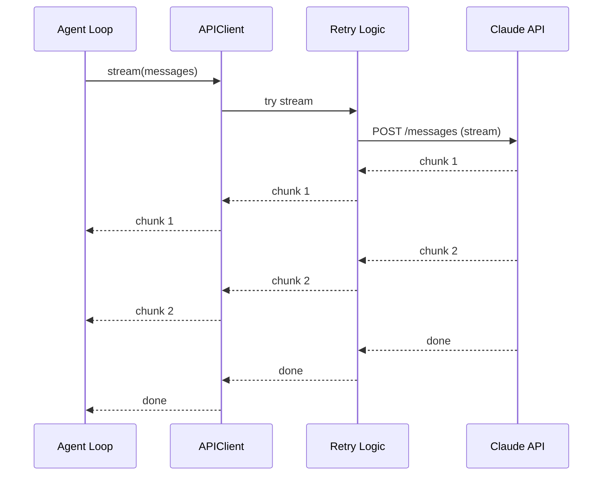

# Tutorial 2: API Layer - Talking to Claude

## Learning Objectives

- Multi-provider API abstraction
- Streaming responses with AsyncGenerators
- Error recovery with exponential backoff
- Prompt caching strategies

## The Problem

Direct API calls are messy:
```typescript
// ❌ Direct coupling - hard to test, no retries
const response = await fetch('https://api.anthropic.com/v1/messages', {...});
```

## The Solution: Provider Pattern



## Implementation

### Step 1: Provider Interface

```typescript
// src/api/provider.ts

export interface Message {
  role: 'user' | 'assistant' | 'system';
  content: string;
}

export interface StreamChunk {
  type: 'content' | 'thinking' | 'done';
  content?: string;
  thinking?: string;
}

export interface APIProvider {
  stream(messages: Message[]): AsyncGenerator<StreamChunk>;
  chat(messages: Message[]): Promise<string>;
}
```

### Step 2: Claude Provider

```typescript
// src/api/claude-provider.ts

import Anthropic from '@anthropic-ai/sdk';
import { APIProvider, Message, StreamChunk } from './provider';

export class ClaudeProvider implements APIProvider {
  private client: Anthropic;
  private cacheControl: Map<string, any> = new Map();

  constructor(private apiKey: string, private model: string = 'claude-3-sonnet-20240229') {
    this.client = new Anthropic({ apiKey });
  }

  /**
   * Stream responses using AsyncGenerator
   * This is the KEY pattern for the agent loop
   */
  async *stream(messages: Message[]): AsyncGenerator<StreamChunk> {
    const stream = await this.client.messages.create({
      model: this.model,
      max_tokens: 4096,
      messages: messages.map(m => ({
        role: m.role,
        content: m.content
      })),
      stream: true,
    });

    for await (const chunk of stream) {
      if (chunk.type === 'content_block_delta') {
        yield {
          type: 'content',
          content: chunk.delta?.text || ''
        };
      }
    }

    yield { type: 'done' };
  }

  /**
   * Non-streaming chat for simple requests
   */
  async chat(messages: Message[]): Promise<string> {
    const response = await this.client.messages.create({
      model: this.model,
      max_tokens: 4096,
      messages: messages.map(m => ({
        role: m.role,
        content: m.content
      }))
    });

    // Claude returns content blocks
    const content = response.content[0];
    return content.type === 'text' ? content.text : '';
  }

  /**
   * Enable prompt caching for repeated prefixes
   */
  enableCaching(prefix: string): void {
    this.cacheControl.set('prefix', prefix);
  }
}
```

### Step 3: Retry Logic

```typescript
// src/api/retry.ts

export async function withRetry<T>(
  fn: () => Promise<T>,
  maxRetries: number = 3,
  baseDelay: number = 1000
): Promise<T> {
  for (let attempt = 1; attempt <= maxRetries; attempt++) {
    try {
      return await fn();
    } catch (error) {
      if (attempt === maxRetries) throw error;
      
      // Exponential backoff
      const delay = baseDelay * Math.pow(2, attempt - 1);
      console.log(`Retry ${attempt}/${maxRetries} after ${delay}ms...`);
      await new Promise(resolve => setTimeout(resolve, delay));
    }
  }
  
  throw new Error('Max retries exceeded');
}
```

### Step 4: API Client

```typescript
// src/api/client.ts

import { APIProvider, Message, StreamChunk } from './provider';
import { withRetry } from './retry';

export class APIClient {
  constructor(private provider: APIProvider) {}

  /**
   * Stream with automatic retry
   */
  async *stream(messages: Message[]): AsyncGenerator<StreamChunk> {
    let attempts = 0;
    const maxAttempts = 3;
    
    while (attempts < maxAttempts) {
      try {
        for await (const chunk of this.provider.stream(messages)) {
          yield chunk;
        }
        return; // Success - exit
      } catch (error) {
        attempts++;
        if (attempts >= maxAttempts) throw error;
        
        // Exponential backoff
        const delay = 1000 * Math.pow(2, attempts - 1);
        console.log(`API error, retrying in ${delay}ms...`);
        await new Promise(r => setTimeout(r, delay));
      }
    }
  }

  /**
   * Simple chat with retry
   */
  async chat(messages: Message[]): Promise<string> {
    return withRetry(() => this.provider.chat(messages));
  }
}
```

## The AsyncGenerator Pattern

This is THE key pattern for AI agents:

```typescript
async function* streamResponse() {
  yield { type: 'thinking', content: 'Analyzing...' };
  await delay(500);
  
  yield { type: 'content', content: 'Here' };
  yield { type: 'content', content: ' is' };
  yield { type: 'content', content: ' the' };
  yield { type: 'content', content: ' answer!' };
  
  yield { type: 'done' };
}

// Usage
for await (const chunk of streamResponse()) {
  if (chunk.type === 'content') {
    process.stdout.write(chunk.content);
  }
}
```

**Benefits:**
- 🔄 Natural backpressure (consumer controls speed)
- 🚫 Easy cancellation (break the loop)
- 📦 Memory efficient (don't buffer everything)
- 🧪 Testable (just iterate)

## Prompt Caching Strategy

```typescript
// Cache the system prompt + conversation history
const cachedPrefix = [
  { role: 'system', content: systemPrompt },
  ...conversationHistory.slice(0, -1) // All but last message
];

const newMessage = conversationHistory[conversationHistory.length - 1];

// Send with cache control
const response = await api.stream([
  ...cachedPrefix.map(m => ({ ...m, cache_control: { type: 'ephemeral' } })),
  newMessage
]);
```

**Result:** ~95% token savings on repeated prefixes!

## Sequence Diagram



## Testing

```typescript
// tests/api.test.ts

import { APIClient } from '../src/api/client';
import { ClaudeProvider } from '../src/api/claude-provider';

// Mock provider for testing
class MockProvider implements APIProvider {
  async *stream(messages: Message[]) {
    yield { type: 'content', content: 'Hello' };
    yield { type: 'done' };
  }
  
  async chat(messages: Message[]) {
    return 'Hello';
  }
}

describe('APIClient', () => {
  it('should stream chunks', async () => {
    const client = new APIClient(new MockProvider());
    const chunks: StreamChunk[] = [];
    
    for await (const chunk of client.stream([])) {
      chunks.push(chunk);
    }
    
    expect(chunks).toHaveLength(2);
    expect(chunks[0].content).toBe('Hello');
  });
});
```

## Integration with Bootstrap

```typescript
// Update bootstrap.ts

// Phase 3: Service Registration
const apiProvider = new ClaudeProvider(config.apiKey, config.model);
const apiClient = new APIClient(apiProvider);
this.container.register('apiClient', apiClient);
```

## What We Learned

1. **Provider Pattern** - Abstract API implementations
2. **AsyncGenerator** - Streaming with backpressure
3. **Exponential Backoff** - Graceful error recovery
4. **Prompt Caching** - Save tokens on repeated context

## Next: The Agent Loop 🔄

T3 will wire everything together into the core agent loop!

---

**Git Commit:**
```bash
git add .
git commit -m "T02: API Layer - Multi-provider client, streaming, retry logic, prompt caching"
```
