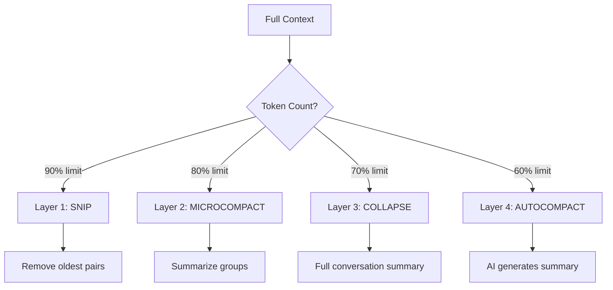

# Tutorial 3: The Agent Loop - Heart of the System

## Learning Objectives

- Build the query → act → observe cycle
- Implement 4-layer context compression
- Handle token budgets and limits
- Manage conversation flow

## The Agent Loop Pattern

The core of any AI agent:

```
┌─────────────────────────────────────────┐
│           AGENT LOOP                    │
├─────────────────────────────────────────┤
│  1. QUERY - User asks something         │
│  2. THINK - Model reasons (optional)  │
│  3. ACT   - Call tools/commands         │
│  4. OBSERVE - Get results               │
│  5. REPEAT - Until complete             │
└─────────────────────────────────────────┘
```

## The Problem

A chat is NOT a single request/response. It's a conversation that may require:
- Multiple tool calls
- Error recovery
- Context management
- Cost tracking

## Implementation

### Step 1: Agent Loop Structure

```typescript
// src/agent/agent-loop.ts

import { APIClient } from '../api/client';
import { StateManager, Message } from '../state/state-manager';
import { ToolManager } from '../tools/tool-manager';
import { Logger } from '../utils/logger';

export interface AgentContext {
  messages: Message[];
  tokenBudget: number;
  costSoFar: number;
}

export interface AgentResult {
  response: string;
  toolsUsed: string[];
  totalCost: number;
  totalTokens: number;
}

export class AgentLoop {
  constructor(
    private api: APIClient,
    private state: StateManager,
    private tools: ToolManager,
    private logger: Logger
  ) {}

  /**
   * THE AGENT LOOP
   * 
   * This is where the magic happens. The loop continues until:
   * - We get a final response (no tool calls)
   * - We hit a token/cost limit
   * - An error occurs
   */
  async run(userInput: string): Promise<AgentResult> {
    this.logger.info('Starting agent loop', { input: userInput.slice(0, 50) });

    // Add user message to state
    this.state.addMessage({
      id: `user-${Date.now()}`,
      role: 'user',
      content: userInput,
      timestamp: new Date()
    });

    let iterations = 0;
    const maxIterations = 10; // Safety limit
    const toolsUsed: string[] = [];

    while (iterations < maxIterations) {
      iterations++;
      this.logger.info(`Agent iteration ${iterations}`);

      // Get current conversation
      const conversation = this.state.getConversation();

      // COMPRESS context if needed
      const compressedMessages = this.compressContext(conversation.messages);

      // Call API
      const response = await this.api.chat(compressedMessages);

      // Check if response contains tool calls
      const toolCalls = this.parseToolCalls(response);

      if (toolCalls.length === 0) {
        // Final response - no tools needed
        this.state.addMessage({
          id: `assistant-${Date.now()}`,
          role: 'assistant',
          content: response,
          timestamp: new Date()
        });

        return {
          response,
          toolsUsed,
          totalCost: this.state.getState().session.totalCost,
          totalTokens: this.state.getState().session.totalTokens
        };
      }

      // Execute tools
      for (const toolCall of toolCalls) {
        this.logger.info(`Executing tool: ${toolCall.name}`);
        
        const result = await this.tools.execute(toolCall.name, toolCall.args);
        toolsUsed.push(toolCall.name);

        // Add tool result to conversation
        this.state.addMessage({
          id: `tool-${Date.now()}`,
          role: 'assistant',
          content: `[Tool ${toolCall.name} result: ${result}]`,
          timestamp: new Date()
        });
      }
    }

    throw new Error(`Max iterations (${maxIterations}) exceeded`);
  }

  /**
   * 4-LAYER CONTEXT COMPRESSION
   * 
   * When context gets too long, we compress in 4 stages:
   * 1. SNIP - Remove oldest messages
   * 2. MICROCOMPACT - Summarize groups
   * 3. COLLAPSE - Full summary
   * 4. AUTOCOMPACT - AI summarizes
   */
  private compressContext(messages: Message[]): Message[] {
    const tokenCount = this.estimateTokens(messages);
    const maxTokens = 100000; // Claude 3 limit

    if (tokenCount < maxTokens * 0.8) {
      return messages; // No compression needed
    }

    this.logger.info(`Compressing context: ${tokenCount} tokens`);

    // Layer 1: Snip - Remove oldest user/assistant pairs
    if (tokenCount > maxTokens * 0.9) {
      return this.snip(messages);
    }

    // Layer 2: Microcompact - Summarize older turns
    if (tokenCount > maxTokens * 0.8) {
      return this.microcompact(messages);
    }

    return messages;
  }

  private snip(messages: Message[]): Message[] {
    // Keep system message, remove oldest pairs
    const systemMsg = messages.find(m => m.role === 'system');
    const recent = messages.slice(-10); // Keep last 10
    return systemMsg ? [systemMsg, ...recent] : recent;
  }

  private microcompact(messages: Message[]): Message[] {
    // Group older messages and summarize
    // Implementation: Keep recent detailed, summarize old
    const recent = messages.slice(-6);
    const old = messages.slice(0, -6);
    
    return [
      { 
        id: 'compact', 
        role: 'system', 
        content: `Previous context: ${old.length} messages summarized`,
        timestamp: new Date()
      },
      ...recent
    ];
  }

  private estimateTokens(messages: Message[]): number {
    // Rough estimate: 1 token ≈ 4 characters
    return messages.reduce((acc, m) => acc + Math.ceil(m.content.length / 4), 0);
  }

  private parseToolCalls(response: string): Array<{name: string, args: any}> {
    // Parse tool calls from response
    // Format: <tool:name>{args}</tool>
    const matches = response.match(/<tool:(\w+)>(.*?)\u003c\/tool>/g) || [];
    return matches.map(match => {
      const name = match.match(/<tool:(\w+)>/)?.[1] || '';
      const args = match.match(/<tool:\w+>(.*?)\u003c\/tool>/)?.[1] || '{}';
      return { name, args: JSON.parse(args) };
    });
  }
}
```

## 4-Layer Compression Explained



| Layer | Trigger | Action | Data Loss |
|-------|---------|--------|-----------|
| 1. Snip | 90% | Delete old messages | High |
| 2. Microcompact | 80% | Group summary | Medium |
| 3. Collapse | 70% | One summary | Medium |
| 4. Autocompact | 60% | AI summary | Low |

## Token Budget Management

```typescript
interface TokenBudget {
  maxInput: number;   // Context window
  maxOutput: number;  // Response size
  reserve: number;    // Buffer for tools
}

class BudgetManager {
  private budget: TokenBudget = {
    maxInput: 100000,
    maxOutput: 8192,
    reserve: 2000
  };

  canAfford(requested: number): boolean {
    const available = this.budget.maxInput - this.budget.reserve;
    return requested <= available;
  }

  escalateOutput(): void {
    // Hit limit? Escalate from 8K to 64K
    this.budget.maxOutput = 64000;
  }
}
```

## Sequence Diagram

```mermaid
sequenceDiagram
    participant User
    participant Loop as AgentLoop
    participant API as APIClient
    participant Tools as ToolManager
    participant State as StateManager
    
    User->>Loop: run("Fix the bug")
    Loop->>State: addMessage(user)
    
    loop Until Complete
        Loop->>State: getConversation()
        State-->>Loop: messages
        
        Loop->>Loop: compressContext()
        
        Loop->>API: chat(messages)
        API-->>Loop: response
        
        Loop->>Loop: parseToolCalls()
        
        alt Has Tool Calls
            Loop->>Tools: execute(tool)
            Tools-->>Loop: result
            Loop->>State: addMessage(tool result)
        else No Tools
            Loop->>State: addMessage(response)
        end
    end
    
    Loop-->>User: AgentResult
```

## What We Learned

1. **Loop Until Done** - Agent acts until complete, not one-shot
2. **4-Layer Compression** - Progressive context reduction
3. **Token Budget** - Track and manage costs
4. **Tool Integration** - Parse and execute tool calls

## Next: Tool System 🔧

T4 will implement the 14-step tool pipeline!

---

**Git Commit:**
```bash
git add .
git commit -m "T03: Agent Loop - Query/act/observe cycle, 4-layer compression, token budgets"
```
