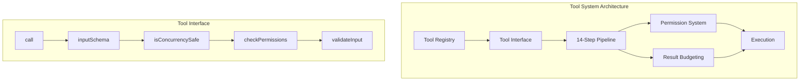
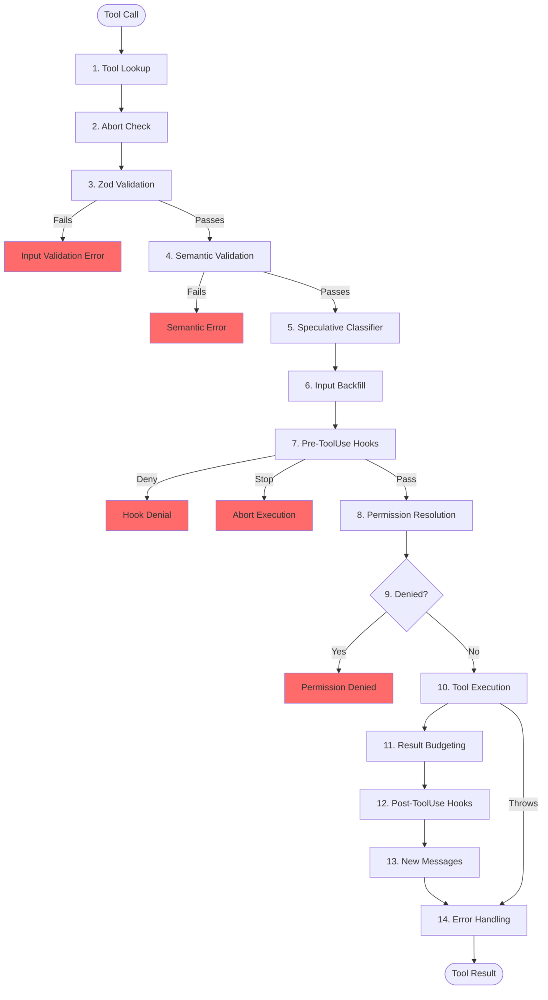
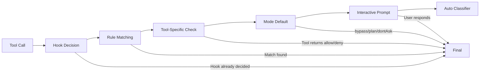

# Tutorial 6: Tool System - From Definition to Execution

## Learning Objectives

By the end of this tutorial, you'll understand:
- The complete 14-step tool execution pipeline
- Input-dependent concurrency classification
- The 7-mode permission system with layered resolution
- Result budgeting and persistence strategies
- Fail-closed defaults for tool safety

## What We're Building

The tool system is the nervous system of Claude Code. While the agent loop is the heartbeat, the tool system translates "the model wants to run `git status`" into an actual shell command, with permission checks, result budgeting, and error handling. Every tool call flows through the same 14-step pipeline.



## The Tool Interface

Every tool in Claude Code is parameterized over three types:

```typescript
// src/tools/types.ts

import { z } from 'zod';

/**
 * Tool interface with three type parameters:
 * - Input: Zod schema for validation and JSON Schema generation
 * - Output: TypeScript return type
 * - Progress: Progress events emitted during execution
 */
export interface Tool<
  Input extends z.ZodTypeAny = z.ZodTypeAny,
  Output = unknown,
  Progress = unknown
> {
  // Core identification
  name: string;
  description: string;
  
  // Schema for validation and API JSON Schema generation
  inputSchema: Input;
  
  // Main execution function
  call(input: z.infer<Input>, context: ToolUseContext): Promise<ToolResult<Output>>;
  
  // Concurrency classification - INPUT DEPENDENT
  isConcurrencySafe(input: z.infer<Input>): boolean;
  
  // Read/write classification - INPUT DEPENDENT  
  isReadOnly(input: z.infer<Input>): boolean;
  
  // Permission check - runs AFTER general permission system
  checkPermissions(
    input: z.infer<Input>,
    context: ToolUseContext
  ): PermissionCheckResult;
  
  // Semantic validation beyond schema
  validateInput?(input: z.infer<Input>): ValidationResult;
  
  // Result size limit for budgeting
  maxResultSizeChars: number;
  
  // Feature flag gating
  isEnabled(): boolean;
  
  // Deferred loading for MCP tools
  shouldDefer?: boolean;
}

export interface ToolResult<T> {
  data: T;
  // Additional messages to inject (sub-agent transcripts, reminders)
  newMessages?: Message[];
  // Function to modify context for subsequent tools
  contextModifier?: (context: ToolUseContext) => ToolUseContext;
}

export interface ToolUseContext {
  // Configuration (mostly immutable)
  options: {
    toolSet: Tool[];
    model: string;
    mcpConnections: Map<string, MCPConnection>;
    debug: boolean;
  };
  
  // Execution state
  abortController: AbortController;
  readFileState: LRUCache<string, FileState>;  // LRU file cache
  messages: Message[];  // Full conversation history
  workingDirectory: string;
  
  // Permission state
  permissionMode: PermissionMode;
  alwaysAllowRules: PermissionRule[];
  alwaysDenyRules: PermissionRule[];
  alwaysAskRules: PermissionRule[];
  
  // UI callbacks (undefined in headless mode)
  setToolJSX?: (jsx: React.ReactNode) => void;
  addNotification?: (notification: Notification) => void;
  requestPrompt?: (prompt: PromptRequest) => Promise<string>;
  
  // Agent context
  agentId?: string;
  renderedSystemPrompt?: string;  // Frozen for cache stability
  parentContext?: ToolUseContext;  // For sub-agents
}

export type PermissionMode =
  | 'default'
  | 'acceptEdits'
  | 'plan'
  | 'dontAsk'
  | 'bypassPermissions'
  | 'auto'
  | 'bubble';

export interface PermissionRule {
  source: 'userSettings' | 'projectSettings' | 'localSettings' | 'cliArg' | 'policySettings' | 'session';
  behavior: 'allow' | 'deny' | 'ask';
  toolName: string;
  contentPattern?: string;  // e.g., "Bash(git *)" for git commands
}

export interface PermissionCheckResult {
  behavior: 'allow' | 'deny' | 'ask' | 'passthrough';
  updatedInput?: unknown;
  reason?: string;
}

export interface ValidationResult {
  valid: boolean;
  error?: string;
}
```

## Fail-Closed Defaults Pattern

Every tool passes through `buildTool()` which spreads fail-closed defaults:

```typescript
// src/tools/buildTool.ts

import { z } from 'zod';
import { Tool, ToolResult, ToolUseContext } from './types.js';

/**
 * SAFE_DEFAULTS - Fail-closed for safety
 * 
 * A new tool that forgets to implement these gets the SAFE behavior,
 * not the dangerous one.
 */
const SAFE_DEFAULTS = {
  // Feature gating - enabled by default
  isEnabled: () => true,
  
  // FAIL-CLOSED: New tools run serially unless explicitly marked safe
  isConcurrencySafe: () => false,
  
  // FAIL-CLOSED: New tools treated as writes unless explicitly marked read-only
  isReadOnly: () => false,
  
  // Destructive operations require explicit marking
  isDestructive: () => false,
  
  // Permission check - "passthrough" means defer to general permission system
  checkPermissions: (): { behavior: 'passthrough' } => ({ behavior: 'passthrough' }),
  
  // Result budgeting - conservative default
  maxResultSizeChars: 10000,
  
  // Deferred loading - disabled by default for built-in tools
  shouldDefer: false,
  
  // No semantic validation by default
  validateInput: undefined,
};

/**
 * buildTool - Factory that applies fail-closed defaults
 * 
 * The definition overrides defaults. If a tool forgets to set
 * isConcurrencySafe, it defaults to false (serial execution).
 */
export function buildTool<TInput extends z.ZodTypeAny, TOutput, TProgress>(
  definition: Partial<Tool<TInput, TOutput, TProgress>> & 
    Pick<Tool<TInput, TOutput, TProgress>, 'name' | 'description' | 'inputSchema' | 'call'>
): Tool<TInput, TOutput, TProgress> {
  return {
    ...SAFE_DEFAULTS,
    ...definition,
  } as Tool<TInput, TOutput, TProgress>;
}
```

## The 14-Step Execution Pipeline

Every tool call flows through these 14 steps:



```typescript
// src/tools/pipeline.ts

import { z } from 'zod';
import { 
  Tool, 
  ToolResult, 
  ToolUseContext, 
  ToolCall,
  PermissionCheckResult 
} from './types.js';

export interface PipelineState {
  toolCall: ToolCall;
  tool: Tool;
  parsedInput: unknown;
  abortController: AbortController;
}

/**
 * The 14-step execution pipeline
 */
export async function executeToolPipeline(
  toolCall: ToolCall,
  context: ToolUseContext,
  registry: ToolRegistry
): Promise<ToolResult<unknown>> {
  
  // === STEP 1: Tool Lookup ===
  const tool = registry.lookup(toolCall.name);
  if (!tool) {
    return {
      data: null,
      error: `Unknown tool: ${toolCall.name}. Available tools: ${registry.getNames().join(', ')}`,
    };
  }
  
  // === STEP 2: Abort Check ===
  if (context.abortController.signal.aborted) {
    return {
      data: null,
      error: 'Tool execution aborted',
    };
  }
  
  // === STEP 3: Zod Validation ===
  const parseResult = tool.inputSchema.safeParse(toolCall.input);
  if (!parseResult.success) {
    // For deferred tools, hint to call ToolSearch first
    const hint = tool.shouldDefer 
      ? ' This is a deferred tool. Call ToolSearch first to load its schema.' 
      : '';
    return {
      data: null,
      error: `Input validation failed: ${parseResult.error.message}${hint}`,
    };
  }
  const parsedInput = parseResult.data;
  
  // === STEP 4: Semantic Validation ===
  if (tool.validateInput) {
    const validation = tool.validateInput(parsedInput);
    if (!validation.valid) {
      return {
        data: null,
        error: validation.error || 'Semantic validation failed',
      };
    }
  }
  
  // === STEP 5: Speculative Classifier Start ===
  // Start auto-mode classifier in parallel for bash commands
  const classifierPromise = startSpeculativeClassifier(tool, parsedInput);
  
  // === STEP 6: Input Backfill ===
  // Clone input and add derived fields (e.g., expand ~/ to absolute path)
  const enrichedInput = enrichInput(parsedInput, context);
  
  // === STEP 7: Pre-ToolUse Hooks ===
  const hookResult = await runPreToolUseHooks(tool, enrichedInput, context);
  if (hookResult.behavior === 'deny') {
    return {
      data: null,
      error: hookResult.reason || 'Denied by hook',
    };
  }
  if (hookResult.behavior === 'stop') {
    return {
      data: null,
      error: 'Execution stopped by hook',
    };
  }
  
  // === STEP 8: Permission Resolution ===
  const permission = await resolvePermission(
    tool,
    enrichedInput,
    context,
    hookResult,
    classifierPromise
  );
  
  // === STEP 9: Permission Denied? ===
  if (permission.behavior === 'deny') {
    runPermissionDeniedHooks(tool, enrichedInput, context);
    return {
      data: null,
      error: permission.reason || 'Permission denied',
    };
  }
  
  // === STEP 10: Tool Execution ===
  let result: ToolResult<unknown>;
  try {
    result = await tool.call(enrichedInput, context);
  } catch (error) {
    // Jump to error handling
    return handleToolError(tool, toolCall, error, context);
  }
  
  // === STEP 11: Result Budgeting ===
  result = await applyResultBudgeting(result, tool.maxResultSizeChars, context);
  
  // === STEP 12: Post-ToolUse Hooks ===
  await runPostToolUseHooks(tool, enrichedInput, result, context);
  
  // === STEP 13: New Messages ===
  if (result.newMessages) {
    context.messages.push(...result.newMessages);
  }
  
  // === STEP 14: Error Handling & Telemetry ===
  // Classify error for telemetry (safe strings only, no raw messages)
  // Emit OTel events
  
  return result;
}

/**
 * Input enrichment - add derived fields without mutating original
 */
function enrichInput(input: unknown, context: ToolUseContext): unknown {
  if (typeof input !== 'object' || input === null) {
    return input;
  }
  
  const enriched = { ...input } as Record<string, unknown>;
  
  // Expand paths like ~/file.txt to absolute paths
  if ('file_path' in enriched && typeof enriched.file_path === 'string') {
    if (enriched.file_path.startsWith('~/')) {
      enriched.file_path = enriched.file_path.replace(
        '~/',
        process.env.HOME + '/'
      );
    }
    if (!enriched.file_path.startsWith('/')) {
      enriched.file_path = `${context.workingDirectory}/${enriched.file_path}`;
    }
  }
  
  return enriched;
}

/**
 * Apply result budgeting - persist oversized results to disk
 */
async function applyResultBudgeting<T>(
  result: ToolResult<T>,
  maxSize: number,
  context: ToolUseContext
): Promise<ToolResult<T>> {
  const resultStr = JSON.stringify(result.data);
  
  if (resultStr.length <= maxSize || maxSize === Infinity) {
    return result;
  }
  
  // Persist to disk and replace with preview
  const hash = await computeHash(resultStr);
  const persistPath = `~/.claude/tool-results/${hash}.txt`;
  await persistResult(resultStr, persistPath);
  
  const preview = resultStr.substring(0, 500) + '...';
  
  return {
    ...result,
    data: `<persisted-output path="${persistPath}" size="${resultStr.length}">
${preview}
</persisted-output>` as unknown as T,
  };
}
```

## The Permission System

The permission system has 7 modes and a layered resolution chain:



```typescript
// src/tools/permissions.ts

import { Tool, ToolUseContext, PermissionMode, PermissionRule } from './types.js';

/**
 * Permission mode behaviors
 */
const MODE_BEHAVIORS: Record<PermissionMode, ModeBehavior> = {
  default: {
    // Tool-specific checks + prompt for unrecognized
    allowByDefault: false,
    promptEnabled: true,
  },
  acceptEdits: {
    // Auto-allow file edits, prompt for others
    allowByDefault: false,
    promptEnabled: true,
    autoAllowToolPatterns: ['FileEdit', 'Write'],
  },
  plan: {
    // Read-only mode - deny all writes
    allowByDefault: false,
    promptEnabled: false,
    denyWriteOperations: true,
  },
  dontAsk: {
    // Auto-deny anything that would prompt (for background agents)
    allowByDefault: false,
    promptEnabled: false,
    autoDeny: true,
  },
  bypassPermissions: {
    // Allow everything without prompting
    allowByDefault: true,
    promptEnabled: false,
  },
  auto: {
    // Use transcript classifier to decide
    allowByDefault: false,
    promptEnabled: true,
    useClassifier: true,
  },
  bubble: {
    // Escalate to parent context (for sub-agents)
    allowByDefault: false,
    promptEnabled: false,
    escalateToParent: true,
  },
};

/**
 * Resolve permission for a tool call
 */
export async function resolvePermission(
  tool: Tool,
  input: unknown,
  context: ToolUseContext,
  hookResult: PermissionCheckResult,
  classifierPromise: Promise<ClassifierResult>
): Promise<PermissionCheckResult> {
  
  // LAYER 1: Hook decision (if already made)
  if (hookResult.behavior !== 'passthrough') {
    return hookResult;  // Final
  }
  
  // LAYER 2: Rule matching
  const ruleMatch = matchPermissionRule(tool.name, input, context);
  if (ruleMatch) {
    return {
      behavior: ruleMatch.behavior,
      reason: `Matched rule: ${ruleMatch.source}`,
    };
  }
  
  // LAYER 3: Tool-specific check
  const toolCheck = tool.checkPermissions(input as never, context);
  if (toolCheck.behavior !== 'passthrough') {
    return toolCheck;
  }
  
  // LAYER 4: Mode-based default
  const mode = MODE_BEHAVIORS[context.permissionMode];
  if (mode.allowByDefault) {
    return { behavior: 'allow', reason: 'Mode: bypassPermissions' };
  }
  if (mode.denyWriteOperations && !tool.isReadOnly(input as never)) {
    return { behavior: 'deny', reason: 'Mode: plan (read-only)' };
  }
  if (mode.autoDeny) {
    return { behavior: 'deny', reason: 'Mode: dontAsk' };
  }
  
  // LAYER 5: Interactive prompt
  if (mode.promptEnabled && context.requestPrompt) {
    const userResponse = await context.requestPrompt({
      tool: tool.name,
      input,
      message: `Allow ${tool.name}?`,
    });
    return {
      behavior: userResponse.toLowerCase().startsWith('y') ? 'allow' : 'deny',
      reason: 'User prompt',
    };
  }
  
  // LAYER 6: Auto classifier
  if (mode.useClassifier) {
    const classifierResult = await classifierPromise;
    return {
      behavior: classifierResult.approved ? 'allow' : 'deny',
      reason: `Classifier: ${classifierResult.confidence}`,
    };
  }
  
  // Default: ask
  return { behavior: 'ask', reason: 'No resolution' };
}

/**
 * Match permission rules with pattern support
 * 
 * Supports patterns like:
 * - Bash(git *) - git commands
 * - Edit(/src/**) - edits in /src directory
 * - Fetch(domain:example.com) - specific domain
 */
function matchPermissionRule(
  toolName: string,
  input: unknown,
  context: ToolUseContext
): PermissionRule | null {
  const allRules = [
    ...context.alwaysAllowRules,
    ...context.alwaysDenyRules,
    ...context.alwaysAskRules,
  ];
  
  for (const rule of allRules) {
    if (rule.toolName !== toolName) continue;
    
    if (!rule.contentPattern) {
      return rule;  // No pattern = matches all
    }
    
    // Pattern matching
    if (matchesPattern(input, rule.contentPattern)) {
      return rule;
    }
  }
  
  return null;
}

/**
 * Pattern matching for permission rules
 */
function matchesPattern(input: unknown, pattern: string): boolean {
  // Bash(git *) pattern
  if (pattern.includes(' ')) {
    const [prefix, suffix] = pattern.split(' ');
    const inputStr = JSON.stringify(input);
    if (prefix && inputStr.includes(prefix)) {
      const regex = new RegExp('^' + suffix.replace('*', '.*') + '$');
      return regex.test(inputStr);
    }
  }
  
  // Path pattern: Edit(/src/**)
  if (pattern.includes('/**')) {
    const prefix = pattern.replace('/**', '');
    const inputObj = input as Record<string, unknown>;
    const path = inputObj.file_path || inputObj.path;
    if (typeof path === 'string') {
      return path.startsWith(prefix);
    }
  }
  
  return false;
}
```

## Tool Registry

The registry provides a single source of truth for all tools:

```typescript
// src/tools/registry.ts

import { Tool } from './types.js';
import { ReadFileTool } from './definitions/ReadFileTool.js';
import { WriteFileTool } from './definitions/WriteFileTool.js';
import { BashTool } from './definitions/BashTool.js';
import { GrepTool } from './definitions/GrepTool.js';
import { GlobTool } from './definitions/GlobTool.js';
import { AgentTool } from './definitions/AgentTool.js';

/**
 * Get all base tools - single source of truth
 * 
 * Always-present tools first, then feature-flagged tools.
 * Feature flags are resolved at bundle time for dead code elimination.
 */
export function getAllBaseTools(): Tool[] {
  const tools: (Tool | null)[] = [
    // Always-present built-in tools
    ReadFileTool,
    WriteFileTool,
    BashTool,
    GrepTool,
    GlobTool,
    
    // Feature-flagged tools
    // Bundler eliminates these when feature('PROACTIVE') is false
    isFeatureEnabled('PROACTIVE') ? SleepTool : null,
    isFeatureEnabled('AGENT_SWARMS') ? AgentTool : null,
    isFeatureEnabled('MCP') ? MCPManagerTool : null,
  ];
  
  return tools.filter((t): t is Tool => t !== null && t.isEnabled());
}

/**
 * Assemble the final tool pool
 * 
 * Sort built-ins and MCP tools separately, then concatenate.
 * This preserves API server prompt cache breakpoints.
 */
export function assembleToolPool(
  baseTools: Tool[],
  mcpTools: Tool[],
  denyRules: string[]
): Tool[] {
  // Filter by deny rules
  const filteredBase = baseTools.filter(t => !denyRules.includes(t.name));
  const filteredMcp = mcpTools.filter(t => !denyRules.includes(t.name));
  
  // Sort each partition alphabetically
  const sortedBase = filteredBase.sort((a, b) => a.name.localeCompare(b.name));
  const sortedMcp = filteredMcp.sort((a, b) => a.name.localeCompare(b.name));
  
  // Concatenate: built-ins first, then MCP
  // This preserves cache breakpoints - adding/removing MCP tools
  // doesn't shift built-in tool positions
  return [...sortedBase, ...sortedMcp];
}

class ToolRegistry {
  private tools: Map<string, Tool> = new Map();
  private aliases: Map<string, string> = new Map();
  
  register(tool: Tool): void {
    this.tools.set(tool.name, tool);
  }
  
  registerAlias(alias: string, target: string): void {
    this.aliases.set(alias, target);
  }
  
  lookup(name: string): Tool | undefined {
    // Direct lookup
    const direct = this.tools.get(name);
    if (direct) return direct;
    
    // Alias fallback (for renamed tools in old transcripts)
    const aliased = this.aliases.get(name);
    if (aliased) {
      return this.tools.get(aliased);
    }
    
    return undefined;
  }
  
  getNames(): string[] {
    return Array.from(this.tools.keys());
  }
  
  getAll(): Tool[] {
    return Array.from(this.tools.values());
  }
}

export const toolRegistry = new ToolRegistry();
```

## Concrete Tool Implementation: ReadFileTool

Let's implement a complete tool with all the patterns:

```typescript
// src/tools/definitions/ReadFileTool.ts

import { z } from 'zod';
import { buildTool } from '../buildTool.js';
import { readFile } from 'fs/promises';

/**
 * ReadFileTool - The most versatile reader
 * 
 * Reads text files, images, PDFs, and directories.
 * Self-bounds via token limits rather than maxResultSizeChars.
 */
const ReadFileInput = z.object({
  file_path: z.string().describe('Absolute or relative path to file'),
  offset: z.number().optional().describe('Line number to start from'),
  limit: z.number().optional().describe('Max lines to read'),
});

export const ReadFileTool = buildTool({
  name: 'Read',
  description: 'Read the contents of a file or directory',
  inputSchema: ReadFileInput,
  
  // ReadFileTool is ALWAYS concurrency-safe and read-only
  // No input inspection needed
  isConcurrencySafe: () => true,
  isReadOnly: () => true,
  
  // Self-bounds via token estimation, no need for external budgeting
  maxResultSizeChars: Infinity,
  
  // Block dangerous device paths
  validateInput: (input) => {
    const dangerous = ['/dev/zero', '/dev/random', '/dev/stdin', '/dev/null'];
    if (dangerous.some(d => input.file_path.includes(d))) {
      return { valid: false, error: 'Cannot read device files' };
    }
    return { valid: true };
  },
  
  // No tool-specific permission logic
  checkPermissions: () => ({ behavior: 'passthrough' }),
  
  call: async (input, context) => {
    const { file_path, offset, limit } = input;
    
    // Resolve path
    const resolvedPath = file_path.startsWith('~/')
      ? file_path.replace('~/', process.env.HOME + '/')
      : file_path.startsWith('/')
        ? file_path
        : `${context.workingDirectory}/${file_path}`;
    
    // Check if it's a directory
    const stats = await stat(resolvedPath).catch(() => null);
    if (!stats) {
      return {
        data: null,
        error: `File not found: ${file_path}`,
      };
    }
    
    if (stats.isDirectory()) {
      // Fallback to ls for directories
      const entries = await readdir(resolvedPath);
      return {
        data: `Directory: ${file_path}\n\n${entries.join('\n')}`,
      };
    }
    
    // Read file
    let content = await readFile(resolvedPath, 'utf-8');
    const lines = content.split('\n');
    
    // Apply offset/limit
    const startLine = offset ? offset - 1 : 0;
    const endLine = limit ? startLine + limit : lines.length;
    const selectedLines = lines.slice(startLine, endLine);
    
    // Add line numbers
    const numbered = selectedLines.map((line, i) => {
      const lineNum = (startLine + i + 1).toString().padStart(4, ' ');
      return `${lineNum} │ ${line}`;
    });
    
    const result = numbered.join('\n');
    const truncated = lines.length > endLine;
    
    // Update readFileState cache
    context.readFileState.set(resolvedPath, {
      content,
      mtime: stats.mtime,
      size: stats.size,
    });
    
    return {
      data: truncated 
        ? `${result}\n\n... (${lines.length - endLine} more lines)`
        : result,
    };
  },
});
```

## Concrete Tool Implementation: BashTool

BashTool shows input-dependent concurrency classification:

```typescript
// src/tools/definitions/BashTool.ts

import { z } from 'zod';
import { buildTool } from '../buildTool.js';
import { exec } from 'child_process';
import { promisify } from 'util';

const execAsync = promisify(exec);

/**
 * Known safe command sets for concurrency classification
 */
const BASH_SEARCH_COMMANDS = ['grep', 'find', 'rg', 'ag'];
const BASH_READ_COMMANDS = ['cat', 'head', 'tail', 'less', 'more', 'ls', 'pwd', 'echo'];
const BASH_LIST_COMMANDS = ['ls', 'll', 'dir'];
const BASH_NEUTRAL_COMMANDS = ['echo', 'printf', 'true', 'false'];

const BashInput = z.object({
  command: z.string().describe('The bash command to execute'),
  cwd: z.string().optional().describe('Working directory'),
  timeout: z.number().optional().describe('Timeout in milliseconds'),
});

/**
 * Parse compound command and classify subcommands
 * 
 * "cd /tmp && mkdir build && ls build" → ['cd /tmp', 'mkdir build', 'ls build']
 * Each subcommand is classified for safety.
 */
function classifyCommand(command: string): {
  isReadOnly: boolean;
  isConcurrencySafe: boolean;
} {
  // Split by operators
  const operators = /&&|;|\|\||\|/;
  const subcommands = command.split(operators).map(s => s.trim()).filter(Boolean);
  
  let hasWrite = false;
  let hasDangerous = false;
  
  for (const sub of subcommands) {
    const tokens = sub.split(/\s+/);
    const cmd = tokens[0];
    
    // Neutral commands don't affect classification
    if (BASH_NEUTRAL_COMMANDS.includes(cmd)) continue;
    
    // Check for write operations
    const writeCommands = ['rm', 'mv', 'cp', 'mkdir', 'touch', 'chmod', 'chown', 
                          '>', '>>', 'sed', 'awk', 'perl', 'tee'];
    if (writeCommands.some(w => sub.includes(w))) {
      hasWrite = true;
    }
    
    // Check for dangerous patterns
    const dangerous = ['rm -rf /', '> /dev/sda', ':(){ :|:& };:', 'curl.*sh'];
    if (dangerous.some(d => new RegExp(d).test(sub))) {
      hasDangerous = true;
    }
  }
  
  return {
    isReadOnly: !hasWrite,
    isConcurrencySafe: !hasWrite && !hasDangerous,
  };
}

export const BashTool = buildTool({
  name: 'Bash',
  description: 'Execute a bash command',
  inputSchema: BashInput,
  maxResultSizeChars: 30000,
  
  // INPUT-DEPENDENT: Same tool, different inputs = different safety
  isConcurrencySafe: (input) => {
    const classification = classifyCommand(input.command);
    return classification.isConcurrencySafe;
  },
  
  isReadOnly: (input) => {
    const classification = classifyCommand(input.command);
    return classification.isReadOnly;
  },
  
  checkPermissions: (input, context) => {
    // Parse for security - if too complex, fail-safe
    try {
      const { isReadOnly } = classifyCommand(input.command);
      
      // In plan mode, deny writes
      if (context.permissionMode === 'plan' && !isReadOnly) {
        return {
          behavior: 'deny',
          reason: 'Write operation blocked in plan mode',
        };
      }
      
      // Block obviously dangerous
      const dangerous = ['rm -rf /', '> /dev/null; rm', 'curl | bash'];
      if (dangerous.some(d => input.command.includes(d))) {
        return {
          behavior: 'deny',
          reason: 'Dangerous command blocked',
        };
      }
      
    } catch {
      // Fail-safe: if we can't parse, require explicit permission
      return { behavior: 'passthrough' };
    }
    
    return { behavior: 'passthrough' };
  },
  
  call: async (input, context) => {
    const { command, cwd, timeout = 60000 } = input;
    
    // Apply timeout via abort controller
    const abortPromise = new Promise<never>((_, reject) => {
      context.abortController.signal.addEventListener('abort', () => {
        reject(new Error('Command aborted'));
      });
    });
    
    const execPromise = execAsync(command, {
      cwd: cwd || context.workingDirectory,
      timeout,
    });
    
    const { stdout, stderr } = await Promise.race([execPromise, abortPromise]);
    
    // Detect image output by magic bytes
    const hasImage = stdout.includes('\x89PNG') || 
                     stdout.includes('\xff\xd8\xff');
    
    return {
      data: stdout || stderr || 'Command completed successfully',
      // Could return image data here if detected
    };
  },
});
```

## Error Classification

Tools classify errors for telemetry without leaking sensitive data:

```typescript
// src/tools/errors.ts

/**
 * Classify tool errors for telemetry
 * 
 * Extracts safe strings without raw error messages
 * that might contain sensitive data.
 */
export function classifyToolError(error: unknown): ErrorClassification {
  if (error instanceof z.ZodError) {
    return {
      category: 'validation',
      type: 'ZodError',
      safeMessage: 'Input validation failed',
      telemetrySafe: true,
    };
  }
  
  if (error instanceof Error) {
    // In minified builds, constructor.name is mangled
    // Extract from known patterns
    const name = error.name || 'Error';
    
    // Permission errors
    if (name.includes('Permission') || error.message.includes('permission')) {
      return {
        category: 'permission',
        type: 'PermissionDenied',
        safeMessage: 'Permission denied',
        telemetrySafe: true,
      };
    }
    
    // File not found
    if (error.message.includes('ENOENT')) {
      return {
        category: 'filesystem',
        type: 'FileNotFound',
        safeMessage: 'File not found',
        errno: 'ENOENT',
        telemetrySafe: true,
      };
    }
    
    // Timeout
    if (error.message.includes('timeout') || name.includes('Timeout')) {
      return {
        category: 'execution',
        type: 'Timeout',
        safeMessage: 'Operation timed out',
        telemetrySafe: true,
      };
    }
    
    // Generic - only use error type, not message
    return {
      category: 'unknown',
      type: name,
      safeMessage: 'Operation failed',
      telemetrySafe: true,
    };
  }
  
  return {
    category: 'unknown',
    type: 'Unknown',
    safeMessage: 'Unknown error',
    telemetrySafe: false,
  };
}
```

## Integration with Agent Loop

The agent loop uses the tool system:

```typescript
// src/agent/loop.ts (updated)

import { executeToolPipeline } from '../tools/pipeline.js';
import { toolRegistry } from '../tools/registry.js';

// In the loop, after receiving tool_calls:
for (const toolCall of toolCalls) {
  const result = await executeToolPipeline(
    toolCall,
    context,
    toolRegistry
  );
  
  // Handle context modifier (only for serial tools)
  if (result.contextModifier && !tool.isConcurrencySafe(toolCall.input)) {
    context = result.contextModifier(context);
  }
  
  toolResults.push(result);
  yield { type: 'tool_result', result };
}
```

## What We Learned

1. **Fail-Closed Defaults** - New tools get safe behavior by default (serial execution, write classification)

2. **Input-Dependent Safety** - `isConcurrencySafe(input)` not `isConcurrencySafe()` - same tool, different safety profiles

3. **14-Step Pipeline** - Structured execution: lookup → validation → permission → execution → budgeting → hooks

4. **Layered Permissions** - Hooks → Rules → Tool-specific → Mode → Prompt → Classifier - each layer handles different cases

5. **Result Budgeting** - Per-tool limits + aggregate conversation budget prevent context explosion

6. **Telemetry-Safe Errors** - Classify without leaking sensitive data (no raw error messages to analytics)

7. **Context Modifiers** - Tools can modify execution environment for subsequent tools (serial-only restriction)

## Architecture Decision Records

**ADR 1: God Object vs Parameter Explosion**
`ToolUseContext` has ~40 fields. The alternative is 15+ parameters to every tool function. The god object is the lesser evil.

**ADR 2: Infinity for ReadFileTool**
ReadFileTool has `maxResultSizeChars: Infinity` because self-bounding via token estimation prevents circular Read loops.

**ADR 3: Built-ins Before MCP in Sort**
Sorting built-ins and MCP tools separately preserves API server prompt cache breakpoints. Adding an MCP tool doesn't shift built-in positions.

---

**Next: Tutorial 7 - Concurrent Tool Execution**

We'll implement the partition algorithm that groups tool calls into concurrent batches, and speculative execution that starts tools before the model finishes streaming.
