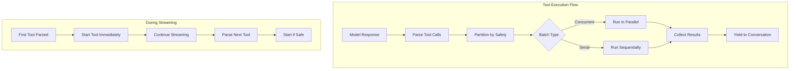
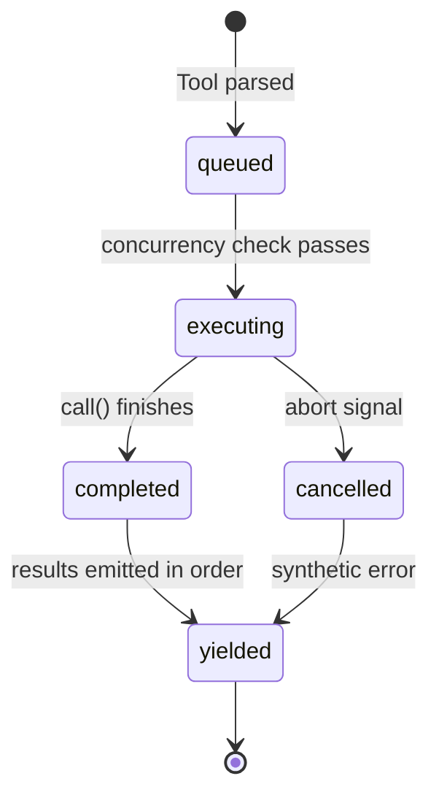

# Tutorial 7: Concurrent Tool Execution

## Learning Objectives

By the end of this tutorial, you'll understand:
- The partition algorithm that groups tools by concurrency safety
- Speculative execution during model response streaming
- Input-dependent concurrency classification (per-call, not per-tool)
- The StreamingToolExecutor lifecycle and state machine
- Order-preserving result harvesting
- Error cascades and abort controller hierarchies

## What We're Building

In Tutorial 6, we built the 14-step tool execution pipeline. But we executed tools one at a time. In this tutorial, we'll implement the concurrency layer that makes Claude Code fast:

1. **Partition Algorithm**: Group consecutive concurrency-safe tools into parallel batches
2. **Streaming Executor**: Start tools while the model is still streaming its response
3. **Orchestrator**: Manage the lifecycle of concurrent and serial tool execution



## The Core Insight

**Concurrency is per-call, not per-tool-type.**

`Bash("ls -la")` is safe to parallelize. `Bash("rm -rf build/")` is not. Same tool, different inputs, different safety profiles. The system must inspect the input before deciding.

## Step 1: The Partition Algorithm

The `partitionToolCalls()` function groups tool calls into batches. Each batch is either:
- **Concurrent**: All tools in the batch are safe to run in parallel
- **Serial**: A single tool that must run alone (or a sequence of such tools)

### Implementation

Create `src/tools/orchestrator.ts`:

```typescript
/**
 * Tool Orchestrator - Partition and Execute Tool Batches
 * 
 * Groups consecutive concurrency-safe tools into parallel batches,
 * isolating unsafe tools into serial batches.
 */

import { Tool, ToolCall, ToolResult, ToolUseContext } from './types.js';
import { ToolRegistry } from './registry.js';
import { executeToolPipeline } from './pipeline.js';

/**
 * A batch of tool calls with execution strategy
 */
export interface ToolBatch {
  parallel: boolean;  // true = run concurrently, false = run serially
  calls: ToolCall[];
}

/**
 * Result of a single tool execution within a batch
 */
interface BatchToolResult {
  call: ToolCall;
  result: ToolResult;
  contextModifier?: (context: ToolUseContext) => ToolUseContext;
}

/**
 * Partition tool calls into concurrent and serial batches
 * 
 * Walks the array left-to-right, grouping consecutive concurrency-safe
 * tools into parallel batches. Any unsafe tool breaks the run.
 * 
 * Example: [Read, Read, Grep, Edit, Read]
 *   -> Batch 1: [Read, Read, Grep] (parallel)
 *   -> Batch 2: [Edit] (serial)
 *   -> Batch 3: [Read] (parallel)
 */
export async function partitionToolCalls(
  calls: ToolCall[],
  registry: ToolRegistry
): Promise<ToolBatch[]> {
  const batches: ToolBatch[] = [];

  for (const call of calls) {
    const tool = registry.get(call.name);
    
    // Fail-closed: unknown tool = not concurrency-safe
    if (!tool) {
      batches.push({ parallel: false, calls: [call] });
      continue;
    }

    // Parse input
    const parseResult = tool.inputSchema.safeParse(call.input);
    if (!parseResult.success) {
      // Fail-closed: parse failure = serial
      batches.push({ parallel: false, calls: [call] });
      continue;
    }

    // Check concurrency safety with parsed input
    let isSafe = false;
    try {
      isSafe = tool.isConcurrencySafe(parseResult.data);
    } catch {
      // Fail-closed: exception = not safe
      isSafe = false;
    }

    // Merge with previous batch if both are safe
    if (isSafe && batches.length > 0 && batches[batches.length - 1].parallel) {
      batches[batches.length - 1].calls.push(call);
    } else {
      batches.push({ parallel: isSafe, calls: [call] });
    }
  }

  return batches;
}

/**
 * Execute a batch of tools concurrently
 * 
 * All tools start simultaneously and run in parallel.
 * Context modifiers are queued and applied after the batch completes.
 */
async function executeConcurrentBatch(
  batch: ToolBatch,
  context: ToolUseContext,
  registry: ToolRegistry,
  maxConcurrency: number = 10
): Promise<BatchToolResult[]> {
  // Execute all tools in parallel with bounded concurrency
  const executing = batch.calls.map(async (call): Promise<BatchToolResult> => {
    try {
      const result = await executeToolPipeline(call, context, registry);
      return {
        call,
        result: {
          tool_call_id: call.id,
          content: typeof result.data === 'string' 
            ? result.data 
            : JSON.stringify(result.data),
          isError: false,
        },
        contextModifier: result.contextModifier,
      };
    } catch (error) {
      return {
        call,
        result: {
          tool_call_id: call.id,
          content: `Error: ${(error as Error).message}`,
          isError: true,
        },
      };
    }
  });

  // Wait for all to complete
  const results = await Promise.all(executing);

  // Apply context modifiers in tool-submission order
  const modifiers = results
    .map(r => r.contextModifier)
    .filter((m): m is NonNullable<typeof m> => m !== undefined);
  
  if (modifiers.length > 0) {
    for (const modifier of modifiers) {
      // Note: In concurrent batches, modifiers don't affect other tools in the batch
      // They only affect subsequent batches
    }
  }

  return results;
}

/**
 * Execute a batch of tools serially
 * 
 * Tools run one at a time. Context modifiers are applied immediately
 * and affect subsequent tools in the same batch.
 */
async function* executeSerialBatch(
  batch: ToolBatch,
  context: ToolUseContext,
  registry: ToolRegistry
): AsyncGenerator<{ call: ToolCall; result: ToolResult; context: ToolUseContext }> {
  let currentContext = context;

  for (const call of batch.calls) {
    try {
      const pipelineResult = await executeToolPipeline(call, currentContext, registry);
      
      const result: ToolResult = {
        tool_call_id: call.id,
        content: typeof pipelineResult.data === 'string'
          ? pipelineResult.data
          : JSON.stringify(pipelineResult.data),
        isError: false,
      };

      // Apply context modifier immediately for serial tools
      if (pipelineResult.contextModifier) {
        currentContext = pipelineResult.contextModifier(currentContext);
      }

      yield { call, result, context: currentContext };
    } catch (error) {
      yield {
        call,
        result: {
          tool_call_id: call.id,
          content: `Error: ${(error as Error).message}`,
          isError: true,
        },
        context: currentContext,
      };
    }
  }
}

/**
 * Execute all partitioned batches in order
 * 
 * This is the main entry point for tool orchestration.
 */
export async function* executeToolBatches(
  batches: ToolBatch[],
  initialContext: ToolUseContext,
  registry: ToolRegistry
): AsyncGenerator<BatchToolResult, ToolUseContext> {
  let currentContext = initialContext;

  for (const batch of batches) {
    if (batch.parallel) {
      // Execute concurrent batch
      const results = await executeConcurrentBatch(batch, currentContext, registry);
      
      // Yield results in submission order
      for (const result of results) {
        yield result;
      }
      
      // Apply context modifiers from concurrent batch (in submission order)
      // These only affect subsequent batches, not other tools in this batch
    } else {
      // Execute serial batch
      for await (const { call, result, context } of executeSerialBatch(batch, currentContext, registry)) {
        yield { call, result };
        currentContext = context;
      }
    }
  }

  return currentContext;
}

/**
 * Convenience function: partition and execute in one call
 */
export async function* executeToolCalls(
  calls: ToolCall[],
  context: ToolUseContext,
  registry: ToolRegistry
): AsyncGenerator<BatchToolResult, ToolUseContext> {
  const batches = await partitionToolCalls(calls, registry);
  return yield* executeToolBatches(batches, context, registry);
}
```

## Step 2: The Streaming Tool Executor

The partition algorithm runs *after* the model's response is complete. But we can do better: start executing tools *while* the model is still streaming.



### Implementation

Create `src/tools/StreamingToolExecutor.ts`:

```typescript
/**
 * Streaming Tool Executor
 * 
 * Starts executing tools while the model response is still streaming.
 * Speculative execution that overlaps tool execution with response generation.
 */

import { Tool, ToolCall, ToolResult, ToolUseContext, ToolUseBlock } from './types.js';
import { ToolRegistry } from './registry.js';
import { executeToolPipeline } from './pipeline.js';

/**
 * Lifecycle states of a tracked tool
 */
type ToolStatus = 'queued' | 'executing' | 'completed' | 'yielded';

/**
 * Tool tracked by the executor
 */
interface TrackedTool {
  id: string;
  call: ToolCall;
  status: ToolStatus;
  isConcurrencySafe: boolean;
  result?: ToolResult;
  error?: Error;
  contextModifier?: (context: ToolUseContext) => ToolUseContext;
  abortController: AbortController;
  promise?: Promise<void>;
}

/**
 * Progress event for UI updates
 */
interface ProgressEvent {
  toolId: string;
  message: string;
}

/**
 * Streaming executor that manages tool lifecycle during response streaming
 */
export class StreamingToolExecutor {
  private tools: TrackedTool[] = [];
  private context: ToolUseContext;
  private registry: ToolRegistry;
  private siblingAbortController: AbortController;
  private discarded = false;
  private pendingProgress: ProgressEvent[] = [];
  private onProgress?: () => void;

  constructor(context: ToolUseContext, registry: ToolRegistry) {
    this.context = context;
    this.registry = registry;
    this.siblingAbortController = new AbortController();
  }

  /**
   * Add a tool to the executor as it's parsed from the stream
   * 
   * Called by the streaming response parser each time a complete
   * tool_use block arrives.
   */
  addTool(block: ToolUseBlock, assistantMessage: { content: string }): void {
    if (this.discarded) return;

    const tool = this.registry.get(block.name);
    
    // Determine concurrency safety
    let isSafe = false;
    if (tool) {
      const parseResult = tool.inputSchema.safeParse(block.input);
      if (parseResult.success) {
        try {
          isSafe = tool.isConcurrencySafe(parseResult.data);
        } catch {
          isSafe = false;
        }
      }
    }

    // Create tracked tool
    const trackedTool: TrackedTool = {
      id: block.id,
      call: {
        id: block.id,
        name: block.name,
        input: block.input,
      },
      status: 'queued',
      isConcurrencySafe: isSafe,
      abortController: new AbortController(),
    };

    // Unknown tool = immediate error
    if (!tool) {
      trackedTool.status = 'completed';
      trackedTool.result = {
        tool_call_id: block.id,
        content: `Error: Unknown tool "${block.name}"`,
        isError: true,
      };
    }

    this.tools.push(trackedTool);

    // Try to start execution immediately
    void this.processQueue();
  }

  /**
   * The admission check - can this tool run now?
   * 
   * A tool can execute if:
   * - No tools are currently executing, OR
   * - Both the new tool AND all running tools are concurrency-safe
   */
  private canExecuteTool(tool: TrackedTool): boolean {
    const executing = this.tools.filter(t => t.status === 'executing');
    
    if (executing.length === 0) {
      return true; // Nothing running, we're good
    }

    // All executing must be safe AND this tool must be safe
    return tool.isConcurrencySafe && executing.every(t => t.isConcurrencySafe);
  }

  /**
   * Process the queue and start eligible tools
   * 
   * Called after each tool is added and after each tool completes.
   */
  private async processQueue(): Promise<void> {
    if (this.discarded) return;

    for (const tool of this.tools) {
      if (tool.status !== 'queued') continue;

      if (this.canExecuteTool(tool)) {
        // Start this tool
        tool.status = 'executing';
        tool.promise = this.executeTool(tool);
        void tool.promise.finally(() => {
          void this.processQueue(); // Re-check queue when done
        });
      } else if (!tool.isConcurrencySafe) {
        // Non-concurrent tool blocked by running tools
        // Stop checking - subsequent tools must maintain order
        break;
      }
      // Concurrent tool blocked by non-concurrent runner
      // Continue checking - subsequent tools might be serial and blocked anyway
    }
  }

  /**
   * Execute a single tool with full error handling
   */
  private async executeTool(trackedTool: TrackedTool): Promise<void> {
    try {
      // Check if discarded before running
      if (this.discarded) {
        trackedTool.status = 'completed';
        trackedTool.result = {
          tool_call_id: trackedTool.call.id,
          content: 'Error: Tool execution discarded due to streaming fallback',
          isError: true,
        };
        return;
      }

      // Link abort controllers
      trackedTool.abortController.signal.addEventListener('abort', () => {
        // Cancel siblings on certain errors (Bash errors cascade)
        if (trackedTool.call.name === 'Bash') {
          this.siblingAbortController.abort();
        }
      });

      // Execute via pipeline
      const result = await executeToolPipeline(
        trackedTool.call,
        this.context,
        this.registry
      );

      trackedTool.result = {
        tool_call_id: trackedTool.call.id,
        content: typeof result.data === 'string' ? result.data : JSON.stringify(result.data),
        isError: false,
      };
      trackedTool.contextModifier = result.contextModifier;
      trackedTool.status = 'completed';

    } catch (error) {
      // Handle execution errors
      const errorMessage = error instanceof Error ? error.message : 'Unknown error';
      
      // Check if this was a sibling cascade
      if (errorMessage.includes('parallel tool call') && errorMessage.includes('errored')) {
        trackedTool.result = {
          tool_call_id: trackedTool.call.id,
          content: `Cancelled: ${errorMessage}`,
          isError: true,
        };
      } else {
        trackedTool.result = {
          tool_call_id: trackedTool.call.id,
          content: `Error: ${errorMessage}`,
          isError: true,
        };
      }

      // Cascade for Bash errors
      if (trackedTool.call.name === 'Bash') {
        this.cancelSiblings(trackedTool);
      }

      trackedTool.status = 'completed';
    }
  }

  /**
   * Cancel sibling tools when a Bash command fails
   * 
   * Bash commands often form implicit dependency chains:
   * mkdir build && cp src/* build/ && tar -czf dist.tar.gz build/
   * If mkdir fails, running cp and tar is pointless.
   */
  private cancelSiblings(erroredTool: TrackedTool): void {
    const description = this.getToolDescription(erroredTool.call);
    
    for (const tool of this.tools) {
      if (tool.status === 'executing' && tool.id !== erroredTool.id) {
        tool.abortController.abort(new Error(`Cancelled: parallel tool call ${description} errored`));
      }
    }
  }

  /**
   * Get a short description of a tool call for error messages
   */
  private getToolDescription(call: ToolCall): string {
    const input = JSON.stringify(call.input);
    const preview = input.length > 40 ? input.slice(0, 40) + '...' : input;
    return `${call.name}(${preview})`;
  }

  /**
   * Get results that are ready to yield (synchronous, mid-stream)
   * 
   * Called between chunks of the streaming API response.
   * Yields results in submission order, breaking if a serial tool is still executing.
   */
  *getCompletedResults(): Generator<{ toolId: string; result: ToolResult }> {
    if (this.discarded) return;

    for (const tool of this.tools) {
      // Drain progress messages first
      const progress = this.pendingProgress.filter(p => p.toolId === tool.id);
      for (const _ of progress) {
        // Progress would be yielded here
      }

      if (tool.status === 'completed') {
        tool.status = 'yielded';
        if (tool.result) {
          yield { toolId: tool.id, result: tool.result };
        }
      } else if (tool.status === 'executing' && !tool.isConcurrencySafe) {
        // Serial tool still running - stop here
        // Results after this might depend on its context modifications
        break;
      }
      // Concurrent tools executing - skip and continue checking subsequent
    }
  }

  /**
   * Get remaining results after stream completes (async, blocking)
   * 
   * Called after the model's response is fully received.
   * Waits for all tools to complete and yields their results.
   */
  async *getRemainingResults(): AsyncGenerator<{ toolId: string; result: ToolResult }> {
    if (this.discarded) return;

    const pendingTools = () => this.tools.filter(t => t.status === 'executing');

    while (this.tools.some(t => t.status !== 'yielded')) {
      // Yield any completed results
      yield* this.getCompletedResults();

      // If nothing new completed but tools are still running, wait
      if (pendingTools().length > 0) {
        await Promise.race(
          pendingTools().map(t => t.promise).filter((p): p is Promise<void> => p !== undefined)
        );
      } else {
        // No tools running, yield remaining completed
        for (const tool of this.tools) {
          if (tool.status === 'completed' && tool.result) {
            tool.status = 'yielded';
            yield { toolId: tool.id, result: tool.result };
          }
        }
        break;
      }
    }
  }

  /**
   * Discard this executor (e.g., on streaming fallback)
   * 
   * Prevents any further tool execution. Results are abandoned.
   */
  discard(): void {
    this.discarded = true;
    this.siblingAbortController.abort();
  }

  /**
   * Check if this executor has been discarded
   */
  isDiscarded(): boolean {
    return this.discarded;
  }
}

/**
 * Tool use block from API response
 */
interface ToolUseBlock {
  id: string;
  name: string;
  input: Record<string, unknown>;
}
```

## Step 3: Integration with the Agent Loop

Now let's integrate the streaming executor into the agent loop for maximum performance.

Update `src/agent/loop.ts`:

```typescript
/**
 * Agent Loop - Core Implementation with Streaming Executor
 *
 * The async generator that runs every interaction.
 * Now uses speculative execution for concurrent tools.
 */

import Anthropic from '@anthropic-ai/sdk';
import {
  Message as AgentMessage,
  ToolCall,
  ToolResult,
  LoopParams,
  LoopState,
  LoopEvent,
  TerminalReason
} from './types.js';
import {
  ToolRegistry,
  toolRegistry,
  ToolUseContext,
  getAllBaseTools,
} from '../tools/index.js';
import { StreamingToolExecutor } from '../tools/StreamingToolExecutor.js';
import { executeToolCalls } from '../tools/orchestrator.js';

// ... existing type definitions ...

/**
 * The Agent Loop with Concurrent Execution
 *
 * Supports two modes:
 * 1. Streaming mode: Uses StreamingToolExecutor for speculative execution
 * 2. Batch mode: Uses partition-based orchestrator for pre-known tool sets
 */
export async function* agentLoop(
  params: LoopParams,
  useStreaming: boolean = true
): AsyncGenerator<LoopEvent, TerminalReason> {
  const state: LoopState = {
    messages: [...params.messages],
    turnCount: 0,
    maxTurns: params.maxTurns ?? 25,
  };

  const anthropic = new Anthropic({
    apiKey: params.apiKey,
  });

  // Build tool context
  const toolContext = await buildToolContext(process.cwd(), {
    toolSet: [],
    model: params.model ?? 'claude-3-5-sonnet-20241022',
    debug: false,
  });

  // Get tools
  const tools = await getAnthropicTools(toolRegistry);

  console.log(`🚀 Starting agent loop (max ${state.maxTurns} turns)`);
  console.log(`📦 Loaded ${tools.length} tools`);
  console.log(`⚡ Concurrent execution: ${useStreaming ? 'streaming' : 'batch'}`);

  while (state.turnCount < state.maxTurns) {
    state.turnCount++;
    console.log(`\n--- Turn ${state.turnCount}/${state.maxTurns} ---`);

    try {
      if (useStreaming) {
        // Streaming mode with speculative execution
        yield* runWithStreaming(state, anthropic, tools, toolContext, params);
      } else {
        // Batch mode with partition algorithm
        yield* runWithBatching(state, anthropic, tools, toolContext, params);
      }

    } catch (error) {
      console.error('❌ Error in agent loop:', error);
      return {
        reason: 'error',
        error: (error as Error).message
      };
    }
  }

  return { reason: 'max_turns_reached' };
}

/**
 * Streaming mode: Tools execute while response streams
 */
async function* runWithStreaming(
  state: LoopState,
  anthropic: Anthropic,
  tools: AnthropicTool[],
  toolContext: ToolUseContext,
  params: LoopParams
): AsyncGenerator<LoopEvent, void> {
  // Create streaming executor
  const executor = new StreamingToolExecutor(toolContext, toolRegistry);
  let streamError: Error | null = null;

  // Start streaming
  const stream = anthropic.messages.stream({
    model: params.model ?? 'claude-3-5-sonnet-20241022',
    max_tokens: 4096,
    system: params.systemPrompt,
    messages: state.messages.map(m => ({
      role: m.role === 'tool' ? 'user' : m.role,
      content: m.content,
    })),
    tools: tools as unknown as Anthropic.Tool[],
  });

  let assistantContent = '';
  const toolCalls: ToolCall[] = [];

  try {
    // Stream the response
    for await (const event of stream) {
      switch (event.type) {
        case 'content_block_delta':
          if (event.delta.type === 'text_delta') {
            const text = event.delta.text;
            assistantContent += text;
            yield { type: 'assistant_message', content: text };
          }
          break;

        case 'content_block_start':
          if (event.content_block.type === 'tool_use') {
            const toolCall: ToolCall = {
              id: event.content_block.id,
              name: event.content_block.name,
              input: event.content_block.input as Record<string, unknown>,
            };
            toolCalls.push(toolCall);
            yield { type: 'tool_call', tool: toolCall };
            
            // Add to executor for speculative execution
            executor.addTool(
              {
                id: event.content_block.id,
                name: event.content_block.name,
                input: event.content_block.input as Record<string, unknown>,
              },
              { content: assistantContent }
            );
          }
          break;
      }

      // Check for completed tools mid-stream
      for (const { toolId, result } of executor.getCompletedResults()) {
        yield { type: 'tool_result', result };
      }
    }
  } catch (error) {
    streamError = error as Error;
    executor.discard();
  }

  // Stream complete - collect remaining results
  const toolResults: ToolResult[] = [];
  
  if (!streamError) {
    for await (const { result } of executor.getRemainingResults()) {
      toolResults.push(result);
      yield { type: 'tool_result', result };
    }
  }

  // Add messages to state
  const assistantMessage: AgentMessage = {
    role: 'assistant',
    content: assistantContent,
    tool_calls: toolCalls.length > 0 ? toolCalls : undefined,
  };
  state.messages.push(assistantMessage);

  for (const result of toolResults) {
    state.messages.push({
      role: 'tool',
      content: result.content,
      tool_call_id: result.tool_call_id,
    });
  }

  // Check completion
  if (toolCalls.length === 0) {
    console.log('✅ No tool calls - task complete');
    return;
  }

  if (streamError) {
    throw streamError;
  }

  console.log('🔄 Continuing to next turn...');
}

/**
 * Batch mode: Wait for full response, then partition and execute
 */
async function* runWithBatching(
  state: LoopState,
  anthropic: Anthropic,
  tools: AnthropicTool[],
  toolContext: ToolUseContext,
  params: LoopParams
): AsyncGenerator<LoopEvent, void> {
  // Get full response (non-streaming)
  const response = await anthropic.messages.create({
    model: params.model ?? 'claude-3-5-sonnet-20241022',
    max_tokens: 4096,
    system: params.systemPrompt,
    messages: state.messages.map(m => ({
      role: m.role === 'tool' ? 'user' : m.role,
      content: m.content,
    })),
    tools: tools as unknown as Anthropic.Tool[],
  });

  // Extract content and tool calls
  let assistantContent = '';
  const toolCalls: ToolCall[] = [];

  for (const block of response.content) {
    if (block.type === 'text') {
      assistantContent += block.text;
      yield { type: 'assistant_message', content: block.text };
    } else if (block.type === 'tool_use') {
      const toolCall: ToolCall = {
        id: block.id,
        name: block.name,
        input: block.input as Record<string, unknown>,
      };
      toolCalls.push(toolCall);
      yield { type: 'tool_call', tool: toolCall };
    }
  }

  // Execute tools using partition algorithm
  const toolResults: ToolResult[] = [];
  
  if (toolCalls.length > 0) {
    console.log(`🔧 Executing ${toolCalls.length} tool(s) via partition algorithm...`);
    
    const generator = executeToolCalls(toolCalls, toolContext, toolRegistry);
    
    for await (const { result } of generator) {
      toolResults.push(result);
      yield { type: 'tool_result', result };
    }
  }

  // Add messages to state
  const assistantMessage: AgentMessage = {
    role: 'assistant',
    content: assistantContent,
    tool_calls: toolCalls.length > 0 ? toolCalls : undefined,
  };
  state.messages.push(assistantMessage);

  for (const result of toolResults) {
    state.messages.push({
      role: 'tool',
      content: result.content,
      tool_call_id: result.tool_call_id,
    });
  }

  if (toolCalls.length === 0) {
    console.log('✅ No tool calls - task complete');
    return;
  }

  console.log('🔄 Continuing to next turn...');
}

// ... existing helper functions (buildToolContext, getAnthropicTools, zodToJsonSchema) ...
```

## Step 4: Update Tool Definitions for Concurrency

Let's enhance the BashTool to properly classify commands for concurrent execution:

Update `src/tools/definitions/BashTool.ts`:

```typescript
/**
 * BashTool - Execute bash commands with concurrency classification
 * 
 * The most complex tool because the same tool can be either
 * concurrency-safe or not depending on the command.
 */

import { z } from 'zod';
import { buildTool } from '../buildTool.js';
import { exec } from 'child_process';
import { promisify } from 'util';

const execAsync = promisify(exec);

const BashInput = z.object({
  command: z.string().describe('The bash command to execute'),
  cwd: z.string().optional().describe('Working directory'),
  timeout: z.number().optional().describe('Timeout in milliseconds'),
});

/**
 * Command sets for concurrency classification
 */
const SEARCH_COMMANDS = new Set(['grep', 'find', 'rg', 'ag', 'ack', 'fd']);
const READ_COMMANDS = new Set(['cat', 'head', 'tail', 'less', 'more', 'ls', 'pwd', 'echo', 'which', 'type', 'file', 'stat', 'wc', 'jq', 'yq']);
const LIST_COMMANDS = new Set(['ls', 'll', 'dir', 'tree', 'find']);
const NEUTRAL_COMMANDS = new Set(['echo', 'printf', 'true', 'false', 'clear', 'date', 'whoami', 'hostname', 'uname']);
const WRITE_COMMANDS = new Set(['rm', 'mv', 'cp', 'mkdir', 'touch', 'chmod', 'chown', 'dd', 'mkfs', 'mount', 'umount', 'tar', 'zip', 'unzip']);

/**
 * Split compound commands by operators
 * "cd /tmp && mkdir build && ls build" -> ['cd /tmp', 'mkdir build', 'ls build']
 */
function splitCommandWithOperators(command: string): string[] {
  const operators = /&&|;|\|\||\|/g;
  return command
    .split(operators)
    .map(s => s.trim())
    .filter(Boolean);
}

/**
 * Classify a single subcommand
 */
function classifySubcommand(subcommand: string): {
  isReadOnly: boolean;
  isSearch: boolean;
  isWrite: boolean;
  command: string;
} {
  const tokens = subcommand.split(/\s+/);
  const cmd = tokens[0];
  
  const isSearch = SEARCH_COMMANDS.has(cmd);
  const isRead = READ_COMMANDS.has(cmd);
  const isNeutral = NEUTRAL_COMMANDS.has(cmd);
  const isWrite = WRITE_COMMANDS.has(cmd);
  
  // Check for redirections (writes)
  const hasRedirection = subcommand.includes('>') || subcommand.includes('>>');
  
  // Check for in-place editing
  const hasInPlaceEdit = cmd === 'sed' && subcommand.includes('-i');
  
  // Check for background process
  const hasBackground = subcommand.includes('&');
  
  return {
    isReadOnly: (isSearch || isRead || isNeutral) && !hasRedirection && !hasInPlaceEdit && !hasBackground,
    isSearch,
    isWrite: isWrite || hasRedirection || hasInPlaceEdit,
    command: cmd,
  };
}

/**
 * Full command classification
 */
export function classifyCommand(command: string): {
  isReadOnly: boolean;
  isConcurrencySafe: boolean;
  subcommands: string[];
  hasBackground: boolean;
  hasPipe: boolean;
} {
  const subcommands = splitCommandWithOperators(command);
  
  let hasWrite = false;
  let hasDangerous = false;
  let hasBackground = false;
  let hasPipe = command.includes('|') && !command.includes('||');
  
  for (const sub of subcommands) {
    const classification = classifySubcommand(sub);
    
    if (classification.isWrite) {
      hasWrite = true;
    }
    
    if (sub.includes('&')) {
      hasBackground = true;
    }
    
    // Check for dangerous patterns
    const dangerousPatterns = [
      'rm -rf / ',
      'rm -rf /',
      'rm -rf /*',
      '> /dev/sda',
      ':(){ :|:& };:',
      'fork bomb',
    ];
    
    for (const pattern of dangerousPatterns) {
      if (sub.includes(pattern)) {
        hasDangerous = true;
      }
    }
    
    // Check for curl pipe
    if (sub.includes('curl') && (sub.includes('| sh') || sub.includes('| bash'))) {
      hasDangerous = true;
    }
  }
  
  return {
    isReadOnly: !hasWrite,
    isConcurrencySafe: !hasWrite && !hasDangerous && !hasBackground,
    subcommands,
    hasBackground,
    hasPipe,
  };
}

export const BashTool = buildTool({
  name: 'Bash',
  description: 'Execute a bash command in the shell. Commands are classified for concurrency safety based on their content.',
  inputSchema: BashInput,
  maxResultSizeChars: 30000,

  // INPUT-DEPENDENT CONCURRENCY CLASSIFICATION
  // Same tool, different inputs = different safety
  isConcurrencySafe: (input) => {
    const classification = classifyCommand(input.command);
    return classification.isConcurrencySafe;
  },

  isReadOnly: (input) => {
    const classification = classifyCommand(input.command);
    return classification.isReadOnly;
  },

  // Interrupt behavior: cancels are safe for reads, blocks for writes
  interruptBehavior: (input) => {
    const classification = classifyCommand(input.command);
    // Allow cancellation for read-only commands
    return classification.isReadOnly ? 'cancel' : 'block';
  },

  // Validation
  validateInput: (input) => {
    const { command } = input;
    
    // Block empty commands
    if (!command.trim()) {
      return { valid: false, error: 'Empty command' };
    }
    
    // Block dangerous patterns
    const dangerousPatterns = [
      { pattern: 'rm -rf / ', reason: 'Dangerous: rm -rf /' },
      { pattern: 'rm -rf /', exact: true, reason: 'Dangerous: rm -rf /' },
      { pattern: '> /dev/sda', reason: 'Dangerous: disk overwrite' },
      { pattern: ':(){ :|:& };:', reason: 'Dangerous: fork bomb' },
    ];
    
    for (const { pattern, reason, exact } of dangerousPatterns) {
      const matches = exact ? command.trim() === pattern : command.includes(pattern);
      if (matches) {
        return { valid: false, error: reason };
      }
    }
    
    return { valid: true };
  },

  // Permission check
  checkPermissions: (input, context) => {
    const classification = classifyCommand(input.command);
    
    // In plan mode, deny writes
    if (context.permissionMode === 'plan' && !classification.isReadOnly) {
      return {
        behavior: 'deny',
        reason: 'Write operation blocked in plan mode',
      };
    }
    
    // Complex multi-command writes require explicit permission
    if (classification.subcommands.length > 1 && !classification.isReadOnly) {
      return { behavior: 'passthrough' };
    }
    
    return { behavior: 'passthrough' };
  },

  // Execution
  call: async (input, context) => {
    const { command, cwd, timeout = 60000 } = input;
    
    // Check abort signal
    if (context.abortController.signal.aborted) {
      throw new Error('Command aborted before execution');
    }

    const execPromise = execAsync(command, {
      cwd: cwd || context.workingDirectory,
      timeout,
      maxBuffer: 1024 * 1024, // 1MB
    });

    // Race with abort signal
    const abortPromise = new Promise<never>((_, reject) => {
      const handler = () => reject(new Error('Command aborted'));
      context.abortController.signal.addEventListener('abort', handler, { once: true });
    });

    try {
      const { stdout, stderr } = await Promise.race([execPromise, abortPromise]);
      
      // Detect image output by magic bytes
      const hasImage = stdout.includes('\x89PNG') || stdout.includes('\xff\xd8\xff');
      
      const output = stdout || stderr || '(no output)';
      
      return {
        data: output,
        metadata: {
          hasImage,
          command,
          cwd: cwd || context.workingDirectory,
        },
      };
    } catch (error) {
      if (error instanceof Error) {
        if (error.message.includes('timeout')) {
          throw new Error(`Command timed out after ${timeout}ms`);
        }
        if (error.message.includes('aborted')) {
          throw new Error('Command aborted by user');
        }
      }
      throw error;
    }
  },
});
```

## Step 5: Update Tool Exports

Update `src/tools/index.ts` to export the new modules:

```typescript
/**
 * Tool System Exports
 */

export * from './types.js';
export * from './buildTool.js';
export * from './registry.js';
export * from './pipeline.js';
export * from './permissions.js';
export * from './errors.js';
export * from './orchestrator.js';
export { StreamingToolExecutor } from './StreamingToolExecutor.js';

// Tool definitions
export { BashTool, classifyCommand } from './definitions/BashTool.js';
export { ReadFileTool } from './definitions/ReadFileTool.js';
export { GrepTool } from './definitions/GrepTool.js';
export { GlobTool } from './definitions/GlobTool.js';
export { WriteFileTool } from './definitions/WriteFileTool.js';
```

## Step 6: Add Tool Types Enhancement

Update `src/tools/types.ts` to add the interrupt behavior interface:

```typescript
// Add to Tool interface, after isReadOnly:

/**
 * Interrupt behavior for this tool
 * 'cancel' - Safe to interrupt (reads, searches)
 * 'block' - Must complete (writes, long-running commands)
 */
interruptBehavior?(input: z.infer<Input>): 'cancel' | 'block';
```

## Step 7: Create Test Suite

Create `src/tools/__tests__/orchestrator.test.ts`:

```typescript
/**
 * Tests for the tool orchestrator
 */

import { describe, it, expect } from 'vitest';
import { partitionToolCalls, ToolBatch } from '../orchestrator.js';
import { ToolRegistry } from '../registry.js';
import { Tool } from '../types.js';
import { z } from 'zod';

// Mock tools for testing
const SafeTool: Tool = {
  name: 'Safe',
  description: 'Always safe',
  inputSchema: z.object({ path: z.string() }),
  isConcurrencySafe: () => true,
  isReadOnly: () => true,
  checkPermissions: () => ({ behavior: 'allow' }),
  call: async () => ({ data: 'ok' }),
  maxResultSizeChars: 1000,
  isEnabled: () => true,
};

const UnsafeTool: Tool = {
  name: 'Unsafe',
  description: 'Never safe',
  inputSchema: z.object({ path: z.string() }),
  isConcurrencySafe: () => false,
  isReadOnly: () => false,
  checkPermissions: () => ({ behavior: 'allow' }),
  call: async () => ({ data: 'ok' }),
  maxResultSizeChars: 1000,
  isEnabled: () => true,
};

const ConditionalTool: Tool = {
  name: 'Conditional',
  description: 'Depends on input',
  inputSchema: z.object({ safe: z.boolean() }),
  isConcurrencySafe: (input) => input.safe,
  isReadOnly: (input) => input.safe,
  checkPermissions: () => ({ behavior: 'allow' }),
  call: async () => ({ data: 'ok' }),
  maxResultSizeChars: 1000,
  isEnabled: () => true,
};

describe('partitionToolCalls', () => {
  it('groups consecutive safe tools', async () => {
    const registry = new ToolRegistry();
    registry.register(SafeTool);
    
    const calls = [
      { id: '1', name: 'Safe', input: { path: '/a' } },
      { id: '2', name: 'Safe', input: { path: '/b' } },
      { id: '3', name: 'Safe', input: { path: '/c' } },
    ];
    
    const batches = await partitionToolCalls(calls, registry);
    
    expect(batches).toHaveLength(1);
    expect(batches[0].parallel).toBe(true);
    expect(batches[0].calls).toHaveLength(3);
  });

  it('isolates unsafe tools', async () => {
    const registry = new ToolRegistry();
    registry.register(UnsafeTool);
    
    const calls = [
      { id: '1', name: 'Unsafe', input: { path: '/a' } },
    ];
    
    const batches = await partitionToolCalls(calls, registry);
    
    expect(batches).toHaveLength(1);
    expect(batches[0].parallel).toBe(false);
  });

  it('partitions mixed sequences', async () => {
    const registry = new ToolRegistry();
    registry.register(SafeTool);
    registry.register(UnsafeTool);
    
    const calls = [
      { id: '1', name: 'Safe', input: { path: '/a' } },
      { id: '2', name: 'Safe', input: { path: '/b' } },
      { id: '3', name: 'Unsafe', input: { path: '/c' } },
      { id: '4', name: 'Safe', input: { path: '/d' } },
    ];
    
    const batches = await partitionToolCalls(calls, registry);
    
    expect(batches).toHaveLength(3);
    expect(batches[0].parallel).toBe(true);
    expect(batches[0].calls).toHaveLength(2);
    expect(batches[1].parallel).toBe(false);
    expect(batches[1].calls).toHaveLength(1);
    expect(batches[2].parallel).toBe(true);
    expect(batches[2].calls).toHaveLength(1);
  });

  it('handles conditional safety', async () => {
    const registry = new ToolRegistry();
    registry.register(ConditionalTool);
    
    const calls = [
      { id: '1', name: 'Conditional', input: { safe: true } },
      { id: '2', name: 'Conditional', input: { safe: false } },
      { id: '3', name: 'Conditional', input: { safe: true } },
    ];
    
    const batches = await partitionToolCalls(calls, registry);
    
    expect(batches).toHaveLength(3);
    expect(batches[0].parallel).toBe(true);
    expect(batches[1].parallel).toBe(false);
    expect(batches[2].parallel).toBe(true);
  });

  it('treats unknown tools as unsafe', async () => {
    const registry = new ToolRegistry();
    // Don't register any tools
    
    const calls = [
      { id: '1', name: 'Unknown', input: {} },
    ];
    
    const batches = await partitionToolCalls(calls, registry);
    
    expect(batches).toHaveLength(1);
    expect(batches[0].parallel).toBe(false);
  });

  it('treats parse failures as unsafe', async () => {
    const registry = new ToolRegistry();
    registry.register(SafeTool);
    
    const calls = [
      { id: '1', name: 'Safe', input: { wrong: 'schema' } },
    ];
    
    const batches = await partitionToolCalls(calls, registry);
    
    expect(batches).toHaveLength(1);
    expect(batches[0].parallel).toBe(false);
  });
});
```

Create `src/tools/__tests__/bash-concurrency.test.ts`:

```typescript
/**
 * Tests for BashTool concurrency classification
 */

import { describe, it, expect } from 'vitest';
import { classifyCommand } from '../definitions/BashTool.js';

describe('classifyCommand', () => {
  describe('concurrency-safe commands', () => {
    it('classifies ls as safe', () => {
      const result = classifyCommand('ls -la');
      expect(result.isConcurrencySafe).toBe(true);
      expect(result.isReadOnly).toBe(true);
    });

    it('classifies cat as safe', () => {
      const result = classifyCommand('cat README.md');
      expect(result.isConcurrencySafe).toBe(true);
      expect(result.isReadOnly).toBe(true);
    });

    it('classifies grep as safe', () => {
      const result = classifyCommand('grep -r "TODO" .');
      expect(result.isConcurrencySafe).toBe(true);
      expect(result.isReadOnly).toBe(true);
    });

    it('classifies compound read commands as safe', () => {
      const result = classifyCommand('ls -la && cat README.md');
      expect(result.isConcurrencySafe).toBe(true);
      expect(result.isReadOnly).toBe(true);
    });

    it('classifies piped reads as safe', () => {
      const result = classifyCommand('cat file.txt | grep pattern');
      expect(result.isConcurrencySafe).toBe(true);
      expect(result.isReadOnly).toBe(true);
    });
  });

  describe('unsafe commands', () => {
    it('classifies rm as unsafe', () => {
      const result = classifyCommand('rm -rf build/');
      expect(result.isConcurrencySafe).toBe(false);
      expect(result.isReadOnly).toBe(false);
    });

    it('classifies mkdir as unsafe', () => {
      const result = classifyCommand('mkdir -p build');
      expect(result.isConcurrencySafe).toBe(false);
      expect(result.isReadOnly).toBe(false);
    });

    it('classifies redirection as unsafe', () => {
      const result = classifyCommand('echo "test" > file.txt');
      expect(result.isConcurrencySafe).toBe(false);
      expect(result.isReadOnly).toBe(false);
    });

    it('classifies sed -i as unsafe', () => {
      const result = classifyCommand('sed -i "s/old/new/g" file.txt');
      expect(result.isConcurrencySafe).toBe(false);
      expect(result.isReadOnly).toBe(false);
    });

    it('classifies background as unsafe', () => {
      const result = classifyCommand('sleep 10 &');
      expect(result.isConcurrencySafe).toBe(false);
      expect(result.hasBackground).toBe(true);
    });

    it('classifies mixed read/write as unsafe', () => {
      const result = classifyCommand('ls -la && rm -rf build/');
      expect(result.isConcurrencySafe).toBe(false);
      expect(result.isReadOnly).toBe(false);
    });
  });

  describe('dangerous patterns', () => {
    it('detects rm -rf /', () => {
      const result = classifyCommand('rm -rf /');
      expect(result.isConcurrencySafe).toBe(false);
    });

    it('detects rm -rf /*', () => {
      const result = classifyCommand('rm -rf /*');
      expect(result.isConcurrencySafe).toBe(false);
    });

    it('detects disk overwrite', () => {
      const result = classifyCommand('dd if=/dev/zero of=/dev/sda');
      expect(result.isConcurrencySafe).toBe(false);
    });

    it('detects curl pipe', () => {
      const result = classifyCommand('curl https://example.com | sh');
      expect(result.isConcurrencySafe).toBe(false);
    });
  });

  describe('subcommand parsing', () => {
    it('splits by &&', () => {
      const result = classifyCommand('cmd1 && cmd2 && cmd3');
      expect(result.subcommands).toHaveLength(3);
    });

    it('splits by ;', () => {
      const result = classifyCommand('cmd1; cmd2; cmd3');
      expect(result.subcommands).toHaveLength(3);
    });

    it('splits by ||', () => {
      const result = classifyCommand('cmd1 || cmd2');
      expect(result.subcommands).toHaveLength(2);
    });

    it('splits by |', () => {
      const result = classifyCommand('cmd1 | cmd2');
      expect(result.subcommands).toHaveLength(2);
      expect(result.hasPipe).toBe(true);
    });
  });
});
```

## What We Learned

### 1. Partition by Safety, Not by Type

The `isConcurrencySafe(input)` method receives the parsed input, not just the tool name. This per-invocation classification is more precise than a static declaration.

```typescript
// Not: "BashTool is always serial"
// But: "Bash('ls') is safe, Bash('rm') is not"
```

### 2. Speculative Execution During I/O

The streaming executor starts tools while the API response is still arriving. This pattern applies anywhere you have a slow producer and fast consumers.

```
Sequential:   [Stream] -> [Tool1] -> [Tool2] -> [Tool3] = 3.1s
Streaming:    [Stream + Tool1 + Tool2] -> [Tool3 drain] = 2.6s
```

### 3. Preserve Submission Order

Results are yielded in submission order, not completion order. This keeps the conversation coherent for the model.

```
Completion order: C (fast), A (medium), B (slow)
Yielded order:    A, B, C (matches model's request)
```

### 4. Error Cascades Follow Dependencies

Bash errors cascade to siblings because shell commands often form implicit pipelines. Read errors are isolated because they're independent.

```
mkdir build && cp src/* build/ && tar -czf dist.tar.gz build/
# If mkdir fails, cp and tar are cancelled
```

### 5. Context Modifiers Are Serial-Only

Tools that modify context must run serially. If two tools ran concurrently and both modified the working directory, which wins?

```typescript
// Concurrent tools: modifiers queued until batch ends
// Serial tools: modifiers applied immediately
```

## Architecture Summary

```mermaid
graph TD
    subgraph "Partition Algorithm"
        A[Tool Calls] --> B{Parse Input}
        B --> C[Check isConcurrencySafe]
        C --> D{Safe?}
        D -->|Yes| E[Add to Parallel Batch]
        D -->|No| F[Start New Serial Batch]
        E --> G{More Calls?}
        F --> G
        G -->|Yes| B
        G -->|No| H[Batches Ready]
    end

    subgraph "Streaming Executor"
        I[Tool Parsed] --> J{Can Execute?}
        J -->|No Running| K[Start Immediately]
        J -->|All Safe| K
        J -->|Blocked| L[Queue]
        K --> M[Executing]
        M --> N[Completed]
        N --> O[Yield in Order]
    end

    subgraph "Execution Results"
        P[Concurrent Batch] --> Q[Run All in Parallel]
        R[Serial Batch] --> S[Run One at a Time]
        Q --> T[Apply Modifiers After]
        S --> U[Apply Modifiers Immediately]
        T --> V[Next Batch]
        U --> W[Next Tool in Batch]
    end
```



## Next: Context Compression

Tutorial 8 will cover the 4-layer compression system that keeps the context window manageable as conversations grow:

1. **Snip** - Remove unimportant messages
2. **Microcompact** - Condense adjacent turns  
3. **Collapse** - Compress tool outputs
4. **Autocompact** - Automatic summarization

The concurrency system extracts maximum parallelism. The compression system ensures we can afford to use it on long conversations.
