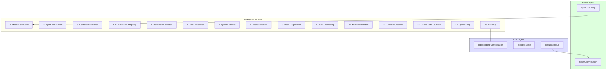
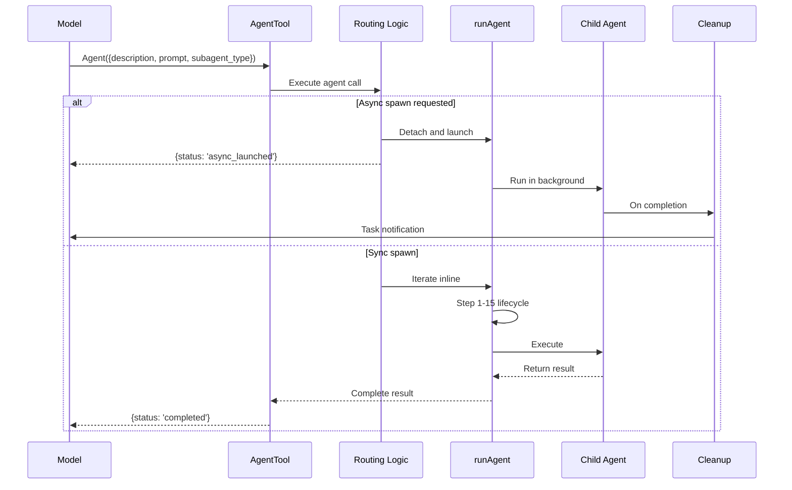

# Tutorial 8: Sub-Agent Spawner

## Learning Objectives

- Multiplication of intelligence through sub-agents
- The 15-step `runAgent` lifecycle
- Agent tool definition with dynamic schemas
- Six built-in agent types (General-Purpose, Explore, Plan, Verification, Guide, Statusline)
- Fork agents for cache sharing
- Frontmatter-defined custom agents
- Permission isolation and async execution

## The Problem

A single agent is powerful, but it has hard limits:

1. **Context window fills up** - Complex tasks exceed available memory
2. **Serial execution bottleneck** - One agent can only do one thing at a time
3. **Polluted conversation** - Exploration tasks clutter the main task history
4. **No parallelism** - Independent work cannot proceed simultaneously

```typescript
// ❌ Single agent doing everything
async function* singleAgent(task) {
  yield* exploreCodebase();    // Pollutes main conversation
  yield* designSolution();     // Uses up tokens
  yield* implementChanges();   // Serial execution
  yield* verifyChanges();      // Blocks everything
}
// All work happens in one conversation, one turn at a time
```

## The Solution: Sub-Agents

Spawn specialized children for specific tasks:

- **Explore agent**: Fast, cheap, read-only search
- **Plan agent**: Architecture design without implementation
- **Verification agent**: Independent testing in background
- **General-purpose agent**: Full-capability worker
- **Custom agents**: Project-specific specialists

```typescript
// ✅ Multiple agents working together
async function* multiAgent(task) {
  // Spawn search in parallel
  const searchTask = spawnAgent('explore', { prompt: 'Find auth files' });
  
  // Main agent continues while search runs
  yield* handleUserInput();
  
  // Get results when ready
  const results = await searchTask.result;
}
```

## Architecture Overview



## Step 1: Agent Tool Definition

The `Agent` tool is the model-facing interface for spawning sub-agents.

### Input Schema

```typescript
// src/agents/tool.ts

import { z } from 'zod';

/**
 * Base input schema for the Agent tool
 * Dynamically extended based on feature flags
 */
const baseAgentSchema = z.object({
  description: z.string()
    .describe('Short 3-5 word summary of the task'),
  
  prompt: z.string()
    .describe('Full task description for the agent'),
  
  subagent_type: z.enum([
    'general-purpose',
    'explore', 
    'plan',
    'verification',
    'guide',
    'statusline',
  ]).optional()
    .describe('Which specialized agent to use'),
  
  model: z.enum(['sonnet', 'opus', 'haiku']).optional()
    .describe('Model override for this agent'),
  
  run_in_background: z.boolean().optional()
    .describe('Launch asynchronously'),
});

/**
 * Multi-agent parameters (when swarm features active)
 */
const multiAgentSchema = z.object({
  name: z.string().optional()
    .describe('Makes agent addressable via SendMessage'),
  
  team_name: z.string().optional()
    .describe('Team context for spawning'),
  
  mode: z.enum(['ask', 'acceptEdits', 'auto', 'bubble']).optional()
    .describe('Permission mode for spawned teammate'),
});

/**
 * Isolation parameters
 */
const isolationSchema = z.object({
  isolation: z.enum(['worktree', 'remote']).optional()
    .describe('Filesystem isolation strategy'),
  
  cwd: z.string().optional()
    .describe('Absolute path override for working directory'),
});

/**
 * Build the full schema based on feature flags
 */
export function buildAgentSchema(options: {
  multiAgentEnabled: boolean;
  isolationEnabled: boolean;
  backgroundEnabled: boolean;
}): z.ZodType {
  let schema: any = baseAgentSchema;
  
  if (options.multiAgentEnabled) {
    schema = schema.merge(multiAgentSchema);
  }
  
  if (options.isolationEnabled) {
    schema = schema.merge(isolationSchema);
  }
  
  // When fork experiment is active, remove run_in_background
  // (all spawns are forced async)
  if (!options.backgroundEnabled) {
    schema = schema.omit({ run_in_background: true });
  }
  
  return schema;
}

export type AgentInput = z.infer<typeof baseAgentSchema>;
```

### Output Schema

```typescript
// src/agents/tool.ts

/**
 * Agent tool output - discriminated union
 */
export const agentOutputSchema = z.discriminatedUnion('status', [
  // Synchronous completion
  z.object({
    status: z.literal('completed'),
    result: z.string().describe('Agent\'s final output'),
    agentId: z.string(),
    model: z.string(),
    turns: z.number(),
  }),
  
  // Background launch acknowledgment
  z.object({
    status: z.literal('async_launched'),
    agentId: z.string(),
    description: z.string(),
    outputFile: z.string().describe('Path where results will be written'),
  }),
  
  // Teammate spawn acknowledgment
  z.object({
    status: z.literal('teammate_spawned'),
    agentId: z.string(),
    name: z.string(),
    teamName: z.string(),
  }),
]);

export type AgentOutput = z.infer<typeof agentOutputSchema>;
```

### Tool Definition

```typescript
// src/agents/tool.ts

import { buildTool } from '../tools/buildTool.js';
import { runAgent } from './runAgent.js';
import type { ToolUseContext } from '../tools/types.js';

/**
 * Create the Agent tool
 */
export function createAgentTool(context: ToolUseContext) {
  return buildTool({
    name: 'Agent',
    description: `Spawn a specialized sub-agent to handle a task.

Available agent types:
- general-purpose: Full-capability worker (default)
- explore: Fast, read-only search specialist
- plan: Architecture design agent
- verification: Independent testing agent
- guide: Documentation lookup agent
- statusline: Terminal status configuration

The sub-agent runs in isolation with its own conversation,
tool set, and permission boundaries. Sync agents block until
complete; async agents run in background and notify on completion.`,
    
    inputSchema: buildAgentSchema({
      multiAgentEnabled: context.options.multiAgentEnabled ?? false,
      isolationEnabled: context.options.isolationEnabled ?? false,
      backgroundEnabled: context.options.backgroundEnabled ?? true,
    }),
    
    outputSchema: agentOutputSchema,
    
    async call(input: AgentInput) {
      return await executeAgentCall(input, context);
    },
  });
}

/**
 * Execute the agent call with routing logic
 */
async function executeAgentCall(
  input: AgentInput,
  context: ToolUseContext
): Promise<AgentOutput> {
  // Step 1: Determine execution mode
  const shouldRunAsync = input.run_in_background ?? false;
  
  // Step 2: Resolve agent definition
  const agentDef = resolveAgentDefinition(
    input.subagent_type ?? 'general-purpose',
    context
  );
  
  if (!agentDef) {
    throw new Error(`Unknown agent type: ${input.subagent_type}`);
  }
  
  // Step 3: Check permissions
  if (!canSpawnAgent(agentDef, context)) {
    throw new Error(`Agent type '${agentDef.agentType}' is not allowed`);
  }
  
  // Step 4: Execute via runAgent lifecycle
  const agentId = createAgentId();
  
  if (shouldRunAsync) {
    // Async path: detach and continue
    const outputFile = getAgentOutputFile(agentId);
    
    // Launch in background (don't await)
    runAsyncAgent(agentDef, input, context, agentId, outputFile);
    
    return {
      status: 'async_launched',
      agentId,
      description: input.description,
      outputFile,
    };
  } else {
    // Sync path: iterate generator inline
    const result = await collectAgentResult(
      runAgent({
        agentDefinition: agentDef,
        prompt: input.prompt,
        context,
        agentId,
      })
    );
    
    return {
      status: 'completed',
      result: result.content,
      agentId,
      model: result.model,
      turns: result.turns,
    };
  }
}
```

## Step 2: Agent Definition Types

```typescript
// src/agents/types.ts

import type { ToolDefinition } from '../tools/types.js';
import type { z } from 'zod';

/**
 * Branded type for agent IDs
 */
export type AgentId = string & { __brand: 'AgentId' };

export function createAgentId(): AgentId {
  return `agent-${crypto.randomUUID().replace(/-/g, '').slice(0, 16)}` as AgentId;
}

/**
 * Permission modes for agents
 */
export type PermissionMode = 
  | 'ask'           // Ask user for permission
  | 'acceptEdits'   // Accept edits without asking
  | 'auto'          // Auto-approve read-only, ask for writes
  | 'bubble'        // Bubble prompts to parent
  | 'dontAsk';      // Never ask (read-only safe)

/**
 * Agent definition - describes a specialized agent
 */
export interface AgentDefinition {
  /** Unique identifier */
  agentType: string;
  
  /** Display name */
  name: string;
  
  /** When to use this agent */
  description: string;
  
  /** Model preference */
  model: 'sonnet' | 'opus' | 'haiku' | 'inherit';
  
  /** Default permission mode */
  permissionMode: PermissionMode;
  
  /** Available tools */
  tools: string[] | '*';
  
  /** Blocked tools */
  disallowedTools?: string[];
  
  /** Maximum conversation turns */
  maxTurns?: number;
  
  /** Whether agent always runs async */
  background?: boolean;
  
  /** Whether to omit CLAUDE.md context */
  omitClaudeMd?: boolean;
  
  /** Preloaded skills */
  skills?: string[];
  
  /** MCP servers to initialize */
  mcpServers?: string[];
  
  /** Lifecycle hooks */
  hooks?: AgentHooks;
  
  /** Terminal color for display */
  color?: 'red' | 'orange' | 'yellow' | 'green' | 'blue' | 'purple';
  
  /** Effort level (cost control) */
  effort?: 'low' | 'medium' | 'high';
  
  /** Generate system prompt */
  getSystemPrompt: (context: AgentContext) => string | Promise<string>;
}

/**
 * Context for system prompt generation
 */
export interface AgentContext {
  toolUseContext: any;
  agentType: string;
  prompt: string;
}

/**
 * Agent lifecycle hooks
 */
export interface AgentHooks {
  PreToolUse?: HookDefinition[];
  PostToolUse?: HookDefinition[];
  Stop?: HookDefinition[];
}

export interface HookDefinition {
  command: string;
  event: string;
  args?: string[];
}

/**
 * Source of agent definition
 */
export type AgentSource = 
  | 'builtin'    // Hardcoded in Claude Code
  | 'user'       // From .claude/agents/
  | 'plugin'     // From loaded plugin
  | 'policy';    // From organizational policy
```

## Step 3: The runAgent Lifecycle

The 15-step lifecycle creates isolated execution contexts for each agent.

```typescript
// src/agents/runAgent.ts

import type {
  AgentDefinition,
  AgentId,
  AgentContext,
} from './types.js';
import type { ToolUseContext } from '../tools/types.js';
import { agentLoop } from '../agent/loop.js';

export interface RunAgentParams {
  agentDefinition: AgentDefinition;
  prompt: string;
  context: ToolUseContext;
  agentId: AgentId;
  modelOverride?: string;
  maxTurns?: number;
  allowedTools?: string[];
  isAsync?: boolean;
}

export interface AgentResult {
  content: string;
  model: string;
  turns: number;
  success: boolean;
}

/**
 * The 15-step runAgent lifecycle
 * 
 * Creates isolated execution contexts for sub-agents.
 * Every step exists for a specific reason - no bloat.
 */
export async function* runAgent(
  params: RunAgentParams
): AsyncGenerator<any, AgentResult> {
  const {
    agentDefinition,
    prompt,
    context: parentContext,
    agentId,
    modelOverride,
    maxTurns,
    allowedTools,
    isAsync = false,
  } = params;
  
  // ========== STEP 1: Model Resolution ==========
  const resolvedModel = resolveAgentModel({
    agentPreference: agentDefinition.model,
    parentModel: parentContext.options.model,
    callerOverride: modelOverride,
    permissionMode: agentDefinition.permissionMode,
  });
  
  // ========== STEP 2: Agent ID Creation ==========
  // Already have agentId from params
  // Could use override.agentId for resumed agents
  
  // ========== STEP 3: Context Preparation ==========
  const contextMessages: any[] = []; // Fork agents would clone parent history
  const promptMessages = [
    { role: 'user', content: prompt },
  ];
  const initialMessages = [...contextMessages, ...promptMessages];
  
  // Clone file state cache for fork agents, create fresh for new agents
  const agentReadFileState = new Map(); // Simplified - real impl clones or creates
  
  // ========== STEP 4: CLAUDE.md Stripping ==========
  // Read-only agents like Explore omit CLAUDE.md to save tokens
  const shouldOmitClaudeMd = agentDefinition.omitClaudeMd ?? false;
  const userContext = shouldOmitClaudeMd 
    ? stripClaudeMd(parentContext.options.userContext)
    : parentContext.options.userContext;
  
  // ========== STEP 5: Permission Isolation ==========
  const agentGetAppState = createAgentStateOverlay({
    parentState: parentContext.getAppState?.() ?? {},
    agentPermissionMode: agentDefinition.permissionMode,
    parentPermissionMode: parentContext.options.permissionMode,
    allowedTools,
    isAsync,
  });
  
  // ========== STEP 6: Tool Resolution ==========
  const resolvedTools = resolveAgentTools({
    agentDefinition,
    availableTools: parentContext.options.toolSet,
    allowedTools,
    isAsync,
  });
  
  // ========== STEP 7: System Prompt ==========
  const agentSystemPrompt = await buildAgentSystemPrompt({
    agentDefinition,
    context: parentContext,
    resolvedModel,
  });
  
  // ========== STEP 8: Abort Controller Isolation ==========
  const agentAbortController = isAsync
    ? new AbortController()  // Async agents survive parent abort
    : parentContext.abortController;  // Sync agents share parent controller
  
  // ========== STEP 9: Hook Registration ==========
  if (agentDefinition.hooks) {
    registerAgentHooks(agentId, agentDefinition.hooks, parentContext);
  }
  
  // ========== STEP 10: Skill Preloading ==========
  if (agentDefinition.skills && agentDefinition.skills.length > 0) {
    const skillMessages = await preloadAgentSkills(
      agentDefinition.skills,
      parentContext.options.workingDirectory
    );
    initialMessages.unshift(...skillMessages);
  }
  
  // ========== STEP 11: MCP Initialization ==========
  // Simplified - real implementation initializes MCP servers
  const mcpCleanup = async () => {}; // No-op for this tutorial
  
  // ========== STEP 12: Context Creation ==========
  const agentContext: ToolUseContext = {
    ...parentContext,
    options: {
      ...parentContext.options,
      toolSet: resolvedTools,
      model: resolvedModel,
      permissionMode: agentDefinition.permissionMode,
    },
    agentId,
    messages: initialMessages,
    readFileState: agentReadFileState,
    abortController: agentAbortController,
    getAppState: agentGetAppState,
  };
  
  // ========== STEP 13: Cache-Safe Params Callback ==========
  // For background summarization - fork conversation with same params
  
  // ========== STEP 14: The Query Loop ==========
  const result: AgentResult = {
    content: '',
    model: resolvedModel,
    turns: 0,
    success: false,
  };
  
  try {
    // Run the agent loop
    const loop = agentLoop({
      messages: initialMessages,
      systemPrompt: agentSystemPrompt,
      maxTurns: maxTurns ?? agentDefinition.maxTurns ?? 25,
      apiKey: parentContext.options.apiKey,
      model: resolvedModel,
    }, false); // Use batch mode for sub-agents
    
    // Collect all events
    for await (const event of loop) {
      // Forward events to parent (for progress tracking)
      yield event;
      
      // Accumulate result
      if (event.type === 'assistant_message') {
        result.content += event.content;
      }
      
      result.turns++;
    }
    
    result.success = true;
  } catch (error) {
    result.success = false;
    result.content = `Error: ${(error as Error).message}`;
    throw error;
  } finally {
    // ========== STEP 15: Cleanup ==========
    await mcpCleanup();
    clearAgentHooks(agentId);
    agentReadFileState.clear();
    cleanupAgentTracking(agentId);
  }
  
  return result;
}

// ========== Helper Functions ==========

function resolveAgentModel(params: {
  agentPreference: string;
  parentModel: string;
  callerOverride?: string;
  permissionMode: string;
}): string {
  // Resolution chain: caller override > agent definition > parent > default
  if (params.callerOverride) return params.callerOverride;
  if (params.agentPreference === 'inherit') return params.parentModel;
  if (params.agentPreference) return params.agentPreference;
  return params.parentModel;
}

function stripClaudeMd(userContext: any): any {
  // Remove CLAUDE.md instructions for read-only agents
  if (!userContext) return userContext;
  const { claudeMd, ...rest } = userContext;
  return rest;
}

function createAgentStateOverlay(params: {
  parentState: any;
  agentPermissionMode: string;
  parentPermissionMode: string;
  allowedTools?: string[];
  isAsync: boolean;
}): () => any {
  return () => {
    let state = { ...params.parentState };
    
    // Permission mode cascade: parent wins if more permissive
    const canOverride = !['bypassPermissions', 'acceptEdits', 'auto']
      .includes(params.parentPermissionMode);
    
    if (params.agentPermissionMode && canOverride) {
      state.permissionMode = params.agentPermissionMode;
    }
    
    // Async agents can't show permission prompts
    if (params.isAsync) {
      state.shouldAvoidPermissionPrompts = true;
    }
    
    // Tool scoping
    if (params.allowedTools) {
      state.allowedTools = params.allowedTools;
    }
    
    return state;
  };
}

function resolveAgentTools(params: {
  agentDefinition: AgentDefinition;
  availableTools: any[];
  allowedTools?: string[];
  isAsync: boolean;
}): any[] {
  let tools = params.availableTools;
  
  // Filter by agent definition
  if (params.agentDefinition.tools !== '*') {
    const allowedSet = new Set(params.agentDefinition.tools);
    tools = tools.filter(t => allowedSet.has(t.name));
  }
  
  // Remove disallowed tools
  if (params.agentDefinition.disallowedTools) {
    const blockedSet = new Set(params.agentDefinition.disallowedTools);
    tools = tools.filter(t => !blockedSet.has(t.name));
  }
  
  // Apply caller's allowed tools
  if (params.allowedTools) {
    const allowedSet = new Set(params.allowedTools);
    tools = tools.filter(t => allowedSet.has(t.name));
  }
  
  // Async agents have restricted tool set
  if (params.isAsync) {
    const asyncAllowed = new Set(['Read', 'Grep', 'Bash']);
    tools = tools.filter(t => asyncAllowed.has(t.name));
  }
  
  return tools;
}

async function buildAgentSystemPrompt(params: {
  agentDefinition: AgentDefinition;
  context: any;
  resolvedModel: string;
}): Promise<string> {
  const agentContext: AgentContext = {
    toolUseContext: params.context,
    agentType: params.agentDefinition.agentType,
    prompt: '', // Would come from input
  };
  
  return params.agentDefinition.getSystemPrompt(agentContext);
}

async function preloadAgentSkills(
  skills: string[],
  projectRoot: string
): Promise<any[]> {
  // Load skill content and convert to messages
  const messages: any[] = [];
  
  for (const skillName of skills) {
    try {
      const skillContent = await loadSkill(skillName, projectRoot);
      messages.push({
        role: 'user',
        content: `[Skill: ${skillName}]\n${skillContent}`,
      });
    } catch (error) {
      console.warn(`Failed to load skill ${skillName}:`, error);
    }
  }
  
  return messages;
}

async function loadSkill(name: string, projectRoot: string): Promise<string> {
  // Simplified - would resolve from .claude/skills/ directory
  return `Skill content for ${name}`;
}

function registerAgentHooks(
  agentId: AgentId,
  hooks: any,
  context: ToolUseContext
): void {
  // Register hooks scoped to this agent
  console.log(`Registered hooks for agent ${agentId}`);
}

function clearAgentHooks(agentId: AgentId): void {
  console.log(`Cleared hooks for agent ${agentId}`);
}

function cleanupAgentTracking(agentId: AgentId): void {
  console.log(`Cleaned up tracking for agent ${agentId}`);
}

async function collectAgentResult(
  generator: AsyncGenerator<any, AgentResult>
): Promise<AgentResult> {
  let result: AgentResult | undefined;
  
  for await (const value of generator) {
    // Intermediate events
  }
  
  // The last value is the return value
  return result ?? {
    content: '',
    model: 'unknown',
    turns: 0,
    success: false,
  };
}
```

## Step 4: Async Agent Execution

```typescript
// src/agents/async.ts

import type { AgentDefinition, AgentId } from './types.js';
import type { ToolUseContext } from '../tools/types.js';
import { runAgent } from './runAgent.js';
import { EventEmitter } from 'events';

/**
 * Background agent manager
 * Handles async execution and result retrieval
 */
export class AsyncAgentManager extends EventEmitter {
  private runningAgents = new Map<AgentId, AgentHandle>();
  private completedAgents = new Map<AgentId, CompletedAgent>();
  
  /**
   * Launch an agent in the background
   */
  async launch(
    agentDef: AgentDefinition,
    prompt: string,
    context: ToolUseContext,
    agentId: AgentId,
    outputFile: string
  ): Promise<void> {
    const handle: AgentHandle = {
      agentId,
      startTime: Date.now(),
      abortController: new AbortController(),
    };
    
    this.runningAgents.set(agentId, handle);
    
    // Run the agent lifecycle
    const generator = runAgent({
      agentDefinition: agentDef,
      prompt,
      context,
      agentId,
      isAsync: true,
    });
    
    // Consume in background
    this.consumeInBackground(generator, agentId, outputFile);
    
    this.emit('launched', { agentId, description: agentDef.name });
  }
  
  /**
   * Consume the generator in background
   */
  private async consumeInBackground(
    generator: AsyncGenerator<any, any>,
    agentId: AgentId,
    outputFile: string
  ): Promise<void> {
    const events: any[] = [];
    let result: any;
    let error: Error | null = null;
    
    try {
      for await (const event of generator) {
        events.push(event);
        this.emit('progress', { agentId, event });
      }
      
      // Get final result
      // In real implementation, would get from generator.return()
    } catch (err) {
      error = err as Error;
    }
    
    // Move to completed
    const handle = this.runningAgents.get(agentId);
    if (handle) {
      this.runningAgents.delete(agentId);
      
      const completed: CompletedAgent = {
        agentId,
        startTime: handle.startTime,
        endTime: Date.now(),
        events,
        result,
        error,
        outputFile,
      };
      
      this.completedAgents.set(agentId, completed);
      
      // Write results to file
      await this.writeResults(completed);
      
      // Notify parent
      this.emit('completed', { agentId, outputFile });
    }
  }
  
  /**
   * Write agent results to output file
   */
  private async writeResults(completed: CompletedAgent): Promise<void> {
    const data = JSON.stringify({
      agentId: completed.agentId,
      startTime: completed.startTime,
      endTime: completed.endTime,
      duration: completed.endTime - completed.startTime,
      events: completed.events,
      result: completed.result,
      error: completed.error?.message,
    }, null, 2);
    
    await Bun.write(completed.outputFile, data);
  }
  
  /**
   * Get results for a completed agent
   */
  async getResults(agentId: AgentId): Promise<any> {
    const completed = this.completedAgents.get(agentId);
    if (!completed) {
      throw new Error(`No results found for agent ${agentId}`);
    }
    
    // Read from file for durability
    const file = Bun.file(completed.outputFile);
    return await file.json();
  }
  
  /**
   * Abort a running background agent
   */
  abort(agentId: AgentId): boolean {
    const handle = this.runningAgents.get(agentId);
    if (handle) {
      handle.abortController.abort();
      return true;
    }
    return false;
  }
  
  /**
   * List all running agents
   */
  getRunningAgents(): AgentId[] {
    return Array.from(this.runningAgents.keys());
  }
  
  /**
   * Check if an agent is still running
   */
  isRunning(agentId: AgentId): boolean {
    return this.runningAgents.has(agentId);
  }
}

interface AgentHandle {
  agentId: AgentId;
  startTime: number;
  abortController: AbortController;
}

interface CompletedAgent {
  agentId: AgentId;
  startTime: number;
  endTime: number;
  events: any[];
  result: any;
  error: Error | null;
  outputFile: string;
}

// Singleton instance
export const asyncAgentManager = new AsyncAgentManager();
```

## Step 5: Built-In Agent Types

```typescript
// src/agents/builtins.ts

import type { AgentDefinition, AgentContext } from './types.js';

/**
 * Built-in agent registry
 * These are the specialized agents available system-wide
 */
export function getBuiltInAgents(): AgentDefinition[] {
  return [
    createGeneralPurposeAgent(),
    createExploreAgent(),
    createPlanAgent(),
    createVerificationAgent(),
    createGuideAgent(),
    createStatuslineAgent(),
  ];
}

/**
 * General-Purpose Agent
 * The workhorse - full capabilities, no restrictions
 */
function createGeneralPurposeAgent(): AgentDefinition {
  return {
    agentType: 'general-purpose',
    name: 'General Purpose',
    description: 'Full-capability worker for any task',
    model: 'inherit',  // Use parent's model
    permissionMode: 'bubble',
    tools: '*',  // All tools
    disallowedTools: ['Agent'],  // Can't spawn sub-agents (prevents recursion)
    maxTurns: 50,
    background: false,
    omitClaudeMd: false,
    
    getSystemPrompt: (ctx: AgentContext) => `
You are a Claude Code sub-agent. Complete the task fully - don't gold-plate,
but don't leave it half-done.

Search Strategy:
- Start broad (Grep for patterns, Read key files)
- Then narrow (examine specific functions, look at usages)
- Look for tests to understand expected behavior

File Creation:
- Never create files unless the task explicitly requires it
- Prefer editing existing files over creating new ones

Task: ${ctx.prompt}
    `.trim(),
  };
}

/**
 * Explore Agent
 * Fast, cheap, read-only search specialist
 * 34 million invocations per week - aggressively optimized
 */
function createExploreAgent(): AgentDefinition {
  return {
    agentType: 'explore',
    name: 'Explore',
    description: 'Fast read-only search of the codebase',
    model: 'haiku',  // Cheapest, fastest model
    permissionMode: 'dontAsk',
    tools: ['Read', 'Grep', 'Bash'],  // Read-only tools only
    disallowedTools: ['FileEdit', 'FileWrite', 'NotebookEdit', 'Agent'],
    maxTurns: 25,
    background: false,
    omitClaudeMd: true,  // Save billions of tokens per week
    color: 'green',
    
    getSystemPrompt: (ctx: AgentContext) => `
=== CRITICAL: READ-ONLY MODE ===
You are an EXPLORATION agent. You CANNOT:
- Edit any files
- Create new files
- Run commands that modify the filesystem

Your ONLY job is to SEARCH and REPORT what you find.

Search Strategy:
1. Use Grep to find relevant files by patterns
2. Read key files to understand structure
3. Report findings concisely

Task: ${ctx.prompt}

Report your findings clearly, citing file paths and line numbers.
    `.trim(),
  };
}

/**
 * Plan Agent
 * Architecture design specialist
 */
function createPlanAgent(): AgentDefinition {
  return {
    agentType: 'plan',
    name: 'Plan',
    description: 'Design software architecture and implementation plans',
    model: 'inherit',  // Needs same reasoning as parent
    permissionMode: 'dontAsk',
    tools: ['Read', 'Grep', 'Bash', 'WebFetch'],  // Research tools
    disallowedTools: ['FileEdit', 'FileWrite', 'Agent'],
    maxTurns: 30,
    background: false,
    omitClaudeMd: true,
    color: 'blue',
    
    getSystemPrompt: (ctx: AgentContext) => `
You are a software architect. Your job is to DESIGN, not IMPLEMENT.

Follow this 4-step process:

1. **Understand Requirements**
   - Clarify what needs to be built
   - Identify constraints and edge cases

2. **Explore Thoroughly**
   - Read existing related code
   - Understand the architecture
   - Note patterns and conventions

3. **Design Solution**
   - Propose a clean architecture
   - Consider trade-offs
   - Plan for extensibility

4. **Detail the Plan**
   - List specific files to create/modify
   - Describe the changes for each file
   - Identify potential risks

Your output MUST end with:

## Critical Files for Implementation
- file/path/one.ts - what to do here
- file/path/two.ts - what to do here
...

Task: ${ctx.prompt}
    `.trim(),
  };
}

/**
 * Verification Agent
 * Independent testing in background
 */
function createVerificationAgent(): AgentDefinition {
  return {
    agentType: 'verification',
    name: 'Verification',
    description: 'Adversarial testing and verification',
    model: 'inherit',
    permissionMode: 'dontAsk',
    tools: ['Read', 'Grep', 'Bash', 'WebFetch'],  // Can run tests
    disallowedTools: ['FileEdit', 'FileWrite', 'Agent'],
    maxTurns: 40,
    background: true,  // Always runs async
    omitClaudeMd: false,  // Needs full context
    color: 'red',  // Displayed in red
    
    getSystemPrompt: (ctx: AgentContext) => `
You are a VERIFICATION agent. Your job is to find problems, not fix them.

CRITICAL: You are read-only. You CANNOT edit files. If you find an issue,
report it clearly - don't try to fix it.

Common Excuses to Avoid:
- "This is probably fine..." → Check it anyway
- "The user likely meant..." → Test what was actually written
- "Edge case, won't happen..." → Verify it can't happen

Required for Every Check:
1. Run the actual verification command
2. Include the command output verbatim
3. Interpret the results honestly

Include at least one adversarial probe:
- Concurrency: What happens with multiple requests?
- Boundaries: Edge cases and limits
- Idempotency: What if run twice?
- Orphan cleanup: Are resources cleaned up?

Task: ${ctx.prompt}

Report findings as:
- ✅ PASS: Description
- ❌ FAIL: Description with evidence
- ⚠️ UNCERTAIN: What you couldn't verify
    `.trim(),
  };
}

/**
 * Claude Code Guide
 * Documentation lookup agent
 */
function createGuideAgent(): AgentDefinition {
  return {
    agentType: 'guide',
    name: 'Claude Code Guide',
    description: 'Answer questions about Claude Code features',
    model: 'haiku',
    permissionMode: 'dontAsk',
    tools: ['Read', 'WebFetch', 'Bash'],
    disallowedTools: ['FileEdit', 'FileWrite', 'Agent'],
    maxTurns: 20,
    background: false,
    omitClaudeMd: false,
    
    getSystemPrompt: (ctx: AgentContext) => `
You are the Claude Code documentation agent.

You can help with:
- Claude Code features and commands
- Claude Agent SDK questions
- Claude API documentation

Available Documentation:
- https://docs.anthropic.com/claude-code
- https://docs.anthropic.com/en/api

Task: ${ctx.prompt}

Provide clear, concise answers with links to relevant documentation.
    `.trim(),
  };
}

/**
 * Statusline Setup Agent
 * Specialized for terminal status configuration
 */
function createStatuslineAgent(): AgentDefinition {
  return {
    agentType: 'statusline',
    name: 'Statusline Setup',
    description: 'Configure terminal status line',
    model: 'sonnet',
    permissionMode: 'bubble',
    tools: ['Read', 'Edit'],  // Limited tool set
    maxTurns: 15,
    background: false,
    color: 'orange',
    
    getSystemPrompt: (ctx: AgentContext) => `
You are the statusline configuration agent.

Your task is to set up the terminal status line for Claude Code.

Status Line Format:
- Supports shell escape sequences
- Written to ~/.claude/settings.json
- Format: {"statusLine": "..."}

Common Patterns:
- Current git branch: $(git branch --show-current)
- Last command status: $?
- Working directory: \w

Task: ${ctx.prompt}

Edit ~/.claude/settings.json to configure the status line.
    `.trim(),
  };
}
```

## Step 6: Fork Agents (Cache Sharing)

```typescript
// src/agents/fork.ts

import type { AgentDefinition, AgentId } from './types.js';
import type { ToolUseContext } from '../tools/types.js';
import { runAgent } from './runAgent.js';

/**
 * Fork agent parameters
 * Enables byte-identical cache sharing with parent
 */
export interface ForkAgentParams {
  agentDefinition: AgentDefinition;
  prompt: string;
  context: ToolUseContext;
  agentId: AgentId;
  
  // Key for cache sharing: parent's conversation history
  forkContextMessages: any[];
  
  // Key for cache sharing: parent's system prompt (byte-identical)
  parentSystemPrompt: string;
  
  // Key for cache sharing: parent's exact tools
  parentTools: any[];
}

/**
 * Create a fork agent
 * 
 * Fork agents inherit the parent's full conversation context,
 * system prompt, and tool array. This enables 90%+ cache discounts
 * on shared context - the server sees identical prefixes.
 */
export async function* forkAgent(
  params: ForkAgentParams
): AsyncGenerator<any, any> {
  const {
    agentDefinition,
    prompt,
    context,
    agentId,
    forkContextMessages,
    parentSystemPrompt,
    parentTools,
  } = params;
  
  // Filter incomplete tool calls from parent history
  // (tool_use without matching tool_result)
  const cleanContext = filterIncompleteToolCalls(forkContextMessages);
  
  // Clone parent's file state cache
  const forkReadFileState = cloneFileStateCache(context.readFileState);
  
  // Run with byte-identical parameters
  return yield* runAgent({
    agentDefinition,
    prompt,
    context: {
      ...context,
      options: {
        ...context.options,
        // Use parent's exact tools (byte-identical for cache)
        toolSet: parentTools,
        // Inherit parent's thinking config for cache
        thinkingConfig: context.options.thinkingConfig,
      },
      // Fork agents share abort controller? No - independent
      abortController: new AbortController(),
      readFileState: forkReadFileState,
    },
    agentId,
    // Override with parent's pre-computed system prompt
    // This is the key: exact same bytes as parent used
    // systemPromptOverride: parentSystemPrompt,
    maxTurns: agentDefinition.maxTurns ?? 25,
  });
}

/**
 * Filter out incomplete tool calls from conversation history
 * API rejects tool_use blocks without matching tool_result
 */
function filterIncompleteToolCalls(messages: any[]): any[] {
  const result: any[] = [];
  const pendingToolUses = new Set<string>();
  
  for (const msg of messages) {
    if (msg.role === 'assistant' && msg.tool_calls) {
      // Track tool_use blocks
      for (const toolCall of msg.tool_calls) {
        pendingToolUses.add(toolCall.id);
      }
      result.push(msg);
    } else if (msg.role === 'tool') {
      // Complete pending tool
      pendingToolUses.delete(msg.tool_call_id);
      result.push(msg);
    } else {
      result.push(msg);
    }
  }
  
  // Strip incomplete tool_use blocks from assistant messages
  return result.map(msg => {
    if (msg.role === 'assistant' && msg.tool_calls) {
      const completeCalls = msg.tool_calls.filter(
        (tc: any) => !pendingToolUses.has(tc.id)
      );
      
      if (completeCalls.length === 0) {
        // Remove tool_calls entirely if none are complete
        const { tool_calls, ...rest } = msg;
        return rest;
      }
      
      return { ...msg, tool_calls: completeCalls };
    }
    return msg;
  });
}

/**
 * Clone the file state cache
 * Shallow copy - file contents are shared via reference
 */
function cloneFileStateCache(
  cache: Map<string, any>
): Map<string, any> {
  // Shallow clone - each entry shares file content strings
  return new Map(cache);
}

/**
 * Guard against recursive forking
 * Fork children keep the Agent tool but shouldn't recursively fork
 */
export function isForkChild(context: ToolUseContext): boolean {
  // Check query source marker
  if (context.options.querySource === 'agent:builtin:fork') {
    return true;
  }
  
  // Fallback: scan conversation for fork boilerplate tag
  // (in case querySource was not threaded)
  return context.messages.some(
    (m: any) => m.content?.includes('<fork-boilerplate>')
  );
}
```

## Step 7: Custom Agents from Frontmatter

```typescript
// src/agents/frontmatter.ts

import { z } from 'zod';
import type { AgentDefinition, AgentSource } from './types.js';
import { readFile, readdir } from 'fs/promises';
import { join } from 'path';

/**
 * Frontmatter schema for agent definitions
 */
const agentFrontmatterSchema = z.object({
  description: z.string(),
  tools: z.union([z.array(z.string()), z.literal('*')]),
  disallowedTools: z.array(z.string()).optional(),
  model: z.enum(['sonnet', 'opus', 'haiku', 'inherit']),
  permissionMode: z.enum(['ask', 'acceptEdits', 'auto', 'bubble', 'dontAsk']),
  maxTurns: z.number().optional(),
  skills: z.array(z.string()).optional(),
  mcpServers: z.array(z.union([z.string(), z.record(z.any())])).optional(),
  hooks: z.record(z.array(z.object({
    command: z.string(),
    event: z.string(),
    args: z.array(z.string()).optional(),
  }))).optional(),
  color: z.enum(['red', 'orange', 'yellow', 'green', 'blue', 'purple']).optional(),
  background: z.boolean().optional(),
  isolation: z.enum(['worktree', 'remote']).optional(),
  effort: z.enum(['low', 'medium', 'high']).optional(),
  omitClaudeMd: z.boolean().optional(),
});

type AgentFrontmatter = z.infer<typeof agentFrontmatterSchema>;

/**
 * Load agents from .claude/agents/ directory
 */
export async function loadUserAgents(
  projectRoot: string
): Promise<AgentDefinition[]> {
  const agentsDir = join(projectRoot, '.claude', 'agents');
  
  try {
    const entries = await readdir(agentsDir, { withFileTypes: true });
    const agents: AgentDefinition[] = [];
    
    for (const entry of entries) {
      if (entry.isFile() && entry.name.endsWith('.md')) {
        const agent = await loadAgentFromFile(
          join(agentsDir, entry.name),
          'user'
        );
        if (agent) {
          agents.push(agent);
        }
      }
    }
    
    return agents;
  } catch (error) {
    // Directory doesn't exist - no user agents
    return [];
  }
}

/**
 * Load a single agent from markdown file
 */
async function loadAgentFromFile(
  filePath: string,
  source: AgentSource
): Promise<AgentDefinition | null> {
  try {
    const content = await readFile(filePath, 'utf-8');
    const { frontmatter, body } = parseFrontmatter(content);
    
    // Validate frontmatter
    const validated = agentFrontmatterSchema.parse(frontmatter);
    
    // Derive agent type from filename
    const agentType = filePath
      .split('/')
      .pop()!
      .replace('.md', '');
    
    return {
      agentType,
      name: agentType.replace(/-/g, ' ').replace(/\b\w/g, l => l.toUpperCase()),
      description: validated.description,
      model: validated.model,
      permissionMode: validated.permissionMode,
      tools: validated.tools,
      disallowedTools: validated.disallowedTools,
      maxTurns: validated.maxTurns,
      background: validated.background,
      omitClaudeMd: validated.omitClaudeMd,
      skills: validated.skills,
      color: validated.color,
      effort: validated.effort,
      
      // Body becomes the system prompt
      getSystemPrompt: () => body,
      
      // Track source for security policies
      // source,
    } as AgentDefinition;
  } catch (error) {
    console.warn(`Failed to load agent from ${filePath}:`, error);
    return null;
  }
}

/**
 * Parse frontmatter from markdown content
 */
function parseFrontmatter(content: string): {
  frontmatter: any;
  body: string;
} {
  const match = content.match(/^---\s*\n([\s\S]*?)\n---\s*\n([\s\S]*)$/);
  
  if (!match) {
    // No frontmatter - treat entire content as body
    return { frontmatter: {}, body: content };
  }
  
  const frontmatterText = match[1];
  const body = match[2].trim();
  
  // Simple YAML parsing (in production, use yaml library)
  const frontmatter: any = {};
  for (const line of frontmatterText.split('\n')) {
    const colonIndex = line.indexOf(':');
    if (colonIndex > 0) {
      const key = line.slice(0, colonIndex).trim();
      let value: any = line.slice(colonIndex + 1).trim();
      
      // Try to parse as JSON (handles arrays, booleans, etc.)
      try {
        value = JSON.parse(value);
      } catch {
        // Keep as string
      }
      
      frontmatter[key] = value;
    }
  }
  
  return { frontmatter, body };
}

/**
 * Example custom agent frontmatter
 */
export const EXAMPLE_CUSTOM_AGENT = `---
description: "Code review specialist - focuses on security and performance"
tools:
  - Read
  - Grep
  - Bash
disallowedTools:
  - FileEdit
  - FileWrite
model: sonnet
permissionMode: dontAsk
maxTurns: 30
skills:
  - security-best-practices
color: red
background: false
---

# Security Review Agent

You are a security-focused code reviewer. Your job is to identify:

1. **Security Issues**
   - SQL injection vulnerabilities
   - XSS risks
   - Hardcoded secrets
   - Unsafe deserialization

2. **Performance Issues**
   - N+1 queries
   - Unnecessary allocations
   - Blocking operations
   - Memory leaks

3. **Best Practices**
   - Error handling
   - Input validation
   - Logging practices
   - Test coverage

Review the provided code thoroughly and report findings with:
- Severity (Critical/High/Medium/Low)
- Location (file:line)
- Explanation
- Suggested fix

Be thorough but constructive. Security is the priority.
`;
```

## Step 8: Agent Registry

```typescript
// src/agents/registry.ts

import type { AgentDefinition } from './types.js';
import { getBuiltInAgents } from './builtins.js';
import { loadUserAgents } from './frontmatter.js';

/**
 * Agent registry
 * Manages all available agent types
 */
export class AgentRegistry {
  private agents = new Map<string, AgentDefinition>();
  private loaded = false;
  
  /**
   * Initialize the registry
   */
  async initialize(projectRoot: string): Promise<void> {
    if (this.loaded) return;
    
    // Load built-in agents
    const builtIns = getBuiltInAgents();
    for (const agent of builtIns) {
      this.agents.set(agent.agentType, agent);
    }
    
    // Load user-defined agents
    const userAgents = await loadUserAgents(projectRoot);
    for (const agent of userAgents) {
      // User agents can override built-ins
      this.agents.set(agent.agentType, agent);
    }
    
    this.loaded = true;
  }
  
  /**
   * Get an agent by type
   */
  get(agentType: string): AgentDefinition | undefined {
    return this.agents.get(agentType);
  }
  
  /**
   * Check if an agent exists
   */
  has(agentType: string): boolean {
    return this.agents.has(agentType);
  }
  
  /**
   * List all available agents
   */
  list(): AgentDefinition[] {
    return Array.from(this.agents.values());
  }
  
  /**
   * Filter by allowed types
   */
  filter(allowedTypes: string[]): AgentDefinition[] {
    return allowedTypes
      .map(type => this.agents.get(type))
      .filter((agent): agent is AgentDefinition => agent !== undefined);
  }
  
  /**
   * Register a custom agent (e.g., from plugin)
   */
  register(agent: AgentDefinition): void {
    this.agents.set(agent.agentType, agent);
  }
}

// Singleton instance
export const agentRegistry = new AgentRegistry();

/**
 * Resolve agent definition
 * Called when Agent tool is invoked
 */
export function resolveAgentDefinition(
  agentType: string,
  context: { options: { allowedAgentTypes?: string[] } }
): AgentDefinition | undefined {
  // Check if type is allowed
  if (context.options.allowedAgentTypes) {
    if (!context.options.allowedAgentTypes.includes(agentType)) {
      return undefined;
    }
  }
  
  return agentRegistry.get(agentType);
}

/**
 * Check if agent can be spawned
 */
export function canSpawnAgent(
  agent: AgentDefinition,
  context: { options: { denyAgentRules?: string[] } }
): boolean {
  // Check deny rules
  if (context.options.denyAgentRules) {
    for (const rule of context.options.denyAgentRules) {
      if (agent.agentType === rule || agent.agentType.startsWith(rule)) {
        return false;
      }
    }
  }
  
  return true;
}
```

## Step 9: Integration with Tool System

```typescript
// src/agents/index.ts

export * from './types.js';
export * from './runAgent.js';
export * from './builtins.js';
export * from './registry.js';
export { createAgentTool } from './tool.js';
export { AsyncAgentManager, asyncAgentManager } from './async.js';
export { forkAgent, isForkChild } from './fork.js';

import { agentRegistry } from './registry.js';

/**
 * Initialize the agent subsystem
 */
export async function initializeAgents(projectRoot: string): Promise<void> {
  await agentRegistry.initialize(projectRoot);
}
```

## Sequence Diagram: Complete Spawn Flow



## The Five Dimensions of Agent Design

Each agent type makes specific choices across five dimensions:

| Dimension | Question | Example Choices |
|-----------|----------|-----------------|
| **What Can It See?** | Context stripping | Explore: Omit CLAUDE.md, git status |
| **What Can It Do?** | Tool restrictions | Verification: Read-only |
| **How Does It Interact?** | Permission mode | Background: No prompts |
| **How Does It Relate?** | Sync vs async | Fork: Inherit full context |
| **How Expensive?** | Model choice | Explore: Haiku (cheap) |

## Testing

```typescript
// tests/agents.test.ts

import { describe, it, expect, beforeEach } from 'bun:test';
import { AgentRegistry, createGeneralPurposeAgent } from '../src/agents';
import { resolveAgentModel, filterIncompleteToolCalls } from '../src/agents/runAgent';

describe('Agent System', () => {
  describe('Model Resolution', () => {
    it('should use caller override first', () => {
      const model = resolveAgentModel({
        agentPreference: 'haiku',
        parentModel: 'sonnet',
        callerOverride: 'opus',
        permissionMode: 'ask',
      });
      expect(model).toBe('opus');
    });
    
    it('should inherit from parent when specified', () => {
      const model = resolveAgentModel({
        agentPreference: 'inherit',
        parentModel: 'sonnet',
        permissionMode: 'ask',
      });
      expect(model).toBe('sonnet');
    });
  });
  
  describe('Tool Call Filtering', () => {
    it('should filter incomplete tool calls', () => {
      const messages = [
        {
          role: 'assistant',
          content: 'Using tool...',
          tool_calls: [
            { id: 'call_1', name: 'Read', input: {} },
            { id: 'call_2', name: 'Grep', input: {} },
          ],
        },
        {
          role: 'tool',
          content: 'result',
          tool_call_id: 'call_1',
        },
      ];
      
      const result = filterIncompleteToolCalls(messages);
      
      // Should strip incomplete call_2
      expect(result[0].tool_calls).toHaveLength(1);
      expect(result[0].tool_calls[0].id).toBe('call_1');
    });
  });
  
  describe('Agent Registry', () => {
    it('should load built-in agents', async () => {
      const registry = new AgentRegistry();
      await registry.initialize('/tmp');
      
      const explore = registry.get('explore');
      expect(explore).toBeDefined();
      expect(explore?.model).toBe('haiku');
      expect(explore?.omitClaudeMd).toBe(true);
    });
  });
});
```

## What We Learned

1. **15-Step Lifecycle** - Comprehensive isolation from parent
2. **Model Resolution** - Override > definition > parent > default
3. **Fork Agents** - Byte-identical cache sharing
4. **Frontmatter Agents** - Zero-code custom agents
5. **Permission Isolation** - Cascading modes, async handling
6. **Five Dimensions** - See/Do/Interact/Relate/Expensive

## Key Insights

**Context is not free** - Every token costs money and displaces working memory. Explore agents strip CLAUDE.md not because it's harmful, but because it's irrelevant. At 34 million spawns per week, irrelevance becomes infrastructure cost.

**The generator architecture is correctness** - The `finally` block guarantees cleanup. Without generators, you'd need try/catch in every execution path. With generators, one `finally` handles abort, error, and completion.

**Byte-identical is the goal** - Fork agents don't just share "similar" context. They share byte-identical system prompts, tool definitions, and message arrays. A single divergent byte busts the cache.

**Configuration over code** - Agent definitions are data, not control flow. Adding a new agent type means writing frontmatter, not modifying lifecycle. This is how systems stay extensible.

## Next: Fork Agents & Coordination

T9 will dive deep into fork agents and T10 will cover multi-agent coordination. We'll build the task state machine and implement the coordinator-worker pattern.

---

**Git Commit:**
```bash
git add .
git commit -m "T08: Sub-Agent Spawner - Multi-agent lifecycle, 15-step runAgent, built-in types, fork agents, frontmatter agents"
```
