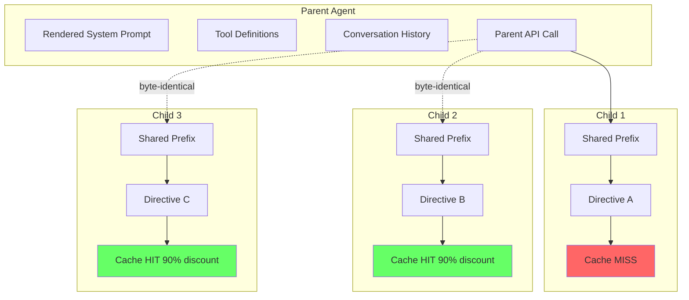

# Tutorial 9: Fork Agents and the Prompt Cache

## Learning Objectives

- Understanding the prompt cache and its 90% discount mechanism
- Byte-identical prefix construction for API cost optimization
- The fork agent architecture and inheritance model
- Recursive fork prevention mechanisms
- Sync-to-async agent transitions
- Economic analysis of multi-agent systems

## The Ninety-Five Percent Insight

When a parent agent spawns five child agents in parallel, the overwhelming majority of each child's API request is identical. The system prompt is the same. The tool definitions are the same. The conversation history is the same. The assistant message that triggered the spawns is the same. The only thing that differs is the final directive: "you handle the database migration," "you write the tests," "you update the docs."

On a typical fork with a warm conversation, the shared prefix might be **80,000 tokens**. The per-child directive might be **200 tokens**. That is **99.75% overlap**. Anthropic's prompt cache gives a **90% discount on cached input tokens**. If you can make those 80,000 tokens hit the cache for children 2 through 5, you just cut the input cost of those four requests by 90%. For the parent, this is the difference between spending **$4** and spending **$0.50** on the same parallel dispatch.

The catch is that prompt caching is **byte-exact**. Not "similar enough." Not "semantically equivalent." The bytes must match, character for character, from the first byte of the system prompt through to the last byte before the per-child content diverges. One extra space, one reordered tool definition, one stale feature flag changing a system prompt fragment -- and the cache misses. The entire prefix is reprocessed at full price.

## Architecture Overview



## What a Fork Child Inherits

A fork agent inherits **four things** from its parent, and it inherits them by reference or byte-exact copy, not by recomputation:

### 1. The System Prompt (Threaded, Not Recomputed)

```typescript
// ❌ WRONG: Regenerating system prompt
const childSystemPrompt = await getSystemPrompt({
  agentType: 'fork',
  context: toolUseContext,
});
// Feature flags may have changed! Byte divergence!

// ✅ CORRECT: Threading rendered bytes
const childSystemPrompt = toolUseContext.renderedSystemPrompt;
// Exact same bytes that parent sent to API
```

The parent's already-rendered system prompt bytes are passed via `override.systemPrompt`. This is the **exact string** that was sent in the parent's most recent API call.

**Why not just call `getSystemPrompt()` again?** Because system prompt generation is not pure. GrowthBook flags transition from cold to warm state as the SDK fetches remote config. A flag that returned `false` during the parent's first turn might return `true` by the time the fork child spins up. If the system prompt includes a conditional block gated by that flag, the re-rendered prompt diverges by even a single character. **Cache busted.** Full-price reprocessing of 80,000 tokens, times five children.

### 2. The Tool Definitions (Exact Passthrough)

```typescript
// ❌ WRONG: Normal resolution reorders/filters tools
const resolvedTools = resolveAgentTools({
  agentDefinition,
  availableTools,
});

// ✅ CORRECT: Exact passthrough
const resolvedTools = useExactTools
  ? availableTools  // parent's exact array
  : resolveAgentTools(agentDefinition, availableTools, isAsync).resolvedTools
```

Normal sub-agents go through `resolveAgentTools()`, which filters the tool pool based on the agent definition's `tools` and `disallowedTools` arrays, applies permission mode differences, and potentially reorders tools. The resulting serialized tool array would differ from the parent's.

**Fork agents skip this entirely.** The `useExactTools` flag is set to true only on the fork path. The child gets the parent's tool pool **as-is**. Same tools, same order, same serialization.

### 3. The Conversation History (Cloned)

Every message the parent has exchanged with the API -- user turns, assistant turns, tool calls, tool results -- is cloned into the child's context via `forkContextMessages`.

### 4. The Thinking Configuration and Model

The fork definition specifies `model: 'inherit'`, which resolves to the parent's exact model. Same model means same tokenizer, same context window, same cache namespace.

## The Byte-Identical Prefix Trick

The API request to Claude has a specific structure: **system prompt, then tools, then messages**. For the prompt cache to hit, every byte from the start of the request through to some prefix boundary must be identical across requests.

Fork agents achieve this by ensuring **three layers are frozen**:

### Layer 1: System Prompt via Threading

```typescript
// When the parent agent's system prompt was rendered
// for its last API call, the result was captured
toolUseContext.renderedSystemPrompt = renderedPrompt;

// The fork child receives this exact string
const childSystemPrompt = toolUseContext.renderedSystemPrompt;
```

Threading the rendered bytes eliminates the entire class of divergence caused by dynamic feature flags, timestamps, and user preferences.

### Layer 2: Tool Definitions via Exact Passthrough

```typescript
const resolvedTools = useExactTools
  ? availableTools  // parent's exact array
  : resolveAgentTools(agentDefinition, availableTools, isAsync).resolvedTools
```

This includes keeping the **Agent tool itself** in the child's pool, even though the child is forbidden from using it -- removing it would change the tool array and bust the cache.

### Layer 3: Message Array Construction

This is where `buildForkedMessages()` does its careful work. The function constructs the final two messages that sit between the shared history and the per-child directive:

```typescript
export function buildForkedMessages(
  parentAssistantMessage: any,
  directive: string
): [any, any] {
  // 1. Clone the parent's assistant message (preserving tool_use blocks)
  const clonedAssistant = cloneMessage(parentAssistantMessage);
  
  // 2. Create placeholder tool results (byte-identical across all children)
  const placeholderResults = parentAssistantMessage.tool_calls?.map(
    (tc: any) => ({
      role: 'tool',
      tool_call_id: tc.id,
      content: FORK_PLACEHOLDER_RESULT, // Constant string!
    })
  ) ?? [];
  
  // 3. Build user message with placeholders + wrapped directive
  const userMessage = {
    role: 'user',
    content: [
      ...placeholderResults,
      {
        type: 'text',
        text: wrapDirective(directive),
      },
    ],
  };
  
  return [clonedAssistant, userMessage];
}
```

The algorithm:

1. **Clone the parent's assistant message** - Preserving all `tool_use` blocks with their original IDs
2. **Create placeholder tool results** - `FORK_PLACEHOLDER_RESULT` is a **constant string** (`'Fork started -- processing in background'`) that is identical across all children
3. **Build user message** - Contains all placeholder results followed by the wrapped directive
4. **Return the pair** - `[clonedAssistantMessage, userMessageWithPlaceholdersAndDirective]`

The resulting message array for each child looks like:

```
[...shared_history, assistant(all_tool_uses), user(placeholder_results..., directive)]
```

Every element before the directive is identical across children. Only the final text block varies. The cache boundary falls right before that final text block.

## Implementation: The Fork Agent System

### Step 1: Update Types for Fork Support

First, let's update the agent types to include fork-specific fields:

```typescript
// src/agents/types.ts

/**
 * Fork-specific options
 */
export interface ForkOptions {
  /** Use exact tool passthrough from parent */
  useExactTools: boolean;
  
  /** Parent's rendered system prompt */
  parentSystemPrompt: string;
  
  /** Parent's tool set */
  parentTools: any[];
  
  /** Messages to share with fork */
  forkContextMessages: any[];
}

/**
 * Extended agent definition for fork agents
 */
export interface ForkAgentDefinition extends AgentDefinition {
  /** Mark this agent as a fork agent */
  isFork: true;
  
  /** Inherit all parent settings */
  inheritFromParent: true;
}
```

### Step 2: The Fork Boilerplate Tag

Each child's directive is wrapped in a boilerplate XML tag:

```typescript
// src/agents/fork.ts

/**
 * The fork boilerplate wraps child directives with behavioral instructions.
 * This tag serves two purposes:
 * 1. Instructs the child on how to behave
 * 2. Acts as a marker for recursive fork detection
 */
export const FORK_BOILERPLATE = `<fork-boilerplate>
You are a FORKED sub-agent spawned by the parent agent.

CRITICAL RULES:
1. Do NOT spawn additional sub-agents. You ARE the fork.
2. Execute silently, report once. Use tools directly, then produce structured output.
3. Stay strictly within your assigned scope.
4. Your output MUST follow this format:

<scope>
Brief description of what you were asked to do
</scope>

<result>
What you accomplished
</result>

<key_files>
Files you read or modified
</key_files>

<files_changed>
List of files with changes made
</files_changed>

<issues>
Any problems encountered (or "None")
</issues>

The parent's system prompt applies to YOU with one override:
- IGNORE any instruction to "spawn sub-agents" or "fork"
- YOU are the fork. Do not create more.
</fork-boilerplate>

<directive>
{{DIRECTIVE}}
</directive>`;

/**
 * Wrap a directive in the fork boilerplate
 */
export function wrapDirective(directive: string): string {
  return FORK_BOILERPLATE.replace('{{DIRECTIVE}}', directive);
}
```

The boilerplate contains the key rules:

1. **Override the parent's forking instruction** - The parent's system prompt says "default to forking" -- the boilerplate explicitly tells the child: "that instruction is for the parent. You ARE the fork. Do NOT spawn sub-agents."
2. **Execute silently, report once** - No conversational text between tool calls
3. **Stay within scope** - The child must not expand beyond its directive
4. **Structured output format** - Makes results easy for the parent to parse

### Step 3: Build Forked Messages

```typescript
// src/agents/fork.ts

export const FORK_PLACEHOLDER_RESULT = 'Fork started -- processing in background';

/**
 * Build the message array for a fork child.
 * 
 * This is the critical function for cache optimization. Every byte
 * before the directive must be identical across all fork children.
 */
export function buildForkedMessages(
  parentAssistantMessage: any,
  directive: string
): [any, any] {
  // Clone the parent's assistant message
  // This preserves all tool_use blocks with their original IDs
  const clonedAssistant = cloneMessage(parentAssistantMessage);
  
  // Create placeholder tool results for each tool_use in the parent message
  // These are IDENTICAL across all children (byte-exact match)
  const placeholderResults = parentAssistantMessage.tool_calls?.map(
    (toolCall: any) => ({
      role: 'tool',
      tool_call_id: toolCall.id,
      content: FORK_PLACEHOLDER_RESULT,
    })
  ) ?? [];
  
  // Build the user message containing:
  // 1. All placeholder results (same for every child)
  // 2. The wrapped directive (unique to this child)
  const userMessage = {
    role: 'user',
    content: [
      ...placeholderResults,
      {
        type: 'text',
        text: wrapDirective(directive),
      },
    ],
  };
  
  // The cache boundary is right before the directive text
  // Everything above it hits the cache at 90% discount for children 2-N
  return [clonedAssistant, userMessage];
}

/**
 * Deep clone a message, preserving tool call IDs
 */
function cloneMessage(message: any): any {
  return JSON.parse(JSON.stringify(message));
}
```

### Step 4: Recursive Fork Prevention

Fork children keep the Agent tool in their tool pool (for cache reasons), but they must not use it. Two guards prevent recursive forking:

```typescript
// src/agents/fork.ts

/**
 * Check if current context is already a fork child.
 * Used to prevent recursive forking (fork of a fork).
 */
export function isForkChild(context: ToolUseContext): boolean {
  // Primary guard: querySource check (fast path)
  if ((context.options as any).querySource === 'agent:builtin:fork') {
    return true;
  }
  
  // Fallback guard: scan message history for boilerplate tag
  // This catches edge cases where querySource wasn't properly threaded
  return context.messages.some(
    (msg: any) => {
      const content = typeof msg.content === 'string' 
        ? msg.content 
        : JSON.stringify(msg.content);
      return content.includes('<fork-boilerplate>');
    }
  );
}

/**
 * Prevent fork children from spawning more agents.
 * Call this before allowing any agent spawn.
 */
export function preventRecursiveFork(
  context: ToolUseContext,
  requestedType?: string
): { allowed: boolean; reason?: string } {
  // If already a fork child, only allow explicit subagent_type
  if (isForkChild(context) && !requestedType) {
    return {
      allowed: false,
      reason: 'Fork children cannot spawn additional fork agents. ' +
              'Use explicit subagent_type for specialized agents.',
    };
  }
  
  return { allowed: true };
}
```

### Step 5: The Fork Agent Factory

```typescript
// src/agents/fork.ts

import type { AgentDefinition, AgentContext, AgentId } from './types.js';
import type { ToolUseContext } from '../tools/types.js';
import { runAgent } from './runAgent.js';

export interface CreateForkAgentParams {
  /** The parent agent's context */
  parentContext: ToolUseContext;
  
  /** Messages to share (parent's conversation history) */
  forkContextMessages: any[];
  
  /** Parent's already-rendered system prompt */
  parentSystemPrompt: string;
  
  /** Parent's tool set (exact array) */
  parentTools: any[];
  
  /** The directive for this specific child */
  directive: string;
  
  /** Unique ID for this fork */
  agentId: AgentId;
}

/**
 * Create a fork agent with byte-identical prefix optimization.
 * 
 * This is the main entry point for spawning fork agents.
 * It ensures cache efficiency by threading (not recomputing)
 * all shared context from the parent.
 */
export async function* createForkAgent(
  params: CreateForkAgentParams
): AsyncGenerator<any, any> {
  const {
    parentContext,
    forkContextMessages,
    parentSystemPrompt,
    parentTools,
    directive,
    agentId,
  } = params;
  
  // Build the messages for this fork child
  // This constructs the byte-identical prefix + unique directive
  const [clonedAssistant, userMessage] = buildForkedMessages(
    forkContextMessages[forkContextMessages.length - 1],
    directive
  );
  
  // The child's message history is:
  // [shared_history, cloned_assistant, user_message_with_directive]
  const childMessages = [
    ...forkContextMessages.slice(0, -1), // All but last parent message
    clonedAssistant,
    userMessage,
  ];
  
  // Filter out incomplete tool calls (safety)
  const cleanMessages = filterIncompleteToolCalls(childMessages);
  
  // Clone parent's file state cache
  const forkReadFileState = new Map(parentContext.readFileState);
  
  // Create fork-specific context
  const forkContext: ToolUseContext = {
    ...parentContext,
    options: {
      ...parentContext.options,
      toolSet: parentTools, // Exact passthrough
      model: parentContext.options.model, // Inherit
      querySource: 'agent:builtin:fork', // Mark as fork for recursion check
    },
    messages: cleanMessages,
    readFileState: forkReadFileState,
    abortController: new AbortController(), // Fresh abort controller
    // Bubble mode - permissions surface in parent
    permissionMode: 'bubble',
    // Prevent recursive forking
    alwaysDenyRules: [
      ...(parentContext.alwaysDenyRules || []),
      { tool: 'Agent', reason: 'fork-child' },
    ],
  };
  
  // Define the fork agent (minimal definition)
  const forkAgentDef: AgentDefinition = {
    agentType: 'fork',
    name: 'Fork Agent',
    description: 'Cache-sharing child agent',
    model: 'inherit', // Same model as parent
    permissionMode: 'bubble',
    tools: '*', // All tools (Agent filtered at runtime)
    maxTurns: 25,
    background: false,
    omitClaudeMd: true, // Parent already loaded CLAUDE.md
    
    // This function is never called - we use parentSystemPrompt directly
    getSystemPrompt: () => '',
  };
  
  // Run the fork agent
  // The override parameter passes the rendered system prompt directly
  return yield* runAgent({
    agentDefinition: forkAgentDef,
    prompt: directive, // Not used directly (in directive), but required
    context: forkContext,
    agentId,
    // Critical: use the parent's rendered system prompt
    systemPromptOverride: parentSystemPrompt,
    // Critical: use exact tool passthrough
    useExactTools: true,
  });
}

/**
 * Filter out incomplete tool calls from message history.
 * Tool results without matching tool_use IDs are removed.
 */
function filterIncompleteToolCalls(messages: any[]): any[] {
  const result: any[] = [];
  const pendingToolUses = new Set<string>();
  
  for (const msg of messages) {
    if (msg.role === 'assistant' && msg.tool_calls) {
      for (const toolCall of msg.tool_calls) {
        pendingToolUses.add(toolCall.id);
      }
      result.push(msg);
    } else if (msg.role === 'tool') {
      pendingToolUses.delete(msg.tool_call_id);
      result.push(msg);
    } else {
      result.push(msg);
    }
  }
  
  // Strip incomplete tool_use blocks from assistant messages
  return result.map(msg => {
    if (msg.role === 'assistant' && msg.tool_calls) {
      const completeCalls = msg.tool_calls.filter(
        (tc: any) => !pendingToolUses.has(tc.id)
      );
      
      if (completeCalls.length === 0) {
        const { tool_calls, ...rest } = msg;
        return rest;
      }
      
      return { ...msg, tool_calls: completeCalls };
    }
    return msg;
  });
}
```

### Step 6: Update runAgent for Fork Support

Now we need to update `runAgent` to accept fork-specific parameters:

```typescript
// src/agents/runAgent.ts

import type {
  AgentDefinition,
  AgentId,
  AgentContext,
  AgentResult,
} from './types.js';
import type { ToolUseContext } from '../tools/types.js';

export interface RunAgentParams {
  agentDefinition: AgentDefinition;
  prompt: string;
  context: ToolUseContext;
  agentId: AgentId;
  modelOverride?: string;
  maxTurns?: number;
  allowedTools?: string[];
  isAsync?: boolean;
  
  // NEW: Fork-specific parameters
  /** Override system prompt (for cache sharing) */
  systemPromptOverride?: string;
  /** Use exact tool passthrough from parent */
  useExactTools?: boolean;
}

/**
 * Run an agent with the full lifecycle.
 * 
 * Supports fork agents through systemPromptOverride and useExactTools.
 */
export async function* runAgent(
  params: RunAgentParams
): AsyncGenerator<any, AgentResult> {
  const {
    agentDefinition,
    prompt,
    context: parentContext,
    agentId,
    modelOverride,
    maxTurns,
    allowedTools,
    isAsync = false,
    systemPromptOverride,
    useExactTools = false,
  } = params;
  
  // ========== STEP 1: Model Resolution ==========
  const resolvedModel = resolveAgentModel({
    agentPreference: agentDefinition.model,
    parentModel: parentContext.options.model,
    callerOverride: modelOverride,
  });
  
  // ========== STEP 2: Agent ID Creation ==========
  // Already have agentId from params
  
  // ========== STEP 3: Context Preparation ==========
  const contextMessages: any[] = [];
  const promptMessages = [{ role: 'user', content: prompt }];
  const initialMessages = [...contextMessages, ...promptMessages];
  
  // Clone file state cache
  const agentReadFileState = new Map(parentContext.readFileState);
  
  // ========== STEP 4: CLAUDE.md Stripping ==========
  const shouldOmitClaudeMd = agentDefinition.omitClaudeMd ?? false;
  
  // ========== STEP 5: Permission Isolation ==========
  const agentGetAppState = createAgentStateOverlay({
    parentState: (parentContext as any).getAppState?.() ?? {},
    agentPermissionMode: agentDefinition.permissionMode,
    parentPermissionMode: parentContext.permissionMode,
    allowedTools,
    isAsync,
  });
  
  // ========== STEP 6: Tool Resolution ==========
  // CRITICAL: For fork agents, pass through exact tool array
  const resolvedTools = useExactTools
    ? (parentContext.options.toolSet ?? []) // Exact passthrough
    : resolveAgentTools({
        agentDefinition,
        availableTools: parentContext.options.toolSet ?? [],
        allowedTools,
        isAsync,
      });
  
  // ========== STEP 7: System Prompt ==========
  // CRITICAL: For fork agents, use the parent's rendered system prompt
  const agentSystemPrompt = systemPromptOverride ?? 
    await buildAgentSystemPrompt({
      agentDefinition,
      context: parentContext,
      resolvedModel,
    });
  
  // ========== STEP 8: Abort Controller Isolation ==========
  const agentAbortController = isAsync
    ? new AbortController()
    : parentContext.abortController;
  
  // ... remaining steps same as before
}
```

### Step 7: Update AgentTool for Fork Path

```typescript
// src/tools/AgentTool.ts

import { isForkChild, createForkAgent, preventRecursiveFork } from '../agents/fork.js';

async function executeAgentCall(
  input: AgentInput,
  context: ToolUseContext
): Promise<AgentOutput> {
  // Check for recursive fork
  const forkCheck = preventRecursiveFork(context, input.subagent_type);
  if (!forkCheck.allowed) {
    throw new Error(forkCheck.reason);
  }
  
  // Determine execution mode
  const shouldRunAsync = input.run_in_background ?? false;
  
  // Check if this should be a fork spawn
  // Fork path: no explicit subagent_type, not already a fork, not coordinator
  const shouldFork = !input.subagent_type && 
                     !isForkChild(context) &&
                     !isCoordinatorMode();
  
  if (shouldFork) {
    // Spawn fork agents for parallel tasks
    return await spawnForkAgents(input, context);
  }
  
  // Standard agent resolution
  const agentDef = agentRegistry.get(input.subagent_type ?? 'general-purpose');
  // ... rest of execution
}

/**
 * Spawn multiple fork agents for parallel task execution.
 */
async function spawnForkAgents(
  input: AgentInput,
  context: ToolUseContext
): Promise<AgentOutput> {
  // For now, spawn a single fork (in real implementation,
  // parent would dispatch multiple forks for different tasks)
  const agentId = createAgentId();
  
  // Get the parent's rendered system prompt
  const parentSystemPrompt = (context as any).renderedSystemPrompt;
  if (!parentSystemPrompt) {
    throw new Error('Fork requires renderedSystemPrompt in context');
  }
  
  // Get the parent's exact tool set
  const parentTools = context.options.toolSet ?? [];
  
  // Get the parent's conversation history
  const forkContextMessages = [...context.messages];
  
  // The directive is the prompt
  const directive = input.prompt;
  
  // Execute the fork agent
  return yield* createForkAgent({
    parentContext: context,
    forkContextMessages,
    parentSystemPrompt,
    parentTools,
    directive,
    agentId,
  });
}

/**
 * Check if we're in coordinator mode (fork disabled)
 */
function isCoordinatorMode(): boolean {
  // Would check app state or config
  return process.env.CLAUDE_COORDINATOR_MODE === 'true';
}
```

## Sync-to-Async Transition

A fork child starts running in the foreground, but what if it takes too long? Claude Code allows **mid-execution backgrounding**:

```typescript
// src/agents/async.ts

/**
 * Sync-to-async transition for long-running agents.
 * 
 * Allows foreground agents to be moved to background
 * without losing any work.
 */
export interface SyncToAsyncTransition {
  /** Signal to trigger backgrounding */
  backgroundSignal: Promise<typeof BACKGROUND_SIGNAL>;
  
  /** Current message history (state) */
  currentMessages: any[];
  
  /** Sidechain transcript file */
  transcriptFile: string;
}

export const BACKGROUND_SIGNAL = Symbol('BACKGROUND_SIGNAL');

/**
 * Create a background signal promise for a foreground agent.
 */
export function createBackgroundSignal(
  timeoutMs: number = 120000 // 2 minutes
): Promise<typeof BACKGROUND_SIGNAL> {
  return new Promise((resolve) => {
    setTimeout(() => resolve(BACKGROUND_SIGNAL), timeoutMs);
  });
}

/**
 * Race between agent progress and background signal.
 * 
 * When background signal fires, gracefully terminate the
 * foreground agent and spawn an async continuation.
 */
export async function* runWithAutoBackground(
  agentGenerator: AsyncGenerator<any, any>,
  transition: SyncToAsyncTransition
): AsyncGenerator<any, any> {
  const iterator = agentGenerator[Symbol.asyncIterator]();
  
  try {
    while (true) {
      // Race between next message and background signal
      const result = await Promise.race([
        iterator.next(),
        transition.backgroundSignal,
      ]);
      
      // Background signal fired - transition to async
      if (result === BACKGROUND_SIGNAL) {
        // Gracefully terminate foreground iterator
        await iterator.return?.(undefined);
        
        // Spawn async continuation with accumulated state
        yield {
          type: 'background_transition',
          messages: transition.currentMessages,
          transcriptFile: transition.transcriptFile,
        };
        
        // Return async status
        return { status: 'async_launched' };
      }
      
      // Normal message from agent
      if (result.done) {
        return result.value;
      }
      
      yield result.value;
    }
  } finally {
    // Cleanup
    await iterator.return?.(undefined);
  }
}
```

## The Economics

Consider a concrete scenario. A developer asks Claude Code to refactor a module. The parent agent analyzes the codebase, forms a plan, and dispatches **five fork children** in parallel:

| Component | Tokens |
|-----------|--------|
| System prompt | ~4,000 |
| Tool definitions (40+ tools) | ~12,000 |
| Conversation history (analysis + planning) | ~30,000 |
| Assistant message with five tool_use blocks | ~2,000 |
| Placeholder tool results | ~500 |
| **Total shared prefix** | **~48,500** |
| Per-child directive | ~200 |

**Cost comparison** (assuming $3/MTok for input):

| Scenario | Cost Calculation | Total |
|----------|-----------------|-------|
| **Without fork** (5 independent agents) | 5 × 48,700 × $3/MTok | **$0.73** |
| **With fork** (byte-identical prefixes) | 48,700 + 4×(4,850 + 200) × $3/MTok | **$0.21** |

**Savings: ~70%** on this moderately-sized task. For a warm session with **100K tokens** of history spawning **8 parallel forks**, the cache savings can exceed **90%**.

```typescript
// The fork decision tree
function shouldUseFork(params: {
  sharedPrefixSize: number;
  childCount: number;
  hasExplicitSubagentType: boolean;
  isCoordinatorMode: boolean;
  isNonInteractive: boolean;
}): boolean {
  // Fork is disabled in these cases
  if (params.hasExplicitSubagentType) return false;
  if (params.isCoordinatorMode) return false;
  if (params.isNonInteractive) return false;
  
  // Fork is beneficial when shared context is large and children are many
  const estimatedSavings = params.sharedPrefixSize * 
                          (params.childCount - 1) * 
                          0.9; // 90% discount
  
  const overhead = params.childCount * 200; // Per-child directive overhead
  
  return estimatedSavings > overhead;
}
```

## Complete Implementation

Let's put it all together in the updated fork.ts:

```typescript
// src/agents/fork.ts - Complete implementation

import type { AgentDefinition, AgentId } from './types.js';
import type { ToolUseContext } from '../tools/types.js';
import { runAgent } from './runAgent.js';

// The constant placeholder result - byte-identical across all children
export const FORK_PLACEHOLDER_RESULT = 'Fork started -- processing in background';

/**
 * Fork boilerplate - instructions and output format for fork children
 */
export const FORK_BOILERPLATE = `<fork-boilerplate>
You are a FORKED sub-agent spawned by the parent agent.

CRITICAL RULES:
1. Do NOT spawn additional sub-agents. You ARE the fork.
2. Execute silently, report once. Use tools directly, then produce structured output.
3. Stay strictly within your assigned scope.
4. Your output MUST follow this format:

<scope>
Brief description of what you were asked to do
</scope>

<result>
What you accomplished
</result>

<key_files>
Files you read or modified
</key_files>

<files_changed>
List of files with changes made
</files_changed>

<issues>
Any problems encountered (or "None")
</issues>

The parent's system prompt applies to YOU with one override:
- IGNORE any instruction to "spawn sub-agents" or "fork"
- YOU are the fork. Do not create more.
</fork-boilerplate>

<directive>
{{DIRECTIVE}}
</directive>`;

/**
 * Wrap a directive in the fork boilerplate
 */
export function wrapDirective(directive: string): string {
  return FORK_BOILERPLATE.replace('{{DIRECTIVE}}', directive);
}

/**
 * Build forked messages with byte-identical prefix optimization
 */
export function buildForkedMessages(
  parentAssistantMessage: any,
  directive: string
): [any, any] {
  const clonedAssistant = cloneMessage(parentAssistantMessage);
  
  const placeholderResults = parentAssistantMessage.tool_calls?.map(
    (toolCall: any) => ({
      role: 'tool',
      tool_call_id: toolCall.id,
      content: FORK_PLACEHOLDER_RESULT,
    })
  ) ?? [];
  
  const userMessage = {
    role: 'user',
    content: [
      ...placeholderResults,
      { type: 'text', text: wrapDirective(directive) },
    ],
  };
  
  return [clonedAssistant, userMessage];
}

/**
 * Check if current context is a fork child
 */
export function isForkChild(context: ToolUseContext): boolean {
  if ((context.options as any).querySource === 'agent:builtin:fork') {
    return true;
  }
  
  return context.messages.some((msg: any) => {
    const content = typeof msg.content === 'string'
      ? msg.content
      : JSON.stringify(msg.content);
    return content.includes('<fork-boilerplate>');
  });
}

/**
 * Prevent recursive fork - returns reason if blocked
 */
export function preventRecursiveFork(
  context: ToolUseContext,
  requestedType?: string
): { allowed: boolean; reason?: string } {
  if (isForkChild(context) && !requestedType) {
    return {
      allowed: false,
      reason: 'Fork children cannot spawn additional fork agents',
    };
  }
  return { allowed: true };
}

/**
 * Deep clone a message
 */
function cloneMessage(message: any): any {
  return JSON.parse(JSON.stringify(message));
}

/**
 * Filter incomplete tool calls from message history
 */
export function filterIncompleteToolCalls(messages: any[]): any[] {
  const result: any[] = [];
  const pendingToolUses = new Set<string>();
  
  for (const msg of messages) {
    if (msg.role === 'assistant' && msg.tool_calls) {
      for (const toolCall of msg.tool_calls) {
        pendingToolUses.add(toolCall.id);
      }
      result.push(msg);
    } else if (msg.role === 'tool') {
      pendingToolUses.delete(msg.tool_call_id);
      result.push(msg);
    } else {
      result.push(msg);
    }
  }
  
  return result.map(msg => {
    if (msg.role === 'assistant' && msg.tool_calls) {
      const completeCalls = msg.tool_calls.filter(
        (tc: any) => !pendingToolUses.has(tc.id)
      );
      
      if (completeCalls.length === 0) {
        const { tool_calls, ...rest } = msg;
        return rest;
      }
      
      return { ...msg, tool_calls: completeCalls };
    }
    return msg;
  });
}

// Re-export runAgent with fork support
export { runAgent } from './runAgent.js';
```

## Testing Fork Agents

```typescript
// test/fork.test.ts

import { describe, it, expect } from 'vitest';
import {
  buildForkedMessages,
  wrapDirective,
  isForkChild,
  preventRecursiveFork,
  FORK_PLACEHOLDER_RESULT,
} from '../src/agents/fork.js';

describe('Fork Agents', () => {
  describe('buildForkedMessages', () => {
    it('creates byte-identical prefixes for same parent', () => {
      const parentMsg = {
        role: 'assistant',
        content: 'Let me spawn some agents',
        tool_calls: [
          { id: 'call_1', function: { name: 'Agent', arguments: '{}' } },
          { id: 'call_2', function: { name: 'Agent', arguments: '{}' } },
        ],
      };
      
      const [assistant1, user1] = buildForkedMessages(parentMsg, 'Task A');
      const [assistant2, user2] = buildForkedMessages(parentMsg, 'Task B');
      
      // Assistant messages should be identical
      expect(assistant1).toEqual(assistant2);
      
      // Placeholder results should be identical
      const placeholders1 = user1.content.slice(0, -1);
      const placeholders2 = user2.content.slice(0, -1);
      expect(placeholders1).toEqual(placeholders2);
      
      // Directives should differ
      const directive1 = user1.content[user1.content.length - 1];
      const directive2 = user2.content[user2.content.length - 1];
      expect(directive1.text).toContain('Task A');
      expect(directive2.text).toContain('Task B');
    });
    
    it('uses constant placeholder result', () => {
      const parentMsg = {
        role: 'assistant',
        tool_calls: [{ id: 'call_1', function: { name: 'Agent' } }],
      };
      
      const [, userMsg] = buildForkedMessages(parentMsg, 'Test');
      const toolResult = userMsg.content[0];
      
      expect(toolResult.content).toBe(FORK_PLACEHOLDER_RESULT);
    });
  });
  
  describe('isForkChild', () => {
    it('detects fork by querySource', () => {
      const context = {
        options: { querySource: 'agent:builtin:fork' },
        messages: [],
      };
      
      expect(isForkChild(context as any)).toBe(true);
    });
    
    it('detects fork by boilerplate tag', () => {
      const context = {
        options: {},
        messages: [
          { content: '<fork-boilerplate>Some directive</fork-boilerplate>' },
        ],
      };
      
      expect(isForkChild(context as any)).toBe(true);
    });
    
    it('returns false for non-fork', () => {
      const context = {
        options: {},
        messages: [{ content: 'Normal message' }],
      };
      
      expect(isForkChild(context as any)).toBe(false);
    });
  });
  
  describe('preventRecursiveFork', () => {
    it('blocks fork children from spawning more forks', () => {
      const forkContext = {
        options: { querySource: 'agent:builtin:fork' },
        messages: [],
      };
      
      const result = preventRecursiveFork(forkContext as any);
      
      expect(result.allowed).toBe(false);
      expect(result.reason).toContain('cannot spawn');
    });
    
    it('allows explicit subagent_type even in fork', () => {
      const forkContext = {
        options: { querySource: 'agent:builtin:fork' },
        messages: [],
      };
      
      const result = preventRecursiveFork(forkContext as any, 'explore');
      
      expect(result.allowed).toBe(true);
    });
  });
});
```

## Design Tensions and Trade-offs

The fork system makes **explicit trade-offs**:

| Tension | Decision | Rationale |
|---------|----------|-----------|
| **Isolation vs Cache Efficiency** | Include all parent history | Cache savings outweigh context overhead |
| **Safety vs Cache Efficiency** | Keep Agent tool in pool | Runtime guards instead of static removal |
| **Simplicity vs Cache Efficiency** | Use placeholder results | Placeholders are technically incoherent but cache-optimal |

Each decision reflects the same priority: **when you are paying per-token for API calls at scale, byte-identical prefixes are worth contorting the architecture around.**

## Summary

Fork agents are not just a convenience for spawning child agents -- they are a **prompt cache exploitation mechanism**. Every design decision traces back to one question: **how do we guarantee byte-identical prefixes across parallel children?**

**Key takeaways:**

1. **Thread rendered prompts, don't recompute** - Capture the rendered bytes and pass them by value
2. **Freeze the tool array** - Use exact passthrough, keep all tools even if forbidden
3. **Maximize shared prefix** - Everything shared comes first, per-child content at the end
4. **Use constant placeholders** - Identical strings across all children
5. **Measure the break-even** - Ensure parallelism pattern actually saves money

The fork agent pattern generalizes beyond Claude Code. Any system dispatching multiple parallel LLM calls from the same context can benefit from cache-aware request construction. When the cache gives you a 90% discount on repeated prefixes, restructuring your architecture to claim that discount is not premature optimization -- it's **economic necessity**.

---

## Next Steps

In Tutorial 10, we'll explore **Coordinator Mode and Agent Swarms** -- how to orchestrate multiple agents with structured task delegation when cache sharing isn't the right model.
