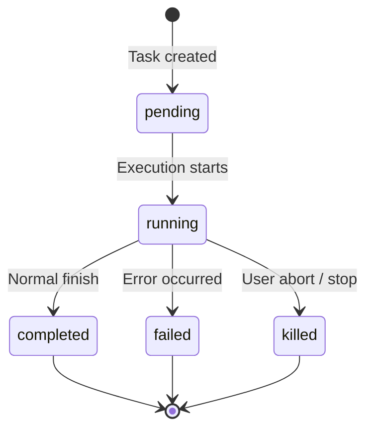

# Tutorial 10: Tasks, Coordination, and Swarms

## Learning Objectives

- The Task State Machine: 7 types, 5 statuses, unified lifecycle
- Background task execution with disk output and notifications
- Coordinator Mode: manager-worker architecture with restricted tools
- The Swarm System: peer-to-peer multi-agent collaboration
- Inter-agent communication via SendMessage
- TaskStop and lifecycle management
- Choosing between orchestration patterns

## The Problem of Scale

A single agent can accomplish remarkable work, but it hits ceilings:

1. **No parallelism** - One agent can only execute one tool at a time
2. **Context pollution** - Wide exploration clutters the conversation
3. **Token limits** - Large tasks exceed context windows
4. **No coordination** - Multiple agents can't collaborate effectively

```typescript
// ❌ Sequential execution wastes time
async function* refactorProject(agent) {
  // Read 50 files sequentially
  for (const file of files) {
    yield* agent.readFile(file);  // Blocks on each read
  }
  // Analyze (now with full context, expensive!)
  yield* agent.analyzePatterns();
  // Edit files one by one
  for (const file of files) {
    yield* agent.editFile(file);  // Blocks on each edit
  }
}
// Total time: sum of all operations. Tokens: massive.
```

## The Solution: Orchestrated Multi-Agent Systems

Claude Code provides three orchestration patterns:

1. **Background Tasks** - Fire-and-forget delegation with result notification
2. **Coordinator Mode** - Hierarchical manager-worker with synthesis phases
3. **Swarm Teams** - Peer-to-peer collaboration with message passing

## Architecture Overview

```mermaid
graph TB
    subgraph "Orchestration Patterns"
        direction TB
        
        subgraph "Background Tasks"
            BT1["Agent spawns task"]
            BT2["Task runs independently"]
            BT3["Notification on completion"]
            BT1 --> BT2 --> BT3
        end
        
        subgraph "Coordinator Mode"
            C1["Research Phase"]
            C2["Synthesis (coordinator only)"]
            C3["Implementation Phase"]
            C4["Verification Phase"]
            C1 --> C2 --> C3 --> C4
        end
        
        subgraph "Swarm Teams"
            S1["Team Creation"]
            S2["Peer Messaging"]
            S3["Plan Approval"]
            S1 --> S2 --> S3
        end
    end
```



## Part 1: The Task State Machine

Every background operation is tracked as a Task. This unified abstraction supports shell commands, sub-agents, remote sessions, and more.

### Seven Task Types

```typescript
// src/tasks/types.ts

export type TaskType = 
  | 'local_bash'      // Background shell commands
  | 'local_agent'     // Background sub-agents  
  | 'remote_agent'    // Remote sessions
  | 'in_process_teammate'  // Swarm teammates
  | 'local_workflow'  // Workflow script executions
  | 'monitor_mcp'     // MCP server monitors
  | 'dream';          // Speculative background thinking

/**
 * Single-character prefixes for visual identification:
 * b4k2m8x1 = bash task
 * a7j3n9p2 = agent task
 * t3f8s2v5 = teammate
 * r1h5q6w4 = remote
 * w6c9d4y7 = workflow
 * m2g7k1z8 = MCP monitor
 * d5b4n3r6 = dream task
 */
```

Task IDs use a prefixed random ID with ~2.8 trillion combinations—enough to resist brute-force attacks on task output files.

### Five Statuses



```typescript
// src/tasks/types.ts

export type TaskStatus = 'pending' | 'running' | 'completed' | 'failed' | 'killed';

export function isTerminalTaskStatus(status: TaskStatus): boolean {
  return status === 'completed' || status === 'failed' || status === 'killed';
}
```

### The Base Task State

```typescript
// src/tasks/types.ts

export type TaskStateBase = {
  id: string;              // Prefixed random ID (e.g., "a7j3n9p2")
  type: TaskType;          // Discriminator for union
  status: TaskStatus;      // Current lifecycle position
  description: string;     // Human-readable summary
  toolUseId?: string;      // The tool_use block that spawned this task
  startTime: number;       // Creation timestamp
  endTime?: number;        // Terminal-state timestamp
  totalPausedMs?: number;  // Accumulated pause time
  outputFile: string;      // Disk path for streaming output
  outputOffset: number;    // Read cursor for incremental output
  notified: boolean;       // Completion reported to parent?
};
```

Key design decisions:
- **`outputFile`**: Every task writes to disk. Parents read incrementally via `outputOffset`.
- **`notified`**: Prevents duplicate completion messages—critical for idempotent notification delivery.

### Agent Task State

```typescript
// src/tasks/types.ts

export type LocalAgentTaskState = TaskStateBase & {
  type: 'local_agent';
  agentId: string;
  prompt: string;
  selectedAgent?: AgentDefinition;
  agentType: string;
  model?: string;
  abortController?: AbortController;
  pendingMessages: string[];    // Queued via SendMessage
  isBackgrounded: boolean;      // Was originally foreground?
  retain: boolean;               // UI is holding this task
  diskLoaded: boolean;            // Sidechain transcript loaded
  evictAfter?: number;            // GC deadline for cleanup
  progress?: AgentProgress;
  lastReportedToolCount: number;
  lastReportedTokenCount: number;
};

export type AgentProgress = {
  toolUseCount: number;
  latestInputTokens: number;      // Cumulative (latest value)
  cumulativeOutputTokens: number; // Summed across turns
  recentActivities: ToolActivity[]; // Last 5 tool uses
};

export type ToolActivity = {
  tool: string;
  description: string;
  timestamp: number;
};
```

Important fields:
- **`pendingMessages`**: Inbox for messages sent while task runs. Drained at tool-round boundaries.
- **`isBackgrounded`**: Distinguishes agents born async from those backgrounded mid-execution.
- **`evictAfter`**: Garbage collection deadline—non-retained completed tasks are purged after grace period.

### Task Registry

```typescript
// src/tasks/registry.ts

import { TaskState, TaskType, TaskStatus } from './types.js';

export interface Task {
  name: string;
  type: TaskType;
  kill(taskId: string, setAppState: SetAppState): Promise<void>;
}

export type SetAppState = (updater: (prev: AppState) => AppState) => void;

// Minimal interface—only kill() needs polymorphic dispatch
export function getAllTasks(): Task[] {
  return [
    LocalShellTask,
    LocalAgentTask,
    RemoteAgentTask,
    DreamTask,
    // Feature-gated tasks
    ...(LocalWorkflowTask ? [LocalWorkflowTask] : []),
    ...(MonitorMcpTask ? [MonitorMcpTask] : []),
  ];
}

export function getTaskByType(type: TaskType): Task | undefined {
  return getAllTasks().find(t => t.type === type);
}
```

**Design insight**: Earlier iterations included `spawn()` and `render()` methods, but these were removed. Spawning and rendering are never called polymorphically—each task type handles its own lifecycle. Only `kill()` genuinely benefits from dispatch by type.

### Task Manager

```typescript
// src/tasks/manager.ts

import { AppState } from '../state/state-manager.js';
import { TaskState, TaskType, TaskStatus, isTerminalTaskStatus } from './types.js';

export class TaskManager {
  private tasks = new Map<string, TaskState>();

  registerTask(task: TaskState): void {
    this.tasks.set(task.id, task);
  }

  getTask(taskId: string): TaskState | undefined {
    return this.tasks.get(taskId);
  }

  updateTask(taskId: string, updates: Partial<TaskState>): void {
    const task = this.tasks.get(taskId);
    if (task) {
      Object.assign(task, updates);
    }
  }

  setTaskStatus(taskId: string, status: TaskStatus): void {
    const task = this.tasks.get(taskId);
    if (task) {
      task.status = status;
      if (isTerminalTaskStatus(status)) {
        task.endTime = Date.now();
      }
    }
  }

  getRunningTasks(): TaskState[] {
    return Array.from(this.tasks.values()).filter(
      t => t.status === 'running'
    );
  }

  getTasksByType(type: TaskType): TaskState[] {
    return Array.from(this.tasks.values()).filter(t => t.type === type);
  }

  evictCompletedTasks(gracePeriodMs: number = 300000): void {
    const now = Date.now();
    for (const [id, task] of this.tasks) {
      if (isTerminalTaskStatus(task.status)) {
        const endTime = task.endTime || now;
        if (now - endTime > gracePeriodMs && !task.retain) {
          this.tasks.delete(id);
        }
      }
    }
  }
}

export const taskManager = new TaskManager();
```

## Part 2: Communication Patterns

### Foreground: The Generator Chain

```typescript
// src/agents/runAgent.ts

async function* runAgent(params: AgentParams): AsyncGenerator<AgentMessage, AgentResult> {
  const iterator = agentLoop(params)[Symbol.asyncIterator]();
  
  // Race between next message and background signal
  while (true) {
    const nextMessagePromise = iterator.next();
    
    const raceResult = params.backgroundPromise
      ? await Promise.race([
          nextMessagePromise.then(result => ({ type: 'message', result })),
          params.backgroundPromise.then(() => ({ type: 'background' }))
        ])
      : { type: 'message', result: await nextMessagePromise };
    
    if (raceResult.type === 'background') {
      // User triggered backgrounding—transition to async
      await iterator.return?.(undefined);
      void runAgent({ ...params, isAsync: true });
      return { status: 'async_launched', agentId: params.agentId };
    }
    
    if (raceResult.result.done) {
      return raceResult.result.value;
    }
    
    yield raceResult.result.value;
  }
}
```

**Critical state transition**: Foreground agents share the parent's abort controller (ESC kills both). Background agents need their own controller. The `Promise.race` pattern enables clean handoff.

### Background: Three Channels

#### 1. Disk Output Files

```typescript
// src/tasks/output.ts

import { createWriteStream } from 'fs';
import { mkdir, symlink } from 'fs/promises';
import path from 'path';

export interface TaskOutput {
  timestamp: number;
  type: 'message' | 'tool_use' | 'tool_result' | 'completion';
  content: unknown;
}

export async function createTaskOutputFile(
  taskId: string,
  baseDir: string
): Promise<string> {
  const outputDir = path.join(baseDir, '.claude', 'tasks');
  await mkdir(outputDir, { recursive: true });
  
  const outputPath = path.join(outputDir, `${taskId}.jsonl`);
  const symlinkPath = path.join(outputDir, 'latest', `${taskId}.jsonl`);
  
  await mkdir(path.dirname(symlinkPath), { recursive: true });
  await symlink(outputPath, symlinkPath).catch(() => {}); // Ignore if exists
  
  return outputPath;
}

export function writeTaskOutput(
  outputPath: string,
  entry: TaskOutput
): void {
  const line = JSON.stringify(entry) + '\n';
  const stream = createWriteStream(outputPath, { flags: 'a' });
  stream.write(line);
  stream.end();
}

export async function* readTaskOutputIncremental(
  outputPath: string,
  offset: number
): AsyncGenerator<TaskOutput, void, unknown> {
  const { createReadStream } = await import('fs');
  const { createInterface } = await import('readline');
  
  const stream = createReadStream(outputPath, { start: offset });
  const rl = createInterface({ input: stream });
  
  for await (const line of rl) {
    if (line.trim()) {
      yield JSON.parse(line);
    }
  }
}
```

#### 2. Task Notifications

```typescript
// src/tasks/notifications.ts

import { TaskState, isTerminalTaskStatus } from './types.js';

export interface TaskNotification {
  taskId: string;
  toolUseId?: string;
  outputFile: string;
  status: 'completed' | 'failed' | 'killed';
  summary: string;
  result: string;
  usage: {
    totalTokens: number;
    toolUses: number;
    durationMs: number;
  };
}

export function formatTaskNotification(notification: TaskNotification): string {
  return `<task-notification>
  <task-id>${notification.taskId}</task-id>
  <tool-use-id>${notification.toolUseId || 'N/A'}</tool-use-id>
  <output-file>${notification.outputFile}</output-file>
  <status>${notification.status}</status>
  <summary>${escapeXml(notification.summary)}</summary>
  <result>${escapeXml(notification.result)}</result>
  <usage>
    <total-tokens>${notification.usage.totalTokens}</total-tokens>
    <tool-uses>${notification.usage.toolUses}</tool-uses>
    <duration-ms>${notification.usage.durationMs}</duration-ms>
  </usage>
</task-notification>`;
}

export function enqueueTaskNotification(
  task: TaskState,
  setAppState: SetAppState
): void {
  if (task.notified || !isTerminalTaskStatus(task.status)) {
    return;
  }
  
  const notification: TaskNotification = {
    taskId: task.id,
    toolUseId: task.toolUseId,
    outputFile: task.outputFile,
    status: task.status,
    summary: task.description,
    result: extractTaskResult(task),
    usage: extractTaskUsage(task),
  };
  
  // Inject into parent's conversation
  injectNotificationIntoParent(task, notification);
  
  // Mark as notified
  setAppState(prev => ({
    ...prev,
    tasks: {
      ...prev.tasks,
      [task.id]: { ...task, notified: true }
    }
  }));
}

function escapeXml(str: string): string {
  return str
    .replace(/&/g, '&amp;')
    .replace(/</g, '&lt;')
    .replace(/>/g, '&gt;')
    .replace(/"/g, '&quot;')
    .replace(/'/g, '&apos;');
}
```

#### 3. Command Queue (Pending Messages)

```typescript
// src/tasks/messages.ts

export function queuePendingMessage(
  agentId: string,
  message: string,
  setAppState: SetAppState
): void {
  setAppState(prev => {
    const task = Object.values(prev.tasks).find(
      t => t.type === 'local_agent' && t.agentId === agentId
    );
    
    if (!task || task.status !== 'running') {
      return prev;
    }
    
    return {
      ...prev,
      tasks: {
        ...prev.tasks,
        [task.id]: {
          ...task,
          pendingMessages: [...task.pendingMessages, message]
        }
      }
    };
  });
}

export function drainPendingMessages(
  taskId: string,
  setAppState: SetAppState
): string[] {
  let messages: string[] = [];
  
  setAppState(prev => {
    const task = prev.tasks[taskId];
    if (!task || task.type !== 'local_agent') return prev;
    
    messages = [...task.pendingMessages];
    return {
      ...prev,
      tasks: {
        ...prev.tasks,
        [taskId]: { ...task, pendingMessages: [] }
      }
    };
  });
  
  return messages;
}
```

### Progress Tracking

```typescript
// src/tasks/progress.ts

export interface ProgressTracker {
  toolUseCount: number;
  latestInputTokens: number;      // Cumulative (keep latest)
  cumulativeOutputTokens: number; // Summed across turns
  recentActivities: ToolActivity[]; // Last 5 only
}

export function updateProgress(
  tracker: ProgressTracker,
  inputTokens: number,
  outputTokens: number,
  activity: ToolActivity
): ProgressTracker {
  return {
    toolUseCount: tracker.toolUseCount + 1,
    latestInputTokens: inputTokens, // Replace, don't sum
    cumulativeOutputTokens: tracker.cumulativeOutputTokens + outputTokens,
    recentActivities: [...tracker.recentActivities.slice(-4), activity]
  };
}

// Token tracking subtlety:
// - Input tokens are cumulative per API call (full conversation resent)
// - Output tokens are per-turn (new tokens generated each time)
// - Summing cumulative input = massive overcount
// - Keeping only latest output = massive undercount
```

## Part 3: Coordinator Mode

Coordinator mode transforms Claude Code from single-agent-with-helpers into a true manager-worker architecture.

### Activation

```typescript
// src/coordinator/config.ts

export function isCoordinatorMode(): boolean {
  if (feature('COORDINATOR_MODE')) {
    return isEnvTruthy(process.env.CLAUDE_CODE_COORDINATOR_MODE);
  }
  return false;
}

export function matchSessionMode(storedMode: boolean): boolean {
  const currentMode = isCoordinatorMode();
  if (storedMode !== currentMode) {
    // Flip env to match stored mode to prevent confusion
    process.env.CLAUDE_CODE_COORDINATOR_MODE = String(storedMode);
  }
  return storedMode;
}
```

### Tool Restrictions

```typescript
// src/coordinator/tools.ts

/**
 * Coordinator gets exactly 3 tools:
 * - Agent: spawn workers
 * - SendMessage: communicate with existing workers
 * - TaskStop: terminate workers
 * 
 * Workers get full tool set minus coordination internals.
 */

export const COORDINATOR_TOOLS = [
  'Agent',
  'SendMessage', 
  'TaskStop'
];

export const INTERNAL_WORKER_TOOLS = new Set([
  'TeamCreate',
  'TeamDelete',
  'SendMessage',
  'SyntheticOutput'
]);

export function getCoordinatorTools(
  allTools: ToolDefinition[]
): ToolDefinition[] {
  return allTools.filter(t => COORDINATOR_TOOLS.includes(t.name));
}

export function getWorkerTools(
  allTools: ToolDefinition[]
): ToolDefinition[] {
  return allTools.filter(t => !INTERNAL_WORKER_TOOLS.has(t.name));
}
```

### The Four-Phase Workflow

```mermaid
graph LR
    subgraph "Phase 1: Research"
        R1["3-5 workers parallel"]
        R2["Read files, run tests"]
        R3["Gather information"]
        R1 --> R2 --> R3
    end
    
    subgraph "Phase 2: Synthesis"
        S1["Coordinator ONLY"]
        S2["No workers spawned"]
        S3["Build unified understanding"]
        S1 --> S2 --> S3
    end
    
    subgraph "Phase 3: Implementation"
        I1["Workers per file set"]
        I2["Disjoint changes"]
        I3["Parallel execution"]
        I1 --> I2 --> I3
    end
    
    subgraph "Phase 4: Verification"
        V1["Workers run tests"]
        V2["Verify changes"]
        V3["Report results"]
        V1 --> V2 --> V3
    end
    
    R3 -->|research results| S1
    S3 -->|specific instructions| I1
    I3 -->|test results| V1
```



### Worker Context

```typescript
// src/coordinator/context.ts

export interface CoordinatorContext {
  workerToolsContext: string;
  scratchpadDir?: string;
  mcpServers: string[];
}

export function getCoordinatorUserContext(
  mcpClients: McpClient[],
  scratchpadDir?: string
): CoordinatorContext {
  const workerTools = getWorkerTools(ALL_TOOLS)
    .map(t => t.name)
    .join(', ');
  
  const serverNames = mcpClients.map(c => c.name).join(', ');
  
  return {
    workerToolsContext: `Workers spawned via Agent have access to: ${workerTools}`
      + (serverNames.length > 0 
        ? `\nWorkers also have MCP tools from: ${serverNames}` 
        : '')
      + (scratchpadDir 
        ? `\nScratchpad: ${scratchpadDir}` 
        : '')
  };
}
```

**The scratchpad pattern**: Workers write findings to disk; other workers read by reference. The coordinator moves information by reference, not by value.

### Continue vs Spawn Decision

| Scenario | Action | Rationale |
|----------|--------|-----------|
| High overlap, same files | Continue | Worker has context, avoids re-reading |
| Low overlap, different domain | Spawn fresh | Dead context from previous task |
| High overlap but worker failed | Spawn fresh | Confused context, fresh start better |
| Follow-up needs worker's output | Continue | Include output in SendMessage |

### Mutual Exclusion with Fork

```typescript
// src/coordinator/fork-conflict.ts

export function isForkSubagentEnabled(): boolean {
  if (feature('FORK_SUBAGENT')) {
    if (isCoordinatorMode()) return false; // Conflict!
    return isEnvTruthy(process.env.CLAUDE_CODE_FORK_SUBAGENT);
  }
  return false;
}

// Fork agents inherit parent's full conversation context (byte-identical)
// Coordinator workers have fresh context with specific instructions
// These are opposing philosophies—system enforces choice at feature flag level
```

## Part 4: The Swarm System

Swarm teams provide peer-to-peer collaboration—a leader coordinating multiple teammates through message passing.

### Team Context

```typescript
// src/swarm/types.ts

export interface TeamContext {
  teamName: string;
  teammates: Map<string, TeammateIdentity>;
  leaderId?: string;
  scratchpadDir?: string;
}

export interface TeammateIdentity {
  id: string;
  name: string;
  color?: 'red' | 'orange' | 'yellow' | 'green' | 'blue' | 'purple';
  role?: 'leader' | 'worker' | 'reviewer';
}

export interface SwarmConfig {
  maxTeamSize: number;
  messageHistoryLimit: number;
  planApprovalRequired: boolean;
  permissionForwarding: boolean;
}
```

### Agent Name Registry

```typescript
// src/swarm/registry.ts

export class AgentNameRegistry {
  private registry = new Map<string, string>(); // name -> agentId

  register(name: string, agentId: string): void {
    this.registry.set(name, agentId);
  }

  resolve(name: string): string | undefined {
    return this.registry.get(name);
  }

  unregister(name: string): void {
    this.registry.delete(name);
  }

  getAll(): Map<string, string> {
    return new Map(this.registry);
  }
}

export const agentNameRegistry = new AgentNameRegistry();

// Usage: SendMessage "researcher" instead of "a7j3n9p2"
```

### In-Process Teammate State

```typescript
// src/swarm/teammate.ts

export interface InProcessTeammateTaskState extends TaskStateBase {
  type: 'in_process_teammate';
  identity: TeammateIdentity;
  prompt: string;
  messages?: Message[];           // Capped at 50 for UI
  pendingUserMessages: string[];
  isIdle: boolean;
  shutdownRequested: boolean;
  awaitingPlanApproval: boolean;
  permissionMode: PermissionMode;
  onIdleCallbacks?: Array<() => void>;
  currentWorkAbortController?: AbortController;
}
```

**Memory safety**: 50-message UI cap prevents 36GB RSS scenarios (observed with 292 agents in 2 minutes during whale sessions).

### The Mailbox System

```typescript
// src/swarm/mailbox.ts

import { writeFile, mkdir, readFile } from 'fs/promises';
import path from 'path';

export interface MailboxMessage {
  from: string;
  text: string;
  summary?: string;
  timestamp: string;
  color?: string;
  type?: 'plain' | 'shutdown_request' | 'shutdown_response' | 
         'plan_approval_request' | 'plan_approval_response';
  requestId?: string;
  approve?: boolean;
  reason?: string;
}

export async function writeToMailbox(
  recipientName: string,
  message: MailboxMessage,
  teamName: string,
  baseDir: string = '.claude'
): Promise<void> {
  const mailboxDir = path.join(baseDir, 'teams', teamName);
  await mkdir(mailboxDir, { recursive: true });
  
  const mailboxPath = path.join(mailboxDir, `${recipientName}.jsonl`);
  const line = JSON.stringify(message) + '\n';
  
  await writeFile(mailboxPath, line, { flag: 'a' });
}

export async function* readMailbox(
  teammateName: string,
  teamName: string,
  baseDir: string = '.claude'
): AsyncGenerator<MailboxMessage> {
  const mailboxPath = path.join(baseDir, 'teams', teamName, `${teammateName}.jsonl`);
  
  try {
    const content = await readFile(mailboxPath, 'utf-8');
    const lines = content.trim().split('\n');
    
    for (const line of lines) {
      if (line) yield JSON.parse(line);
    }
  } catch {
    // Mailbox doesn't exist yet
  }
}

export async function broadcastToTeam(
  senderName: string,
  message: Omit<MailboxMessage, 'from'>,
  teamContext: TeamContext,
  baseDir: string
): Promise<void> {
  for (const [id, teammate] of teamContext.teammates) {
    if (teammate.name.toLowerCase() !== senderName.toLowerCase()) {
      await writeToMailbox(
        teammate.name,
        { ...message, from: senderName },
        teamContext.teamName,
        baseDir
      );
    }
  }
}
```

### Permission Forwarding

```typescript
// src/swarm/permissions.ts

export interface PermissionRequest {
  requestId: string;
  toolName: string;
  toolUseId: string;
  input: unknown;
  description: string;
  suggestions?: string[];
}

export async function forwardPermissionToLeader(
  request: PermissionRequest,
  leaderName: string,
  teamName: string,
  baseDir: string
): Promise<boolean> {
  const message: MailboxMessage = {
    from: 'system',
    text: `Permission request: ${request.description}`,
    summary: `Permission required: ${request.toolName}`,
    timestamp: new Date().toISOString(),
    type: 'plain',
    // Include full request details
    ...request
  };
  
  await writeToMailbox(leaderName, message, teamName, baseDir);
  
  // Wait for response (simplified—actual impl would poll)
  return await waitForPermissionResponse(request.requestId);
}
```

## Part 5: SendMessage Tool

SendMessage is the universal communication primitive—handles four routing modes through one interface.

### Input Schema

```typescript
// src/tools/definitions/SendMessageTool.ts

import { z } from 'zod';

export const SendMessageInputSchema = z.object({
  to: z.string(),
  // Options: "teammate-name", "*", "uds:<socket>", "bridge:<session-id>"
  summary: z.string().optional(),
  message: z.union([
    z.string(),
    z.discriminatedUnion('type', [
      z.object({
        type: z.literal('shutdown_request'),
        reason: z.string().optional()
      }),
      z.object({
        type: z.literal('shutdown_response'),
        request_id: z.string(),
        approve: z.boolean(),
        reason: z.string().optional()
      }),
      z.object({
        type: z.literal('plan_approval_response'),
        request_id: z.string(),
        approve: z.boolean(),
        feedback: z.string().optional()
      })
    ])
  ])
});

export type SendMessageInput = z.infer<typeof SendMessageInputSchema>;
```

### Routing Dispatch

```typescript
// src/tools/definitions/SendMessageTool.ts

export class SendMessageTool implements ToolDefinition {
  name = 'SendMessage';
  description = 'Send a message to another agent or teammate';
  inputSchema = SendMessageInputSchema;

  async call(input: SendMessageInput, context: ToolContext): Promise<ToolResult> {
    // Priority-ordered dispatch
    
    // 1. Bridge messages (cross-machine)
    if (input.to.startsWith('bridge:')) {
      return this.sendViaBridge(input, context);
    }
    
    // 2. UDS messages (local inter-process)
    if (input.to.startsWith('uds:')) {
      return this.sendViaUds(input, context);
    }
    
    // 3. In-process routing (agent name or ID)
    const registeredId = context.appState.agentNameRegistry.get(input.to);
    const agentId = registeredId ?? toAgentId(input.to);
    
    const task = Object.values(context.appState.tasks).find(
      t => t.type === 'local_agent' && t.agentId === agentId
    );
    
    if (task) {
      if (task.status === 'running') {
        // Queue for delivery at tool-round boundary
        queuePendingMessage(agentId, JSON.stringify(input.message), context.setAppState);
        return { success: true, message: 'Message queued for delivery' };
      }
      
      if (isTerminalTaskStatus(task.status)) {
        // Auto-resume pattern!
        const result = await this.resumeAndSend(agentId, input, context);
        return result;
      }
    }
    
    // 4. Team mailbox (fallback)
    if (context.appState.teamContext) {
      if (input.to === '*') {
        await this.broadcastToTeam(input, context);
        return { success: true, message: 'Broadcast to team' };
      }
      
      await this.sendViaMailbox(input, context);
      return { success: true, message: 'Message written to mailbox' };
    }
    
    return { success: false, error: `Recipient "${input.to}" not found` };
  }

  private async resumeAndSend(
    agentId: string,
    input: SendMessageInput,
    context: ToolContext
  ): Promise<ToolResult> {
    // Transparent agent resumption!
    // Reconstructs from disk transcript, restores history, restarts agent
    const resumed = await resumeAgentBackground({
      agentId,
      prompt: typeof input.message === 'string' 
        ? input.message 
        : JSON.stringify(input.message),
      toolUseContext: context
    });
    
    return {
      success: true,
      message: `Agent "${input.to}" was stopped; resumed with your message`
    };
  }

  // ... implementations for sendViaBridge, sendViaUds, broadcastToTeam, sendViaMailbox
}
```

### The Auto-Resume Pattern

```typescript
// src/agents/resume.ts

export async function resumeAgentBackground(
  params: ResumeAgentParams
): Promise<AgentResult> {
  // 1. Read sidechain JSONL transcript from disk
  const transcript = await readTranscript(params.agentId);
  
  // 2. Reconstruct message history
  //    - Filter orphaned thinking blocks
  //    - Filter unresolved tool uses
  const messages = reconstructMessageHistory(transcript);
  
  // 3. Rebuild content replacement state for prompt cache stability
  const contentReplacements = rebuildContentReplacements(transcript);
  
  // 4. Resolve original agent definition
  const agentDef = await resolveAgentDefinition(transcript.metadata);
  
  // 5. Re-register as background task
  const newTaskId = await registerBackgroundTask({
    agentId: params.agentId,
    agentType: agentDef.agentType,
    description: `Resumed: ${agentDef.name}`
  });
  
  // 6. Call runAgent with restored history + new prompt
  const result = await runAgent({
    agentId: params.agentId,
    messages: [...messages, { role: 'user', content: params.prompt }],
    agentDefinition: agentDef,
    isAsync: true
  });
  
  return result;
}
```

**Elegant complexity**: The implementation is complex (reconstructing state from disk), but the interface is trivial—send a message, it works. Complexity is absorbed by infrastructure.

## Part 6: TaskStop Tool

```typescript
// src/tools/definitions/TaskStopTool.ts

import { z } from 'zod';

export const TaskStopInputSchema = z.strictObject({
  task_id: z.string().optional(),
  shell_id: z.string().optional() // Deprecated backward compat
});

export type TaskStopInput = z.infer<typeof TaskStopInputSchema>;

export class TaskStopTool implements ToolDefinition {
  name = 'TaskStop';
  description = 'Terminate a running background task';
  inputSchema = TaskStopInputSchema;

  async call(input: TaskStopInput, context: ToolContext): Promise<ToolResult> {
    const taskId = input.task_id || input.shell_id;
    
    if (!taskId) {
      return { success: false, error: 'Must provide task_id' };
    }
    
    const task = context.appState.tasks[taskId];
    if (!task) {
      return { success: false, error: `Task "${taskId}" not found` };
    }
    
    if (isTerminalTaskStatus(task.status)) {
      return { success: false, error: `Task "${taskId}" is already ${task.status}` };
    }
    
    // Dispatch to type-specific kill implementation
    const taskImpl = getTaskByType(task.type);
    if (!taskImpl) {
      return { success: false, error: `Unknown task type: ${task.type}` };
    }
    
    await taskImpl.kill(taskId, context.setAppState);
    
    return { success: true, message: `Task "${taskId}" stopped` };
  }
}
```

## Part 7: Choosing Between Patterns

| Scenario | Pattern | Why |
|----------|---------|-----|
| Run tests while editing | Background Task | One async task, no coordination needed |
| Search codebase for usages | Background Task | Fire-and-forget, read output when done |
| Refactor 40 files across 3 modules | Coordinator | Research → Synthesis → Implementation phases |
| Multi-day feature with review gates | Swarm | Long-lived agents, plan approval, peer comms |
| Fix bug with known location | Single Agent | Orchestration overhead exceeds benefit |
| DB migration + API + frontend updates | Coordinator | Parallel workstreams after shared planning |
| Pair programming with oversight | Swarm with plan mode | Propose → approve → execute flow |

## Implementation: Updating Our Code

Let's add task management to our agent system:

```typescript
// src/tasks/index.ts

export * from './types.js';
export * from './manager.js';
export * from './notifications.js';
export * from './messages.js';
export * from './progress.js';
export * from './output.js';
export * from './registry.js';
```

```typescript
// src/index.ts (add exports)

// ... existing exports
export * from './tasks/index.js';
export * from './coordinator/index.js';
export * from './swarm/index.js';
```

## Testing

```typescript
// src/tasks/__tests__/manager.test.ts

import { describe, it, expect, beforeEach } from 'vitest';
import { TaskManager, taskManager } from '../manager.js';
import { TaskType, TaskStatus } from '../types.js';

describe('TaskManager', () => {
  beforeEach(() => {
    // Reset singleton
    (taskManager as any).tasks.clear();
  });

  it('should register and retrieve tasks', () => {
    const task = createMockTask({ id: 'a1234567', type: 'local_agent' });
    taskManager.registerTask(task);
    
    const retrieved = taskManager.getTask('a1234567');
    expect(retrieved).toEqual(task);
  });

  it('should filter running tasks', () => {
    taskManager.registerTask(createMockTask({ id: 'a1', status: 'running' }));
    taskManager.registerTask(createMockTask({ id: 'a2', status: 'completed' }));
    taskManager.registerTask(createMockTask({ id: 'a3', status: 'running' }));
    
    const running = taskManager.getRunningTasks();
    expect(running).toHaveLength(2);
    expect(running.every(t => t.status === 'running')).toBe(true);
  });

  it('should evict completed tasks after grace period', () => {
    const oldTask = createMockTask({
      id: 'a1',
      status: 'completed',
      endTime: Date.now() - 400000 // 400s ago
    });
    
    taskManager.registerTask(oldTask);
    taskManager.evictCompletedTasks(300000); // 300s grace
    
    expect(taskManager.getTask('a1')).toBeUndefined();
  });
});

function createMockTask(overrides: Partial<TaskState>): TaskState {
  return {
    id: 'test',
    type: 'local_agent',
    status: 'pending',
    description: 'Test task',
    startTime: Date.now(),
    outputFile: '/tmp/test.jsonl',
    outputOffset: 0,
    notified: false,
    ...overrides
  };
}
```

## Verification

Run the build:

```bash
cd ~/Downloads/projects/build-claude-code-typescript
npm run build
```

## Summary

In this tutorial, we built:

1. **Task State Machine** - Unified abstraction for all background operations
2. **Three Communication Channels** - Disk files, notifications, queued messages
3. **Coordinator Mode** - Hierarchical manager-worker with restricted tools
4. **Swarm System** - Peer-to-peer teams with mailbox communication
5. **SendMessage Tool** - Universal routing with auto-resume capability
6. **TaskStop Tool** - Lifecycle termination with type-specific cleanup

**Key insights:**
- "Never delegate understanding"—coordinator must synthesize, not defer
- Auto-resume pattern: apparent simplicity over actual simplicity
- Memory caps prevent production incidents (36GB RSS → 50-message limit)
- File-based communication: durable, inspectable, cheap at agent scale
- Layered architecture: primitives are general, patterns are composed

The orchestration layer transforms a single agent into a development team—capable of working on wide problems, in parallel, with coordination.

## Next Steps

In Tutorial 11, we'll explore the Memory System—file-based memory with LLM recall, staleness handling, and the two-phase loading that keeps startup fast while providing rich context.
