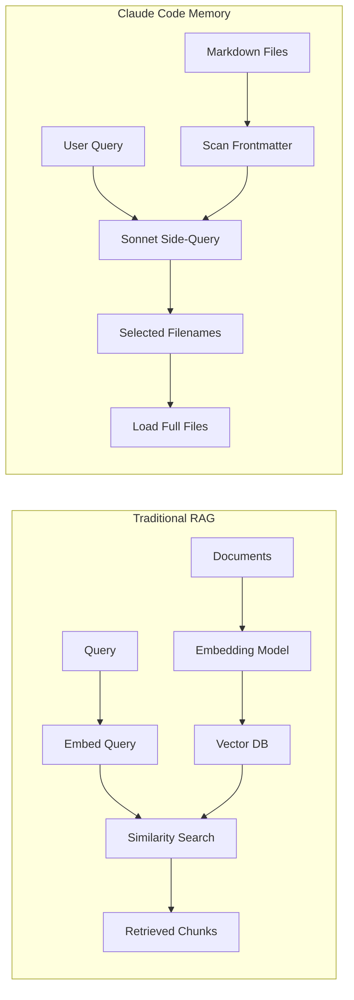
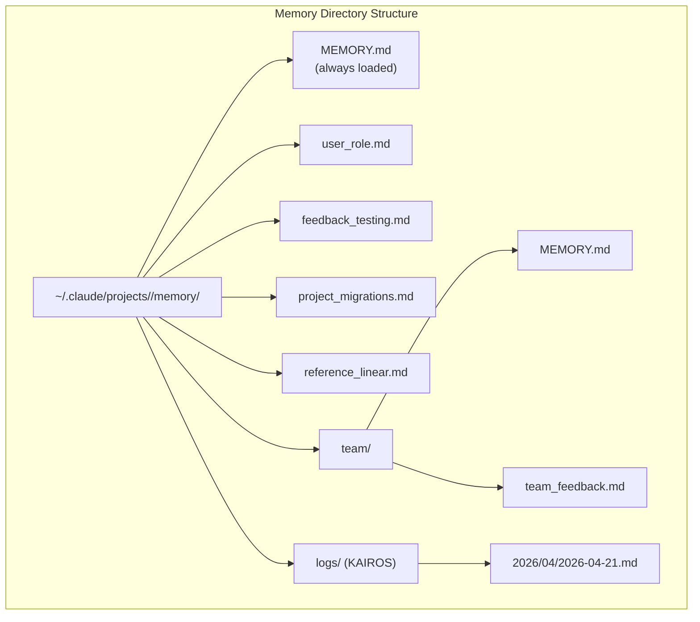
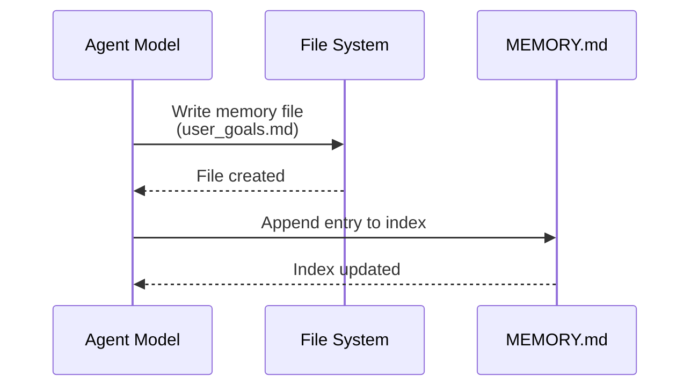
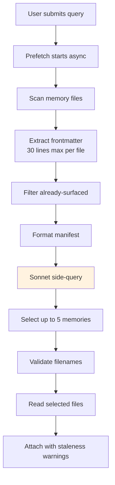
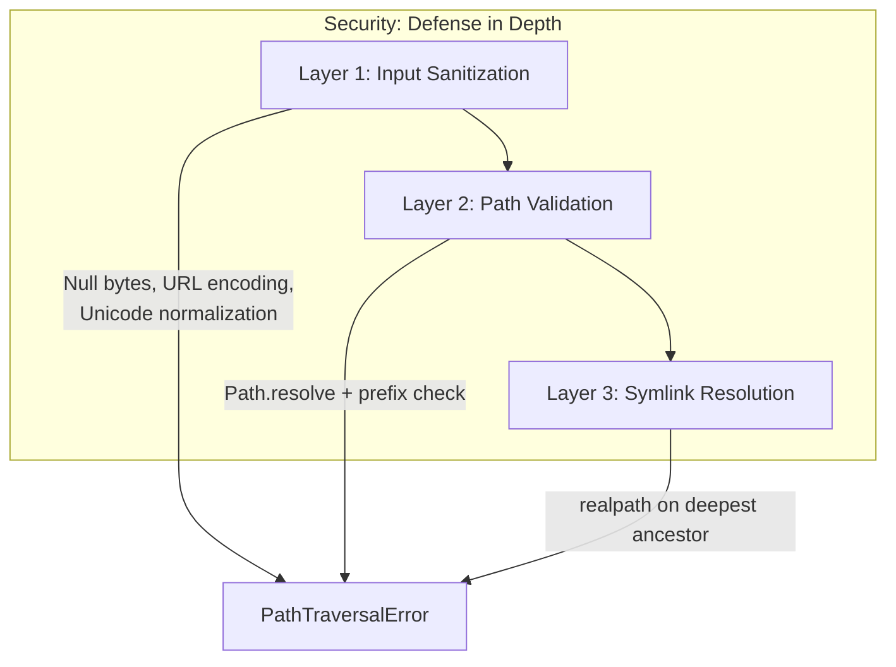
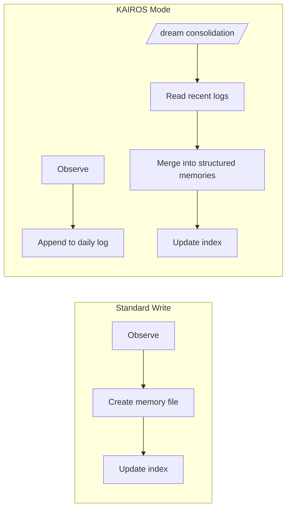

# Tutorial 11: Memory -- Learning Across Conversations

## Learning Objectives

- The Stateless Problem: why agents need memory across sessions
- File-based storage: human-readable, editable, version-controllable
- Four-type taxonomy: user, feedback, project, reference
- Two-step write protocol: create file, update index
- LLM-powered recall: Sonnet side-query for relevance selection
- Staleness warnings: treating old memories as hypotheses
- Team memory: shared knowledge with defense in depth
- KAIROS mode: append-only logs and /dream consolidation

## The Stateless Problem

Every session so far has been independent. The agent runs, tools execute, sub-agents coordinate, and when the process exits, all context vanishes. The next conversation starts fresh: same system prompt, same tools, zero knowledge of what came before.

This manifests in concrete ways:
- A user corrects the model's testing approach Monday, Tuesday it makes the same mistake
- A user explains their role and preferences, every new session requires re-explaining
- The agent is perpetually a new hire on their first day

Industry solutions like RAG (vector databases) work well for documentation but are mismatched for agent memory. An agent's memory is observations, not documents: who the user is, what they've corrected, project constraints. These are small, change frequently, and must be human-editable.

Claude Code's memory system makes a different bet entirely: **files on disk, Markdown format, LLM-powered recall, no infrastructure.**



## Design Philosophy

- **Human-readable:** Open `MEMORY.md` in any text editor
- **Human-editable:** Correct stale memories with vim, delete with `rm`
- **Version-controllable:** Team memories commit to git, diff cleanly
- **Zero infrastructure:** Works offline, no servers, no schemas
- **Debuggable:** `ls` and `cat` for diagnosis, not query logs

The model uses standard tools (`FileWriteTool`, `FileEditTool`) to manage memories. No special memory API exists. The system prompt teaches a two-step protocol, and the model executes it with existing capabilities under new instructions.



## Part 1: Storage Architecture

### Path Resolution

Memory is scoped to the git repository root:

```typescript
// src/memory/paths.ts

import { homedir } from 'os';
import { join } from 'path';

/**
 * Resolve the memory directory for a project.
 * Git root takes precedence over working directory.
 */
export async function resolveMemoryPath(
  gitRoot: string | null,
  workingDir: string
): Promise<string> {
  const basePath = gitRoot ?? workingDir;
  const sanitized = sanitizePath(basePath);
  return join(homedir(), '.claude', 'projects', sanitized, 'memory');
}

/**
 * Sanitize a path for use as a directory name.
 * Converts slashes to dashes, removes problematic characters.
 */
export function sanitizePath(input: string): string {
  return input
    .replace(/^\//, '')           // Remove leading slash
    .replace(/\//g, '-')          // Slashes to dashes
    .replace(/\\/g, '-')          // Backslashes to dashes
    .replace(/[^a-zA-Z0-9\-_.]/g, '') // Remove special chars
    .replace(/-+/g, '-')           // Collapse multiple dashes
    .replace(/^-|-$/g, '');        // Trim leading/trailing dashes
}

// Example: /Users/alex/code/myapp → Users-alex-code-myapp
```

### The Four-Type Taxonomy

Memories are constrained to exactly four types:

```typescript
// src/memory/types.ts

export type MemoryType = 'user' | 'feedback' | 'project' | 'reference';

/**
 * Core question: Is this knowledge derivable from the current project state?
 * 
 * Code patterns, git history, file structure — all re-derivable. Excluded.
 * These four capture what cannot be re-derived.
 */

export interface MemoryFrontmatter {
  name: string;           // Human-readable title
  description: string;    // One-line relevance indicator
  type: MemoryType;       // Taxonomy classification
}

/**
 * User memories: Information about the person
 * - Role, goals, responsibilities, expertise level
 * - "Senior Go engineer, new to React"
 * - Affects explanation style, depth, assumptions
 */

/**
 * Feedback memories: Guidance about how to work
 * - Corrections AND confirmations
 * - Specific structure: rule + Why + How to apply
 */

/**
 * Project memories: Ongoing work context
 * - Who is doing what, why, by when
 * - Relative dates converted to absolute ("Thursday" → "2026-04-16")
 */

/**
 * Reference memories: Bookmarks to external systems
 * - Linear project URL, Grafana dashboard, Slack channel
 * - Tell the model WHERE to look, not WHAT to find
 */
```

### Memory File Structure

```typescript
// src/memory/types.ts

export interface MemoryFile {
  path: string;                    // Absolute file path
  frontmatter: MemoryFrontmatter;    // Parsed YAML header
  body: string;                      // Full content (loaded on demand)
  mtime: number;                    // Modification time for staleness
  size: number;                     // Bytes for budget tracking
}

/**
 * In-memory representation of the memory system state
 */
export interface MemoryState {
  memoryDir: string;                 // Base directory path
  indexPath: string;                 // MEMORY.md location
  files: Map<string, MemoryFile>;    // All discovered memory files
  surfacedFiles: Set<string>;       // Already loaded this session
  teamDir?: string;                  // Team memory subdirectory
}
```

## Part 2: The Write Path

Writing a memory is a two-step process using standard file tools.



```typescript
// src/memory/write.ts

import { join } from 'path';
import { writeFile, appendFile } from 'fs/promises';

/**
 * Format memory content with frontmatter
 */
export function formatMemoryContent(
  frontmatter: MemoryFrontmatter,
  body: string
): string {
  const yaml = [
    '---',
    `name: ${frontmatter.name}`,
    `description: ${frontmatter.description}`,
    `type: ${frontmatter.type}`,
    '---',
    '',
    body
  ].join('\n');
  
  return yaml;
}

/**
 * Format a single index entry
 * Must stay under ~150 characters
 */
export function formatIndexEntry(
  filename: string,
  description: string
): string {
  const entry = `- [${filename}](${filename}) -- ${description}`;
  // Hard cap enforcement
  if (entry.length > 150) {
    return entry.slice(0, 147) + '...';
  }
  return entry;
}

/**
 * Two-step memory write protocol
 * 
 * Step 1: Create the memory file
 * Step 2: Update the MEMORY.md index
 */
export async function writeMemory(
  memoryDir: string,
  filename: string,
  frontmatter: MemoryFrontmatter,
  body: string
): Promise<void> {
  // Step 1: Write the memory file
  const content = formatMemoryContent(frontmatter, body);
  const filePath = join(memoryDir, filename);
  await writeFile(filePath, content, 'utf-8');
  
  // Step 2: Update the index
  const indexPath = join(memoryDir, 'MEMORY.md');
  const indexEntry = formatIndexEntry(filename, frontmatter.description);
  await appendFile(indexPath, indexEntry + '\n', 'utf-8');
}

// Example usage:
// await writeMemory(
//   '/Users/alex/.claude/projects/myapp/memory',
//   'feedback_testing.md',
//   {
//     name: 'Testing Policy',
//     description: 'Integration tests must hit real DB, not mocks',
//     type: 'feedback'
//   },
//   `Don't mock the database in integration tests.
//
// **Why:** We got burned last quarter when mocked tests passed but production
// queries hit edge cases the mocks didn't cover.
//
// **How to apply:** Any test file under __tests__/ that touches database
// operations should use the real PGlite instance from test-utils.`
// );
```

### MEMORY.md Index Caps

The index has two hard caps to prevent context explosion:

```typescript
// src/memory/index.ts

export const MEMORY_INDEX_MAX_LINES = 200;
export const MEMORY_INDEX_MAX_BYTES = 25000;

/**
 * Validate and report index size issues
 */
export function validateIndexSize(content: string): {
  valid: boolean;
  lineCount: number;
  byteCount: number;
  issues: string[];
} {
  const lines = content.split('\n');
  const bytes = Buffer.byteLength(content, 'utf-8');
  const issues: string[] = [];
  
  if (lines.length > MEMORY_INDEX_MAX_LINES) {
    issues.push(
      `Index exceeds ${MEMORY_INDEX_MAX_LINES} lines (${lines.length}). ` +
      'Consider consolidating old memories or moving details into topic files.'
    );
  }
  
  if (bytes > MEMORY_INDEX_MAX_BYTES) {
    issues.push(
      `Index exceeds ${MEMORY_INDEX_MAX_BYTES} bytes (${bytes}). ` +
      'Keep entries under ~200 chars. Move detail into topic files.'
    );
  }
  
  return { valid: issues.length === 0, lineCount: lines.length, byteCount: bytes, issues };
}
```

## Part 3: The Recall Path



### Scanning Memory Files

```typescript
// src/memory/scan.ts

import { readdir, readFile, stat } from 'fs/promises';
import { join } from 'path';
import type { MemoryFile, MemoryFrontmatter } from './types.js';

/**
 * Extract YAML frontmatter from file content
 * Reads only first 30 lines for efficiency
 */
export function extractFrontmatter(content: string): {
  frontmatter: MemoryFrontmatter | null;
  body: string;
} {
  const lines = content.split('\n');
  
  // Must start with ---
  if (lines[0]?.trim() !== '---') {
    return { frontmatter: null, body: content };
  }
  
  // Find closing ---
  const endIndex = lines.findIndex((line, i) => i > 0 && line.trim() === '---');
  if (endIndex === -1) {
    return { frontmatter: null, body: content };
  }
  
  // Parse YAML (simplified - production uses proper YAML parser)
  const yamlLines = lines.slice(1, endIndex);
  const frontmatter: Partial<MemoryFrontmatter> = {};
  
  for (const line of yamlLines) {
    const match = line.match(/^(\w+):\s*(.+)$/);
    if (match) {
      const [, key, value] = match;
      if (key === 'name' || key === 'description' || key === 'type') {
        frontmatter[key] = value.trim();
      }
    }
  }
  
  const body = lines.slice(endIndex + 1).join('\n');
  
  return {
    frontmatter: frontmatter as MemoryFrontmatter,
    body
  };
}

/**
 * Scan directory for memory files
 * Only reads first 30 lines of each file for frontmatter extraction
 */
export async function scanMemoryFiles(memoryDir: string): Promise<MemoryFile[]> {
  const files: MemoryFile[] = [];
  
  try {
    const entries = await readdir(memoryDir, { withFileTypes: true });
    
    for (const entry of entries) {
      if (!entry.isFile() || !entry.name.endsWith('.md')) {
        continue;
      }
      // Skip the index itself and team subdir files
      if (entry.name === 'MEMORY.md' || entry.name.startsWith('team-')) {
        continue;
      }
      
      const filePath = join(memoryDir, entry.name);
      const stats = await stat(filePath);
      
      // Read only first 30 lines for frontmatter
      const content = await readFile(filePath, 'utf-8');
      const lines = content.split('\n').slice(0, 30).join('\n');
      const { frontmatter } = extractFrontmatter(lines);
      
      if (frontmatter) {
        files.push({
          path: filePath,
          frontmatter,
          body: '', // Loaded on demand
          mtime: stats.mtimeMs,
          size: stats.size
        });
      }
    }
  } catch (error) {
    // Directory may not exist yet
    if ((error as NodeJS.ErrnoException).code !== 'ENOENT') {
      throw error;
    }
  }
  
  return files;
}
```

### The Manifest and Selection

```typescript
// src/memory/recall.ts

import type { MemoryFile } from './types.js';

/**
 * Format memory manifest for the LLM selector
 * One line per file: type, name, date, description
 */
export function formatMemoryManifest(
  files: MemoryFile[],
  surfacedFiles: Set<string>
): string {
  const available = files.filter(f => !surfedFiles.has(f.path));
  
  return available
    .map(file => {
      const date = new Date(file.mtime).toISOString().split('T')[0];
      const { type, name, description } = file.frontmatter;
      return `[${type}] ${name} (${date}): ${description}`;
    })
    .join('\n');
}

/**
 * Parsed side-query response
 */
export interface RecallSelection {
  selectedFiles: string[];  // Filenames only, not full paths
  reasoning: string;       // Why these were selected
}

/**
 * System prompt for the Sonnet side-query
 * 
 * The selector should be conservative: include only memories that will
 * be useful for the current query. Skip memories if uncertain.
 * 
 * Do NOT select API/usage documentation for tools already in active use
 * (the model already has those tools loaded). But DO surface warnings,
 * gotchas, or known issues about those tools.
 */
export const RECALL_SELECTOR_PROMPT = `You are a memory relevance selector.

Given:
1. A manifest of available memory files (type, name, date, description)
2. The user's current query
3. Recently used tools (to avoid redundant documentation)

Select up to 5 memory files that would be MOST useful for the current query.

Guidelines:
- Be conservative: include only if clearly relevant
- Skip memories for tools already in active use (unless they contain warnings/gotchas)
- Prefer recent memories over old ones when relevance is equal
- Consider memory type: user and feedback memories are usually high-value

Respond with JSON:
{
  "selectedFiles": ["filename1.md", "filename2.md"],
  "reasoning": "Brief explanation of selection rationale"
}`;

/**
 * Validate selected filenames against known set
 * Catches hallucinated filenames from the LLM
 */
export function validateSelections(
  selections: string[],
  knownFiles: MemoryFile[]
): { valid: string[]; invalid: string[] } {
  const knownPaths = new Set(knownFiles.map(f => f.path));
  const knownNames = new Set(knownFiles.map(f => 
    f.path.split('/').pop()!
  ));
  
  const valid: string[] = [];
  const invalid: string[] = [];
  
  for (const selection of selections) {
    // Accept either full path or just filename
    const name = selection.split('/').pop()!;
    if (knownNames.has(name)) {
      const fullPath = knownFiles.find(f => 
        f.path.endsWith('/' + name)
      )?.path;
      if (fullPath) valid.push(fullPath);
    } else {
      invalid.push(selection);
    }
  }
  
  return { valid, invalid };
}
```

### Staleness Handling

```typescript
// src/memory/staleness.ts

/**
 * Calculate human-readable staleness warning
 */
export function calculateStaleness(mtime: number): string {
  const now = Date.now();
  const ageMs = now - mtime;
  const ageDays = Math.floor(ageMs / (1000 * 60 * 60 * 24));
  
  // Today or yesterday: no warning
  if (ageDays === 0) return '';
  if (ageDays === 1) return '';
  
  // Format human-readable
  let ageText: string;
  if (ageDays < 7) {
    ageText = `${ageDays} days ago`;
  } else if (ageDays < 30) {
    ageText = `${Math.floor(ageDays / 7)} weeks ago`;
  } else if (ageDays < 365) {
    ageText = `${Math.floor(ageDays / 30)} months ago`;
  } else {
    ageText = `${Math.floor(ageDays / 365)} years ago`;
  }
  
  // Action-cue framing validated through evals
  return `This memory is from ${ageText}. Before recommending from memory, verify against current code since file:line citations and behavior claims may be outdated.`;
}

/**
 * Wrap memory content with staleness warning if applicable
 */
export function wrapWithStaleness(
  content: string,
  mtime: number
): string {
  const warning = calculateStaleness(mtime);
  if (!warning) return content;
  
  return `${warning}\n\n---\n\n${content}`;
}
```

## Part 4: Team Memory

Team memory lives in a subdirectory, gated behind feature flags:



```typescript
// src/memory/team.ts

import { join, resolve } from 'path';
import { realpath } from 'fs/promises';

/**
 * Path traversal attack detection
 * Layer 1: Input sanitization
 */
export function sanitizePathKey(input: string): string {
  // Reject null bytes
  if (input.includes('\0')) {
    throw new PathTraversalError('Null bytes detected');
  }
  
  // Reject URL-encoded traversals
  if (input.includes('%2e') || input.includes('%2f') || input.includes('%5c')) {
    throw new PathTraversalError('URL-encoded traversal detected');
  }
  
  // Reject backslashes (Windows-style)
  if (input.includes('\\')) {
    throw new PathTraversalError('Backslash detected');
  }
  
  // Reject absolute paths
  if (input.startsWith('/')) {
    throw new PathTraversalError('Absolute path detected');
  }
  
  // Normalize Unicode (catch fullwidth characters that normalize to ../)
  const normalized = input.normalize('NFC');
  if (normalized !== input) {
    // Re-check after normalization
    return sanitizePathKey(normalized);
  }
  
  return input;
}

/**
 * Layer 2 & 3: Path resolution and symlink checking
 */
export async function resolveTeamPath(
  memoryDir: string,
  filename: string
): Promise<string> {
  // Layer 1: Sanitize input
  const sanitized = sanitizePathKey(filename);
  
  // Layer 2: Resolve and validate prefix
  const teamDir = join(memoryDir, 'team');
  const resolved = resolve(teamDir, sanitized);
  
  // Trailing separator convention prevents prefix-only match
  const teamDirWithSep = teamDir.endsWith('/') ? teamDir : teamDir + '/';
  if (!resolved.startsWith(teamDirWithSep)) {
    throw new PathTraversalError('Resolved path outside team directory');
  }
  
  // Layer 3: Resolve symlinks on deepest existing ancestor
  try {
    const realPath = await realpath(resolved);
    if (!realPath.startsWith(teamDir)) {
      throw new PathTraversalError('Symlink target outside team directory');
    }
  } catch (error) {
    // File doesn't exist yet - that's fine for new writes
    if ((error as NodeJS.ErrnoException).code !== 'ENOENT') {
      throw error;
    }
  }
  
  return resolved;
}

export class PathTraversalError extends Error {
  constructor(message: string) {
    super(message);
    this.name = 'PathTraversalError';
  }
}

/**
 * Scope guidance for the model
 * 
 * User memories: always private
 * Reference memories: usually team
 * Feedback memories: default to private unless project-wide
 * 
 * Cross-check: Before saving a private feedback memory, check that
 * it does not contradict a team feedback memory.
 */
export function getScopeGuidance(type: string): string {
  const guidance: Record<string, string> = {
    user: 'Private only. Never team.',
    feedback: 'Default to private. Team only if project-wide convention.',
    project: 'Usually private. Team if coordinating across team members.',
    reference: 'Usually team. Private only if personal bookmark.'
  };
  return guidance[type] ?? 'Default to private.';
}
```

## Part 5: KAIROS Mode

KAIROS mode (assistant mode) uses append-only daily logs for continuous operation:



```typescript
// src/memory/kairos.ts

import { join } from 'path';
import { appendFile, mkdir, writeFile } from 'fs/promises';

/**
 * Get daily log path based on current date
 * Pattern-based in prompt: model derives date from date_change attachment
 * This allows prompt caching across midnight
 */
export function getDailyLogPath(memoryDir: string, date: Date): string {
  const year = date.getFullYear();
  const month = String(date.getMonth() + 1).padStart(2, '0');
  const day = String(date.getDate()).padStart(2, '0');
  
  return join(memoryDir, 'logs', String(year), month, `${year}-${month}-${day}.md`);
}

/**
 * Append timestamped observation to daily log
 * Model instructed: "Do not rewrite or reorganize the log"
 */
export async function appendToDailyLog(
  logPath: string,
  observation: string
): Promise<void> {
  // Ensure directory exists
  const dir = logPath.slice(0, logPath.lastIndexOf('/'));
  await mkdir(dir, { recursive: true });
  
  const timestamp = new Date().toISOString();
  const entry = `- [${timestamp}] ${observation}\n`;
  
  await appendFile(logPath, entry, 'utf-8');
}

/**
 * Consolidation lock file
 * Content = PID for mutual exclusion
 * Mtime = lastConsolidatedAt for scheduling
 */
export interface ConsolidationLock {
  holderPid: number;
  acquiredAt: number;
}

/**
 * Check if consolidation should run
 * Gates evaluated cheapest-first
 */
export function shouldConsolidate(
  lastConsolidatedAt: number,
  sessionsModified: number,
  isLocked: boolean
): boolean {
  // Gate 1: Hours since last consolidation > 24
  const hoursSince = (Date.now() - lastConsolidatedAt) / (1000 * 60 * 60);
  if (hoursSince <= 24) return false;
  
  // Gate 2: Sessions modified since then > 5
  if (sessionsModified < 5) return false;
  
  // Gate 3: No other process holds lock
  if (isLocked) return false;
  
  return true;
}

/**
 * The /dream consolidation phases
 */
export type ConsolidationPhase = 'orient' | 'gather' | 'consolidate' | 'prune';

/**
 * Phase descriptions for the consolidating agent
 */
export const CONSOLIDATION_PHASES: Record<ConsolidationPhase, string> = {
  orient: 'List directory, read index, skim existing memory files',
  gather: 'Search logs, check for drifted memories',
  consolidate: 'Write or update files, MERGE into existing rather than duplicate',
  prune: 'Update index under 200 lines, remove stale pointers'
};
```

## Part 6: Background Memory Extraction

A forked agent catches memories the main agent missed:

```typescript
// src/memory/extraction.ts

import type { Message } from '../agent/types.js';

/**
 * Background extraction agent configuration
 * 
 * Runs at end of each complete query loop
 * Shares parent's prompt cache via fork
 * Skips if main agent already saved in current turn range
 */
export interface ExtractionConfig {
  memoryDir: string;
  turnRange: { start: number; end: number };
  mainAgentSaved: boolean;  // Skip if true
  toolBudget: string[];     // Read-only + memory write only
}

/**
 * Extraction agent prompt
 * 
 * Constrained tool budget:
 * - ReadFileTool, GlobTool, GrepTool (read-only)
 * - WriteFileTool, FileEditTool (memory paths only)
 * 
 * Two-turn strategy:
 * Turn 1: Read MEMORY.md, existing memories in parallel
 * Turn 2: Write any missed memories in parallel
 */
export const EXTRACTION_PROMPT = `You are a memory extraction agent.

Analyze the recent conversation and extract any memories the main agent missed.

Tool constraints:
- Use read-only tools (ReadFile, Glob, Grep) for investigation
- Use WriteFile/FileEdit ONLY for paths within the memory directory

Strategy:
1. First, read MEMORY.md and check what memories exist
2. Identify what should have been saved but wasn't
3. Write the missing memories following the two-step protocol

Focus on: user preferences, corrections, project context, feedback.`;

/**
 * Determine if extraction should run
 */
export function shouldRunExtraction(
  config: ExtractionConfig
): boolean {
  // Don't duplicate main agent's work
  if (config.mainAgentSaved) return false;
  
  // Require valid turn range
  if (config.turnRange.start >= config.turnRange.end) return false;
  
  return true;
}
```

## Part 7: Integration

```typescript
// src/memory/index.ts

import { scanMemoryFiles } from './scan.js';
import { writeMemory } from './write.js';
import { formatMemoryManifest, validateSelections } from './recall.js';
import { wrapWithStaleness } from './staleness.js';
import type { MemoryFile, MemoryState, MemoryFrontmatter } from './types.js';

export * from './types.js';
export * from './paths.js';
export * from './scan.js';
export * from './write.js';
export * from './recall.js';
export * from './staleness.js';
export * from './team.js';
export * from './kairos.js';
export * from './extraction.js';

/**
 * Initialize memory system for a project
 */
export async function initializeMemory(
  gitRoot: string | null,
  workingDir: string
): Promise<MemoryState> {
  const { resolveMemoryPath } = await import('./paths.js');
  const memoryDir = await resolveMemoryPath(gitRoot, workingDir);
  const indexPath = `${memoryDir}/MEMORY.md`;
  
  return {
    memoryDir,
    indexPath,
    files: new Map(),
    surfacedFiles: new Set(),
    teamDir: `${memoryDir}/team`
  };
}

/**
 * Full recall pipeline
 */
export async function recallRelevantMemories(
  state: MemoryState,
  userQuery: string,
  recentTools: string[],
  llmSelector: (manifest: string, query: string, tools: string[]) => Promise<string[]>
): Promise<Array<{ path: string; content: string }>> {
  // Scan for available memories
  const files = await scanMemoryFiles(state.memoryDir);
  
  // Format manifest
  const manifest = formatMemoryManifest(files, state.surfacedFiles);
  
  // Run LLM side-query
  const selections = await llmSelector(manifest, userQuery, recentTools);
  
  // Validate and load selected files
  const { valid } = validateSelections(selections, files);
  const results: Array<{ path: string; content: string }> = [];
  
  for (const filePath of valid) {
    const file = files.find(f => f.path === filePath);
    if (!file) continue;
    
    // Load full content
    const { readFile } = await import('fs/promises');
    const fullContent = await readFile(filePath, 'utf-8');
    
    // Wrap with staleness warning
    const content = wrapWithStaleness(fullContent, file.mtime);
    
    results.push({ path: filePath, content });
    state.surfacedFiles.add(filePath);
  }
  
  return results;
}
```

## Part 8: Testing

```typescript
// src/memory/__tests__/memory.test.ts

import { describe, it, expect, beforeEach, afterEach } from 'vitest';
import { mkdtemp, writeFile, mkdir } from 'fs/promises';
import { tmpdir } from 'os';
import { join } from 'path';
import {
  sanitizePath,
  extractFrontmatter,
  formatMemoryManifest,
  calculateStaleness,
  validateIndexSize,
  sanitizePathKey,
  PathTraversalError
} from '../index.js';

describe('Memory System', () => {
  describe('Path Sanitization', () => {
    it('converts slashes to dashes', () => {
      expect(sanitizePath('/Users/alex/code/myapp'))
        .toBe('Users-alex-code-myapp');
    });
    
    it('removes special characters', () => {
      expect(sanitizePath('/path/with@special#chars!'))
        .toBe('path-withspecialchars');
    });
  });
  
  describe('Frontmatter Extraction', () => {
    it('parses valid frontmatter', () => {
      const content = `---
name: Testing Policy
description: Use real DB in tests
type: feedback
---

Body content here`;
      
      const result = extractFrontmatter(content);
      expect(result.frontmatter).toEqual({
        name: 'Testing Policy',
        description: 'Use real DB in tests',
        type: 'feedback'
      });
      expect(result.body).toBe('\nBody content here');
    });
    
    it('returns null for missing frontmatter', () => {
      const content = 'Just body content';
      const result = extractFrontmatter(content);
      expect(result.frontmatter).toBeNull();
    });
  });
  
  describe('Staleness Warnings', () => {
    it('returns empty for recent memories', () => {
      const yesterday = Date.now() - 24 * 60 * 60 * 1000;
      expect(calculateStaleness(yesterday)).toBe('');
    });
    
    it('warns for old memories', () => {
      const old = Date.now() - 50 * 24 * 60 * 60 * 1000;
      const warning = calculateStaleness(old);
      expect(warning).toContain('50 days ago');
      expect(warning).toContain('verify against current code');
    });
  });
  
  describe('Index Size Validation', () => {
    it('accepts small indexes', () => {
      const content = '\n'.repeat(100);
      const result = validateIndexSize(content);
      expect(result.valid).toBe(true);
    });
    
    it('rejects oversized indexes', () => {
      const content = '\n'.repeat(250);
      const result = validateIndexSize(content);
      expect(result.valid).toBe(false);
      expect(result.issues).toContain(expect.stringContaining('200 lines'));
    });
  });
  
  describe('Security: Path Traversal', () => {
    it('rejects null bytes', () => {
      expect(() => sanitizePathKey('file\0name'))
        .toThrow(PathTraversalError);
    });
    
    it('rejects URL-encoded traversals', () => {
      expect(() => sanitizePathKey('..%2f..%2fetc'))
        .toThrow(PathTraversalError);
    });
    
    it('rejects backslashes', () => {
      expect(() => sanitizePathKey('..\\windows\\system32'))
        .toThrow(PathTraversalError);
    });
    
    it('rejects absolute paths', () => {
      expect(() => sanitizePathKey('/etc/passwd'))
        .toThrow(PathTraversalError);
    });
  });
});
```

## Key Takeaways

1. **Files beat databases** for agent memory. Human readability builds trust.

2. **Constrain what gets saved, not just how.** The derivability test eliminates re-derivable knowledge.

3. **LLM side-queries for recall** understand context and negation. The latency cost is bounded and hidden.

4. **Staleness warnings, not expiration.** Institutional knowledge stays valid. Treat old memories as hypotheses.

5. **Defense in depth for team memory.** Three layers of path validation before any write.

6. **Background extraction as safety net.** The main agent will miss memories. A forked agent catches the gaps.

## Next Steps

Tutorial 12 covers the Skills System: dynamic capability loading with lifecycle hooks and security snapshots.
