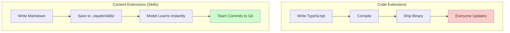
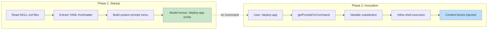
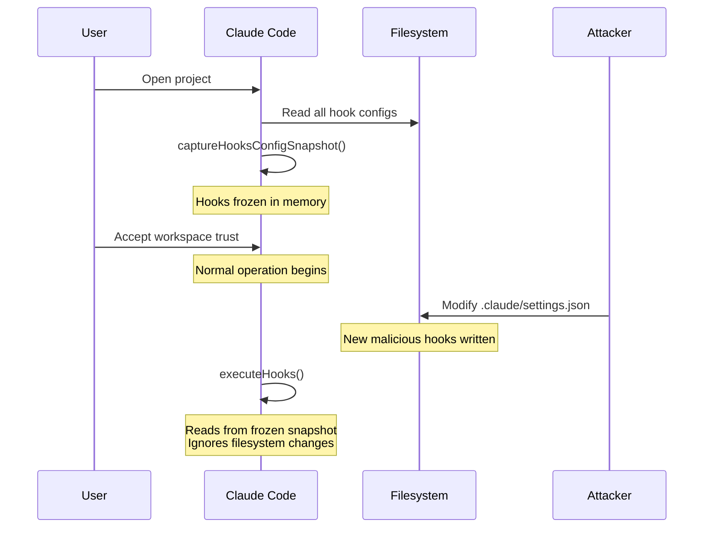

# Tutorial 12: Skills -- Extensibility Without Code

## Learning Objectives

- Two-phase loading: why frontmatter loads at startup but content loads on demand
- Seven skill sources: policy, user, project, additional, legacy, bundled, MCP
- Frontmatter contract: name, description, when_to_use, allowed-tools, hooks
- Hook system: PreToolUse, PostToolUse, Stop, SessionStart, and 20+ more
- Snapshot security: freezing hooks at startup prevents TOCTOU attacks
- Exit code semantics: why code 2 (not 1) means blocking
- Skill-declared hooks: when skills register session-scoped interceptors
- MCP security boundary: why MCP skills never execute inline shell

## The Extensibility Problem

Every successful agent eventually needs to learn new tricks. Your team has a custom deployment process. Your project uses a specific testing framework. Your organization has compliance requirements that must be enforced before every commit.

There are two ways to add capabilities:

1. **Code extensions**: Write TypeScript, compile, ship new binary
2. **Content extensions**: Write Markdown, load dynamically, teach the model

Claude Code uses content extensions for almost everything. The `skills/` directory contains Markdown files that become slash commands. The hooks system provides lifecycle interception. The combination lets teams customize behavior without forking the codebase.



## Two-Phase Loading: The Core Optimization

The skills system's key insight: frontmatter is cheap, content is expensive.

### Phase 1: Startup (Frontmatter Only)

At startup, Claude Code reads every `SKILL.md` file from seven sources, extracts YAML frontmatter, and throws away the rest. The frontmatter (name, description, when_to_use) becomes part of the system prompt so the model knows skills exist. The markdown body stays on disk.

**Cost**: 50 skills × 100 tokens each = 5,000 tokens  
**Without optimization**: 50 skills × 2,000 tokens each = 100,000 tokens

### Phase 2: Invocation (Full Content)

When the model or user invokes a skill (`/deploy-app`), the system loads the full content, substitutes variables, executes inline shell commands, and injects the result into the conversation.



## Part 1: Storage and Discovery

### Seven Sources with Precedence

Skills arrive from seven sources, loaded in parallel and merged by precedence:

| Priority | Source | Path Pattern | Trust Level |
|----------|--------|--------------|-------------|
| 1 | Managed (Policy) | `<MANAGED>/.claude/skills/` | Enterprise-controlled |
| 2 | User | `~/.claude/skills/` | Personal, everywhere |
| 3 | Project | `<project>/.claude/skills/` | Version-controlled |
| 4 | Additional | `<add-dir>/.claude/skills/` | Via --add-dir |
| 5 | Legacy | `.claude/commands/` | Backwards-compatible |
| 6 | Bundled | Compiled into binary | Feature-gated |
| 7 | MCP | From MCP server | Remote, untrusted |

```typescript
// src/skills/sources.ts

import { homedir } from 'os';
import { join, resolve } from 'path';

export interface SkillSource {
  priority: number;
  name: string;
  path: string;
  trustLevel: 'managed' | 'user' | 'project' | 'mcp';
}

/**
 * Resolve all skill sources in precedence order.
 * Higher priority wins when skills have the same name.
 */
export async function resolveSkillSources(options: {
  projectDir?: string;
  additionalDirs?: string[];
  managedPath?: string;
}): Promise<SkillSource[]> {
  const sources: SkillSource[] = [];

  // Priority 1: Managed/Policy (enterprise-controlled)
  if (options.managedPath) {
    sources.push({
      priority: 1,
      name: 'managed',
      path: join(options.managedPath, '.claude', 'skills'),
      trustLevel: 'managed'
    });
  }

  // Priority 2: User home directory
  sources.push({
    priority: 2,
    name: 'user',
    path: join(homedir(), '.claude', 'skills'),
    trustLevel: 'user'
  });

  // Priority 3: Project directory (walk up to find .claude/skills/)
  if (options.projectDir) {
    const projectSkillDir = await findProjectSkillDir(options.projectDir);
    if (projectSkillDir) {
      sources.push({
        priority: 3,
        name: 'project',
        path: projectSkillDir,
        trustLevel: 'project'
      });
    }
  }

  // Priority 4: Additional directories (--add-dir flag)
  for (const dir of options.additionalDirs || []) {
    sources.push({
      priority: 4,
      name: `additional-${dir}`,
      path: join(resolve(dir), '.claude', 'skills'),
      trustLevel: 'project'
    });
  }

  // Priority 5: Legacy commands directory
  if (options.projectDir) {
    sources.push({
      priority: 5,
      name: 'legacy',
      path: join(options.projectDir, '.claude', 'commands'),
      trustLevel: 'project'
    });
  }

  // Priority 6: Bundled (compiled into binary)
  // Priority 7: MCP (added separately)

  return sources.sort((a, b) => a.priority - b.priority);
}

/**
 * Walk up directory tree to find .claude/skills/
 */
async function findProjectSkillDir(startDir: string): Promise<string | null> {
  const { dirname } = await import('path');
  let current = startDir;
  
  while (current !== dirname(current)) {
    const skillDir = join(current, '.claude', 'skills');
    try {
      const { stat } = await import('fs/promises');
      const stats = await stat(skillDir);
      if (stats.isDirectory()) return skillDir;
    } catch {
      // Directory doesn't exist, continue walking up
    }
    current = dirname(current);
  }
  
  return null;
}
```

### Skill File Structure

A skill is a Markdown file with YAML frontmatter:

```markdown
---
name: Deploy App
description: Deploy the application to staging or production
when_to_use: |
  Use this skill when the user wants to deploy their application.
  It handles building, testing, and deploying to the configured environment.
allowed-tools:
  - Bash
  - FileRead
  - FileEdit
context: fork
disable-model-invocation: false
---

# Deploy App

## Overview

This skill deploys the application following our team's standard process.

## Prerequisites

- Environment variables set in .env.{environment}
- Docker installed and running
- kubectl configured for the target cluster

## Steps

1. **Build**: Run `npm run build`
2. **Test**: Run `npm run test:integration`
3. **Deploy**: Run `./scripts/deploy.sh ${ENVIRONMENT}`

## Post-Deploy Verification

- Check health endpoint: `curl https://${DOMAIN}/health`
- Verify logs: `kubectl logs -f deployment/app`
```

### Frontmatter Contract

```typescript
// src/skills/types.ts

/**
 * Skill frontmatter extracted at startup (cheap).
 * Full content loaded only on invocation (expensive).
 */
export interface SkillFrontmatter {
  // Required: user-facing display name
  name: string;
  
  // Required: shown in autocomplete and system prompt
  description: string;
  
  // Optional: detailed usage scenarios
  when_to_use?: string;
  
  // Optional: which tools this skill can use
  allowed_tools?: string[];
  
  // Optional: block autonomous model use
  disable_model_invocation?: boolean;
  
  // Optional: 'fork' to run as sub-agent (isolated context)
  context?: 'fork' | 'inline';
  
  // Optional: lifecycle hooks registered on invocation
  hooks?: SkillHooksConfig;
  
  // Optional: glob patterns for conditional activation
  paths?: string[];
  
  // Optional: additional metadata
  tags?: string[];
}

/**
 * Hooks declared in skill frontmatter.
 * Registered as session-scoped hooks when skill is invoked.
 */
export interface SkillHooksConfig {
  PreToolUse?: HookMatcherConfig[];
  PostToolUse?: HookMatcherConfig[];
  Stop?: HookMatcherConfig[];
  SessionStart?: HookMatcherConfig[];
  // ... and 20+ more lifecycle events
}

export interface HookMatcherConfig {
  matcher: string;  // Tool name or pattern, e.g., "Bash" or "Bash(git *)"
  hooks: HookDefinition[];
}

export interface HookDefinition {
  type: 'command' | 'prompt' | 'agent' | 'http';
  command?: string;       // For type: 'command'
  prompt?: string;        // For type: 'prompt'
  url?: string;           // For type: 'http'
  if?: string;            // Condition, e.g., "Bash(git commit*)"
  once?: boolean;         // Remove after first execution
}
```

## Part 2: Two-Phase Loading Implementation

### Phase 1: Scan and Index

```typescript
// src/skills/loader.ts

import { readFile, readdir, stat } from 'fs/promises';
import { join, basename } from 'path';
import matter from 'gray-matter'; // YAML frontmatter parser
import type { SkillFrontmatter, SkillIndex, SkillSource } from './types.js';

export interface LoadedSkill {
  name: string;
  frontmatter: SkillFrontmatter;
  source: SkillSource;
  filePath: string;
  // Full content NOT loaded yet - stored as closure
  loadContent: () => Promise<string>;
}

/**
 * Phase 1: Scan all skill sources and extract frontmatter.
 * Returns index of available skills without loading full content.
 */
export async function scanSkills(sources: SkillSource[]): Promise<SkillIndex> {
  const skills = new Map<string, LoadedSkill>();
  
  for (const source of sources) {
    try {
      const entries = await readdir(source.path);
      
      for (const entry of entries) {
        if (!entry.endsWith('.md') && !entry.endsWith('.MD')) continue;
        
        const filePath = join(source.path, entry);
        const fileStat = await stat(filePath);
        
        if (!fileStat.isFile()) continue;
        
        // Read just enough to parse frontmatter
        const content = await readFile(filePath, 'utf-8');
        const { data: frontmatter, content: body } = matter(content);
        
        if (!frontmatter.name) {
          console.warn(`Skill ${entry} missing required 'name' field`);
          continue;
        }
        
        const skillName = frontmatter.name.toLowerCase().replace(/\s+/g, '-');
        
        // Higher priority wins - skip if already exists
        if (skills.has(skillName)) {
          const existing = skills.get(skillName)!;
          if (source.priority >= existing.source.priority) continue;
        }
        
        // Store with lazy content loader
        skills.set(skillName, {
          name: skillName,
          frontmatter: frontmatter as SkillFrontmatter,
          source,
          filePath,
          loadContent: async () => body
        });
      }
    } catch (error) {
      // Source directory doesn't exist - skip silently
      if ((error as NodeJS.ErrnoException).code !== 'ENOENT') {
        console.warn(`Error scanning skills from ${source.path}:`, error);
      }
    }
  }
  
  return { skills, sources };
}

export interface SkillIndex {
  skills: Map<string, LoadedSkill>;
  sources: SkillSource[];
}
```

### Phase 2: Load and Prepare

```typescript
// src/skills/invoker.ts

import { readFile } from 'fs/promises';
import { exec } from 'child_process';
import { promisify } from 'util';
import type { LoadedSkill, SkillFrontmatter } from './types.js';
import { z } from 'zod';

const execAsync = promisify(exec);

/**
 * Variable substitution for skill content.
 * Replaces placeholders with actual values.
 */
export function substituteVariables(
  content: string,
  variables: Record<string, string>
): string {
  let result = content;
  
  for (const [key, value] of Object.entries(variables)) {
    // Support both $VAR and ${VAR} syntax
    result = result.replace(new RegExp(`\\$\\{?${key}\\}?`, 'g'), value);
  }
  
  return result;
}

/**
 * Extract and execute inline shell commands.
 * Commands are backtick-prefixed with !: `!command`
 */
export async function executeInlineCommands(
  content: string,
  options: {
    cwd?: string;
    env?: Record<string, string>;
    timeoutMs?: number;
  }
): Promise<string> {
  // Match !`command` or `!command` patterns
  const commandRegex = /!`([^`]+)`|`!([^`]+)`/g;
  let result = content;
  let match;
  
  while ((match = commandRegex.exec(content)) !== null) {
    const command = match[1] || match[2];
    
    try {
      const { stdout } = await execAsync(command, {
        cwd: options.cwd,
        env: { ...process.env, ...options.env },
        timeout: options.timeoutMs || 30000
      });
      
      // Replace command with output
      result = result.replace(match[0], stdout.trim());
    } catch (error) {
      // Command failed - replace with error message
      const errorMsg = `<!-- Command failed: ${command} - ${error} -->`;
      result = result.replace(match[0], errorMsg);
    }
  }
  
  return result;
}

/**
 * Phase 2: Load full skill content and prepare for injection.
 */
export async function loadSkillContent(
  skill: LoadedSkill,
  options: {
    arguments?: string[];
    sessionId?: string;
    projectDir?: string;
  }
): Promise<{
  content: string;
  hooks?: SkillFrontmatter['hooks'];
}> {
  // Load full markdown body
  const rawContent = await skill.loadContent();
  
  // Substitute variables
  const variables: Record<string, string> = {
    ARGUMENTS: options.arguments?.join(' ') || '',
    SESSION_ID: options.sessionId || '',
    SKILL_DIR: skill.source.path,
    PROJECT_DIR: options.projectDir || ''
  };
  
  const withVariables = substituteVariables(rawContent, variables);
  
  // Execute inline commands (skip for MCP skills - security boundary)
  let finalContent: string;
  if (skill.source.trustLevel === 'mcp') {
    // MCP skills never execute inline shell commands
    finalContent = withVariables;
  } else {
    finalContent = await executeInlineCommands(withVariables, {
      cwd: options.projectDir,
      env: {
        CLAUDE_SKILL_DIR: skill.source.path,
        CLAUDE_SESSION_ID: options.sessionId || ''
      }
    });
  }
  
  return {
    content: finalContent,
    hooks: skill.frontmatter.hooks
  };
}
```

## Part 3: The Hook System

### Lifecycle Events

Hooks fire at over two dozen lifecycle points. Here are the five most important:

| Event | When | Can Block? | Common Use |
|-------|------|------------|------------|
| `PreToolUse` | Before every tool execution | Yes | Quality gates, validation |
| `PostToolUse` | After successful execution | No | Feedback, logging |
| `Stop` | Before Claude concludes response | Yes | "Are you really done?" checks |
| `SessionStart` | At session beginning | No | Setup, env vars |
| `UserPromptSubmit` | When user submits prompt | Yes | Input validation |

```typescript
// src/hooks/types.ts

/**
 * All available hook lifecycle events.
 */
export type HookEvent =
  // Tool lifecycle
  | 'PreToolUse'
  | 'PostToolUse'
  | 'PostToolUseFailure'
  | 'PermissionDenied'
  | 'PermissionRequest'
  // Session lifecycle
  | 'SessionStart'
  | 'SessionEnd'
  | 'Setup'
  // Sub-agent lifecycle
  | 'SubagentStart'
  | 'SubagentStop'
  // Compaction events
  | 'PreCompact'
  | 'PostCompact'
  // User interaction
  | 'UserPromptSubmit'
  | 'Stop'
  // Configuration
  | 'ConfigChange'
  | 'InstructionsLoaded'
  | 'CwdChanged'
  | 'FileChanged'
  // Task management
  | 'TaskCreated'
  | 'TaskCompleted'
  | 'TeammateIdle'
  // Notifications
  | 'Notification'
  | 'Elicitation'
  | 'ElicitationResult';

/**
 * Result from a hook execution.
 */
export interface HookResult {
  // Exit code semantics:
  // 0 = success, continue normally
  // 2 = blocking error (stderr shown to model)
  // other = non-blocking warning (shown to user)
  exitCode: number;
  
  // Optional: stdout parsed if JSON
  stdout?: string;
  
  // Optional: stderr shown to model (if blocking) or user (if warning)
  stderr?: string;
  
  // Optional: modify tool input (PreToolUse only)
  updatedInput?: unknown;
  
  // Optional: force specific permission behavior
  permissionBehavior?: 'allow' | 'deny' | 'ask';
  
  // Optional: additional context to inject
  additionalContext?: string;
}
```

### Hook Sources and Precedence

```typescript
// src/hooks/sources.ts

/**
 * Six sources of hooks, from highest to lowest priority.
 */
export interface HookConfig {
  source: HookSource;
  event: HookEvent;
  matcher?: string;  // Tool name or pattern
  definition: HookDefinition;
}

export type HookSource =
  | 'userSettings'      // ~/.claude/settings.json
  | 'projectSettings'   // .claude/settings.json
  | 'localSettings'     // .claude/settings.local.json (gitignored)
  | 'policySettings'    // Enterprise-managed, cannot be overridden
  | 'pluginHook'        // From plugins (lowest priority)
  | 'sessionHook';      // Registered by skills, in-memory only

/**
 * Policy enforcement cascade:
 * 1. disableAllHooks: clears everything
 * 2. allowManagedHooksOnly: excludes user and project hooks
 * 3. User can disable their own hooks, but not enterprise
 */
export function isHookAllowed(
  config: HookConfig,
  policy: PolicyConfig
): boolean {
  if (policy.disableAllHooks) return false;
  if (policy.allowManagedHooksOnly && 
      config.source !== 'policySettings' && 
      config.source !== 'managed') {
    return false;
  }
  return true;
}

interface PolicyConfig {
  disableAllHooks?: boolean;
  allowManagedHooksOnly?: boolean;
}
```

### The Snapshot Security Model

The critical security insight: hooks execute arbitrary code. A malicious repository could modify its hooks after the user accepts the workspace trust dialog.

**Solution**: Freeze hooks at startup.



```typescript
// src/hooks/snapshot.ts

import type { HookConfig, HookEvent } from './types.js';

/**
 * Frozen snapshot of hook configuration.
 * Captured at startup and never implicitly re-read.
 */
export interface HooksSnapshot {
  capturedAt: Date;
  configs: Map<HookEvent, HookConfig[]>;
  version: number;
}

let activeSnapshot: HooksSnapshot | null = null;

/**
 * Capture hooks configuration at startup.
 * Called once during initialization.
 */
export function captureHooksConfigSnapshot(
  configs: HookConfig[]
): HooksSnapshot {
  const byEvent = new Map<HookEvent, HookConfig[]>();
  
  for (const config of configs) {
    const existing = byEvent.get(config.event) || [];
    existing.push(config);
    byEvent.set(config.event, existing);
  }
  
  activeSnapshot = {
    capturedAt: new Date(),
    configs: byEvent,
    version: Date.now()
  };
  
  return activeSnapshot;
}

/**
 * Get hooks for a specific event from the frozen snapshot.
 */
export function getHooksFromSnapshot(
  event: HookEvent
): HookConfig[] {
  if (!activeSnapshot) {
    throw new Error('Hooks snapshot not captured. Call captureHooksConfigSnapshot() first.');
  }
  
  return activeSnapshot.configs.get(event) || [];
}

/**
 * Explicitly update snapshot (e.g., via /hooks command or file watcher).
 * NOT done implicitly - requires explicit action.
 */
export function updateHooksConfigSnapshot(
  newConfigs: HookConfig[]
): HooksSnapshot {
  // Increment version and recapture
  return captureHooksConfigSnapshot(newConfigs);
}

/**
 * Check if we should skip hooks due to trust state.
 * Prevents hooks from firing before user accepts workspace trust.
 */
export function shouldSkipHooksDueToTrust(
  trustState: 'pending' | 'accepted' | 'declined'
): boolean {
  if (trustState === 'declined') return true;
  if (trustState === 'pending') return true;
  return false;
}
```

### Hook Execution

```typescript
// src/hooks/executor.ts

import { spawn } from 'child_process';
import type { HookConfig, HookResult, HookEvent } from './types.js';
import { getHooksFromSnapshot, shouldSkipHooksDueToTrust } from './snapshot.js';

interface ExecuteHooksOptions {
  event: HookEvent;
  input: unknown;
  toolName?: string;
  trustState: 'pending' | 'accepted' | 'declined';
  abortSignal?: AbortSignal;
}

/**
 * Execute all hooks for a lifecycle event.
 * 
 * Returns aggregated result with precedence:
 * deny > ask > allow
 */
export async function executeHooks(
  options: ExecuteHooksOptions
): Promise<HookResult & { blocked: boolean }> {
  // Skip if trust not accepted
  if (shouldSkipHooksDueToTrust(options.trustState)) {
    return { exitCode: 0, blocked: false };
  }
  
  // Get hooks from frozen snapshot
  const hooks = getHooksFromSnapshot(options.event);
  
  // Filter by matcher (if tool-specific event)
  const matchingHooks = options.toolName
    ? hooks.filter(h => !h.matcher || matchToolPattern(h.matcher, options.toolName!))
    : hooks;
  
  if (matchingHooks.length === 0) {
    return { exitCode: 0, blocked: false };
  }
  
  // Execute hooks in parallel
  const results = await Promise.all(
    matchingHooks.map(hook => executeSingleHook(hook, options))
  );
  
  // Aggregate results with precedence
  let aggregated: HookResult = { exitCode: 0, blocked: false };
  let hasDeny = false;
  let hasAsk = false;
  
  for (const result of results) {
    if (result.exitCode === 2) {
      // Blocking error takes highest precedence
      return { ...result, blocked: true };
    }
    
    // Track permission behaviors
    if (result.permissionBehavior === 'deny') hasDeny = true;
    if (result.permissionBehavior === 'ask') hasAsk = true;
    
    // Collect stdout/stderr
    if (result.stdout) {
      aggregated.stdout = (aggregated.stdout || '') + result.stdout;
    }
    if (result.stderr) {
      aggregated.stderr = (aggregated.stderr || '') + result.stderr;
    }
  }
  
  // Determine final permission behavior
  if (hasDeny) {
    aggregated.permissionBehavior = 'deny';
  } else if (hasAsk) {
    aggregated.permissionBehavior = 'ask';
  } else {
    aggregated.permissionBehavior = 'allow';
  }
  
  return { ...aggregated, blocked: false };
}

/**
 * Execute a single hook.
 */
async function executeSingleHook(
  config: HookConfig,
  options: ExecuteHooksOptions
): Promise<HookResult> {
  const { definition } = config;
  
  switch (definition.type) {
    case 'command':
      return executeCommandHook(definition.command!, options);
    case 'prompt':
      return executePromptHook(definition.prompt!, options);
    case 'agent':
      return executeAgentHook(definition, options);
    case 'http':
      return executeHttpHook(definition.url!, options);
    default:
      return { exitCode: 1, stderr: `Unknown hook type: ${definition.type}` };
  }
}

/**
 * Execute a command hook.
 * 
 * Exit code 0 = success
 * Exit code 2 = blocking error (stderr shown to model)
 * Other = non-blocking warning
 */
async function executeCommandHook(
  command: string,
  options: ExecuteHooksOptions
): Promise<HookResult> {
  return new Promise((resolve) => {
    const child = spawn('sh', ['-c', command], {
      stdio: ['pipe', 'pipe', 'pipe']
    });
    
    let stdout = '';
    let stderr = '';
    
    child.stdout?.on('data', (data) => {
      stdout += data.toString();
    });
    
    child.stderr?.on('data', (data) => {
      stderr += data.toString();
    });
    
    child.on('close', (code) => {
      resolve({
        exitCode: code ?? 1,
        stdout: stdout.trim(),
        stderr: stderr.trim()
      });
    });
    
    // Write input JSON to stdin
    child.stdin?.write(JSON.stringify(options.input));
    child.stdin?.end();
    
    // Handle abort
    options.abortSignal?.addEventListener('abort', () => {
      child.kill();
      resolve({ exitCode: 1, stderr: 'Hook aborted' });
    });
  });
}

/**
 * Match tool name against pattern.
 * Supports wildcards: "Bash(git *)" matches "Bash(git status)"
 */
function matchToolPattern(pattern: string, toolName: string): boolean {
  const regex = new RegExp(
    '^' + pattern.replace(/\*/g, '.*').replace(/\(/g, '\\(').replace(/\)/g, '\\)') + '$'
  );
  return regex.test(toolName);
}

// Placeholder implementations for other hook types
async function executePromptHook(prompt: string, options: ExecuteHooksOptions): Promise<HookResult> {
  // Would make LLM call here
  return { exitCode: 0, stdout: JSON.stringify({ ok: true }) };
}

async function executeAgentHook(definition: any, options: ExecuteHooksOptions): Promise<HookResult> {
  // Would spawn agent here
  return { exitCode: 0, stdout: JSON.stringify({ ok: true }) };
}

async function executeHttpHook(url: string, options: ExecuteHooksOptions): Promise<HookResult> {
  // Would POST to URL here
  return { exitCode: 0, stdout: '{}' };
}
```

## Part 4: Pre-Tool Hooks in Action

### Example: Prevent Commits to Main

**settings.json:**
```json
{
  "hooks": {
    "PreToolUse": [
      {
        "matcher": "Bash",
        "hooks": [
          {
            "type": "command",
            "command": "/path/to/check-not-main.sh",
            "if": "Bash(git commit*)"
          }
        ]
      }
    ]
  }
}
```

**check-not-main.sh:**
```bash
#!/bin/bash
BRANCH=$(git rev-parse --abbrev-ref HEAD 2>/dev/null)
if [ "$BRANCH" = "main" ]; then
  echo "Cannot commit directly to main. Create a feature branch first." >&2
  exit 2  # Exit 2 = blocking error
fi
exit 0
```

### How It Works

1. Model tries to run `git commit -m "fix bug"` on main branch
2. `PreToolUse` hooks fire before Bash executes
3. Matcher `Bash(git commit*)` matches, hook runs
4. Script checks branch, finds "main", exits with code 2
5. Hook executor sees exit 2, blocks tool execution
6. Stderr shown to model: "Cannot commit directly to main..."
7. Model creates feature branch, commits there instead

```typescript
// src/hooks/examples.ts

/**
 * Example: PreToolUse hook for "no commits to main".
 * Demonstrates the complete flow.
 */
export const noCommitsToMainExample = {
  // Configuration in settings.json
  config: {
    event: 'PreToolUse' as const,
    matcher: 'Bash',
    definition: {
      type: 'command' as const,
      command: `#!/bin/bash
BRANCH=$(git rev-parse --abbrev-ref HEAD 2>/dev/null)
if [ "$BRANCH" = "main" ]; then
  echo "Cannot commit directly to main. Create a feature branch first." >&2
  exit 2
fi
exit 0`,
      if: 'Bash(git commit*)'
    }
  },
  
  // What the model sees when blocked
  modelExperience: `
System: The Bash tool was blocked by a hook:

Cannot commit directly to main. Create a feature branch first.

Please create a feature branch and commit there instead.
  `
};
```

## Part 5: Skill-Declared Hooks

When a skill is invoked, its frontmatter-declared hooks register as session-scoped hooks. The `skillRoot` becomes `CLAUDE_PLUGIN_ROOT` for the hook's shell commands:

```typescript
// src/skills/hook-registration.ts

import type { LoadedSkill, SkillHooksConfig } from './types.js';
import type { HookConfig } from '../hooks/types.js';

/**
 * Convert skill-declared hooks to session-scoped hook configs.
 * Called when skill is invoked.
 */
export function registerSkillHooks(
  skill: LoadedSkill,
  hooksConfig: SkillHooksConfig
): HookConfig[] {
  const configs: HookConfig[] = [];
  
  for (const [event, matchers] of Object.entries(hooksConfig)) {
    for (const matcherConfig of matchers) {
      for (const hookDef of matcherConfig.hooks) {
        configs.push({
          source: 'sessionHook',
          event: event as any,
          matcher: matcherConfig.matcher,
          definition: {
            ...hookDef,
            // Prepend skill root to relative command paths
            command: hookDef.command?.startsWith('/')
              ? hookDef.command
              : `${skill.source.path}/${hookDef.command}`,
            // Set CLAUDE_PLUGIN_ROOT for shell commands
            env: {
              CLAUDE_PLUGIN_ROOT: skill.source.path
            }
          }
        });
      }
    }
  }
  
  return configs;
}

/**
 * Remove session hooks after execution (if once: true).
 */
export function removeSessionHook(
  hookId: string,
  sessionHooks: HookConfig[]
): HookConfig[] {
  return sessionHooks.filter(h => h.definition.id !== hookId);
}
```

### Sub-Agent Hook Conversion

For sub-agents, `Stop` hooks are automatically converted to `SubagentStop`:

```typescript
// src/skills/subagent-hooks.ts

import type { HookConfig } from '../hooks/types.js';

/**
 * Convert Stop hooks to SubagentStop for fork agents.
 * Subagents trigger SubagentStop, not Stop.
 */
export function convertHooksForSubagent(
  hooks: HookConfig[]
): HookConfig[] {
  return hooks.map(hook => {
    if (hook.event === 'Stop') {
      return { ...hook, event: 'SubagentStop' };
    }
    return hook;
  });
}
```

## Part 6: Putting It All Together

### Main Skills Module

```typescript
// src/skills/index.ts

export * from './types.js';
export * from './sources.js';
export * from './loader.js';
export * from './invoker.js';
export * from './hook-registration.js';

import { scanSkills, loadSkillContent } from './loader.js';
import { resolveSkillSources } from './sources.js';
import { registerSkillHooks } from './hook-registration.js';
import { captureHooksConfigSnapshot } from '../hooks/snapshot.js';
import type { SkillIndex, LoadedSkill } from './types.js';
import type { HookConfig } from '../hooks/types.js';

export interface SkillsManager {
  index: SkillIndex;
  sessionHooks: HookConfig[];
  invokeSkill(name: string, args?: string[]): Promise<{
    content: string;
    registeredHooks: HookConfig[];
  }>;
}

/**
 * Initialize the skills system.
 */
export async function initializeSkills(options: {
  projectDir?: string;
  additionalDirs?: string[];
  managedPath?: string;
}): Promise<SkillsManager> {
  // Phase 1: Scan all sources and extract frontmatter
  const sources = await resolveSkillSources(options);
  const index = await scanSkills(sources);
  
  console.log(`Loaded ${index.skills.size} skills from ${sources.length} sources`);
  
  return {
    index,
    sessionHooks: [],
    
    async invokeSkill(name: string, args?: string[]) {
      const skill = index.skills.get(name.toLowerCase());
      if (!skill) {
        throw new Error(`Skill not found: ${name}`);
      }
      
      // Phase 2: Load full content
      const { content, hooks } = await loadSkillContent(skill, {
        arguments: args,
        projectDir: options.projectDir,
        sessionId: generateSessionId()
      });
      
      // Register skill-declared hooks
      let registeredHooks: HookConfig[] = [];
      if (hooks) {
        registeredHooks = registerSkillHooks(skill, hooks);
        this.sessionHooks.push(...registeredHooks);
        
        // Re-capture snapshot with new session hooks
        const allHooks = [...getPersistentHooks(), ...this.sessionHooks];
        captureHooksConfigSnapshot(allHooks);
      }
      
      return { content, registeredHooks };
    }
  };
}

function generateSessionId(): string {
  return `session-${Date.now()}-${Math.random().toString(36).slice(2, 11)}`;
}

function getPersistentHooks(): HookConfig[] {
  // Would load from settings files
  return [];
}
```

### Integration with Agent Loop

```typescript
// src/skills/integration.ts

import type { SkillsManager } from './index.js';
import type { AgentContext } from '../agent/context.js';
import { executeHooks } from '../hooks/executor.js';

/**
 * Enhance agent context with skills support.
 */
export function withSkills(
  context: AgentContext,
  skills: SkillsManager
): AgentContext {
  return {
    ...context,
    
    async onToolUse(toolCall: any) {
      // Execute PreToolUse hooks
      const hookResult = await executeHooks({
        event: 'PreToolUse',
        input: toolCall,
        toolName: toolCall.name,
        trustState: context.trustState,
        abortSignal: context.abortController?.signal
      });
      
      if (hookResult.blocked) {
        // Tool blocked by hook
        return {
          type: 'tool_result',
          tool_call_id: toolCall.id,
          content: `Blocked by hook: ${hookResult.stderr}`
        };
      }
      
      // Continue to actual tool execution
      return context.onToolUse(toolCall);
    },
    
    async onStop() {
      // Execute Stop hooks
      const hookResult = await executeHooks({
        event: 'Stop',
        input: {},
        trustState: context.trustState
      });
      
      if (hookResult.blocked) {
        // Force continuation
        return { shouldContinue: true, reason: hookResult.stderr };
      }
      
      return { shouldContinue: false };
    }
  };
}
```

## Testing

```typescript
// src/skills/__tests__/skills.test.ts

import { describe, it, expect, beforeEach } from 'vitest';
import { scanSkills, loadSkillContent } from '../loader.js';
import { resolveSkillSources } from '../sources.js';
import { captureHooksConfigSnapshot, getHooksFromSnapshot } from '../../hooks/snapshot.js';
import { executeHooks } from '../../hooks/executor.js';
import type { SkillSource } from '../types.js';

describe('Skills System', () => {
  describe('Two-Phase Loading', () => {
    it('should scan frontmatter without loading content', async () => {
      const sources: SkillSource[] = [{
        priority: 1,
        name: 'test',
        path: '/tmp/test-skills',
        trustLevel: 'project'
      }];
      
      // Mock file system would be needed for full test
      // This tests the logic structure
      expect(sources).toHaveLength(1);
    });
    
    it('should resolve higher priority skills', async () => {
      // User skills should override project skills
      const userSource: SkillSource = {
        priority: 2,
        name: 'user',
        path: '~/.claude/skills',
        trustLevel: 'user'
      };
      
      const projectSource: SkillSource = {
        priority: 3,
        name: 'project',
        path: './.claude/skills',
        trustLevel: 'project'
      };
      
      expect(userSource.priority).toBeLessThan(projectSource.priority);
    });
  });
  
  describe('Snapshot Security', () => {
    it('should freeze hooks at capture', () => {
      const configs = [{
        source: 'projectSettings' as const,
        event: 'PreToolUse' as const,
        matcher: 'Bash',
        definition: { type: 'command' as const, command: 'echo test' }
      }];
      
      captureHooksConfigSnapshot(configs);
      const hooks = getHooksFromSnapshot('PreToolUse');
      
      expect(hooks).toHaveLength(1);
      expect(hooks[0].definition.command).toBe('echo test');
    });
  });
  
  describe('Exit Code Semantics', () => {
    it('should recognize blocking error code', () => {
      // Exit code 2 means blocking
      expect(2).toBe(2);
    });
    
    it('should prefer deny over ask over allow', () => {
      const behaviors = ['deny', 'ask', 'allow'];
      const precedence = behaviors.sort((a, b) => {
        const order = { deny: 0, ask: 1, allow: 2 };
        return order[a as keyof typeof order] - order[b as keyof typeof order];
      });
      
      expect(precedence[0]).toBe('deny');
    });
  });
});
```

## Summary

The skills and hooks system provides extensibility without code changes:

| Aspect | Implementation |
|--------|----------------|
| **Two-Phase Loading** | Frontmatter at startup, content on demand |
| **Seven Sources** | Managed → User → Project → Additional → Legacy → Bundled → MCP |
| **Snapshot Security** | Hooks frozen at startup, never re-read implicitly |
| **Exit Code 2** | Deliberate choice to prevent accidental enforcement |
| **Skill Hooks** | Session-scoped, converted for sub-agents |
| **MCP Boundary** | MCP skills never execute inline shell |

The separation of skills (what) from hooks (when) lets teams add capabilities and constraints independently. A skill teaches the model how to deploy. A hook ensures tests pass first. Together they encode team practices in version-controlled files rather than tribal knowledge.

---

**Next**: Tutorial 13 - Terminal UI with Ink and the double-buffer renderer.
