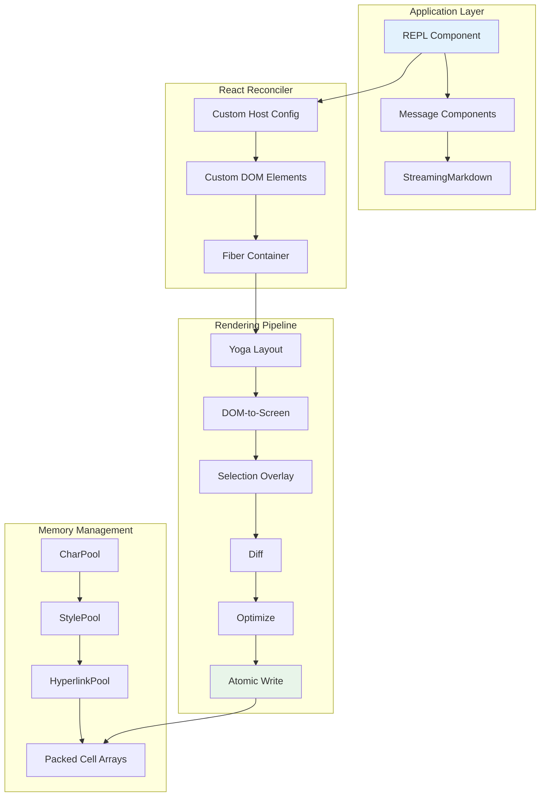

# Tutorial 13: Terminal UI -- Custom Rendering Engine

## Learning Objectives

By the end of this tutorial, you'll understand:
- **Why stock Ink won't work** for streaming LLM output
- **Custom React reconciler** for terminal rendering
- **Double-buffer architecture** with cell-level diffing
- **Pool-based memory management** to eliminate GC pressure
- **Packed typed arrays** for efficient screen representation
- **Frame scheduling** and BSU/ESU atomic terminal updates

## Why Build a Custom Renderer?

The terminal is not a browser. There is no DOM, no CSS engine, no compositor. There is a stream of bytes going to stdout and a stream of bytes coming from stdin. Everything between those two streams -- layout, styling, diffing, hit-testing, scrolling, selection -- has to be invented from scratch.

Claude Code needs a reactive UI: prompt input, streaming markdown, permission dialogs, progress spinners, scrollable message lists. React is the obvious choice for component trees. But terminals don't provide a host environment for React to render into.

**Stock Ink's problems:**
- Allocates one JavaScript object per cell per frame (24,000 objects on 200x120)
- Diffs at the string level (entire rows of ANSI-encoded text)
- No blit optimization, no double buffering, no cell-level dirty tracking
- Works for CLI dashboards refreshing once per second
- Fails for LLM agents streaming tokens at 60fps

**Claude Code's solution:** Custom rendering engine that shares Ink's conceptual DNA (React reconciler, Yoga layout, ANSI output) but reimplements the critical path:
- Packed typed arrays instead of object-per-cell
- Pool-based string interning instead of string-per-frame
- Double-buffered rendering with cell-level diffing
- Optimizer that merges adjacent terminal writes

Result: 60fps on a 200-column terminal while streaming tokens.

## Architecture Overview



## Step 1: The Custom DOM

React's reconciler needs something to reconcile against. In the browser, that's the DOM. In Claude Code's terminal, it is a custom in-memory tree.

### DOM Element Types

```typescript
// src/ui/dom/types.ts

/**
 * Seven element types for terminal rendering.
 * These map directly to terminal concepts, not HTML.
 */
export enum ElementType {
  ROOT = 'ink-root',        // Document root, one per instance
  BOX = 'ink-box',          // Flexbox container (div equivalent)
  TEXT = 'ink-text',        // Text node with Yoga measure function
  VIRTUAL_TEXT = 'ink-virtual-text', // Nested styled text
  LINK = 'ink-link',        // Hyperlink via OSC 8 sequences
  PROGRESS = 'ink-progress', // Progress indicator
  RAW_ANSI = 'ink-raw-ansi', // Pre-rendered ANSI content
}

/**
 * DOM Element carrying state for the rendering pipeline.
 */
export interface DOMElement {
  type: ElementType;
  yogaNode: YogaNode;           // Flexbox layout node
  style: Styles;                 // CSS-like properties mapped to Yoga
  attributes: Map<string, unknown>;
  childNodes: (DOMElement | TextNode)[];
  dirty: boolean;                // Needs re-rendering
  internal: boolean;             // Skip selection (borders, etc)
  scrollTop: number;
  scrollLeft: number;
  stickyScroll: boolean;
  
  // React debug attribution
  debugOwnerChain?: string;
}

/**
 * Text node for leaf content.
 */
export interface TextNode {
  type: 'text';
  content: string;
  style?: Styles;
  parentNode: DOMElement;
}

/**
 * CSS-like styles mapped to Yoga properties.
 */
export interface Styles {
  // Layout
  display?: 'flex' | 'none';
  flexDirection?: 'row' | 'column';
  flexWrap?: 'wrap' | 'nowrap';
  flexGrow?: number;
  flexShrink?: number;
  flexBasis?: number | string;
  
  // Alignment
  alignItems?: 'flex-start' | 'center' | 'flex-end' | 'stretch';
  justifyContent?: 'flex-start' | 'center' | 'flex-end' | 'space-between' | 'space-around';
  
  // Spacing
  padding?: number | string;
  paddingTop?: number;
  paddingRight?: number;
  paddingBottom?: number;
  paddingLeft?: number;
  
  margin?: number | string;
  marginTop?: number;
  marginRight?: number;
  marginBottom?: number;
  marginLeft?: number;
  
  // Appearance
  width?: number | string;
  height?: number | string;
  minWidth?: number;
  maxWidth?: number;
  minHeight?: number;
  maxHeight?: number;
  
  // Text
  color?: string;
  backgroundColor?: string;
  fontWeight?: 'normal' | 'bold';
  textDecoration?: 'none' | 'underline' | 'line-through';
  textAlign?: 'left' | 'center' | 'right';
  
  // Special
  textWrap?: 'wrap' | 'truncate' | 'truncate-start' | 'truncate-middle' | 'truncate-end';
}
```

### DOM Factory Functions

```typescript
// src/ui/dom/factory.ts

import { YogaNode, Yoga } from 'yoga-layout';
import { ElementType, DOMElement, TextNode, Styles } from './types';

/**
 * Create a new DOM element with Yoga node.
 */
export function createElement(
  type: ElementType,
  style: Styles = {},
  attributes: Map<string, unknown> = new Map()
): DOMElement {
  const yogaNode = Yoga.Node.create();
  
  // Apply styles to Yoga node
  applyStylesToYoga(yogaNode, style);
  
  const element: DOMElement = {
    type,
    yogaNode,
    style,
    attributes,
    childNodes: [],
    dirty: true,
    internal: false,
    scrollTop: 0,
    scrollLeft: 0,
    stickyScroll: false,
  };
  
  // For text nodes, set up measure function
  if (type === ElementType.TEXT) {
    yogaNode.setMeasureFunc((width) => 
      measureTextNode(element, width)
    );
  }
  
  return element;
}

/**
 * Create a text node.
 */
export function createTextNode(content: string): TextNode {
  return {
    type: 'text',
    content,
    parentNode: undefined as unknown as DOMElement,
  };
}

/**
 * Append child to parent, updating Yoga tree.
 */
export function appendChild(
  parent: DOMElement,
  child: DOMElement | TextNode
): void {
  parent.childNodes.push(child);
  
  if (child.type !== 'text') {
    parent.yogaNode.insertChild(child.yogaNode, parent.childNodes.length - 1);
  } else {
    child.parentNode = parent;
  }
  
  markDirty(parent);
}

/**
 * Remove child from parent.
 */
export function removeChild(
  parent: DOMElement,
  child: DOMElement | TextNode
): void {
  const index = parent.childNodes.indexOf(child);
  if (index === -1) return;
  
  parent.childNodes.splice(index, 1);
  
  if (child.type !== 'text') {
    parent.yogaNode.removeChild(child.yogaNode);
    // Free Yoga node to prevent WASM memory leaks
    Yoga.Node.destroy(child.yogaNode);
  }
  
  markDirty(parent);
}

/**
 * Mark element and all ancestors as dirty.
 */
export function markDirty(element: DOMElement): void {
  let current: DOMElement | undefined = element;
  
  while (current) {
    if (current.dirty) return; // Already dirty, ancestors too
    current.dirty = true;
    
    // For text nodes, mark Yoga node dirty
    if (current.yogaNode) {
      current.yogaNode.markDirty();
    }
    
    // Walk up to parent
    current = current.parentNode;
  }
}

/**
 * Apply styles to Yoga node.
 */
function applyStylesToYoga(yogaNode: YogaNode, style: Styles): void {
  if (style.display === 'none') {
    yogaNode.setDisplay(Yoga.DISPLAY_NONE);
  } else {
    yogaNode.setDisplay(Yoga.DISPLAY_FLEX);
  }
  
  // Flex direction
  if (style.flexDirection) {
    const direction = style.flexDirection === 'row' 
      ? Yoga.FLEX_DIRECTION_ROW 
      : Yoga.FLEX_DIRECTION_COLUMN;
    yogaNode.setFlexDirection(direction);
  }
  
  // Flex wrap
  if (style.flexWrap) {
    const wrap = style.flexWrap === 'wrap' 
      ? Yoga.WRAP_WRAP 
      : Yoga.WRAP_NO_WRAP;
    yogaNode.setFlexWrap(wrap);
  }
  
  // Flex grow/shrink
  if (style.flexGrow !== undefined) {
    yogaNode.setFlexGrow(style.flexGrow);
  }
  if (style.flexShrink !== undefined) {
    yogaNode.setFlexShrink(style.flexShrink);
  }
  
  // Padding
  const padding = normalizeSpacing(style.padding);
  yogaNode.setPadding(Yoga.EDGE_TOP, padding.top);
  yogaNode.setPadding(Yoga.EDGE_RIGHT, padding.right);
  yogaNode.setPadding(Yoga.EDGE_BOTTOM, padding.bottom);
  yogaNode.setPadding(Yoga.EDGE_LEFT, padding.left);
  
  // Width/Height
  if (typeof style.width === 'number') {
    yogaNode.setWidth(style.width);
  } else if (style.width === '100%') {
    yogaNode.setWidthPercent(100);
  }
  
  if (typeof style.height === 'number') {
    yogaNode.setHeight(style.height);
  } else if (style.height === '100%') {
    yogaNode.setHeightPercent(100);
  }
}

/**
 * Normalize spacing shorthand to edges.
 */
function normalizeSpacing(
  spacing: number | string | undefined
): { top: number; right: number; bottom: number; left: number } {
  if (spacing === undefined) {
    return { top: 0, right: 0, bottom: 0, left: 0 };
  }
  
  if (typeof spacing === 'number') {
    return { top: spacing, right: spacing, bottom: spacing, left: spacing };
  }
  
  // Parse CSS-like shorthand (not implemented for brevity)
  return { top: 0, right: 0, bottom: 0, left: 0 };
}
```

### Text Measurement

```typescript
// src/ui/dom/measure.ts

import { DOMElement, TextNode } from './types';
import { getGraphemeWidth } from '../utils/unicode';

/**
 * Measure text node dimensions for Yoga layout.
 * Called during Yoga's layout pass -- must be synchronous and fast.
 */
export function measureTextNode(
  element: DOMElement,
  availableWidth: number
): { width: number; height: number } {
  // Get text content from child text nodes
  const textNodes = element.childNodes.filter(
    (child): child is TextNode => child.type === 'text'
  );
  
  const text = textNodes.map(node => node.content).join('');
  
  if (!text) {
    return { width: 0, height: 1 }; // Empty line still has height
  }
  
  // Get wrap mode from style
  const wrapMode = element.style.textWrap ?? 'wrap';
  
  if (wrapMode === 'wrap') {
    return measureWrappedText(text, availableWidth);
  } else {
    return measureTruncatedText(text, availableWidth, wrapMode);
  }
}

/**
 * Measure text with word wrapping.
 */
function measureWrappedText(
  text: string,
  maxWidth: number
): { width: number; height: number } {
  const words = text.split(/(\s+)/); // Keep whitespace in result
  let currentLine = '';
  let currentLineWidth = 0;
  let lines = 1;
  let maxLineWidth = 0;
  
  for (const word of words) {
    const wordWidth = measureStringWidth(word);
    
    if (wordWidth > maxWidth && currentLineWidth === 0) {
      // Word is longer than line, force break
      const chars = Array.from(word);
      for (const char of chars) {
        const charWidth = getGraphemeWidth(char);
        if (currentLineWidth + charWidth > maxWidth) {
          lines++;
          currentLineWidth = charWidth;
        } else {
          currentLineWidth += charWidth;
        }
      }
      maxLineWidth = Math.max(maxLineWidth, currentLineWidth);
    } else if (currentLineWidth + wordWidth > maxWidth) {
      // Start new line
      lines++;
      currentLineWidth = wordWidth;
    } else {
      currentLineWidth += wordWidth;
    }
    
    maxLineWidth = Math.max(maxLineWidth, currentLineWidth);
  }
  
  return { width: maxLineWidth, height: lines };
}

/**
 * Measure text with truncation.
 */
function measureTruncatedText(
  text: string,
  maxWidth: number,
  mode: 'truncate' | 'truncate-start' | 'truncate-middle' | 'truncate-end'
): { width: number; height: number } {
  const textWidth = measureStringWidth(text);
  
  if (textWidth <= maxWidth) {
    return { width: textWidth, height: 1 };
  }
  
  // For truncate modes, we show one line with ellipsis
  return { width: maxWidth, height: 1 };
}

/**
 * Measure string width accounting for Unicode.
 */
function measureStringWidth(str: string): number {
  let width = 0;
  
  // Iterate by grapheme clusters (not codepoints)
  const iterator = new Intl.Segmenter('en', { granularity: 'grapheme' }).segment(str);
  
  for (const segment of iterator) {
    width += getGraphemeWidth(segment.segment);
  }
  
  return width;
}
```

## Step 2: Unicode Width Utilities

```typescript
// src/ui/utils/unicode.ts

/**
 * Get display width of a grapheme cluster.
 * 
 * - ASCII: 1 column
 * - CJK/East Asian Wide: 2 columns
 * - Emoji: 2 columns
 * - Combining marks: 0 columns
 * - ANSI escape codes: 0 columns (should be stripped before calling)
 */
export function getGraphemeWidth(grapheme: string): number {
  // Fast path: ASCII
  if (grapheme.length === 1) {
    const code = grapheme.charCodeAt(0);
    if (code >= 0x20 && code < 0x7f) {
      return 1;
    }
  }
  
  // Check East Asian Width
  if (isEastAsianWide(grapheme)) {
    return 2;
  }
  
  // Check emoji
  if (isEmoji(grapheme)) {
    return 2;
  }
  
  // Check combining marks
  if (isCombiningMark(grapheme)) {
    return 0;
  }
  
  // Default: 1
  return 1;
}

/**
 * Check if character is East Asian Wide.
 */
function isEastAsianWide(char: string): boolean {
  // Simplified check: CJK Unified Ideographs
  const code = char.codePointAt(0) ?? 0;
  return (
    (code >= 0x4e00 && code <= 0x9fff) || // CJK Unified Ideographs
    (code >= 0x3400 && code <= 0x4dbf) || // CJK Extension A
    (code >= 0x20000 && code <= 0x2a6df) || // CJK Extension B
    (code >= 0xf900 && code <= 0xfaff) || // CJK Compatibility
    (code >= 0x3000 && code <= 0x303f) || // CJK Symbols/Punctuation
    (code >= 0xff00 && code <= 0xffef) || // Fullwidth forms
    (code >= 0xac00 && code <= 0xd7af) // Hangul Syllables
  );
}

/**
 * Check if grapheme is emoji.
 */
function isEmoji(char: string): boolean {
  const code = char.codePointAt(0) ?? 0;
  
  // Emoji ranges
  return (
    (code >= 0x1f600 && code <= 0x1f64f) || // Emoticons
    (code >= 0x1f300 && code <= 0x1f5ff) || // Misc Symbols
    (code >= 0x1f680 && code <= 0x1f6ff) || // Transport/Map
    (code >= 0x1f900 && code <= 0x1f9ff) || // Supplemental
    (code >= 0x2600 && code <= 0x26ff) || // Misc
    (code >= 0x2700 && code <= 0x27bf) // Dingbats
  );
}

/**
 * Check if grapheme is combining mark.
 */
function isCombiningMark(char: string): boolean {
  const code = char.codePointAt(0) ?? 0;
  return (
    (code >= 0x0300 && code <= 0x036f) || // Combining Diacriticals
    (code >= 0x1ab0 && code <= 0x1aff) || // Extended
    (code >= 0x1dc0 && code <= 0x1dff) || // Supplement
    (code >= 0xfe20 && code <= 0xfe2f) // Half Marks
  );
}

/**
 * Cell width classification for terminal rendering.
 */
export enum CellWidth {
  NARROW = 0,      // Standard single-column character
  WIDE = 1,        // CJK/emoji head cell (occupies 2 columns)
  SPACER_TAIL = 2, // Second column of a wide character
  SPACER_HEAD = 3, // Soft-wrap continuation marker
}

/**
 * Get cell width classification for a character.
 */
export function getCellWidth(char: string): CellWidth {
  const width = getGraphemeWidth(char);
  return width === 2 ? CellWidth.WIDE : CellWidth.NARROW;
}
```

## Step 3: Pool-Based Memory Management

The key insight: intern everything. If a value appears in thousands of cells, store it once and reference by integer ID. Integer comparison is one CPU instruction. String comparison is a loop.

```typescript
// src/ui/pools/CharPool.ts

/**
 * Pool for interning character strings to integer IDs.
 * Shared across frames so blit can copy cell words directly.
 */
export class CharPool {
  private strings: string[] = [' ', ''];  // Index 0 = space, 1 = empty
  private ascii: Int32Array;
  private multiByte: Map<string, number> = new Map();
  
  constructor() {
    // Pre-populate ASCII fast path
    this.ascii = new Int32Array(128).fill(-1);
    this.strings[0] = ' ';
    this.strings[1] = '';
    this.ascii[0x20] = 0; // Space
    this.ascii[0] = 1;    // Empty string
  }
  
  /**
   * Intern a character string, returning pool ID.
   */
  intern(char: string): number {
    // Fast path: ASCII single-byte
    if (char.length === 1) {
      const code = char.charCodeAt(0);
      if (code < 128) {
        const cached = this.ascii[code];
        if (cached !== -1) return cached;
        
        const index = this.strings.length;
        this.strings.push(char);
        this.ascii[code] = index;
        return index;
      }
    }
    
    // Fallback: Map lookup for multi-byte
    const cached = this.multiByte.get(char);
    if (cached !== undefined) return cached;
    
    const index = this.strings.length;
    this.strings.push(char);
    this.multiByte.set(char, index);
    return index;
  }
  
  /**
   * Get string by ID.
   */
  get(id: number): string {
    return this.strings[id] ?? ' ';
  }
  
  /**
   * Reset pool (called periodically to bound growth).
   */
  reset(liveIds: Set<number>): CharPool {
    const fresh = new CharPool();
    
    // Re-intern live cells into fresh pool
    for (const id of liveIds) {
      const str = this.get(id);
      fresh.intern(str);
    }
    
    return fresh;
  }
}
```

```typescript
// src/ui/pools/StylePool.ts

/**
 * Style definition for terminal cells.
 */
export interface StyleDefinition {
  foreground?: string;
  background?: string;
  bold?: boolean;
  dim?: boolean;
  italic?: boolean;
  underline?: boolean;
  inverse?: boolean;
  strikethrough?: boolean;
}

/**
 * Pool for interning styles to integer IDs.
 * Bit 0 encodes visibility on spaces:
 * - Even ID: foreground only (invisible on space)
 * - Odd ID: visible on space (bg, inverse, underline)
 */
export class StylePool {
  private styles: StyleDefinition[] = [{}];
  private index: Map<string, number> = new Map();
  private transitions: Map<string, string> = new Map();
  
  /**
   * Intern a style, returning pool ID.
   */
  intern(style: StyleDefinition): number {
    const key = JSON.stringify(style);
    const cached = this.index.get(key);
    if (cached !== undefined) return cached;
    
    const id = this.styles.length;
    this.styles.push(style);
    this.index.set(key, id);
    
    return id;
  }
  
  /**
   * Get style by ID.
   */
  get(id: number): StyleDefinition {
    return this.styles[id] ?? {};
  }
  
  /**
   * Check if style is visible on space characters.
   * Uses bit 0 trick: odd IDs are visible on spaces.
   */
  isVisibleOnSpace(styleId: number): boolean {
    return (styleId & 1) === 1;
  }
  
  /**
   * Get cached ANSI transition string between styles.
   */
  getTransition(fromId: number, toId: number): string {
    const cacheKey = `${fromId}->${toId}`;
    const cached = this.transitions.get(cacheKey);
    if (cached !== undefined) return cached;
    
    const from = this.get(fromId);
    const to = this.get(toId);
    const transition = computeAnsiTransition(from, to);
    
    this.transitions.set(cacheKey, transition);
    return transition;
  }
}

/**
 * Compute ANSI escape sequence to transition between styles.
 */
function computeAnsiTransition(
  from: StyleDefinition,
  to: StyleDefinition
): string {
  const codes: number[] = [];
  
  // Check each property for change
  if (from.bold !== to.bold) {
    codes.push(to.bold ? 1 : 22);
  }
  if (from.dim !== to.dim) {
    codes.push(to.dim ? 2 : 22);
  }
  if (from.italic !== to.italic) {
    codes.push(to.italic ? 3 : 23);
  }
  if (from.underline !== to.underline) {
    codes.push(to.underline ? 4 : 24);
  }
  if (from.inverse !== to.inverse) {
    codes.push(to.inverse ? 7 : 27);
  }
  if (from.strikethrough !== to.strikethrough) {
    codes.push(to.strikethrough ? 9 : 29);
  }
  
  // Foreground
  if (from.foreground !== to.foreground) {
    if (to.foreground) {
      codes.push(...parseColor(to.foreground, 30));
    } else {
      codes.push(39);
    }
  }
  
  // Background
  if (from.background !== to.background) {
    if (to.background) {
      codes.push(...parseColor(to.background, 40));
    } else {
      codes.push(49);
    }
  }
  
  if (codes.length === 0) return '';
  return `\x1b[${codes.join(';')}m`;
}

/**
 * Parse color to ANSI codes.
 */
function parseColor(color: string, base: number): number[] {
  // Handle hex colors
  if (color.startsWith('#')) {
    const hex = color.slice(1);
    const r = parseInt(hex.slice(0, 2), 16);
    const g = parseInt(hex.slice(2, 4), 16);
    const b = parseInt(hex.slice(4, 6), 16);
    return [base + 8, 2, r, g, b]; // 38;2;R;G;B or 48;2;R;G;B
  }
  
  // Named colors (simplified)
  const named: Record<string, number> = {
    black: 0, red: 1, green: 2, yellow: 3,
    blue: 4, magenta: 5, cyan: 6, white: 7,
    gray: 8, brightRed: 9, brightGreen: 10,
    brightYellow: 11, brightBlue: 12,
    brightMagenta: 13, brightCyan: 14, brightWhite: 15,
  };
  
  const code = named[color];
  if (code !== undefined) {
    return code < 8 ? [base + code] : [base + 8, 5, code];
  }
  
  return [base + 9]; // Reset to default
}
```

```typescript
// src/ui/pools/HyperlinkPool.ts

/**
 * Pool for interning hyperlink URIs (OSC 8).
 */
export class HyperlinkPool {
  private uris: string[] = [''];  // Index 0 = no hyperlink
  private index: Map<string, number> = new Map([['', 0]]);
  
  /**
   * Intern a URI, returning pool ID.
   */
  intern(uri: string): number {
    const cached = this.index.get(uri);
    if (cached !== undefined) return cached;
    
    const id = this.uris.length;
    this.uris.push(uri);
    this.index.set(uri, id);
    return id;
  }
  
  /**
   * Get URI by ID.
   */
  get(id: number): string {
    return this.uris[id] ?? '';
  }
  
  /**
   * Generate OSC 8 hyperlink escape sequence.
   */
  getOsc8(id: number, params: string = ''): string {
    const uri = this.get(id);
    if (!uri) return '';
    return `\x1b]8;${params};${uri}\x1b\\`;
  }
  
  /**
   * Close OSC 8 hyperlink.
   */
  getOsc8Close(): string {
    return '\x1b]8;;\x1b\\';
  }
}
```

## Step 4: Packed Cell Representation

```typescript
// src/ui/screen/Cell.ts

/**
 * Screen cell packed into two Int32 words:
 * 
 * Word 0: charId (32 bits) - index into CharPool
 * Word 1: styleId[31:17] (15 bits) | hyperlinkId[16:2] (15 bits) | width[1:0] (2 bits)
 * 
 * Total: 64 bits per cell = 8 bytes
 * A 200x120 terminal = 24,000 cells = 192KB
 * Same size as object-per-cell, but no GC pressure and cache-friendly.
 */

export type Cell = bigint; // Two Int32s as one BigInt for bulk operations

/**
 * Pack cell components into a 64-bit value.
 */
export function packCell(
  charId: number,
  styleId: number,
  hyperlinkId: number,
  width: number
): Cell {
  return (
    BigInt.asUintN(32, BigInt(charId)) |
    (BigInt.asUintN(64, BigInt(styleId)) << 32n) |
    (BigInt.asUintN(64, BigInt(hyperlinkId)) << 47n) |
    (BigInt.asUintN(64, BigInt(width)) << 62n)
  );
}

/**
 * Unpack cell components.
 */
export function unpackCell(cell: Cell): {
  charId: number;
  styleId: number;
  hyperlinkId: number;
  width: number;
} {
  return {
    charId: Number(cell & 0xffffffffn),
    styleId: Number((cell >> 32n) & 0x7fffn),  // 15 bits
    hyperlinkId: Number((cell >> 47n) & 0x7fffn), // 15 bits
    width: Number((cell >> 62n) & 0x3n), // 2 bits
  };
}

/**
 * Extract just charId for fast comparisons.
 */
export function getCharId(cell: Cell): number {
  return Number(cell & 0xffffffffn);
}

/**
 * Extract just styleId for diffing.
 */
export function getStyleId(cell: Cell): number {
  return Number((cell >> 32n) & 0x7fffn);
}

/**
 * Get width from packed cell.
 */
export function getWidth(cell: Cell): number {
  return Number((cell >> 62n) & 0x3n);
}
```

```typescript
// src/ui/screen/Screen.ts

import { Cell, packCell } from './Cell';
import { CharPool } from '../pools/CharPool';
import { StylePool, StyleDefinition } from '../pools/StylePool';
import { HyperlinkPool } from '../pools/HyperlinkPool';

export interface ScreenDimensions {
  columns: number;
  rows: number;
}

/**
 * Screen buffer with packed cells.
 */
export class Screen {
  // Packed cell data: two Int32s per cell as one BigInt
  public cells: BigInt64Array;
  
  // Damage rectangle for optimization
  public damage: {
    top: number;
    left: number;
    bottom: number;
    right: number;
    hasDamage: boolean;
  };
  
  // Per-row soft wrap markers
  public softWrap: Int32Array;
  
  constructor(
    public dimensions: ScreenDimensions,
    public charPool: CharPool,
    public stylePool: StylePool,
    public hyperlinkPool: HyperlinkPool
  ) {
    const cellCount = dimensions.columns * dimensions.rows;
    this.cells = new BigInt64Array(cellCount).fill(0n);
    
    this.damage = {
      top: 0,
      left: 0,
      bottom: 0,
      right: 0,
      hasDamage: false,
    };
    
    this.softWrap = new Int32Array(dimensions.rows).fill(-1);
  }
  
  /**
   * Get cell index from row/column.
   */
  getIndex(row: number, col: number): number {
    return row * this.dimensions.columns + col;
  }
  
  /**
   * Read cell at row/column.
   */
  getCell(row: number, col: number): Cell {
    return this.cells[this.getIndex(row, col)];
  }
  
  /**
   * Write cell at row/column.
   */
  setCell(row: number, col: number, cell: Cell): void {
    const index = this.getIndex(row, col);
    this.cells[index] = cell;
    this.markDamage(row, col);
  }
  
  /**
   * Write a character with style to screen.
   */
  writeChar(
    row: number,
    col: number,
    char: string,
    style: StyleDefinition = {}
  ): void {
    const charId = this.charPool.intern(char);
    const styleId = this.stylePool.intern(style);
    const hyperlinkId = 0; // No hyperlink
    const width = char.length > 1 ? 2 : 1; // Simplified
    
    const cell = packCell(charId, styleId, hyperlinkId, width);
    this.setCell(row, col, cell);
  }
  
  /**
   * Mark cell as damaged (needs repaint).
   */
  markDamage(row: number, col: number): void {
    if (!this.damage.hasDamage) {
      this.damage.top = row;
      this.damage.left = col;
      this.damage.bottom = row;
      this.damage.right = col;
      this.damage.hasDamage = true;
    } else {
      this.damage.top = Math.min(this.damage.top, row);
      this.damage.left = Math.min(this.damage.left, col);
      this.damage.bottom = Math.max(this.damage.bottom, row);
      this.damage.right = Math.max(this.damage.right, col);
    }
  }
  
  /**
   * Clear damage rectangle.
   */
  clearDamage(): void {
    this.damage.hasDamage = false;
  }
  
  /**
   * Bulk clear entire screen.
   */
  clear(): void {
    this.cells.fill(0n);
    this.markDamage(
      0, 0,
      this.dimensions.rows - 1,
      this.dimensions.columns - 1
    );
  }
  
  /**
   * Create new screen with same dimensions (for double buffering).
   */
  createSibling(): Screen {
    return new Screen(
      this.dimensions,
      this.charPool,
      this.stylePool,
      this.hyperlinkPool
    );
  }
}
```

## Step 5: The Rendering Pipeline

```typescript
// src/ui/renderer/pipeline.ts

import { DOMElement, ElementType } from '../dom/types';
import { Screen } from '../screen/Screen';
import { getCharId, getStyleId } from '../screen/Cell';
import { Frame } from './Frame';

export interface RenderPhase {
  name: string;
  durationMs: number;
}

export interface RenderResult {
  frame: Frame;
  phases: RenderPhase[];
}

/**
 * Seven-stage rendering pipeline.
 */
export async function renderPipeline(
  root: DOMElement,
  prevFrame: Frame | null,
  dimensions: { columns: number; rows: number }
): Promise<RenderResult> {
  const phases: RenderPhase[] = [];
  const startTime = performance.now();
  
  // Stage 1: React Commit (already done by caller)
  phases.push({ name: 'react', durationMs: 0 });
  
  // Stage 2: Yoga Layout
  const yogaStart = performance.now();
  root.yogaNode.calculateLayout(dimensions.columns, dimensions.rows, Yoga.DIRECTION_LTR);
  phases.push({ name: 'yoga', durationMs: performance.now() - yogaStart });
  
  // Stage 3: DOM to Screen
  const screenStart = performance.now();
  const frame = new Frame(dimensions);
  await renderDOMToScreen(root, frame.screen, prevFrame?.screen ?? null);
  phases.push({ name: 'dom-to-screen', durationMs: performance.now() - screenStart });
  
  // Stage 4: Selection Overlay
  const overlayStart = performance.now();
  // (Selection overlay applied here)
  phases.push({ name: 'overlay', durationMs: performance.now() - overlayStart });
  
  // Stage 5: Diff
  const diffStart = performance.now();
  const patches = diffScreens(prevFrame?.screen ?? null, frame.screen);
  phases.push({ name: 'diff', durationMs: performance.now() - diffStart });
  
  // Stage 6: Optimize
  const optStart = performance.now();
  const optimized = optimizePatches(patches);
  phases.push({ name: 'optimize', durationMs: performance.now() - optStart });
  
  // Stage 7: Write
  const writeStart = performance.now();
  await writeToStdout(optimized);
  phases.push({ name: 'write', durationMs: performance.now() - writeStart });
  
  return { frame, phases };
}

/**
 * Walk DOM tree and write to screen buffer.
 */
async function renderDOMToScreen(
  node: DOMElement,
  screen: Screen,
  prevScreen: Screen | null,
  offsetX: number = 0,
  offsetY: number = 0
): Promise<void> {
  const layout = {
    left: node.yogaNode.getComputedLeft(),
    top: node.yogaNode.getComputedTop(),
    width: node.yogaNode.getComputedWidth(),
    height: node.yogaNode.getComputedHeight(),
  };
  
  const absoluteX = offsetX + layout.left;
  const absoluteY = offsetY + layout.top;
  
  // Skip hidden nodes
  if (node.style.display === 'none') return;
  
  // Blit optimization: copy unchanged subtree from prev screen
  if (prevScreen && !node.dirty && isPositionUnchanged(node, prevScreen)) {
    blitSubtree(node, prevScreen, screen, absoluteX, absoluteY);
    return;
  }
  
  switch (node.type) {
    case ElementType.TEXT:
      renderTextNode(node, screen, absoluteX, absoluteY);
      break;
      
    case ElementType.RAW_ANSI:
      renderRawAnsi(node, screen, absoluteX, absoluteY);
      break;
      
    case ElementType.BOX:
    case ElementType.ROOT:
      // Container - recurse to children
      for (const child of node.childNodes) {
        if (child.type !== 'text') {
          await renderDOMToScreen(child, screen, prevScreen, absoluteX, absoluteY);
        }
      }
      break;
      
    default:
      // Other types render content then recurse
      for (const child of node.childNodes) {
        if (child.type !== 'text') {
          await renderDOMToScreen(child, screen, prevScreen, absoluteX, absoluteY);
        }
      }
  }
  
  // Mark clean after render
  node.dirty = false;
}

/**
 * Render text content with word wrapping.
 */
function renderTextNode(
  node: DOMElement,
  screen: Screen,
  startX: number,
  startY: number
): void {
  // Get text content
  const textNodes = node.childNodes.filter(
    (c): c is { type: 'text'; content: string } => c.type === 'text'
  );
  const text = textNodes.map(n => n.content).join('');
  
  if (!text) return;
  
  const style = node.style;
  const wrapMode = style.textWrap ?? 'wrap';
  const maxWidth = node.yogaNode.getComputedWidth();
  
  let x = startX;
  let y = startY;
  
  // Simple wrap implementation
  const words = text.split(' ');
  for (const word of words) {
    const wordWidth = word.length; // Simplified (no Unicode)
    
    if (x + wordWidth > startX + maxWidth && wrapMode === 'wrap') {
      x = startX;
      y++;
    }
    
    // Write word char by char
    for (let i = 0; i < word.length; i++) {
      if (x < screen.dimensions.columns && y < screen.dimensions.rows) {
        screen.writeChar(y, x, word[i], style);
      }
      x++;
    }
    
    // Space after word
    if (x < screen.dimensions.columns) {
      screen.writeChar(y, x, ' ', style);
      x++;
    }
  }
}

/**
 * Render pre-rendered ANSI content.
 */
function renderRawAnsi(
  node: DOMElement,
  screen: Screen,
  startX: number,
  startY: number
): void {
  // For syntax-highlighted code, write raw ANSI directly
  // without parsing individual styles
  const rawContent = node.attributes.get('rawContent') as string ?? '';
  // (Implementation would parse ANSI and write to screen)
}
```

## Step 6: Cell-Level Diffing

```typescript
// src/ui/renderer/diff.ts

import { Screen } from '../screen/Screen';
import { Cell, getCharId, getStyleId } from '../screen/Cell';

export interface Patch {
  type: 'stdout';
  row: number;
  startCol: number;
  endCol: number;
  content: string; // ANSI-encoded content
}

/**
 * Diff two screens and produce minimal patches.
 */
export function diffScreens(
  prev: Screen | null,
  current: Screen
): Patch[] {
  const patches: Patch[] = [];
  
  // If no previous screen, full render needed
  if (!prev) {
    return createFullScreenPatches(current);
  }
  
  // Check damage rectangle
  if (!current.damage.hasDamage) {
    return patches; // Nothing changed
  }
  
  // Only diff within damage rectangle
  const { top, left, bottom, right } = current.damage;
  
  for (let row = top; row <= bottom; row++) {
    let rowStart = -1;
    let lastDifferent = false;
    
    for (let col = left; col <= right; col++) {
      const prevCell = prev.getCell(row, col);
      const currCell = current.getCell(row, col);
      
      const different = cellsDiffer(prevCell, currCell);
      
      if (different && rowStart === -1) {
        // Start of changed run
        rowStart = col;
      } else if (!different && rowStart !== -1) {
        // End of changed run
        const patch = createRowPatch(current, row, rowStart, col - 1);
        patches.push(patch);
        rowStart = -1;
      }
    }
    
    // Handle run that extends to end of damage rect
    if (rowStart !== -1) {
      const patch = createRowPatch(current, row, rowStart, right);
      patches.push(patch);
    }
  }
  
  return patches;
}

/**
 * Check if two cells differ.
 * Two integer comparisons per cell (the packed words).
 */
function cellsDiffer(a: Cell, b: Cell): boolean {
  return a !== b; // BigInt comparison
}

/**
 * Create a patch for a run of changed cells on a row.
 */
function createRowPatch(
  screen: Screen,
  row: number,
  startCol: number,
  endCol: number
): Patch {
  let content = '';
  let currentStyle = 0;
  
  for (let col = startCol; col <= endCol; col++) {
    const cell = screen.getCell(row, col);
    const { charId, styleId, hyperlinkId } = unpackCell(cell);
    
    // Emit style transition if changed
    if (styleId !== currentStyle) {
      content += screen.stylePool.getTransition(currentStyle, styleId);
      currentStyle = styleId;
    }
    
    // Emit hyperlink if present
    if (hyperlinkId !== 0) {
      content += screen.hyperlinkPool.getOsc8(hyperlinkId);
    }
    
    // Emit character
    const char = screen.charPool.get(charId);
    content += char;
    
    // Close hyperlink
    if (hyperlinkId !== 0) {
      content += screen.hyperlinkPool.getOsc8Close();
    }
  }
  
  // Reset style at end
  if (currentStyle !== 0) {
    content += '\x1b[0m';
  }
  
  return {
    type: 'stdout',
    row,
    startCol,
    endCol,
    content: moveCursor(row, startCol) + content,
  };
}

/**
 * Create ANSI escape sequence to move cursor.
 */
function moveCursor(row: number, col: number): string {
  // ANSI: row and col are 1-indexed
  return `\x1b[${row + 1};${col + 1}H`;
}

/**
 * Create patches for full screen (no previous).
 */
function createFullScreenPatches(screen: Screen): Patch[] {
  const patches: Patch[] = [];
  
  for (let row = 0; row < screen.dimensions.rows; row++) {
    const patch = createRowPatch(screen, row, 0, screen.dimensions.columns - 1);
    patches.push(patch);
  }
  
  return patches;
}

/**
 * Unpack cell for patch generation.
 */
function unpackCell(cell: Cell): {
  charId: number;
  styleId: number;
  hyperlinkId: number;
  width: number;
} {
  return {
    charId: Number(cell & 0xffffffffn),
    styleId: Number((cell >> 32n) & 0x7fffn),
    hyperlinkId: Number((cell >> 47n) & 0x7fffn),
    width: Number((cell >> 62n) & 0x3n),
  };
}
```

## Step 7: Patch Optimization and Output

```typescript
// src/ui/renderer/optimize.ts

import { Patch } from './diff';

export interface OptimizedPatch {
  type: 'stdout' | 'cursor' | 'clear';
  content: string;
}

/**
 * Optimize patches by merging adjacent writes and eliminating redundant cursor moves.
 */
export function optimizePatches(patches: Patch[]): OptimizedPatch[] {
  const optimized: OptimizedPatch[] = [];
  let prevEndCol = -1;
  let prevRow = -1;
  
  for (const patch of patches) {
    // Check if this patch can be merged with previous
    if (
      prevRow === patch.row &&
      prevEndCol === patch.startCol - 1
    ) {
      // Adjacent on same row - merge
      const last = optimized[optimized.length - 1];
      last.content += patch.content;
    } else {
      // New patch needed
      optimized.push({
        type: 'stdout',
        content: patch.content,
      });
    }
    
    prevRow = patch.row;
    prevEndCol = patch.endCol;
  }
  
  return optimized;
}

/**
 * Write optimized patches to stdout with BSU/ESU atomic updates.
 */
export async function writeToStdout(
  patches: OptimizedPatch[]
): Promise<void> {
  if (patches.length === 0) return;
  
  // Begin Synchronized Update (BSU)
  let output = '\x1b[?2026h';
  
  for (const patch of patches) {
    output += patch.content;
  }
  
  // End Synchronized Update (ESU)
  output += '\x1b[?2026l';
  
  // Single write call
  process.stdout.write(output);
}
```

## Step 8: React Reconciler Bridge

```typescript
// src/ui/reconciler/hostConfig.ts

import Reconciler from 'react-reconciler';
import {
  createElement,
  createTextNode,
  appendChild,
  removeChild,
  insertBefore,
} from '../dom/factory';
import { DOMElement, TextNode, ElementType } from '../dom/types';
import { markDirty } from '../dom/factory';

/**
 * Host configuration for React reconciler.
 * Maps React operations to custom DOM.
 */
export const hostConfig = {
  // Create methods
  createInstance(
    type: ElementType,
    props: Record<string, unknown>,
    rootContainer: DOMElement,
    hostContext: unknown,
    internalHandle: Reconciler.Fiber
  ): DOMElement {
    const element = createElement(type, props.style as any || {});
    
    // Apply initial props
    for (const [key, value] of Object.entries(props)) {
      if (key === 'style') continue;
      element.attributes.set(key, value);
    }
    
    // Store debug owner chain
    element.debugOwnerChain = getComponentStack(internalHandle);
    
    return element;
  },
  
  createTextInstance(
    content: string,
    rootContainer: DOMElement,
    hostContext: unknown,
    internalHandle: Reconciler.Fiber
  ): TextNode {
    return createTextNode(content);
  },
  
  // Tree manipulation
  appendInitialChild(
    parent: DOMElement,
    child: DOMElement | TextNode
  ): void {
    appendChild(parent, child);
  },
  
  appendChild(parent: DOMElement, child: DOMElement | TextNode): void {
    appendChild(parent, child);
  },
  
  appendChildToContainer(
    container: DOMElement,
    child: DOMElement | TextNode
  ): void {
    appendChild(container, child);
  },
  
  removeChild(parent: DOMElement, child: DOMElement | TextNode): void {
    removeChild(parent, child);
  },
  
  insertBefore(
    parent: DOMElement,
    child: DOMElement | TextNode,
    beforeChild: DOMElement | TextNode
  ): void {
    insertBefore(parent, child, beforeChild);
  },
  
  // Updates
  commitUpdate(
    instance: DOMElement,
    updatePayload: unknown,
    type: ElementType,
    oldProps: Record<string, unknown>,
    newProps: Record<string, unknown>,
    internalHandle: Reconciler.Fiber
  ): void {
    // Diff styles and apply only what changed
    const styleChanged = !shallowEqual(oldProps.style, newProps.style);
    if (styleChanged) {
      instance.style = newProps.style as any;
      applyStylesToYoga(instance.yogaNode, instance.style);
    }
    
    // Update attributes
    for (const [key, value] of Object.entries(newProps)) {
      if (key === 'style') continue;
      if (oldProps[key] !== value) {
        instance.attributes.set(key, value);
      }
    }
    
    markDirty(instance);
  },
  
  commitTextUpdate(
    textInstance: TextNode,
    oldContent: string,
    newContent: string
  ): void {
    textInstance.content = newContent;
    if (textInstance.parentNode) {
      markDirty(textInstance.parentNode);
    }
  },
  
  // Lifecycle
  commitMount(): void {},
  commitUnmount(): void {},
  
  // Context
  getRootHostContext(): unknown {
    return {};
  },
  
  getChildHostContext(): unknown {
    return {};
  },
  
  // Finalization
  resetAfterCommit(container: DOMElement): void {
    // This is the critical hook: run layout and schedule render
    container.onComputeLayout?.();
    container.onRender?.();
  },
  
  // Scheduling
  scheduleTimeout: setTimeout,
  cancelTimeout: clearTimeout,
  noTimeout: -1,
  
  isPrimaryRenderer: false,
  warnsIfAccessingDuringRender: true,
  supportsMutation: true,
  supportsHydration: false,
  supportsPersistence: false,
  
  // (Other required host config methods omitted for brevity)
};

/**
 * Shallow equality check for objects.
 */
function shallowEqual(a: unknown, b: unknown): boolean {
  if (a === b) return true;
  if (typeof a !== 'object' || typeof b !== 'object') return false;
  if (a === null || b === null) return false;
  
  const aKeys = Object.keys(a as object);
  const bKeys = Object.keys(b as object);
  
  if (aKeys.length !== bKeys.length) return false;
  
  for (const key of aKeys) {
    if ((a as any)[key] !== (b as any)[key]) return false;
  }
  
  return true;
}

/**
 * Get component stack for debug attribution.
 */
function getComponentStack(fiber: Reconciler.Fiber): string {
  // Extract React component name from fiber
  // (Simplified implementation)
  return fiber?.type?.name ?? 'unknown';
}

// Create reconciler
export const reconciler = Reconciler(hostConfig);
```

## Step 9: Frame Class and Double Buffering

```typescript
// src/ui/renderer/Frame.ts

import { Screen } from '../screen/Screen';
import { CharPool } from '../pools/CharPool';
import { StylePool } from '../pools/StylePool';
import { HyperlinkPool } from '../pools/HyperlinkPool';

export interface FrameDimensions {
  columns: number;
  rows: number;
}

/**
 * Frame represents one complete screen state.
 * Ink maintains two: front (displayed) and back (rendering into).
 */
export class Frame {
  screen: Screen;
  dimensions: FrameDimensions;
  cursor: { x: number; y: number; visible: boolean };
  
  constructor(dimensions: FrameDimensions) {
    this.dimensions = dimensions;
    
    // Create pools
    const charPool = new CharPool();
    const stylePool = new StylePool();
    const hyperlinkPool = new HyperlinkPool();
    
    this.screen = new Screen(dimensions, charPool, stylePool, hyperlinkPool);
    this.cursor = { x: 0, y: 0, visible: false };
  }
  
  /**
   * Swap frames (used after render).
   */
  static swap(front: Frame, back: Frame): void {
    // Swap screen contents
    const tempCells = front.screen.cells;
    front.screen.cells = back.screen.cells;
    back.screen.cells = tempCells;
    
    // Clear back frame for next render
    back.screen.cells.fill(0n);
    back.screen.clearDamage();
  }
}
```

## Step 10: The Ink Class

```typescript
// src/ui/Ink.ts

import { reconciler } from './reconciler/hostConfig';
import { DOMElement, ElementType } from './dom/types';
import { Frame } from './renderer/Frame';
import { renderPipeline } from './renderer/pipeline';
import throttle from 'lodash/throttle';

export const FRAME_INTERVAL_MS = 16; // ~60fps

export interface InkOptions {
  stdout?: NodeJS.WriteStream;
  stdin?: NodeJS.ReadStream;
  debug?: boolean;
}

/**
 * Main Ink class - manages React tree and rendering.
 */
export class Ink {
  private rootNode: DOMElement;
  private container: Reconciler.OpaqueRoot;
  private frontFrame: Frame;
  private backFrame: Frame;
  private scheduleRender: () => void;
  private isRendering = false;
  
  constructor(private options: InkOptions = {}) {
    // Create root DOM element
    this.rootNode = createElement(ElementType.ROOT, {});
    this.rootNode.internal = true;
    
    // Get terminal dimensions
    const dimensions = this.getTerminalDimensions();
    
    // Create double buffers
    this.frontFrame = new Frame(dimensions);
    this.backFrame = new Frame(dimensions);
    
    // Create React container
    this.container = reconciler.createContainer(
      this.rootNode,
      1, // ConcurrentRoot
      null,
      false,
      null,
      'Ink',
      () => {},
      null
    );
    
    // Wire callbacks
    this.rootNode.onComputeLayout = () => this.handleLayout();
    this.rootNode.onRender = () => this.scheduleRender();
    
    // Create throttled render function
    this.scheduleRender = throttle(
      () => this.deferredRender(),
      FRAME_INTERVAL_MS,
      { leading: true, trailing: true }
    );
    
    // Setup resize handler
    this.setupResizeHandler();
  }
  
  /**
   * Render a React element into the terminal.
   */
  render(element: React.ReactElement): void {
    reconciler.updateContainer(element, this.container, null, () => {});
  }
  
  /**
   * Unmount and cleanup.
   */
  unmount(): void {
    reconciler.updateContainer(null, this.container, null, () => {});
  }
  
  /**
   * Handle layout computation.
   */
  private handleLayout(): void {
    // Yoga layout is computed during render pipeline
    // This hook is for any pre-layout setup
  }
  
  /**
   * Deferred render via microtask.
   */
  private deferredRender(): void {
    // Use microtask to ensure layout effects run first
    queueMicrotask(() => this.performRender());
  }
  
  /**
   * Perform actual render.
   */
  private async performRender(): Promise<void {
    if (this.isRendering) return;
    this.isRendering = true;
    
    try {
      const { frame, phases } = await renderPipeline(
        this.rootNode,
        this.frontFrame,
        this.frontFrame.dimensions
      );
      
      // Swap frames
      Frame.swap(this.frontFrame, this.backFrame);
      
      if (this.options.debug) {
        console.error('Frame phases:', phases);
      }
    } finally {
      this.isRendering = false;
    }
  }
  
  /**
   * Get current terminal dimensions.
   */
  private getTerminalDimensions(): { columns: number; rows: number } {
    const stdout = this.options.stdout ?? process.stdout;
    return {
      columns: stdout.columns ?? 80,
      rows: stdout.rows ?? 24,
    };
  }
  
  /**
   * Setup terminal resize handler.
   */
  private setupResizeHandler(): void {
    const stdout = this.options.stdout ?? process.stdout;
    
    stdout.on('resize', () => {
      const newDimensions = this.getTerminalDimensions();
      
      // Update Yoga root dimensions
      this.rootNode.yogaNode.setWidth(newDimensions.columns);
      this.rootNode.yogaNode.setHeight(newDimensions.rows);
      
      // Recreate frames with new dimensions
      this.frontFrame = new Frame(newDimensions);
      this.backFrame = new Frame(newDimensions);
      
      // Schedule render
      this.scheduleRender();
    });
  }
}
```

## Step 11: Using the Renderer

```typescript
// src/ui/index.ts

export { Ink } from './Ink';
export { Text } from './components/Text';
export { Box } from './components/Box';
export { Newline } from './components/Newline';

// Example usage
import React from 'react';
import { Ink, Text, Box } from './';

const ink = new Ink();

// Simple component
const App = () => (
  <Box flexDirection="column" padding={1}>
    <Text bold color="green">Hello Terminal!</Text>
    <Text>This is a custom renderer.</Text>
  </Box>
);

ink.render(<App />);
```

## Summary: Key Principles

1. **Intern Everything**: Store repeated values (chars, styles, URIs) once, reference by integer ID. Integer comparison is one CPU instruction. String comparison is a loop.

2. **Diff at the Right Level**: Cell-level diffing (24,000 comparisons) is fast when it's just two BigInt comparisons. String diffing at the row level is slower.

3. **Packed Typed Arrays**: One BigInt per cell instead of one object with three strings. Better cache locality, no GC pressure.

4. **Double Buffering**: Reuse buffers instead of allocating per frame. Swap is just pointer reassignment.

5. **BSU/ESU Atomic Updates**: Wrap frame writes in synchronized update markers to prevent terminal tearing.

6. **Damage Rectangle**: Track only what changed. Skip diffing unchanged regions entirely.

7. **Blit Optimization**: Copy unchanged subtrees from previous frame instead of re-rendering.

8. **Pool Reset**: Periodically migrate live cells to fresh pools to bound memory growth.

These principles enable 60fps streaming on a 200-column terminal while the LLM outputs tokens. The terminal UI is not just functional -- it's smooth.
