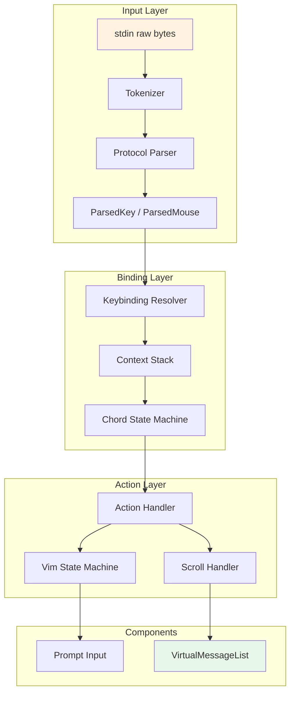

# Tutorial 14: Input Handling -- From Bytes to Actions

## Learning Objectives

By the end of this tutorial, you'll understand:
- **Terminal input protocols** -- Kitty keyboard, xterm modifyOtherKeys, legacy VT sequences
- **Byte-to-key parsing** -- Tokenizing escape sequences with timeout handling
- **Contextual keybindings** -- 16 input contexts with priority resolution
- **Vim mode** -- State machine implementation with exhaustive type checking
- **Virtual scrolling** -- Rendering only visible messages for performance

## The Input Challenge

Terminal input is deceptively complex. When you press `Ctrl+X` followed by `Ctrl+K`, your terminal sends byte sequences separated by milliseconds. A modern terminal might send structured Kitty protocol sequences. A legacy terminal over SSH sends ambiguous legacy VT codes. Windows Terminal has its own quirks.

Your input system must:
1. Parse raw bytes into structured key events
2. Support multiple terminal protocols simultaneously
3. Handle chords (multi-key sequences like `Ctrl+X Ctrl+K`)
4. Provide contextual keybindings that activate/deactivate based on UI state
5. Implement vim mode for text editing
6. Virtualize long conversations for performance

## Architecture Overview



## Step 1: Tokenizing Raw Input

Terminal input arrives as raw bytes with no explicit framing. A single `read()` might return `\x1b[1;5A` (Ctrl+Up), or `\x1b` in one read and `[1;5A` in the next.

### The Tokenizer

```typescript
// src/ui/input/tokenize.ts

export interface TokenizerState {
  buffer: string;           // Accumulated bytes
  timeout: ReturnType<typeof setTimeout> | null;
  isPasting: boolean;       // Inside bracketed paste
}

export interface Token {
  sequence: string;         // Complete escape sequence
  isPasted: boolean;        // From bracketed paste
}

const INITIAL_TIMEOUT_MS = 50;   // Escape sequence timeout
const PASTE_TIMEOUT_MS = 500;    // Paste operation timeout

/**
 * Create a fresh tokenizer state.
 */
export function createTokenizerState(): TokenizerState {
  return {
    buffer: '',
    timeout: null,
    isPasting: false,
  };
}

/**
 * Process input chunk, returning completed tokens.
 * Handles incomplete sequences with timeout-based reassembly.
 */
export function tokenize(
  state: TokenizerState,
  chunk: Buffer,
  onToken: (token: Token) => void,
  scheduleFlush: (ms: number, callback: () => void) => void,
  clearFlush: (timer: ReturnType<typeof setTimeout>) => void
): void {
  // Append new bytes to buffer
  state.buffer += chunk.toString('utf8');
  
  // Check for bracketed paste markers
  while (state.buffer.length > 0) {
    if (state.isPasting) {
      const endIdx = state.buffer.indexOf('\x1b[201~');
      if (endIdx !== -1) {
        // End of paste
        const content = state.buffer.slice(0, endIdx);
        state.buffer = state.buffer.slice(endIdx + 6); // Remove marker
        state.isPasting = false;
        
        // Emit each character as pasted token
        for (const char of content) {
          onToken({ sequence: char, isPasted: true });
        }
      } else {
        // Still accumulating paste
        break;
      }
    } else {
      const startIdx = state.buffer.indexOf('\x1b[200~');
      if (startIdx !== -1) {
        // Start of paste - emit everything before as normal
        const before = state.buffer.slice(0, startIdx);
        state.buffer = state.buffer.slice(startIdx + 6); // Remove marker
        state.isPasting = true;
        
        // Emit normal tokens before paste
        emitNormalTokens(before, onToken);
      } else {
        // Normal input processing
        const consumed = emitNormalTokens(state.buffer, onToken);
        state.buffer = state.buffer.slice(consumed);
        break;
      }
    }
  }
  
  // Schedule flush for incomplete sequences
  if (state.buffer.length > 0) {
    if (state.timeout) {
      clearFlush(state.timeout);
    }
    
    const timeoutMs = state.isPasting ? PASTE_TIMEOUT_MS : INITIAL_TIMEOUT_MS;
    state.timeout = scheduleFlush(timeoutMs, () => {
      // Timeout expired - flush as individual keys
      for (const char of state.buffer) {
        onToken({ sequence: char, isPasted: false });
      }
      state.buffer = '';
      state.timeout = null;
    });
  }
}

/**
 * Emit complete escape sequences as tokens.
 * Returns the number of characters consumed.
 */
function emitNormalTokens(
  buffer: string,
  onToken: (token: Token) => void
): number {
  let pos = 0;
  
  while (pos < buffer.length) {
    const remaining = buffer.slice(pos);
    
    // Check for escape sequence
    if (remaining[0] === '\x1b') {
      const seqLen = matchEscapeSequence(remaining);
      if (seqLen > 0 && pos + seqLen <= buffer.length) {
        onToken({
          sequence: buffer.slice(pos, pos + seqLen),
          isPasted: false,
        });
        pos += seqLen;
        continue;
      }
      
      // Incomplete sequence - stop here
      break;
    }
    
    // Regular character
    onToken({ sequence: remaining[0], isPasted: false });
    pos++;
  }
  
  return pos;
}

/**
 * Try to match an escape sequence at the start of the string.
 * Returns sequence length if matched, 0 if incomplete, -1 if not a sequence.
 */
function matchEscapeSequence(str: string): number {
  // OSC sequences: ESC ] ... BEL or ESC ] ... ESC \
  const oscMatch = str.match(/^\x1b\][^\x07\x1b]*(?:\x07|\x1b\\)/);
  if (oscMatch) return oscMatch[0].length;
  
  // CSI sequences: ESC [ ... final byte
  const csiMatch = str.match(/^\x1b\[[0-9;:<=>?]*[A-Za-z`{|}]/);
  if (csiMatch) return csiMatch[0].length;
  
  // SS3 sequences: ESC O ...
  const ss3Match = str.match(/^\x1bO[A-Za-z0-9]/);
  if (ss3Match) return ss3Match[0].length;
  
  // DCS sequences: ESC P ... ST
  const dcsMatch = str.match(/^\x1bP[^\x1b]*\x1b\\/);
  if (dcsMatch) return dcsMatch[0].length;
  
  // Single ESC is incomplete unless followed by non-[ character
  if (str.length === 1) return 0; // Incomplete
  if (str[1] !== '[' && str[1] !== 'O' && str[1] !== 'P' && str[1] !== ']') {
    // ESC followed by regular char - this is Alt+key, not a sequence
    return -1;
  }
  
  return 0; // Potentially incomplete
}
```

### Key Types

```typescript
// src/ui/input/types.ts

/**
 * Parsed keypress with normalized modifiers.
 */
export interface ParsedKey {
  kind: 'key';
  name: string;             // 'return', 'escape', 'a', 'f1', etc.
  ctrl: boolean;
  meta: boolean;            // Alt/Option
  shift: boolean;
  option: boolean;            // macOS Option
  super: boolean;             // Cmd (when supported)
  sequence: string;           // Raw sequence for debugging
  isPasted: boolean;          // From bracketed paste
}

/**
 * Parsed mouse event.
 */
export interface ParsedMouse {
  kind: 'mouse';
  button: number;           // 0=left, 1=middle, 2=right
  action: 'press' | 'release' | 'drag';
  col: number;              // 1-indexed terminal column
  row: number;              // 1-indexed terminal row
}

/**
 * Terminal response to a query.
 */
export interface ParsedResponse {
  kind: 'response';
  type: string;
  data: unknown;
}

export type ParsedInput = ParsedKey | ParsedMouse | ParsedResponse;
```

## Step 2: Multi-Protocol Parser

Different terminals use different protocols. We support all major ones:

### Protocol Parser

```typescript
// src/ui/input/parser.ts

import { ParsedKey, ParsedMouse, ParsedInput } from './types.js';

/**
 * Parse a tokenized sequence into a structured input event.
 * Supports: Kitty keyboard, xterm modifyOtherKeys, legacy VT sequences.
 */
export function parseInput(sequence: string): ParsedInput | null {
  // Empty sequence
  if (!sequence || sequence.length === 0) return null;
  
  // Check for Kitty keyboard protocol: CSI codepoint ; modifiers u
  const kittyMatch = sequence.match(/^\x1b\[(\d+)(?:;(\d+))?u$/);
  if (kittyMatch) {
    return parseKittySequence(
      parseInt(kittyMatch[1], 10),
      kittyMatch[2] ? parseInt(kittyMatch[2], 10) : undefined
    );
  }
  
  // Check for xterm modifyOtherKeys: CSI 27 ; modifier ; keycode ~
  const modifyMatch = sequence.match(/^\x1b\[27;(\d+);(\d+)~$/);
  if (modifyMatch) {
    return parseModifyOtherKeys(
      parseInt(modifyMatch[1], 10),
      parseInt(modifyMatch[2], 10)
    );
  }
  
  // Check for SGR mouse: CSI < button ; col ; row M/m
  const mouseMatch = sequence.match(/^\x1b\[<(\d+);(\d+);(\d+)([Mm])$/);
  if (mouseMatch) {
    return parseSGRMouse(
      parseInt(mouseMatch[1], 10),
      parseInt(mouseMatch[2], 10),
      parseInt(mouseMatch[3], 10),
      mouseMatch[4] === 'M'
    );
  }
  
  // Check for CSI cursor position response
  const cprMatch = sequence.match(/^\x1b\[(\d+);(\d+)R$/);
  if (cprMatch) {
    return {
      kind: 'response',
      type: 'cursorPosition',
      data: {
        row: parseInt(cprMatch[1], 10),
        col: parseInt(cprMatch[2], 10),
      },
    };
  }
  
  // Check for function keys and arrows
  const fnMatch = sequence.match(/^\x1b(?:O|\[)([0-9;]*)([A-Za-z])$/);
  if (fnMatch) {
    return parseFunctionKey(fnMatch[1], fnMatch[2]);
  }
  
  // Single escape (ESC key)
  if (sequence === '\x1b') {
    return {
      kind: 'key',
      name: 'escape',
      ctrl: false,
      meta: false,
      shift: false,
      option: false,
      super: false,
      sequence,
      isPasted: false,
    };
  }
  
  // ESC + char (Alt/Option + key)
  if (sequence.length === 2 && sequence[0] === '\x1b') {
    const char = sequence[1];
    return {
      kind: 'key',
      name: char.toLowerCase(),
      ctrl: false,
      meta: true,      // Alt
      shift: char >= 'A' && char <= 'Z',
      option: true,
      super: false,
      sequence,
      isPasted: false,
    };
  }
  
  // Control characters
  if (sequence.length === 1) {
    const code = sequence.charCodeAt(0);
    
    // Ctrl+A through Ctrl+Z
    if (code >= 1 && code <= 26) {
      const letter = String.fromCharCode(code + 64).toLowerCase();
      return {
        kind: 'key',
        name: letter,
        ctrl: true,
        meta: false,
        shift: false,
        option: false,
        super: false,
        sequence,
        isPasted: false,
      };
    }
    
    // Special control characters
    if (code === 0) return createKey('space', { ctrl: true }, sequence);
    if (code === 9) return createKey('tab', {}, sequence);
    if (code === 13) return createKey('return', {}, sequence);
    if (code === 27) return createKey('escape', {}, sequence);
    if (code === 32) return createKey('space', {}, sequence);
    if (code === 127) return createKey('backspace', {}, sequence);
    
    // Regular printable character
    return {
      kind: 'key',
      name: sequence,
      ctrl: false,
      meta: false,
      shift: false,
      option: false,
      super: false,
      sequence,
      isPasted: false,
    };
  }
  
  // Unknown sequence - treat as individual characters
  return null;
}

function parseKittySequence(codepoint: number, modifiers?: number): ParsedKey {
  // Map codepoint to key name
  const keyName = CODEPOINT_TO_KEY[codepoint] ?? String.fromCharCode(codepoint);
  
  // Decode modifier bits: 1 + (shift ? 1 : 0) + (alt ? 2 : 0) + (ctrl ? 4 : 0) + (super ? 8 : 0)
  const mod = (modifiers ?? 1) - 1;
  
  return {
    kind: 'key',
    name: keyName,
    ctrl: (mod & 4) !== 0,
    meta: (mod & 2) !== 0,
    shift: (mod & 1) !== 0,
    option: (mod & 2) !== 0,
    super: (mod & 8) !== 0,
    sequence: `\x1b[${codepoint}${modifiers ? `;${modifiers}` : ''}u`,
    isPasted: false,
  };
}

function parseModifyOtherKeys(modifier: number, keycode: number): ParsedKey {
  // Modifier format same as Kitty but order is different
  const mod = modifier - 1;
  
  return {
    kind: 'key',
    name: String.fromCharCode(keycode).toLowerCase(),
    ctrl: (mod & 4) !== 0,
    meta: (mod & 2) !== 0,
    shift: (mod & 1) !== 0,
    option: (mod & 2) !== 0,
    super: (mod & 8) !== 0,
    sequence: `\x1b[27;${modifier};${keycode}~`,
    isPasted: false,
  };
}

function parseFunctionKey(params: string, final: string): ParsedKey | null {
  // Parse parameters like "1;5" for modified function keys
  const parts = params.split(';').map(Number);
  const baseCode = parts[0] || 0;
  const modifier = (parts[1] || 1) - 1;
  
  // Map final character and base code to key name
  const keyName = FUNCTION_KEY_MAP[`${baseCode}${final}`];
  if (!keyName) return null;
  
  return {
    kind: 'key',
    name: keyName,
    ctrl: (modifier & 4) !== 0,
    meta: (modifier & 2) !== 0,
    shift: (modifier & 1) !== 0,
    option: (modifier & 2) !== 0,
    super: (modifier & 8) !== 0,
    sequence: `\x1b[${params}${final}`,
    isPasted: false,
  };
}

function parseSGRMouse(button: number, col: number, row: number, isPress: boolean): ParsedMouse {
  // Decode button: 0/1/2 = left/middle/right, 64/65 = wheel, +32 = drag
  const isWheel = button >= 64;
  const isDrag = button >= 32 && !isWheel;
  const actualButton = button & ~32 & ~64;
  
  return {
    kind: 'mouse',
    button: actualButton,
    action: isWheel ? 'press' : isDrag ? 'drag' : isPress ? 'press' : 'release',
    col,
    row,
  };
}

function createKey(
  name: string,
  modifiers: Partial<ParsedKey>,
  sequence: string
): ParsedKey {
  return {
    kind: 'key',
    name,
    ctrl: modifiers.ctrl ?? false,
    meta: modifiers.meta ?? false,
    shift: modifiers.shift ?? false,
    option: modifiers.option ?? false,
    super: modifiers.super ?? false,
    sequence,
    isPasted: false,
  };
}

// Codepoint mappings for Kitty protocol
const CODEPOINT_TO_KEY: Record<number, string> = {
  1: 'home',
  2: 'insert',
  3: 'delete',
  4: 'end',
  5: 'pageup',
  6: 'pagedown',
  7: 'backspace',
  9: 'tab',
  13: 'return',
  27: 'escape',
  127: 'backspace',
  57348: 'f1',
  57349: 'f2',
  57350: 'f3',
  57351: 'f4',
  57352: 'f5',
  57353: 'f6',
  57354: 'f7',
  57355: 'f8',
  57356: 'f9',
  57357: 'f10',
  57358: 'f11',
  57359: 'f12',
};

// Function key mappings for legacy sequences
const FUNCTION_KEY_MAP: Record<string, string> = {
  'A': 'up',
  'B': 'down',
  'C': 'right',
  'D': 'left',
  'H': 'home',
  'F': 'end',
  'E': 'clear',
  'P': 'f1',
  'Q': 'f2',
  'R': 'f3',
  'S': 'f4',
  '11~': 'f1',
  '12~': 'f2',
  '13~': 'f3',
  '14~': 'f4',
  '15~': 'f5',
  '17~': 'f6',
  '18~': 'f7',
  '19~': 'f8',
  '20~': 'f9',
  '21~': 'f10',
  '23~': 'f11',
  '24~': 'f12',
  '2~': 'insert',
  '3~': 'delete',
  '5~': 'pageup',
  '6~': 'pagedown',
  '1;5A': 'up',    // Ctrl+Up
  '1;5B': 'down',  // Ctrl+Down
  '1;5C': 'right', // Ctrl+Right
  '1;5D': 'left',  // Ctrl+Left
  '1;2A': 'up',    // Shift+Up
  '1;2B': 'down',  // Shift+Down
};
```

### Terminal Mode Setup

```typescript
// src/ui/input/terminalMode.ts

/**
 * Escape sequences for terminal mode management.
 */

// Enable/disable raw mode
export const ENABLE_RAW_MODE = '';
export const DISABLE_RAW_MODE = '';

// Kitty keyboard protocol
export const ENABLE_KITTY_KEYBOARD = '\x1b[>1u';     // Enable
export const DISABLE_KITTY_KEYBOARD = '\x1b[<1u';    // Disable
export const QUERY_KITTY_KEYBOARD = '\x1b[?u';      // Query support

// XTerm modifyOtherKeys
export const ENABLE_MODIFY_OTHER_KEYS = '\x1b[>4;2m';
export const DISABLE_MODIFY_OTHER_KEYS = '\x1b[>4;0m';

// Bracketed paste
export const ENABLE_BRACKETED_PASTE = '\x1b[?2004h';
export const DISABLE_BRACKETED_PASTE = '\x1b[?2004l';

// Focus events
export const ENABLE_FOCUS_EVENTS = '\x1b[?1004h';
export const DISABLE_FOCUS_EVENTS = '\x1b[?1004l';

// SGR mouse protocol
export const ENABLE_SGR_MOUSE = '\x1b[?1002h\x1b[?1006h';
export const DISABLE_SGR_MOUSE = '\x1b[?1006l\x1b[?1002l';

// Alternate screen buffer
export const ENABLE_ALT_SCREEN = '\x1b[?1049h';
export const DISABLE_ALT_SCREEN = '\x1b[?1049l';

// Cursor visibility
export const HIDE_CURSOR = '\x1b[?25l';
export const SHOW_CURSOR = '\x1b[?25h';

/**
 * Get initialization sequence for full terminal mode.
 */
export function getTerminalInitSequence(): string {
  return (
    ENABLE_ALT_SCREEN +
    HIDE_CURSOR +
    ENABLE_BRACKETED_PASTE +
    ENABLE_FOCUS_EVENTS +
    ENABLE_SGR_MOUSE +
    ENABLE_KITTY_KEYBOARD +
    ENABLE_MODIFY_OTHER_KEYS
  );
}

/**
 * Get cleanup sequence to restore terminal state.
 */
export function getTerminalCleanupSequence(): string {
  return (
    DISABLE_MODIFY_OTHER_KEYS +
    DISABLE_KITTY_KEYBOARD +
    DISABLE_SGR_MOUSE +
    DISABLE_FOCUS_EVENTS +
    DISABLE_BRACKETED_PASTE +
    SHOW_CURSOR +
    DISABLE_ALT_SCREEN
  );
}
```

## Step 3: The Keybinding System

### Keybinding Types

```typescript
// src/ui/input/keybindings/types.ts

/**
 * Action names for all possible keybindings.
 */
export type ActionName =
  | 'app:interrupt'
  | 'app:exit'
  | 'app:redraw'
  | 'chat:submit'
  | 'chat:cancel'
  | 'chat:killAgents'
  | 'chat:externalEditor'
  | 'history:search'
  | 'history:previous'
  | 'history:next'
  | 'cursor:moveLeft'
  | 'cursor:moveRight'
  | 'cursor:moveWordLeft'
  | 'cursor:moveWordRight'
  | 'cursor:moveStart'
  | 'cursor:moveEnd'
  | 'text:deleteChar'
  | 'text:deleteWord'
  | 'text:deleteLine'
  | 'text:paste'
  | 'vim:enterMode'
  | 'scroll:up'
  | 'scroll:down'
  | 'scroll:pageUp'
  | 'scroll:pageDown'
  | 'scroll:top'
  | 'scroll:bottom';

/**
 * Contexts for keybinding resolution.
 */
export type KeybindingContext =
  | 'Global'      // Always active
  | 'Chat'      // Chat input focused
  | 'Dialog'    // Modal dialog open
  | 'VimNormal' // Vim normal mode
  | 'VimInsert' // Vim insert mode
  | 'History'   // History search active
  | 'Scroll';   // Scrolling transcript

/**
 * Single keybinding definition.
 */
export interface Keybinding {
  key: string;                    // e.g., 'ctrl+c', 'escape', 'a'
  action: ActionName | null;      // null = explicit unbind
  when?: string;                  // Optional condition
}

/**
 * Block of bindings for a specific context.
 */
export interface KeybindingBlock {
  context: KeybindingContext;
  bindings: Record<string, ActionName | null>;
}

/**
 * Full keybinding configuration.
 */
export interface KeybindingConfig {
  version: number;
  bindings: KeybindingBlock[];
}

/**
 * Parsed key chord (single key or multi-key sequence).
 */
export interface KeyChord {
  keys: string[];                 // e.g., ['ctrl+x', 'ctrl+k']
}

/**
 * Result of keybinding resolution.
 */
export type ResolutionResult =
  | { type: 'match'; action: ActionName }
  | { type: 'chord_started'; pending: string[] }
  | { type: 'chord_cancelled' }
  | { type: 'unbound' }
  | { type: 'none' };
```

### Default Keybindings

```typescript
// src/ui/input/keybindings/defaults.ts

import { KeybindingBlock } from './types.js';

/**
 * Default keybinding configuration.
 */
export const DEFAULT_BINDINGS: KeybindingBlock[] = [
  {
    context: 'Global',
    bindings: {
      'ctrl+c': 'app:interrupt',
      'ctrl+d': 'app:exit',
      'ctrl+l': 'app:redraw',
    },
  },
  {
    context: 'Chat',
    bindings: {
      'return': 'chat:submit',
      'enter': 'chat:submit',
      'escape': 'chat:cancel',
      'ctrl+x ctrl+k': 'chat:killAgents',
      'ctrl+x ctrl+e': 'chat:externalEditor',
      'ctrl+r': 'history:search',
      'up': 'history:previous',
      'down': 'history:next',
      'ctrl+a': 'cursor:moveStart',
      'ctrl+e': 'cursor:moveEnd',
      'ctrl+w': 'text:deleteWord',
      'ctrl+u': 'text:deleteLine',
    },
  },
  {
    context: 'Dialog',
    bindings: {
      'escape': 'chat:cancel',
      'y': 'chat:submit',      // Yes
      'n': 'chat:cancel',      // No
    },
  },
  {
    context: 'VimNormal',
    bindings: {
      // Navigation
      'h': 'cursor:moveLeft',
      'j': 'scroll:down',
      'k': 'scroll:up',
      'l': 'cursor:moveRight',
      'w': 'cursor:moveWordRight',
      'b': 'cursor:moveWordLeft',
      '0': 'cursor:moveStart',
      '$': 'cursor:moveEnd',
      'g': 'scroll:top',
      'shift+g': 'scroll:bottom',
      
      // Scrolling
      'ctrl+u': 'scroll:pageUp',
      'ctrl+d': 'scroll:pageDown',
      
      // Mode switching
      'i': 'vim:enterMode',
      'a': 'vim:enterMode',
      'o': 'vim:enterMode',
      ':': 'vim:enterMode',
    },
  },
  {
    context: 'VimInsert',
    bindings: {
      'escape': 'vim:enterMode',
      'ctrl+c': 'vim:enterMode',
    },
  },
  {
    context: 'History',
    bindings: {
      'escape': 'chat:cancel',
      'ctrl+c': 'chat:cancel',
      'return': 'chat:submit',
      'enter': 'chat:submit',
      'up': 'history:previous',
      'down': 'history:next',
    },
  },
  {
    context: 'Scroll',
    bindings: {
      'escape': 'chat:cancel',
      'up': 'scroll:up',
      'down': 'scroll:down',
      'pageup': 'scroll:pageUp',
      'pagedown': 'scroll:pageDown',
      'home': 'scroll:top',
      'end': 'scroll:bottom',
    },
  },
];

/**
 * Keys that cannot be rebound (system-reserved).
 */
export const NON_REBINDABLE_KEYS = new Set([
  'ctrl+c',  // Interrupt signal
  'ctrl+d',  // EOF signal
  'ctrl+m',  // Same as Enter
  'ctrl+z',  // SIGTSTP (terminal handles this)
  'ctrl+\\', // SIGQUIT
]);

/**
 * Keys reserved by macOS (cannot be captured by terminal).
 */
export const MACOS_RESERVED_KEYS = new Set([
  'cmd+c',
  'cmd+v',
  'cmd+x',
  'cmd+q',
  'cmd+w',
  'cmd+tab',
  'cmd+space',
]);
```

### Keybinding Resolver

```typescript
// src/ui/input/keybindings/resolver.ts

import { ParsedKey } from '../types.js';
import { 
  ActionName, 
  KeybindingContext, 
  KeybindingBlock, 
  ResolutionResult 
} from './types.js';

/**
 * Resolver state for chord handling.
 */
export interface ResolverState {
  pendingChord: string[];
  chordTimeout: ReturnType<typeof setTimeout> | null;
}

const CHORD_TIMEOUT_MS = 1000;

/**
 * Create a fresh resolver state.
 */
export function createResolverState(): ResolverState {
  return {
    pendingChord: [],
    chordTimeout: null,
  };
}

/**
 * Normalize a key name for matching.
 */
export function normalizeKey(key: ParsedKey): string {
  const parts: string[] = [];
  
  // Order: ctrl+shift+meta+key
  if (key.ctrl) parts.push('ctrl');
  if (key.shift) parts.push('shift');
  if (key.meta) parts.push('meta');
  if (key.option) parts.push('option');
  if (key.super) parts.push('super');
  
  // Map special names
  const name = KEY_NAME_ALIASES[key.name] ?? key.name;
  parts.push(name);
  
  return parts.join('+');
}

/**
 * Resolve a keypress against the keybinding table.
 */
export function resolveKeybinding(
  key: ParsedKey,
  activeContexts: KeybindingContext[],
  bindings: KeybindingBlock[],
  state: ResolverState,
  scheduleTimeout: (ms: number, callback: () => void) => ReturnType<typeof setTimeout>,
  clearTimeoutFn: (timer: ReturnType<typeof setTimeout>) => void
): ResolutionResult {
  const normalized = normalizeKey(key);
  
  // Build lookup from active contexts
  const contextBindings = buildContextBindings(activeContexts, bindings);
  
  // Check if we're in the middle of a chord
  if (state.pendingChord.length > 0) {
    const fullChord = [...state.pendingChord, normalized].join(' ');
    
    if (fullChord in contextBindings) {
      // Complete chord matched
      const action = contextBindings[fullChord];
      clearChord(state, clearTimeoutFn);
      return action === null 
        ? { type: 'unbound' }
        : { type: 'match', action };
    }
    
    // Check if this is a valid chord prefix
    const chordPrefix = state.pendingChord.join(' ') + ' ';
    const hasContinuation = Object.keys(contextBindings).some(k => 
      k.startsWith(chordPrefix)
    );
    
    if (!hasContinuation) {
      // No continuation - cancel chord
      clearChord(state, clearTimeoutFn);
      return { type: 'chord_cancelled' };
    }
    
    // Continue chord
    state.pendingChord.push(normalized);
    resetChordTimeout(state, scheduleTimeout, clearTimeoutFn);
    return { type: 'chord_started', pending: [...state.pendingChord] };
  }
  
  // Check for direct match
  if (normalized in contextBindings) {
    const action = contextBindings[normalized];
    return action === null
      ? { type: 'unbound' }
      : { type: 'match', action };
  }
  
  // Check if this could start a chord
  const chordPrefix = normalized + ' ';
  const hasContinuation = Object.keys(contextBindings).some(k =>
    k.startsWith(chordPrefix)
  );
  
  if (hasContinuation) {
    state.pendingChord = [normalized];
    resetChordTimeout(state, scheduleTimeout, clearTimeoutFn);
    return { type: 'chord_started', pending: [normalized] };
  }
  
  return { type: 'none' };
}

/**
 * Build merged binding table from active contexts.
 * Later contexts override earlier ones.
 */
function buildContextBindings(
  contexts: KeybindingContext[],
  blocks: KeybindingBlock[]
): Record<string, ActionName | null> {
  const merged: Record<string, ActionName | null> = {};
  
  // Find Global bindings first
  const globalBlock = blocks.find(b => b.context === 'Global');
  if (globalBlock) {
    Object.assign(merged, globalBlock.bindings);
  }
  
  // Overlay active contexts in order
  for (const context of contexts) {
    const block = blocks.find(b => b.context === context);
    if (block) {
      Object.assign(merged, block.bindings);
    }
  }
  
  return merged;
}

function resetChordTimeout(
  state: ResolverState,
  scheduleTimeout: (ms: number, callback: () => void) => ReturnType<typeof setTimeout>,
  clearTimeoutFn: (timer: ReturnType<typeof setTimeout>) => void
): void {
  if (state.chordTimeout) {
    clearTimeoutFn(state.chordTimeout);
  }
  
  state.chordTimeout = scheduleTimeout(CHORD_TIMEOUT_MS, () => {
    state.pendingChord = [];
    state.chordTimeout = null;
  });
}

function clearChord(
  state: ResolverState,
  clearTimeoutFn: (timer: ReturnType<typeof setTimeout>) => void
): void {
  if (state.chordTimeout) {
    clearTimeoutFn(state.chordTimeout);
    state.chordTimeout = null;
  }
  state.pendingChord = [];
}

// Key name aliases for normalization
const KEY_NAME_ALIASES: Record<string, string> = {
  'return': 'enter',
  'esc': 'escape',
  'del': 'delete',
  'ins': 'insert',
  'pgup': 'pageup',
  'pgdown': 'pagedown',
};
```

## Step 4: Vim Mode State Machine

### Vim State Types

```typescript
// src/ui/input/vim/types.ts

/**
 * Vim modes.
 */
export type VimMode = 'NORMAL' | 'INSERT' | 'VISUAL' | 'COMMAND';

/**
 * Command state for normal mode.
 */
export type CommandState =
  | { type: 'idle' }
  | { type: 'count'; digits: string }
  | { type: 'operator'; op: Operator; count: number }
  | { type: 'operatorCount'; op: Operator; count: number; digits: string }
  | { type: 'operatorTextObj'; op: Operator; count: number; scope: TextObjScope }
  | { type: 'find'; find: FindType; count: number }
  | { type: 'g'; count: number }
  | { type: 'replace'; count: number }
  | { type: 'indent'; dir: '>' | '<'; count: number };

/**
 * Vim operators.
 */
export type Operator = 'delete' | 'change' | 'yank';

/**
 * Text object scope.
 */
export type TextObjScope = { type: 'inner' } | { type: 'around' };

/**
 * Find motion types.
 */
export type FindType = 
  | { type: 'f'; char: string }      // Find forward to char
  | { type: 'F'; char: string }      // Find backward to char
  | { type: 't'; char: string }      // Find forward before char
  | { type: 'T'; char: string };     // Find backward before char

/**
 * Full vim state.
 */
export interface VimState {
  mode: VimMode;
  command: CommandState;
  cursor: { line: number; col: number };
}

/**
 * Result of a state transition.
 */
export interface TransitionResult {
  newState: VimState;
  effect?: VimEffect;
}

/**
 * Effects that can result from transitions.
 */
export type VimEffect =
  | { type: 'move'; delta: { line?: number; col?: number } }
  | { type: 'delete'; range: Range }
  | { type: 'change'; range: Range }
  | { type: 'yank'; range: Range }
  | { type: 'insert'; text: string }
  | { type: 'switchMode'; mode: VimMode }
  | { type: 'executeCommand'; command: string }
  | { type: 'none' };

export interface Range {
  start: { line: number; col: number };
  end: { line: number; col: number };
}

/**
 * Create initial vim state.
 */
export function createVimState(): VimState {
  return {
    mode: 'NORMAL',
    command: { type: 'idle' },
    cursor: { line: 0, col: 0 },
  };
}
```

### Vim State Machine

```typescript
// src/ui/input/vim/transitions.ts

import { ParsedKey } from '../types.js';
import { 
  VimState, 
  VimMode, 
  CommandState, 
  Operator,
  TransitionResult, 
  VimEffect,
  Range,
  TextObjScope,
  FindType 
} from './types.js';

/**
 * Process a keypress in vim normal mode.
 * Returns the new state and any resulting effect.
 */
export function transition(
  state: VimState,
  key: ParsedKey
): TransitionResult {
  if (state.mode === 'INSERT') {
    return handleInsertMode(state, key);
  }
  
  if (state.mode === 'NORMAL') {
    return handleNormalMode(state, key);
  }
  
  if (state.mode === 'COMMAND') {
    return handleCommandMode(state, key);
  }
  
  return { newState: state, effect: { type: 'none' } };
}

function handleInsertMode(state: VimState, key: ParsedKey): TransitionResult {
  if (key.name === 'escape' || (key.ctrl && key.name === 'c')) {
    return {
      newState: { ...state, mode: 'NORMAL', command: { type: 'idle' } },
      effect: { type: 'switchMode', mode: 'NORMAL' },
    };
  }
  
  // In insert mode, keys insert text (handled by caller)
  return { newState: state, effect: { type: 'none' } };
}

function handleCommandMode(state: VimState, key: ParsedKey): TransitionResult {
  // Command line editing (simplified)
  if (key.name === 'escape') {
    return {
      newState: { ...state, mode: 'NORMAL', command: { type: 'idle' } },
      effect: { type: 'switchMode', mode: 'NORMAL' },
    };
  }
  
  if (key.name === 'enter' || key.name === 'return') {
    // Execute command (placeholder)
    return {
      newState: { ...state, mode: 'NORMAL', command: { type: 'idle' } },
      effect: { type: 'switchMode', mode: 'NORMAL' },
    };
  }
  
  return { newState: state, effect: { type: 'none' } };
}

function handleNormalMode(state: VimState, key: ParsedKey): TransitionResult {
  const char = key.name;
  const command = state.command;
  
  // Handle count prefix
  if (/^[1-9]$/.test(char) && command.type !== 'operatorCount') {
    return handleCountPrefix(state, char);
  }
  
  // Handle '0' specially (start of line vs count digit)
  if (char === '0') {
    if (command.type === 'count' || command.type === 'operatorCount') {
      return handleCountDigit(state, '0');
    }
    return handleMotion(state, 'start');
  }
  
  // State machine dispatch
  switch (command.type) {
    case 'idle':
      return fromIdle(state, key);
    case 'count':
      return fromCount(state, key);
    case 'operator':
      return fromOperator(state, key);
    case 'operatorCount':
      return fromOperatorCount(state, key);
    case 'operatorTextObj':
      return fromOperatorTextObj(state, key);
    case 'find':
      return fromFind(state, key);
    case 'g':
      return fromG(state, key);
    case 'replace':
      return fromReplace(state, key);
    case 'indent':
      return fromIndent(state, key);
    default:
      // Exhaustiveness check
      const _exhaustive: never = command;
      return { newState: state, effect: { type: 'none' } };
  }
}

function fromIdle(state: VimState, key: ParsedKey): TransitionResult {
  const char = key.name;
  
  // Count prefix
  if (/^[1-9]$/.test(char)) {
    return {
      newState: { 
        ...state, 
        command: { type: 'count', digits: char } 
      },
      effect: { type: 'none' },
    };
  }
  
  // Operators
  if (char === 'd') {
    return enterOperatorState(state, 'delete');
  }
  if (char === 'c') {
    return enterOperatorState(state, 'change');
  }
  if (char === 'y') {
    return enterOperatorState(state, 'yank');
  }
  
  // Find motions
  if (char === 'f' || char === 'F' || char === 't' || char === 'T') {
    return {
      newState: {
        ...state,
        command: { type: 'find', find: { type: char as 'f'|'F'|'t'|'T', char: '' }, count: 1 },
      },
      effect: { type: 'none' },
    };
  }
  
  // G-prefixed commands
  if (char === 'g') {
    return {
      newState: { ...state, command: { type: 'g', count: 1 } },
      effect: { type: 'none' },
    };
  }
  
  // Replace
  if (char === 'r') {
    return {
      newState: { ...state, command: { type: 'replace', count: 1 } },
      effect: { type: 'none' },
    };
  }
  
  // Indent
  if (char === '>' || char === '<') {
    return {
      newState: { ...state, command: { type: 'indent', dir: char, count: 1 } },
      effect: { type: 'none' },
    };
  }
  
  // Simple motions
  const motion = SIMPLE_MOTIONS[char];
  if (motion) {
    return handleMotion(state, motion);
  }
  
  // Enter insert mode
  if (char === 'i' || char === 'a' || char === 'o') {
    return {
      newState: { ...state, mode: 'INSERT' },
      effect: { type: 'switchMode', mode: 'INSERT' },
    };
  }
  
  // Command mode
  if (char === ':') {
    return {
      newState: { ...state, mode: 'COMMAND' },
      effect: { type: 'switchMode', mode: 'COMMAND' },
    };
  }
  
  // Immediate commands
  if (char === 'x') {
    return {
      newState: { ...state, command: { type: 'idle' } },
      effect: { 
        type: 'delete', 
        range: { 
          start: state.cursor, 
          end: { ...state.cursor, col: state.cursor.col + 1 } 
        } 
      },
    };
  }
  
  if (char === 'shift+g') {
    return handleMotion(state, 'end');
  }
  
  return { newState: state, effect: { type: 'none' } };
}

function fromCount(state: VimState, key: ParsedKey): TransitionResult {
  const char = key.name;
  const count = parseInt(state.command.digits, 10);
  
  // Continue count
  if (/^[0-9]$/.test(char)) {
    return {
      newState: {
        ...state,
        command: { type: 'count', digits: state.command.digits + char },
      },
      effect: { type: 'none' },
    };
  }
  
  // Operator after count
  if (char === 'd' || char === 'c' || char === 'y') {
    const op: Operator = char === 'd' ? 'delete' : char === 'c' ? 'change' : 'yank';
    return {
      newState: {
        ...state,
        command: { type: 'operator', op, count },
      },
      effect: { type: 'none' },
    };
  }
  
  // Motion with count
  const motion = SIMPLE_MOTIONS[char];
  if (motion) {
    return handleCountedMotion(state, motion, count);
  }
  
  // Reset
  return {
    newState: { ...state, command: { type: 'idle' } },
    effect: { type: 'none' },
  };
}

function fromOperator(state: VimState, key: ParsedKey): TransitionResult {
  const { op, count } = state.command;
  const char = key.name;
  
  // Self-repeat (dd, cc, yy)
  if ((char === 'd' && op === 'delete') ||
      (char === 'c' && op === 'change') ||
      (char === 'y' && op === 'yank')) {
    return {
      newState: { ...state, command: { type: 'idle' } },
      effect: { type: op, range: makeLineRange(state.cursor, count) },
    };
  }
  
  // Count after operator
  if (/^[1-9]$/.test(char)) {
    return {
      newState: {
        ...state,
        command: { type: 'operatorCount', op, count, digits: char },
      },
      effect: { type: 'none' },
    };
  }
  
  // Text object
  if (char === 'i' || char === 'a') {
    return {
      newState: {
        ...state,
        command: { 
          type: 'operatorTextObj', 
          op, 
          count, 
          scope: { type: char === 'i' ? 'inner' : 'around' } 
        },
      },
      effect: { type: 'none' },
    };
  }
  
  // Motion
  const motion = SIMPLE_MOTIONS[char];
  if (motion) {
    return executeOperatorMotion(state, op, motion, count);
  }
  
  // Cancel
  return {
    newState: { ...state, command: { type: 'idle' } },
    effect: { type: 'none' },
  };
}

function fromOperatorCount(state: VimState, key: ParsedKey): TransitionResult {
  const { op, count, digits } = state.command;
  const char = key.name;
  
  // Continue count
  if (/^[0-9]$/.test(char)) {
    return {
      newState: {
        ...state,
        command: { type: 'operatorCount', op, count, digits: digits + char },
      },
      effect: { type: 'none' },
    };
  }
  
  const fullCount = parseInt(digits, 10) * count;
  
  // Motion
  const motion = SIMPLE_MOTIONS[char];
  if (motion) {
    return executeOperatorMotion(state, op, motion, fullCount);
  }
  
  // Cancel
  return {
    newState: { ...state, command: { type: 'idle' } },
    effect: { type: 'none' },
  };
}

function fromOperatorTextObj(state: VimState, key: ParsedKey): TransitionResult {
  const { op, count, scope } = state.command;
  const char = key.name;
  
  // Quote objects
  if (char === '"' || char === "'" || char === '`') {
    return {
      newState: { ...state, command: { type: 'idle' } },
      effect: { 
        type: op, 
        range: findQuoteObject(state.cursor, char, scope) 
      },
    };
  }
  
  // Bracket objects
  if (char === '(' || char === ')' || char === 'b') {
    return {
      newState: { ...state, command: { type: 'idle' } },
      effect: { 
        type: op, 
        range: findBracketObject(state.cursor, '(', ')', scope) 
      },
    };
  }
  
  if (char === '{' || char === '}' || char === 'B') {
    return {
      newState: { ...state, command: { type: 'idle' } },
      effect: { 
        type: op, 
        range: findBracketObject(state.cursor, '{', '}', scope) 
      },
    };
  }
  
  if (char === '[' || char === ']') {
    return {
      newState: { ...state, command: { type: 'idle' } },
      effect: { 
        type: op, 
        range: findBracketObject(state.cursor, '[', ']', scope) 
      },
    };
  }
  
  // Word objects
  if (char === 'w' || char === 'W') {
    return {
      newState: { ...state, command: { type: 'idle' } },
      effect: { 
        type: op, 
        range: findWordObject(state.cursor, scope, char === 'W') 
      },
    };
  }
  
  // Cancel
  return {
    newState: { ...state, command: { type: 'idle' } },
    effect: { type: 'none' },
  };
}

function fromFind(state: VimState, key: ParsedKey): TransitionResult {
  const { find, count } = state.command;
  const char = key.name;
  
  if (char.length === 1) {
    const newFind: FindType = { ...find, char };
    return {
      newState: { ...state, command: { type: 'idle' } },
      effect: { 
        type: 'move', 
        delta: executeFindMotion(state.cursor, newFind, count) 
      },
    };
  }
  
  // Cancel
  return {
    newState: { ...state, command: { type: 'idle' } },
    effect: { type: 'none' },
  };
}

function fromG(state: VimState, key: ParsedKey): TransitionResult {
  const char = key.name;
  
  if (char === 'g') {
    return handleMotion(state, 'top');
  }
  
  // Other g-prefixed commands
  return {
    newState: { ...state, command: { type: 'idle' } },
    effect: { type: 'none' },
  };
}

function fromReplace(state: VimState, key: ParsedKey): TransitionResult {
  const char = key.name;
  
  if (char.length === 1) {
    return {
      newState: { ...state, command: { type: 'idle' } },
      effect: { 
        type: 'change', 
        range: { 
          start: state.cursor, 
          end: { ...state.cursor, col: state.cursor.col + 1 } 
        } 
      },
    };
  }
  
  return {
    newState: { ...state, command: { type: 'idle' } },
    effect: { type: 'none' },
  };
}

function fromIndent(state: VimState, key: ParsedKey): TransitionResult {
  const { dir, count } = state.command;
  const char = key.name;
  
  // Repeat (>> or <<)
  if (char === '>' || char === '<') {
    return {
      newState: { ...state, command: { type: 'idle' } },
      effect: { type: 'none' }, // Handled by editor
    };
  }
  
  return {
    newState: { ...state, command: { type: 'idle' } },
    effect: { type: 'none' },
  };
}

// Helper functions
function enterOperatorState(state: VimState, op: Operator): TransitionResult {
  return {
    newState: {
      ...state,
      command: { type: 'operator', op, count: 1 },
    },
    effect: { type: 'none' },
  };
}

function handleCountPrefix(state: VimState, digit: string): TransitionResult {
  return {
    newState: {
      ...state,
      command: { type: 'count', digits: digit },
    },
    effect: { type: 'none' },
  };
}

function handleCountDigit(state: VimState, digit: string): TransitionResult {
  return {
    newState: {
      ...state,
      command: { 
        ...state.command, 
        digits: (state.command as { digits: string }).digits + digit 
      },
    },
    effect: { type: 'none' },
  };
}

function handleMotion(state: VimState, motion: string): TransitionResult {
  return {
    newState: { ...state, command: { type: 'idle' } },
    effect: { type: 'move', delta: MOTION_DELTAS[motion] ?? {} },
  };
}

function handleCountedMotion(
  state: VimState, 
  motion: string, 
  count: number
): TransitionResult {
  const delta = MOTION_DELTAS[motion] ?? {};
  return {
    newState: { ...state, command: { type: 'idle' } },
    effect: { 
      type: 'move', 
      delta: { 
        line: (delta.line ?? 0) * count,
        col: (delta.col ?? 0) * count,
      } 
    },
  };
}

function executeOperatorMotion(
  state: VimState,
  op: Operator,
  motion: string,
  count: number
): TransitionResult {
  // Simplified - would calculate actual range based on motion
  return {
    newState: { ...state, command: { type: 'idle' } },
    effect: { 
      type: op, 
      range: { 
        start: state.cursor, 
        end: { line: state.cursor.line, col: state.cursor.col + count } 
      } 
    },
  };
}

function makeLineRange(cursor: { line: number; col: number }, count: number): Range {
  return {
    start: { line: cursor.line, col: 0 },
    end: { line: cursor.line + count - 1, col: Infinity },
  };
}

function findQuoteObject(
  cursor: { line: number; col: number },
  quote: string,
  scope: TextObjScope
): Range {
  // Simplified - would scan line for quote pairs
  return { start: cursor, end: { ...cursor, col: cursor.col + 1 } };
}

function findBracketObject(
  cursor: { line: number; col: number },
  open: string,
  close: string,
  scope: TextObjScope
): Range {
  // Simplified - would scan for matching bracket
  return { start: cursor, end: { ...cursor, col: cursor.col + 1 } };
}

function findWordObject(
  cursor: { line: number; col: number },
  scope: TextObjScope,
  bigWord: boolean
): Range {
  // Simplified - would use word boundary detection
  return { start: cursor, end: { ...cursor, col: cursor.col + 1 } };
}

function executeFindMotion(
  cursor: { line: number; col: number },
  find: FindType,
  count: number
): { line?: number; col?: number } {
  // Simplified - would scan for character
  return { col: 1 };
}

// Simple motion mappings
const SIMPLE_MOTIONS: Record<string, string> = {
  'h': 'left',
  'j': 'down',
  'k': 'up',
  'l': 'right',
  'w': 'word-next',
  'b': 'word-prev',
  'e': 'word-end',
  '^': 'first-nonblank',
  '$': 'end',
  '0': 'start',
};

const MOTION_DELTAS: Record<string, { line?: number; col?: number }> = {
  'left': { col: -1 },
  'down': { line: 1 },
  'up': { line: -1 },
  'right': { col: 1 },
  'word-next': { col: 1 },
  'word-prev': { col: -1 },
  'end': { col: Infinity },
  'start': { col: -Infinity },
  'top': { line: -Infinity },
};
```

## Step 5: Virtual Scrolling

### Virtual Scroll Hook

```typescript
// src/ui/components/VirtualMessageList.tsx

import React, { useMemo, useCallback, useRef, useState, useEffect } from 'react';
import { Box } from './Box.js';
import { Text } from './Text.js';

export interface Message {
  id: string;
  role: 'user' | 'assistant';
  content: string;
  timestamp: number;
}

export interface VirtualMessageListProps {
  messages: Message[];
  rowHeight?: number;
  overscan?: number;
  height: number;
}

interface VirtualItem {
  index: number;
  message: Message;
  style: { position: 'absolute'; top: number; height: number };
}

/**
 * Virtualized message list that renders only visible messages.
 * Essential for long conversations with hundreds of messages.
 */
export function VirtualMessageList({
  messages,
  rowHeight = 3,
  overscan = 3,
  height,
}: VirtualMessageListProps): React.ReactElement {
  const containerRef = useRef<HTMLDivElement>(null);
  const [scrollTop, setScrollTop] = useState(0);
  const [isSticky, setIsSticky] = useState(true);
  
  const totalHeight = messages.length * rowHeight;
  const visibleCount = Math.ceil(height / rowHeight);
  
  // Calculate visible range with overscan
  const { virtualItems, startIndex, endIndex } = useMemo(() => {
    const start = Math.floor(scrollTop / rowHeight);
    const overscanStart = Math.max(0, start - overscan);
    const end = Math.min(start + visibleCount + overscan, messages.length);
    
    const items: VirtualItem[] = [];
    for (let i = overscanStart; i < end; i++) {
      items.push({
        index: i,
        message: messages[i],
        style: {
          position: 'absolute',
          top: i * rowHeight,
          height: rowHeight,
        },
      });
    }
    
    return {
      virtualItems: items,
      startIndex: overscanStart,
      endIndex: end,
    };
  }, [scrollTop, messages, rowHeight, overscan, visibleCount]);
  
  // Scroll handlers
  const handleScroll = useCallback((delta: number) => {
    setScrollTop(prev => {
      const newScrollTop = Math.max(0, Math.min(prev + delta, totalHeight - height));
      setIsSticky(newScrollTop >= totalHeight - height - 1);
      return newScrollTop;
    });
  }, [totalHeight, height]);
  
  const scrollToBottom = useCallback(() => {
    setScrollTop(Math.max(0, totalHeight - height));
    setIsSticky(true);
  }, [totalHeight, height]);
  
  const scrollToIndex = useCallback((index: number) => {
    setScrollTop(Math.max(0, index * rowHeight - height / 2));
    setIsSticky(false);
  }, [rowHeight, height]);
  
  // Auto-scroll when new messages arrive if sticky
  useEffect(() => {
    if (isSticky) {
      scrollToBottom();
    }
  }, [messages.length, isSticky, scrollToBottom]);
  
  return (
    <Box flexDirection="column" height={height} overflow="hidden">
      {/* Scroll indicator */}
      {!isSticky && messages.length > visibleCount && (
        <Box 
          position="absolute" 
          top={0} 
          right={1}
          backgroundColor="blue"
        >
          <Text color="white">{`↑ ${messages.length - endIndex} more`}</Text>
        </Box>
      )}
      
      {/* Virtual scroll container */}
      <Box 
        flexDirection="column" 
        height={totalHeight}
        position="relative"
      >
        {virtualItems.map(({ index, message, style }) => (
          <Box
            key={message.id}
            flexDirection="column"
            padding={1}
            borderStyle={index % 2 === 0 ? 'single' : undefined}
            style={style}
          >
            <Text bold color={message.role === 'user' ? 'blue' : 'green'}>
              {message.role === 'user' ? 'You' : 'Claude'}
            </Text>
            <Text>{message.content.slice(0, 200)}</Text>
          </Box>
        ))}
      </Box>
      
      {/* Spacer for virtual height */}
      <Box height={totalHeight - (endIndex * rowHeight)} />
    </Box>
  );
}
```

## Step 6: Integration

### Input Handler Component

```typescript
// src/ui/components/InputHandler.tsx

import React, { useEffect, useRef, useCallback } from 'react';
import { ParsedKey, ParsedInput } from '../input/types.js';
import { tokenize, createTokenizerState } from '../input/tokenize.js';
import { parseInput } from '../input/parser.js';
import { 
  resolveKeybinding, 
  createResolverState,
  normalizeKey 
} from '../input/keybindings/resolver.js';
import { DEFAULT_BINDINGS } from '../input/keybindings/defaults.js';
import { transition } from '../input/vim/transitions.js';
import { createVimState } from '../input/vim/types.js';
import { KeybindingContext, ActionName } from '../input/keybindings/types.js';
import { getTerminalInitSequence, getTerminalCleanupSequence } from '../input/terminalMode.js';

export interface InputHandlerProps {
  onAction?: (action: ActionName, key: ParsedKey) => void;
  activeContexts?: KeybindingContext[];
  enableVim?: boolean;
  onVimEffect?: (effect: unknown) => void;
}

/**
 * Component that handles raw terminal input.
 * Sets up raw mode, tokenizes input, and resolves keybindings.
 */
export function InputHandler({
  onAction,
  activeContexts = ['Chat'],
  enableVim = false,
  onVimEffect,
}: InputHandlerProps): null {
  const tokenizerRef = useRef(createTokenizerState());
  const resolverRef = useRef(createResolverState());
  const vimStateRef = useRef(createVimState());
  const stdinRef = useRef(process.stdin);
  
  // Handle parsed key
  const handleKey = useCallback((key: ParsedKey) => {
    // Skip pasted keys (security feature)
    if (key.isPasted) {
      // Pasted content should go to focused input
      return;
    }
    
    // Vim mode handling
    if (enableVim && activeContexts.includes('VimNormal' as KeybindingContext)) {
      const result = transition(vimStateRef.current, key);
      vimStateRef.current = result.newState;
      
      if (result.effect && result.effect.type !== 'none') {
        onVimEffect?.(result.effect);
      }
      
      return;
    }
    
    // Standard keybinding resolution
    const result = resolveKeybinding(
      key,
      activeContexts,
      DEFAULT_BINDINGS,
      resolverRef.current,
      (ms, cb) => setTimeout(cb, ms) as unknown as ReturnType<typeof setTimeout>,
      clearTimeout
    );
    
    if (result.type === 'match') {
      onAction?.(result.action, key);
    }
  }, [activeContexts, enableVim, onAction, onVimEffect]);
  
  // Setup raw input handling
  useEffect(() => {
    const stdin = stdinRef.current;
    
    // Initialize terminal
    process.stdout.write(getTerminalInitSequence());
    
    // Set raw mode
    if (stdin.isTTY) {
      stdin.setRawMode(true);
    }
    
    // Handle input chunks
    const handleData = (chunk: Buffer) => {
      tokenize(
        tokenizerRef.current,
        chunk,
        (token) => {
          const parsed = parseInput(token.sequence);
          if (parsed?.kind === 'key') {
            handleKey(parsed);
          }
        },
        (ms, cb) => setTimeout(cb, ms) as unknown as ReturnType<typeof setTimeout>,
        clearTimeout
      );
    };
    
    stdin.on('data', handleData);
    
    // Cleanup
    return () => {
      stdin.off('data', handleData);
      if (stdin.isTTY) {
        stdin.setRawMode(false);
      }
      process.stdout.write(getTerminalCleanupSequence());
    };
  }, [handleKey]);
  
  // This component doesn't render anything
  return null;
}
```

## Step 7: Usage Example

```typescript
// src/ui/demo/input-demo.tsx

import React, { useState, useCallback } from 'react';
import { render } from '../Ink.js';
import { Box } from './Box.js';
import { Text } from './Text.js';
import { InputHandler } from './InputHandler.js';
import { VirtualMessageList } from './VirtualMessageList.js';
import { Message } from './VirtualMessageList.js';
import { ActionName, KeybindingContext } from '../input/keybindings/types.js';
import { ParsedKey } from '../input/types.js';

/**
 * Demo showing the complete input system.
 */
function InputDemo(): React.ReactElement {
  const [messages, setMessages] = useState<Message[]>([
    { id: '1', role: 'user', content: 'Hello!', timestamp: Date.now() },
    { id: '2', role: 'assistant', content: 'Hi there! How can I help?', timestamp: Date.now() },
  ]);
  const [inputText, setInputText] = useState('');
  const [activeContexts, setActiveContexts] = useState<KeybindingContext[]>(['Chat']);
  const [lastAction, setLastAction] = useState<string>('');
  
  const handleAction = useCallback((action: ActionName, key: ParsedKey) => {
    setLastAction(`${action} (${key.sequence === '\r' ? 'enter' : key.name})`);
    
    switch (action) {
      case 'chat:submit':
        if (inputText.trim()) {
          setMessages(prev => [...prev, {
            id: String(Date.now()),
            role: 'user',
            content: inputText,
            timestamp: Date.now(),
          }]);
          setInputText('');
        }
        break;
        
      case 'chat:cancel':
        setInputText('');
        break;
        
      case 'history:search':
        setActiveContexts(['History']);
        break;
        
      case 'scroll:up':
        // Scroll handled by VirtualMessageList
        break;
        
      case 'scroll:down':
        // Scroll handled by VirtualMessageList
        break;
        
      case 'app:exit':
        process.exit(0);
        break;
    }
  }, [inputText]);
  
  const handleVimEffect = useCallback((effect: unknown) => {
    // Handle vim effects like mode changes
    console.error('Vim effect:', effect);
  }, []);
  
  return (
    <Box flexDirection="column" height={24}>
      <InputHandler
        onAction={handleAction}
        activeContexts={activeContexts}
        enableVim={false}
        onVimEffect={handleVimEffect}
      />
      
      {/* Header */}
      <Box backgroundColor="blue" padding={1}>
        <Text color="white" bold>Claude Code Input Demo</Text>
      </Box>
      
      {/* Message list */}
      <Box flexDirection="column" flexGrow={1} overflow="hidden">
        <VirtualMessageList
          messages={messages}
          height={18}
          rowHeight={3}
        />
      </Box>
      
      {/* Input area */}
      <Box flexDirection="column" borderStyle="single" padding={1}>
        <Text dimColor>Active: {activeContexts.join(', ')}</Text>
        <Text>Input: {inputText || '<type here>'}</Text>
        <Text dimColor>Last action: {lastAction}</Text>
        <Text dimColor>Press Ctrl+C to exit, Enter to send</Text>
      </Box>
    </Box>
  );
}

// Run the demo
render(<InputDemo />);
```

## Testing the Input System

```typescript
// src/ui/input/__tests__/parser.test.ts

import { describe, it, expect } from 'vitest';
import { parseInput } from '../parser.js';
import { ParsedKey } from '../types.js';

describe('Input Parser', () => {
  describe('Legacy VT sequences', () => {
    it('parses arrow keys', () => {
      const up = parseInput('\x1b[A') as ParsedKey;
      expect(up.name).toBe('up');
      expect(up.ctrl).toBe(false);
      
      const down = parseInput('\x1b[B') as ParsedKey;
      expect(down.name).toBe('down');
    });
    
    it('parses modified arrows', () => {
      const ctrlUp = parseInput('\x1b[1;5A') as ParsedKey;
      expect(ctrlUp.name).toBe('up');
      expect(ctrlUp.ctrl).toBe(true);
    });
    
    it('parses function keys', () => {
      const f1 = parseInput('\x1bOP') as ParsedKey;
      expect(f1.name).toBe('f1');
      
      const f5 = parseInput('\x1b[15~') as ParsedKey;
      expect(f5.name).toBe('f5');
    });
  });
  
  describe('Kitty protocol', () => {
    it('parses Kitty escape sequence', () => {
      const esc = parseInput('\x1b[27u') as ParsedKey;
      expect(esc.name).toBe('escape');
    });
    
    it('parses Kitty Ctrl+A', () => {
      const ctrlA = parseInput('\x1b[97;5u') as ParsedKey;
      expect(ctrlA.name).toBe('a');
      expect(ctrlA.ctrl).toBe(true);
    });
  });
  
  describe('Control characters', () => {
    it('parses Ctrl+C', () => {
      const key = parseInput('\x03') as ParsedKey;
      expect(key.name).toBe('c');
      expect(key.ctrl).toBe(true);
    });
    
    it('parses Tab', () => {
      const key = parseInput('\t') as ParsedKey;
      expect(key.name).toBe('tab');
    });
    
    it('parses Enter', () => {
      const key = parseInput('\r') as ParsedKey;
      expect(key.name).toBe('return');
    });
  });
  
  describe('Meta/Alt sequences', () => {
    it('parses Alt+key', () => {
      const key = parseInput('\x1bx') as ParsedKey;
      expect(key.name).toBe('x');
      expect(key.meta).toBe(true);
    });
  });
});
```

```typescript
// src/ui/input/__tests__/resolver.test.ts

import { describe, it, expect } from 'vitest';
import { resolveKeybinding, createResolverState, normalizeKey } from '../keybindings/resolver.js';
import { DEFAULT_BINDINGS } from '../keybindings/defaults.js';
import { ParsedKey } from '../types.js';

const makeKey = (name: string, modifiers: Partial<ParsedKey> = {}): ParsedKey => ({
  kind: 'key',
  name,
  ctrl: false,
  meta: false,
  shift: false,
  option: false,
  super: false,
  sequence: '',
  isPasted: false,
  ...modifiers,
});

describe('Keybinding Resolver', () => {
  describe('normalizeKey', () => {
    it('normalizes simple keys', () => {
      expect(normalizeKey(makeKey('a'))).toBe('a');
      expect(normalizeKey(makeKey('return'))).toBe('enter');
    });
    
    it('normalizes modified keys', () => {
      expect(normalizeKey(makeKey('c', { ctrl: true }))).toBe('ctrl+c');
      expect(normalizeKey(makeKey('a', { ctrl: true, shift: true }))).toBe('ctrl+shift+a');
    });
  });
  
  describe('resolveKeybinding', () => {
    it('resolves simple bindings', () => {
      const state = createResolverState();
      const result = resolveKeybinding(
        makeKey('c', { ctrl: true }),
        ['Global'],
        DEFAULT_BINDINGS,
        state,
        (ms, cb) => setTimeout(cb, ms) as unknown as ReturnType<typeof setTimeout>,
        clearTimeout
      );
      
      expect(result.type).toBe('match');
      if (result.type === 'match') {
        expect(result.action).toBe('app:interrupt');
      }
    });
    
    it('respects context priority', () => {
      const state = createResolverState();
      const customBindings = [
        ...DEFAULT_BINDINGS,
        {
          context: 'Chat' as const,
          bindings: { 'ctrl+c': 'chat:cancel' as const },
        },
      ];
      
      const result = resolveKeybinding(
        makeKey('c', { ctrl: true }),
        ['Global', 'Chat'],
        customBindings,
        state,
        (ms, cb) => setTimeout(cb, ms) as unknown as ReturnType<typeof setTimeout>,
        clearTimeout
      );
      
      expect(result.type).toBe('match');
      if (result.type === 'match') {
        expect(result.action).toBe('chat:cancel');
      }
    });
  });
});
```

## Key Insights

### Progressive Enhancement

The input system gracefully degrades across terminals:

| Terminal | Protocol | Modifier Support |
|----------|----------|------------------|
| Kitty | CSI u | Full (Ctrl/Shift/Alt/Super) |
| Ghostty | modifyOtherKeys | Ctrl/Shift/Alt |
| iTerm2 | Legacy + some CSI u | Limited |
| Windows Terminal | Legacy | Minimal |

### Security: Bracketed Paste

Bracketed paste prevents paste hijacking. When enabled, pasted content is wrapped in markers:

```
ESC[200~   <-- Start paste
<pasted content>
ESC[201~   <-- End paste
```

Without this, pasting text containing `\x03` (Ctrl+C) could execute commands. The parser sets `isPasted: true`, and keybindings are skipped for pasted content.

### Performance: Batched Updates

All keys from a single `read()` are processed in one batch. This means pasting 100 characters produces one re-render, not 100.

## Summary

This tutorial covered:

1. **Tokenizer** - Handles escape sequence boundaries with timeout-based reassembly
2. **Multi-Protocol Parser** - Supports Kitty, xterm modifyOtherKeys, and legacy VT sequences
3. **Keybinding System** - Context-aware resolution with chord support
4. **Vim Mode** - Pure state machine with exhaustive TypeScript checking
5. **Virtual Scrolling** - Renders only visible messages for performance

The complete system turns raw bytes into meaningful actions while handling the complexity of terminal diversity.

## Next Steps

- Add more vim motions (%, *, #)
- Implement search within message list
- Add mouse support for message selection
- Support for user-customizable keybindings.json

## Resources

- [Kitty Keyboard Protocol](https://sw.kovidgoyal.net/kitty/keyboard-protocol/)
- [XTerm Control Sequences](https://invisible-island.net/xterm/ctlseqs/ctlseqs.html)
- [Terminal Input Parsing](https://viewsourcecode.org/scroll/blog/posts/2016/5/4/terminal-input-parsing.html)
