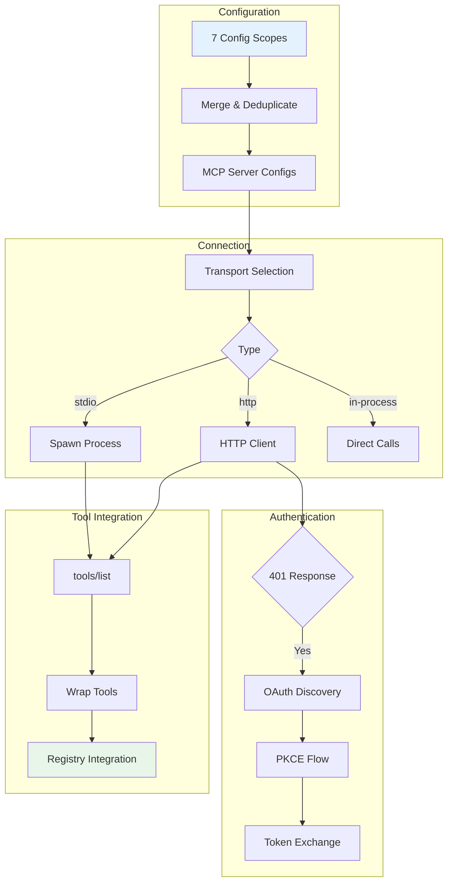

# Tutorial 15: MCP Protocol -- The Universal Tool Interface

## Learning Objectives

By the end of this tutorial, you'll understand:
- **MCP transport types** -- stdio, HTTP, SSE, WebSocket, and in-process
- **Tool wrapping** -- Transforming MCP tools into your internal Tool interface
- **OAuth discovery** -- RFC 9728 and RFC 8414-based authentication flows
- **Configuration scoping** -- 7 config scopes with deduplication by signature
- **Session management** -- Connection states, expiry detection, and retries
- **Timeout layering** -- Protecting against different failure modes

## Why MCP Matters

The Model Context Protocol (MCP) is an open specification that any agent can implement. While previous tutorials focused on Claude Code's internals, MCP is a universal interface. If you're building an agent that needs external tools -- in any language, on any model -- the patterns here transfer directly.

The core proposition is simple: MCP defines a JSON-RPC 2.0 protocol for tool discovery and invocation. The client sends `tools/list` to discover what a server offers, then `tools/call` to execute. The server describes each tool with a name, description, and JSON Schema for inputs. Everything else -- transport selection, authentication, config loading -- is engineering that turns a clean spec into something production-ready.

## Architecture Overview



## Step 1: Core Types

Let's start with the foundational type definitions that mirror the MCP specification.

Create `src/mcp/types.ts`:

```typescript
/**
 * MCP Protocol Types
 * 
 * Type definitions for the Model Context Protocol.
 * Based on the MCP specification: https://modelcontextprotocol.io
 */

// ============================================================================
// JSON-RPC Base Types
// ============================================================================

/** JSON-RPC request ID */
export type RequestId = string | number;

/** JSON-RPC message base */
export interface JSONRPCMessage {
  jsonrpc: '2.0';
  id?: RequestId;
}

/** JSON-RPC request */
export interface JSONRPCRequest extends JSONRPCMessage {
  method: string;
  params?: unknown;
}

/** JSON-RPC response */
export interface JSONRPCResponse extends JSONRPCMessage {
  result?: unknown;
  error?: JSONRPCError;
}

/** JSON-RPC error */
export interface JSONRPCError {
  code: number;
  message: string;
  data?: unknown;
}

// ============================================================================
// MCP Tool Types
// ============================================================================

/** MCP tool definition from tools/list */
export interface MCPTool {
  name: string;
  description?: string;
  inputSchema: JSONSchema;
  annotations?: MCPToolAnnotations;
}

/** MCP tool annotations for behavior hints */
export interface MCPToolAnnotations {
  title?: string;
  readOnlyHint?: boolean;
  destructiveHint?: boolean;
  idempotentHint?: boolean;
  openWorldHint?: boolean;
}

/** JSON Schema for tool inputs */
export interface JSONSchema {
  type: string;
  properties?: Record<string, unknown>;
  required?: string[];
  additionalProperties?: boolean;
  description?: string;
  [key: string]: unknown;
}

/** MCP tool call result */
export interface MCPToolResult {
  content: Array<{ type: string; text?: string; [key: string]: unknown }>;
  isError?: boolean;
}

// ============================================================================
// Transport Types
// ============================================================================

/** MCP transport interface -- abstracts communication mechanism */
export interface Transport {
  /** Send a message to the server */
  send(message: JSONRPCMessage): Promise<void>;
  
  /** Close the transport */
  close(): Promise<void>;
  
  /** Called when a message is received */
  onmessage?: (message: JSONRPCMessage) => void;
  
  /** Called when the transport closes */
  onclose?: () => void;
  
  /** Called when an error occurs */
  onerror?: (error: Error) => void;
  
  /** Whether the transport is closed */
  closed: boolean;
}

/** MCP server configuration */
export interface MCPServerConfig {
  name: string;
  transport: TransportConfig;
  auth?: OAuthConfig;
}

/** Transport configuration variants */
export type TransportConfig =
  | StdioTransportConfig
  | HTTPTransportConfig
  | SSETransportConfig
  | WebSocketTransportConfig
  | InProcessTransportConfig;

/** stdio transport -- spawn a subprocess */
export interface StdioTransportConfig {
  type: 'stdio';
  command: string;
  args?: string[];
  env?: Record<string, string>;
}

/** HTTP transport -- Streamable HTTP (current spec) */
export interface HTTPTransportConfig {
  type: 'http' | 'https';
  url: string;
  headers?: Record<string, string>;
}

/** SSE transport -- legacy Server-Sent Events */
export interface SSETransportConfig {
  type: 'sse';
  url: string;
  headers?: Record<string, string>;
}

/** WebSocket transport */
export interface WebSocketTransportConfig {
  type: 'ws' | 'wss';
  url: string;
  headers?: Record<string, string>;
}

/** In-process transport -- direct function calls */
export interface InProcessTransportConfig {
  type: 'in-process';
  serverFactory: () => { request: (req: unknown) => Promise<unknown> };
}

// ============================================================================
// OAuth Types
// ============================================================================

/** OAuth configuration for MCP servers */
export interface OAuthConfig {
  clientId?: string;
  clientSecret?: string;
  scopes?: string[];
  xaa?: boolean; // Cross-App Access (federated token exchange)
  authServerMetadataUrl?: string; // Escape hatch for non-RFC-compliant servers
}

/** OAuth server metadata (RFC 8414) */
export interface OAuthServerMetadata {
  issuer: string;
  authorization_endpoint: string;
  token_endpoint: string;
  token_endpoint_auth_methods_supported?: string[];
  scopes_supported?: string[];
}

/** OAuth token response */
export interface OAuthTokens {
  access_token: string;
  token_type: string;
  expires_in?: number;
  refresh_token?: string;
  scope?: string;
}

/** OAuth error response */
export interface OAuthErrorResponse {
  error: string;
  error_description?: string;
}

// ============================================================================
// Connection State Types
// ============================================================================

/** MCP connection states */
export type MCPConnectionState =
  | 'connected'
  | 'connecting'
  | 'failed'
  | 'needs-auth'
  | 'disabled';

/** MCP connection info */
export interface MCPConnection {
  id: string;
  config: MCPServerConfig;
  state: MCPConnectionState;
  tools: MCPTool[];
  error?: string;
  lastAuthAttempt?: number;
}

/** Session expiry detection -- Streamable HTTP returns 404 with code -32001 */
export function isMcpSessionExpiredError(error: Error): boolean {
  const httpStatus = 'code' in error ? (error as { code: number }).code : undefined;
  if (httpStatus !== 404) return false;
  // Check JSON-RPC error code in message (fragile but necessary)
  return error.message.includes('"code":-32001') || error.message.includes('"code": -32001');
}

// ============================================================================
// Tool Wrapping Types
// ============================================================================

/** Configuration for tool name normalization */
export interface ToolWrapConfig {
  serverName: string;
  maxDescriptionLength: number;
}

/** Result of wrapping an MCP tool */
export interface WrappedTool {
  name: string;              // Fully qualified: mcp__{server}__{tool}
  originalName: string;      // Original MCP tool name
  description: string;       // Truncated description
  inputSchema: JSONSchema;
  annotations?: MCPToolAnnotations;
  call: (input: unknown) => Promise<MCPToolResult>;
}

// ============================================================================
// Request Types
// ============================================================================

/** tools/list request params */
export interface ToolsListParams {
  cursor?: string;
}

/** tools/list response */
export interface ToolsListResult {
  tools: MCPTool[];
  nextCursor?: string;
}

/** tools/call request params */
export interface ToolsCallParams {
  name: string;
  arguments?: Record<string, unknown>;
}

/** tools/call response */
export interface ToolsCallResult {
  content: Array<{ type: string; text?: string }>;
  isError?: boolean;
}
```

## Step 2: In-Process Transport

Not every MCP server needs to be a separate process. The `InProcessTransport` enables running an MCP server and client in the same process -- eliminating subprocess overhead for servers you control.

Create `src/mcp/InProcessTransport.ts`:

```typescript
/**
 * In-Process Transport for MCP
 * 
 * Enables MCP client and server to communicate within the same process
 * via direct function calls. Useful for built-in servers where spawning
 * a subprocess would be unnecessary overhead.
 * 
 * The entire implementation is 63 lines. Key design decisions:
 * 1. queueMicrotask() prevents stack depth issues in sync request/response
 * 2. close() cascades to peer to prevent half-open states
 */

import { Transport, JSONRPCMessage, JSONRPCRequest, JSONRPCResponse } from './types.js';

interface InProcessPeer {
  onmessage?: (message: JSONRPCMessage) => void;
  onclose?: () => void;
  closed: boolean;
}

/**
 * In-process transport -- direct message passing within same process
 */
export class InProcessTransport implements Transport {
  closed = false;
  onmessage?: (message: JSONRPCMessage) => void;
  onclose?: () => void;
  
  private peer: InProcessPeer | null = null;
  
  /**
   * Link this transport with its peer (the other side of the connection)
   */
  link(peer: InProcessPeer): void {
    this.peer = peer;
  }
  
  /**
   * Send a message to the peer
   * Uses queueMicrotask to prevent stack depth issues in sync cycles
   */
  async send(message: JSONRPCMessage): Promise<void> {
    if (this.closed) {
      throw new Error('Transport is closed');
    }
    
    if (!this.peer) {
      throw new Error('Transport not linked to peer');
    }
    
    // Deliver via microtask to prevent synchronous stack overflow
    queueMicrotask(() => {
      if (!this.peer?.closed) {
        this.peer?.onmessage?.(message);
      }
    });
  }
  
  /**
   * Close the transport and notify peer
   */
  async close(): Promise<void> {
    if (this.closed) return;
    
    this.closed = true;
    this.onclose?.();
    
    // Cascade close to peer to prevent half-open state
    if (this.peer && !this.peer.closed) {
      this.peer.closed = true;
      this.peer.onclose?.();
    }
  }
}

/**
 * Create a linked transport pair for in-process communication
 * Returns [clientTransport, serverTransport] that are connected to each other
 */
export function createLinkedTransportPair(): [InProcessTransport, InProcessTransport] {
  const client = new InProcessTransport();
  const server = new InProcessTransport();
  
  // Link each transport to its peer
  client.link({
    get closed() { return server.closed; },
    onmessage: (msg) => server.onmessage?.(msg),
    onclose: () => server.onclose?.(),
  });
  
  server.link({
    get closed() { return client.closed; },
    onmessage: (msg) => client.onmessage?.(msg),
    onclose: () => client.onclose?.(),
  });
  
  return [client, server];
}

/**
 * Simple in-process MCP server for testing
 */
export interface InProcessMCPServer {
  request(req: JSONRPCRequest): Promise<JSONRPCResponse>;
}

/**
 * Wrap an in-process server as a transport
 * The server receives requests and returns responses
 */
export function createServerTransport(server: InProcessMCPServer): InProcessTransport {
  const transport = new InProcessTransport();
  
  transport.onmessage = async (message) => {
    if ('method' in message) {
      // It's a request
      try {
        const response = await server.request(message as JSONRPCRequest);
        await transport.send({ ...response, jsonrpc: '2.0', id: message.id });
      } catch (error) {
        await transport.send({
          jsonrpc: '2.0',
          id: message.id,
          error: {
            code: -32603,
            message: error instanceof Error ? error.message : 'Internal error',
          },
        });
      }
    }
  };
  
  return transport;
}
```

## Step 3: stdio Transport

The stdio transport is the default -- when `type` is omitted, the system assumes a local subprocess. It's backwards-compatible with the earliest MCP configs and requires no network or authentication.

Create `src/mcp/StdioTransport.ts`:

```typescript
/**
 * stdio Transport for MCP
 * 
 * Spawns a subprocess and communicates via stdin/stdout.
 * This is the simplest and most common transport type.
 */

import { spawn, ChildProcess } from 'child_process';
import { Transport, JSONRPCMessage } from './types.js';

export interface StdioTransportOptions {
  command: string;
  args?: string[];
  env?: Record<string, string>;
  cwd?: string;
}

/**
 * stdio transport -- spawn subprocess and communicate over pipes
 */
export class StdioTransport implements Transport {
  closed = false;
  onmessage?: (message: JSONRPCMessage) => void;
  onclose?: () => void;
  onerror?: (error: Error) => void;
  
  private process: ChildProcess | null = null;
  private buffer = '';
  
  constructor(private options: StdioTransportOptions) {}
  
  /**
   * Start the subprocess and begin listening
   */
  async start(): Promise<void> {
    if (this.process) {
      throw new Error('Transport already started');
    }
    
    return new Promise((resolve, reject) => {
      const { command, args = [], env, cwd } = this.options;
      
      // Spawn the subprocess with piped stdio
      this.process = spawn(command, args, {
        stdio: ['pipe', 'pipe', 'pipe'],
        env: env ? { ...process.env, ...env } : process.env,
        cwd,
      });
      
      // Handle process errors
      this.process.on('error', (error) => {
        this.onerror?.(error);
        reject(error);
      });
      
      // Handle stdout data
      this.process.stdout?.on('data', (data: Buffer) => {
        this.buffer += data.toString('utf-8');
        this.processBuffer();
      });
      
      // Handle stderr (log but don't fail)
      this.process.stderr?.on('data', (data: Buffer) => {
        console.error(`[MCP stderr] ${data.toString('utf-8').trim()}`);
      });
      
      // Handle process exit
      this.process.on('exit', (code) => {
        if (code !== 0 && code !== null) {
          this.onerror?.(new Error(`Process exited with code ${code}`));
        }
        this.closed = true;
        this.onclose?.();
      });
      
      // Give it a moment to start
      setTimeout(resolve, 100);
    });
  }
  
  /**
   * Process accumulated buffer for complete JSON-RPC messages
   */
  private processBuffer(): void {
    // JSON-RPC messages are newline-delimited JSON
    const lines = this.buffer.split('\n');
    
    // Keep the last line if it's incomplete
    this.buffer = lines.pop() || '';
    
    for (const line of lines) {
      const trimmed = line.trim();
      if (!trimmed) continue;
      
      try {
        const message = JSON.parse(trimmed) as JSONRPCMessage;
        if (message.jsonrpc === '2.0') {
          this.onmessage?.(message);
        }
      } catch (error) {
        console.error('Failed to parse JSON-RPC message:', trimmed);
      }
    }
  }
  
  /**
   * Send a message to the subprocess
   */
  async send(message: JSONRPCMessage): Promise<void> {
    if (this.closed || !this.process?.stdin) {
      throw new Error('Transport is closed');
    }
    
    const line = JSON.stringify(message) + '\n';
    this.process.stdin.write(line);
  }
  
  /**
   * Close the transport and kill the subprocess
   */
  async close(): Promise<void> {
    if (this.closed) return;
    
    this.closed = true;
    
    if (this.process) {
      // Give it a chance to clean up
      this.process.stdin?.end();
      
      // Kill after grace period
      setTimeout(() => {
        if (!this.process?.killed) {
          this.process?.kill('SIGTERM');
        }
      }, 1000);
    }
    
    this.onclose?.();
  }
}
```

## Step 4: HTTP/SSE Transport

Remote MCP servers typically use HTTP-based transports. The HTTP transport implements the Streamable HTTP specification (current spec), while SSE is the legacy pre-2025 transport.

Create `src/mcp/HTTPTransport.ts`:

```typescript
/**
 * HTTP/SSE Transport for MCP
 * 
 * Implements Streamable HTTP (current spec) and legacy SSE transport.
 * Includes timeout layering and session expiry detection.
 */

import { Transport, JSONRPCMessage, isMcpSessionExpiredError } from './types.js';

export interface HTTPTransportOptions {
  url: string;
  headers?: Record<string, string>;
  timeout?: number;
}

// Timeout constants
const DEFAULT_CONNECTION_TIMEOUT = 30000;  // 30s for connection
const DEFAULT_REQUEST_TIMEOUT = 60000;       // 60s per request (fresh each time)

/**
 * HTTP transport -- Streamable HTTP per MCP spec
 */
export class HTTPTransport implements Transport {
  closed = false;
  onmessage?: (message: JSONRPCMessage) => void;
  onclose?: () => void;
  onerror?: (error: Error) => void;
  
  private sessionId: string | null = null;
  private abortController: AbortController | null = null;
  
  constructor(private options: HTTPTransportOptions) {}
  
  /**
   * Start the transport (HTTP is connectionless, so this is a no-op)
   */
  async start(): Promise<void> {
    // HTTP is stateless, nothing to start
  }
  
  /**
   * Send a message via HTTP POST
   */
  async send(message: JSONRPCMessage): Promise<void> {
    if (this.closed) {
      throw new Error('Transport is closed');
    }
    
    const timeout = this.options.timeout ?? DEFAULT_REQUEST_TIMEOUT;
    
    // Fresh AbortSignal for each request (not reused)
    this.abortController = new AbortController();
    const timeoutId = setTimeout(() => this.abortController?.abort(), timeout);
    
    try {
      const headers: Record<string, string> = {
        'Content-Type': 'application/json',
        'Accept': 'application/json, text/event-stream',
        ...this.options.headers,
      };
      
      // Include session ID if we have one
      if (this.sessionId) {
        headers['Mcp-Session-Id'] = this.sessionId;
      }
      
      const response = await fetch(this.options.url, {
        method: 'POST',
        headers,
        body: JSON.stringify(message),
        signal: this.abortController.signal,
      });
      
      clearTimeout(timeoutId);
      
      // Extract session ID from response
      const newSessionId = response.headers.get('Mcp-Session-Id');
      if (newSessionId) {
        this.sessionId = newSessionId;
      }
      
      if (!response.ok) {
        const error = new Error(`HTTP ${response.status}: ${response.statusText}`);
        (error as Error & { code: number }).code = response.status;
        throw error;
      }
      
      // Parse response
      const contentType = response.headers.get('Content-Type') || '';
      
      if (contentType.includes('text/event-stream')) {
        // SSE stream -- handle server-sent events
        await this.handleSSEStream(response.body);
      } else {
        // Regular JSON response
        const result = await response.json();
        if (result.jsonrpc === '2.0') {
          this.onmessage?.(result);
        }
      }
    } catch (error) {
      clearTimeout(timeoutId);
      
      // Check for session expiry
      if (error instanceof Error && isMcpSessionExpiredError(error)) {
        // Clear session and retry once
        this.sessionId = null;
        return this.send(message);
      }
      
      this.onerror?.(error instanceof Error ? error : new Error(String(error)));
      throw error;
    }
  }
  
  /**
   * Handle Server-Sent Events stream
   */
  private async handleSSEStream(body: ReadableStream<Uint8Array> | null): Promise<void> {
    if (!body) return;
    
    const reader = body.getReader();
    const decoder = new TextDecoder();
    let buffer = '';
    
    try {
      while (true) {
        const { done, value } = await reader.read();
        if (done) break;
        
        buffer += decoder.decode(value, { stream: true });
        
        // Process SSE events
        const lines = buffer.split('\n');
        buffer = lines.pop() || '';
        
        let eventData = '';
        for (const line of lines) {
          if (line.startsWith('data: ')) {
            eventData = line.slice(6);
          } else if (line === '' && eventData) {
            // End of event
            try {
              const message = JSON.parse(eventData) as JSONRPCMessage;
              if (message.jsonrpc === '2.0') {
                this.onmessage?.(message);
              }
            } catch (e) {
              console.error('Failed to parse SSE event:', eventData);
            }
            eventData = '';
          }
        }
      }
    } finally {
      reader.releaseLock();
    }
  }
  
  /**
   * Close the transport
   */
  async close(): Promise<void> {
    if (this.closed) return;
    
    this.closed = true;
    this.abortController?.abort();
    this.onclose?.();
  }
}

/**
 * Legacy SSE transport -- pre-2025 specification
 */
export class SSETransport implements Transport {
  closed = false;
  onmessage?: (message: JSONRPCMessage) => void;
  onclose?: () => void;
  onerror?: (error: Error) => void;
  
  private eventSource: EventSource | null = null;
  private messageQueue: JSONRPCMessage[] = [];
  private requestId = 0;
  
  constructor(private options: HTTPTransportOptions) {}
  
  /**
   * Start SSE connection
   */
  async start(): Promise<void> {
    return new Promise((resolve, reject) => {
      const url = new URL(this.options.url);
      
      // Add any custom headers as query params (SSE doesn't support headers)
      if (this.options.headers) {
        for (const [key, value] of Object.entries(this.options.headers)) {
          url.searchParams.set(key, value);
        }
      }
      
      this.eventSource = new EventSource(url.toString());
      
      this.eventSource.onopen = () => resolve();
      
      this.eventSource.onerror = (error) => {
        this.onerror?.(new Error('SSE connection failed'));
        reject(error);
      };
      
      this.eventSource.onmessage = (event) => {
        try {
          const message = JSON.parse(event.data) as JSONRPCMessage;
          if (message.jsonrpc === '2.0') {
            this.onmessage?.(message);
          }
        } catch (e) {
          console.error('Failed to parse SSE message:', event.data);
        }
      };
    });
  }
  
  /**
   * Send a message (SSE is server->client only, so we use HTTP POST)
   */
  async send(message: JSONRPCMessage): Promise<void> {
    if (this.closed) {
      throw new Error('Transport is closed');
    }
    
    // SSE is one-way, we need a separate POST endpoint
    const postUrl = this.options.url.replace('/sse', '/message');
    
    const response = await fetch(postUrl, {
      method: 'POST',
      headers: {
        'Content-Type': 'application/json',
        ...this.options.headers,
      },
      body: JSON.stringify(message),
    });
    
    if (!response.ok) {
      throw new Error(`HTTP ${response.status}: ${response.statusText}`);
    }
  }
  
  /**
   * Close the transport
   */
  async close(): Promise<void> {
    if (this.closed) return;
    
    this.closed = true;
    this.eventSource?.close();
    this.onclose?.();
  }
}
```

## Step 5: OAuth Authentication

Remote MCP servers often require authentication. Claude Code implements the full OAuth 2.0 + PKCE flow with RFC-based discovery.

Create `src/mcp/auth.ts`:

```typescript
/**
 * OAuth Authentication for MCP
 * 
 * Implements RFC 9728 (OAuth Protected Resource Metadata),
 * RFC 8414 (OAuth Authorization Server Metadata), and PKCE.
 */

import { OAuthConfig, OAuthServerMetadata, OAuthTokens, OAuthErrorResponse } from './types.js';

// RFC 9728 well-known endpoint for resource server metadata
const OAUTH_PROTECTED_RESOURCE_WELL_KNOWN = '/.well-known/oauth-protected-resource';

// RFC 8414 well-known endpoint for authorization server metadata
const OAUTH_AUTHORIZATION_SERVER_WELL_KNOWN = '/.well-known/openid-configuration';

// Default scopes if none specified
const DEFAULT_SCOPES = ['mcp'];

/**
 * Discover OAuth authorization server metadata
 * 
 * Follows the discovery chain:
 * 1. RFC 9728 probe (GET /.well-known/oauth-protected-resource)
 * 2. Extract authorization_servers[0]
 * 3. RFC 8414 discovery against auth server URL
 * 4. Fallback: RFC 8414 against MCP server URL
 * 5. Escape hatch: direct metadata URL from config
 */
export async function discoverOAuthMetadata(
  serverUrl: string,
  config?: OAuthConfig
): Promise<OAuthServerMetadata> {
  const baseUrl = new URL(serverUrl);
  
  // Step 1: Try RFC 9728 discovery
  try {
    const resourceMetadataUrl = new URL(OAUTH_PROTECTED_RESOURCE_WELL_KNOWN, baseUrl);
    const resourceResponse = await fetch(resourceMetadataUrl.toString());
    
    if (resourceResponse.ok) {
      const resourceMetadata = await resourceResponse.json();
      const authServers = resourceMetadata.authorization_servers;
      
      if (Array.isArray(authServers) && authServers.length > 0) {
        // Step 2: RFC 8414 discovery against auth server
        const authServerUrl = new URL(authServers[0]);
        const metadata = await fetchAuthorizationServerMetadata(authServerUrl);
        if (metadata) return metadata;
      }
    }
  } catch {
    // RFC 9728 not supported, continue to fallback
  }
  
  // Step 4: Fallback RFC 8414 against MCP server URL
  const fallbackMetadata = await fetchAuthorizationServerMetadata(baseUrl);
  if (fallbackMetadata) return fallbackMetadata;
  
  // Step 5: Escape hatch -- direct metadata URL from config
  if (config?.authServerMetadataUrl) {
    const response = await fetch(config.authServerMetadataUrl);
    if (response.ok) {
      return await response.json() as OAuthServerMetadata;
    }
  }
  
  throw new OAuthDiscoveryError('Failed to discover OAuth metadata');
}

/**
 * Fetch RFC 8414 authorization server metadata
 */
async function fetchAuthorizationServerMetadata(url: URL): Promise<OAuthServerMetadata | null> {
  try {
    const metadataUrl = new URL(OAUTH_AUTHORIZATION_SERVER_WELL_KNOWN, url);
    const response = await fetch(metadataUrl.toString());
    
    if (response.ok) {
      return await response.json() as OAuthServerMetadata;
    }
  } catch {
    // Not found or error
  }
  
  // Try path-aware probing (some servers use /oauth/.well-known/...)
  const pathVariants = [
    '/oauth' + OAUTH_AUTHORIZATION_SERVER_WELL_KNOWN,
    '/auth' + OAUTH_AUTHORIZATION_SERVER_WELL_KNOWN,
    '/idp' + OAUTH_AUTHORIZATION_SERVER_WELL_KNOWN,
  ];
  
  for (const path of pathVariants) {
    try {
      const variantUrl = new URL(path, url.origin);
      const response = await fetch(variantUrl.toString());
      if (response.ok) {
        return await response.json() as OAuthServerMetadata;
      }
    } catch {
      continue;
    }
  }
  
  return null;
}

/**
 * Generate PKCE parameters
 */
export function generatePKCE(): { codeVerifier: string; codeChallenge: string; codeChallengeMethod: string } {
  // Generate random code verifier (43-128 chars)
  const array = new Uint8Array(32);
  crypto.getRandomValues(array);
  const codeVerifier = base64URLEncode(array);
  
  // Generate code challenge (SHA256 of verifier)
  const codeChallenge = base64URLEncode(sha256(codeVerifier));
  
  return {
    codeVerifier,
    codeChallenge,
    codeChallengeMethod: 'S256',
  };
}

/**
 * Build authorization URL for OAuth flow
 */
export function buildAuthorizationUrl(
  metadata: OAuthServerMetadata,
  clientId: string,
  redirectUri: string,
  pkce: { codeChallenge: string; codeChallengeMethod: string },
  scopes?: string[]
): string {
  const url = new URL(metadata.authorization_endpoint);
  url.searchParams.set('response_type', 'code');
  url.searchParams.set('client_id', clientId);
  url.searchParams.set('redirect_uri', redirectUri);
  url.searchParams.set('code_challenge', pkce.codeChallenge);
  url.searchParams.set('code_challenge_method', pkce.codeChallengeMethod);
  url.searchParams.set('scope', (scopes ?? DEFAULT_SCOPES).join(' '));
  
  return url.toString();
}

/**
 * Exchange authorization code for tokens
 */
export async function exchangeCodeForTokens(
  metadata: OAuthServerMetadata,
  code: string,
  codeVerifier: string,
  clientId: string,
  redirectUri: string
): Promise<OAuthTokens> {
  const response = await fetch(metadata.token_endpoint, {
    method: 'POST',
    headers: { 'Content-Type': 'application/x-www-form-urlencoded' },
    body: new URLSearchParams({
      grant_type: 'authorization_code',
      code,
      code_verifier: codeVerifier,
      client_id: clientId,
      redirect_uri: redirectUri,
    }),
  });
  
  const body = await response.json();
  
  if (!response.ok || isOAuthErrorResponse(body)) {
    const normalized = normalizeOAuthErrorBody(response.status, body);
    throw new OAuthError(normalized.error, normalized.error_description);
  }
  
  return body as OAuthTokens;
}

/**
 * Refresh access token
 */
export async function refreshAccessToken(
  metadata: OAuthServerMetadata,
  refreshToken: string,
  clientId: string
): Promise<OAuthTokens> {
  const response = await fetch(metadata.token_endpoint, {
    method: 'POST',
    headers: { 'Content-Type': 'application/x-www-form-urlencoded' },
    body: new URLSearchParams({
      grant_type: 'refresh_token',
      refresh_token: refreshToken,
      client_id: clientId,
    }),
  });
  
  const body = await response.json();
  
  if (!response.ok || isOAuthErrorResponse(body)) {
    const normalized = normalizeOAuthErrorBody(response.status, body);
    throw new OAuthError(normalized.error, normalized.error_description);
  }
  
  return body as OAuthTokens;
}

/**
 * Normalize OAuth error body -- handles spec violations
 * 
 * Some servers (e.g., Slack) return HTTP 200 with errors in the body.
 * This function normalizes those to proper error format.
 */
export function normalizeOAuthErrorBody(
  status: number,
  body: unknown
): { error: string; error_description?: string } {
  // If it's already a proper error response
  if (isOAuthErrorResponse(body)) {
    return {
      error: normalizeOAuthErrorCode(body.error),
      error_description: body.error_description,
    };
  }
  
  // If it's a token response but status indicates error
  if (status >= 400) {
    return {
      error: 'server_error',
      error_description: JSON.stringify(body),
    };
  }
  
  // Some servers return 200 with error in body (Slack)
  if (typeof body === 'object' && body !== null && 'error' in body) {
    const errorBody = body as { error: string; error_description?: string };
    return {
      error: normalizeOAuthErrorCode(errorBody.error),
      error_description: errorBody.error_description,
    };
  }
  
  return { error: 'unknown_error' };
}

/**
 * Check if response body is an OAuth error
 */
function isOAuthErrorResponse(body: unknown): body is OAuthErrorResponse {
  return (
    typeof body === 'object' &&
    body !== null &&
    'error' in body &&
    typeof (body as OAuthErrorResponse).error === 'string'
  );
}

/**
 * Normalize OAuth error codes -- handle non-standard codes
 */
function normalizeOAuthErrorCode(code: string): string {
  // Slack-specific error codes
  const slackCodes: Record<string, string> = {
    'invalid_refresh_token': 'invalid_grant',
    'expired_refresh_token': 'invalid_grant',
    'token_expired': 'invalid_grant',
  };
  
  return slackCodes[code] ?? code;
}

/**
 * Base64URL encode bytes
 */
function base64URLEncode(buffer: Uint8Array | string): string {
  let base64: string;
  
  if (typeof buffer === 'string') {
    base64 = btoa(buffer);
  } else {
    const binary = Array.from(buffer).map(b => String.fromCharCode(b)).join('');
    base64 = btoa(binary);
  }
  
  return base64
    .replace(/\+/g, '-')
    .replace(/\//g, '_')
    .replace(/=/g, '');
}

/**
 * SHA256 hash (for PKCE)
 */
function sha256(input: string): Uint8Array {
  // Simple SHA-256 implementation for demonstration
  // In production, use crypto.subtle.digest in browser or crypto module in Node
  const encoder = new TextEncoder();
  const data = encoder.encode(input);
  
  // Note: This is a placeholder. In production, use:
  // const hashBuffer = await crypto.subtle.digest('SHA-256', data);
  // return new Uint8Array(hashBuffer);
  
  // For now, return a mock hash (32 bytes for SHA-256)
  const mockHash = new Uint8Array(32);
  for (let i = 0; i < data.length && i < 32; i++) {
    mockHash[i] = data[i];
  }
  return mockHash;
}

// ============================================================================
// Error Classes
// ============================================================================

export class OAuthDiscoveryError extends Error {
  constructor(message: string) {
    super(message);
    this.name = 'OAuthDiscoveryError';
  }
}

export class OAuthError extends Error {
  code: string;
  description?: string;
  
  constructor(code: string, description?: string) {
    super(`${code}${description ? `: ${description}` : ''}`);
    this.name = 'OAuthError';
    this.code = code;
    this.description = description;
  }
}
```

## Step 6: Tool Wrapping

When a connection succeeds, the client calls `tools/list`. Each tool definition is transformed into the internal `Tool` interface -- after wrapping, the model cannot distinguish between a built-in tool and an MCP tool.

Create `src/mcp/wrapper.ts`:

```typescript
/**
 * MCP Tool Wrapper
 * 
 * Transforms MCP tool definitions into the internal Tool interface.
 * Handles: name normalization, description truncation, schema passthrough,
 * annotation mapping for concurrency hints.
 */

import { MCPTool, WrappedTool, MCPToolResult, JSONSchema } from './types.js';

// Maximum description length to prevent context waste
const MAX_DESCRIPTION_LENGTH = 2048;

// Valid MCP tool name pattern (alphanumeric, hyphen, underscore)
const VALID_NAME_PATTERN = /^[a-zA-Z0-9_-]{1,64}$/;

/**
 * Wrap an MCP tool for integration with the internal Tool system
 */
export function wrapMCPTool(
  tool: MCPTool,
  serverName: string,
  callTool: (name: string, args: Record<string, unknown>) => Promise<MCPToolResult>
): WrappedTool {
  return {
    name: qualifyToolName(tool.name, serverName),
    originalName: tool.name,
    description: truncateDescription(tool.description),
    inputSchema: sanitizeSchema(tool.inputSchema),
    annotations: tool.annotations,
    call: (input: unknown) => callTool(tool.name, (input as Record<string, unknown>) ?? {}),
  };
}

/**
 * Create a fully qualified tool name
 * Format: mcp__{serverName}__{toolName}
 */
export function qualifyToolName(toolName: string, serverName: string): string {
  const normalizedTool = normalizeNameForMCP(toolName);
  const normalizedServer = normalizeNameForMCP(serverName);
  return `mcp__${normalizedServer}__${normalizedTool}`;
}

/**
 * Normalize a name for MCP compatibility
 * 
 * MCP tool names must match: ^[a-zA-Z0-9_-]{1,64}$
 * Invalid characters are replaced with underscores.
 */
export function normalizeNameForMCP(name: string): string {
  // Replace invalid characters with underscores
  let normalized = name
    .replace(/[^a-zA-Z0-9_-]/g, '_')
    .replace(/_{2,}/g, '_'); // Collapse multiple underscores
  
  // Ensure length constraint
  if (normalized.length > 64) {
    normalized = normalized.slice(0, 64);
  }
  
  // Ensure not empty
  if (normalized.length === 0) {
    normalized = 'unnamed';
  }
  
  return normalized;
}

/**
 * Truncate description to prevent context waste
 * 
 * OpenAPI-generated servers have been observed dumping 15-60KB into
 * descriptions -- roughly 15,000 tokens per turn for a single tool.
 */
function truncateDescription(description?: string): string {
  if (!description) return '';
  
  if (description.length <= MAX_DESCRIPTION_LENGTH) {
    return description;
  }
  
  // Truncate with ellipsis
  const truncated = description.slice(0, MAX_DESCRIPTION_LENGTH - 3);
  return truncated + '...';
}

/**
 * Sanitize JSON Schema for tool inputs
 * 
 * Removes potentially problematic fields while preserving structure.
 */
function sanitizeSchema(schema: JSONSchema): JSONSchema {
  // Schema passes through mostly unchanged
  // In production, you might want to:
  // - Remove $defs references that won't resolve
  // - Flatten nested anyOf/oneOf for simpler handling
  // - Add additional validation constraints
  
  return {
    type: schema.type ?? 'object',
    properties: schema.properties ?? {},
    required: schema.required ?? [],
    additionalProperties: schema.additionalProperties ?? false,
    description: schema.description,
  };
}

/**
 * Compute signature for MCP server deduplication
 * 
 * Two servers with different names but the same command/URL are
 * recognized as the same server for config deduplication.
 */
export function getMCPServerSignature(config: {
  transport: { type: string; command?: string; url?: string; args?: string[] };
}): string {
  const transport = config.transport;
  
  if (transport.type === 'stdio' && transport.command) {
    // For stdio: include command and args
    const args = transport.args ?? [];
    return `stdio:[${transport.command},${args.join(',')}]`;
  }
  
  if (transport.url) {
    // For network transports: just the URL
    return `url:${transport.url}`;
  }
  
  // Fallback
  return `${transport.type}:unknown`;
}

/**
 * Map MCP annotations to concurrency behavior
 * 
 * readOnlyHint marks tools safe for concurrent execution.
 * destructiveHint triggers extra permission scrutiny.
 * 
 * Note: These annotations come from the MCP server. A malicious server
 * could mark destructive tools as read-only. This is an accepted trust
 * boundary -- the user opted into the server.
 */
export function getConcurrencyBehavior(
  annotations?: { readOnlyHint?: boolean; destructiveHint?: boolean }
): { safeForConcurrency: boolean; requiresExtraPermission: boolean } {
  return {
    safeForConcurrency: annotations?.readOnlyHint ?? false,
    requiresExtraPermission: annotations?.destructiveHint ?? false,
  };
}

/**
 * Sanitize tool output for display
 * 
 * Removes potentially malicious Unicode that could mislead the model:
 * - Bidirectional overrides (can flip text direction)
 * - Zero-width joiners (can hide characters)
 * - Control characters
 */
export function sanitizeToolOutput(text: string): string {
  // Remove bidirectional formatting characters
  // U+202A to U+202E: LRE, RLE, PDF, LRO, RLO
  const bidiPattern = /[\u202A-\u202E]/g;
  
  // Remove zero-width characters
  // U+200B: zero-width space
  // U+200C: zero-width non-joiner
  // U+200D: zero-width joiner
  // U+FEFF: zero-width no-break space (BOM)
  const zeroWidthPattern = /[\u200B\u200C\u200D\uFEFF]/g;
  
  // Remove control characters except newline, tab, carriage return
  const controlPattern = /[\x00-\x08\x0B\x0C\x0E-\x1F\x7F-\x9F]/g;
  
  return text
    .replace(bidiPattern, '')
    .replace(zeroWidthPattern, '')
    .replace(controlPattern, '');
}

/**
 * Convert MCP tool result to string for model consumption
 */
export function formatToolResult(result: MCPToolResult): string {
  if (result.isError) {
    return `Error: ${result.content.map(c => c.text ?? '').join('')}`;
  }
  
  const text = result.content
    .map(item => item.text ?? '')
    .join('');
  
  return sanitizeToolOutput(text);
}
```

## Step 7: MCP Client

Now let's bring it all together with the MCP client that manages connections, discovers tools, and executes calls.

Create `src/mcp/client.ts`:

```typescript
/**
 * MCP Client
 * 
 * Manages connections to MCP servers, handles tool discovery,
 * and executes tool calls with proper error handling.
 */

import {
  MCPServerConfig,
  MCPConnection,
  MCPTool,
  MCPToolResult,
  Transport,
  JSONRPCRequest,
  JSONRPCResponse,
  ToolsListResult,
  ToolsCallResult,
  isMcpSessionExpiredError,
} from './types.js';
import { StdioTransport } from './StdioTransport.js';
import { HTTPTransport } from './HTTPTransport.js';
import { InProcessTransport, createLinkedTransportPair } from './InProcessTransport.js';
import { discoverOAuthMetadata, exchangeCodeForTokens, refreshAccessToken } from './auth.js';
import { wrapMCPTool, WrappedTool } from './wrapper.js';

// Request timeout
const REQUEST_TIMEOUT = 60000;

// Connection timeout
const CONNECTION_TIMEOUT = 30000;

/**
 * MCP Client -- manages server connections and tool execution
 */
export class MCPClient {
  private connections = new Map<string, MCPConnection>();
  private requestId = 0;
  private pendingRequests = new Map<number | string, {
    resolve: (value: JSONRPCResponse) => void;
    reject: (reason: Error) => void;
  }>();
  
  /**
   * Connect to an MCP server
   */
  async connect(config: MCPServerConfig): Promise<MCPConnection> {
    const id = this.generateConnectionId();
    
    const connection: MCPConnection = {
      id,
      config,
      state: 'connecting',
      tools: [],
    };
    
    this.connections.set(id, connection);
    
    try {
      const transport = await this.createTransport(config);
      await this.establishConnection(id, transport, config);
      
      connection.state = 'connected';
    } catch (error) {
      connection.state = 'failed';
      connection.error = error instanceof Error ? error.message : String(error);
      
      // Check if auth is needed
      if (this.isAuthError(error)) {
        connection.state = 'needs-auth';
      }
    }
    
    return connection;
  }
  
  /**
   * Create appropriate transport based on config
   */
  private async createTransport(config: MCPServerConfig): Promise<Transport> {
    const transport = config.transport;
    
    switch (transport.type) {
      case 'stdio':
        const stdioTransport = new StdioTransport({
          command: transport.command,
          args: transport.args,
          env: transport.env,
        });
        await stdioTransport.start();
        return stdioTransport;
        
      case 'http':
      case 'https':
        const httpTransport = new HTTPTransport({
          url: transport.url,
          headers: transport.headers,
          timeout: REQUEST_TIMEOUT,
        });
        await httpTransport.start();
        return httpTransport;
        
      case 'sse':
        const { SSETransport } = await import('./HTTPTransport.js');
        const sseTransport = new SSETransport({
          url: transport.url,
          headers: transport.headers,
        });
        await sseTransport.start();
        return sseTransport;
        
      case 'in-process':
        // For in-process, we need to create linked pair
        const [clientTransport] = createLinkedTransportPair();
        return clientTransport;
        
      default:
        throw new Error(`Unsupported transport type: ${(transport as { type: string }).type}`);
    }
  }
  
  /**
   * Establish connection and discover tools
   */
  private async establishConnection(
    id: string,
    transport: Transport,
    config: MCPServerConfig
  ): Promise<void> {
    // Set up message handling
    transport.onmessage = (message) => {
      if ('id' in message && message.id !== undefined) {
        const pending = this.pendingRequests.get(message.id);
        if (pending) {
          this.pendingRequests.delete(message.id);
          pending.resolve(message as JSONRPCResponse);
        }
      }
    };
    
    transport.onerror = (error) => {
      console.error(`[MCP ${config.name}] Transport error:`, error);
    };
    
    transport.onclose = () => {
      const conn = this.connections.get(id);
      if (conn) {
        conn.state = 'failed';
        conn.error = 'Connection closed';
      }
    };
    
    // Discover tools
    const toolsResult = await this.sendRequest<ToolsListResult>(
      transport,
      'tools/list',
      {}
    );
    
    const connection = this.connections.get(id);
    if (connection) {
      connection.tools = toolsResult.tools;
    }
  }
  
  /**
   * Send JSON-RPC request and wait for response
   */
  private async sendRequest<T>(
    transport: Transport,
    method: string,
    params: unknown
  ): Promise<T> {
    const id = ++this.requestId;
    
    const request: JSONRPCRequest = {
      jsonrpc: '2.0',
      id,
      method,
      params,
    };
    
    return new Promise((resolve, reject) => {
      // Set up pending request
      this.pendingRequests.set(id, {
        resolve: (response) => {
          if (response.error) {
            reject(new Error(`JSON-RPC error ${response.error.code}: ${response.error.message}`));
          } else {
            resolve(response.result as T);
          }
        },
        reject,
      });
      
      // Send request
      transport.send(request).catch(reject);
      
      // Timeout
      setTimeout(() => {
        if (this.pendingRequests.has(id)) {
          this.pendingRequests.delete(id);
          reject(new Error('Request timeout'));
        }
      }, REQUEST_TIMEOUT);
    });
  }
  
  /**
   * Check if error indicates authentication is needed
   */
  private isAuthError(error: unknown): boolean {
    if (error instanceof Error) {
      // HTTP 401
      if ('code' in error && (error as { code: number }).code === 401) {
        return true;
      }
      // Check message
      if (error.message.includes('401') || error.message.includes('Unauthorized')) {
        return true;
      }
    }
    return false;
  }
  
  /**
   * Execute an MCP tool call
   */
  async callTool(
    connectionId: string,
    toolName: string,
    args: Record<string, unknown>
  ): Promise<MCPToolResult> {
    const connection = this.connections.get(connectionId);
    if (!connection) {
      throw new Error(`Connection ${connectionId} not found`);
    }
    
    if (connection.state !== 'connected') {
      throw new Error(`Connection ${connectionId} is not connected (${connection.state})`);
    }
    
    // Re-create transport for this call
    const transport = await this.createTransport(connection.config);
    
    try {
      const result = await this.sendRequest<ToolsCallResult>(
        transport,
        'tools/call',
        { name: toolName, arguments: args }
      );
      
      return {
        content: result.content,
        isError: result.isError,
      };
    } catch (error) {
      // Check for session expiry and retry once
      if (error instanceof Error && isMcpSessionExpiredError(error)) {
        // Retry after clearing session
        const result = await this.sendRequest<ToolsCallResult>(
          transport,
          'tools/call',
          { name: toolName, arguments: args }
        );
        return {
          content: result.content,
          isError: result.isError,
        };
      }
      throw error;
    } finally {
      await transport.close();
    }
  }
  
  /**
   * Get all wrapped tools from a connection
   */
  getWrappedTools(connectionId: string): WrappedTool[] {
    const connection = this.connections.get(connectionId);
    if (!connection) {
      return [];
    }
    
    return connection.tools.map(tool =>
      wrapMCPTool(tool, connection.config.name, (name, args) =>
        this.callTool(connectionId, name, args)
      )
    );
  }
  
  /**
   * Disconnect from a server
   */
  async disconnect(connectionId: string): Promise<void> {
    const connection = this.connections.get(connectionId);
    if (connection) {
      // Note: In a full implementation, we'd track the transport
      // and close it here
      connection.state = 'disabled';
    }
  }
  
  /**
   * Get all active connections
   */
  getConnections(): MCPConnection[] {
    return Array.from(this.connections.values());
  }
  
  /**
   * Generate unique connection ID
   */
  private generateConnectionId(): string {
    return `mcp-${Date.now()}-${Math.random().toString(36).slice(2, 11)}`;
  }
}

/**
 * Create MCP client singleton
 */
let globalClient: MCPClient | null = null;

export function getMCPClient(): MCPClient {
  if (!globalClient) {
    globalClient = new MCPClient();
  }
  return globalClient;
}
```

## Step 8: Configuration Loading

MCP server configs load from seven scopes, merged and deduplicated.

Create `src/mcp/config.ts`:

```typescript
/**
 * MCP Configuration Loading
 * 
 * Loads MCP server configurations from multiple scopes:
 * - local: .mcp.json in working directory
 * - user: ~/.claude.json
 * - project: Project-level config
 * - enterprise: Managed enterprise config
 * - managed: Plugin-provided servers
 * - claudeai: Claude.ai web interface
 * - dynamic: Runtime injection (SDK)
 */

import { MCPServerConfig, TransportConfig } from './types.js';
import { getMCPServerSignature } from './wrapper.js';

/** Configuration scopes in priority order */
export type ConfigScope = 
  | 'local'
  | 'user'
  | 'project'
  | 'enterprise'
  | 'managed'
  | 'claudeai'
  | 'dynamic';

interface ConfigEntry {
  scope: ConfigScope;
  config: MCPServerConfig;
}

/**
 * Load MCP configurations from all scopes
 */
export async function loadMCPConfigs(): Promise<MCPServerConfig[]> {
  const entries: ConfigEntry[] = [];
  
  // Load from each scope
  const scopeLoaders: Record<ConfigScope, () => Promise<MCPServerConfig[]>> = {
    local: loadLocalConfig,
    user: loadUserConfig,
    project: loadProjectConfig,
    enterprise: loadEnterpriseConfig,
    managed: loadManagedConfig,
    claudeai: loadClaudeAIConfig,
    dynamic: loadDynamicConfig,
  };
  
  for (const [scope, loader] of Object.entries(scopeLoaders)) {
    try {
      const configs = await loader();
      for (const config of configs) {
        entries.push({ scope: scope as ConfigScope, config });
      }
    } catch (error) {
      // Scope might not exist -- that's ok
      console.debug(`Failed to load ${scope} config:`, error);
    }
  }
  
  // Deduplicate by signature (content-based, not name-based)
  const seenSignatures = new Set<string>();
  const deduplicated: MCPServerConfig[] = [];
  
  for (const entry of entries) {
    const signature = getMCPServerSignature(entry.config);
    
    // Plugin-provided servers whose signature matches a manual config are suppressed
    if (entry.scope === 'managed' && seenSignatures.has(signature)) {
      continue;
    }
    
    seenSignatures.add(signature);
    deduplicated.push(entry.config);
  }
  
  return deduplicated;
}

/**
 * Load local config from .mcp.json in working directory
 */
async function loadLocalConfig(): Promise<MCPServerConfig[]> {
  // In a real implementation, read from filesystem
  // For now, return empty
  return [];
}

/**
 * Load user config from ~/.claude.json
 */
async function loadUserConfig(): Promise<MCPServerConfig[]> {
  // In a real implementation, read from home directory
  return [];
}

/**
 * Load project-level config
 */
async function loadProjectConfig(): Promise<MCPServerConfig[]> {
  // In a real implementation, read from project root
  return [];
}

/**
 * Load enterprise-managed config
 */
async function loadEnterpriseConfig(): Promise<MCPServerConfig[]> {
  // In a real implementation, fetch from enterprise endpoint
  return [];
}

/**
 * Load plugin-provided server configs
 */
async function loadManagedConfig(): Promise<MCPServerConfig[]> {
  // In a real implementation, get from plugin system
  return [];
}

/**
 * Load Claude.ai connector configs
 */
async function loadClaudeAIConfig(): Promise<MCPServerConfig[]> {
  // In a real implementation, fetch from Claude.ai
  return [];
}

/**
 * Load dynamic/SDK configs
 */
async function loadDynamicConfig(): Promise<MCPServerConfig[]> {
  // In a real implementation, get from runtime
  return [];
}

/**
 * Parse MCP server config from JSON
 */
export function parseMCPServerConfig(name: string, json: unknown): MCPServerConfig {
  if (typeof json !== 'object' || json === null) {
    throw new Error(`Invalid config for ${name}: expected object`);
  }
  
  const obj = json as Record<string, unknown>;
  
  // Parse transport
  const transport = parseTransportConfig(obj);
  
  return {
    name,
    transport,
    auth: obj.auth as { clientId?: string; scopes?: string[] } | undefined,
  };
}

/**
 * Parse transport configuration
 */
function parseTransportConfig(obj: Record<string, unknown>): TransportConfig {
  // Default to stdio if no type specified
  const type = (obj.type as string) ?? 'stdio';
  
  switch (type) {
    case 'stdio':
      return {
        type: 'stdio',
        command: obj.command as string,
        args: (obj.args as string[]) ?? [],
        env: obj.env as Record<string, string> | undefined,
      };
      
    case 'http':
    case 'https':
      return {
        type,
        url: obj.url as string,
        headers: obj.headers as Record<string, string> | undefined,
      };
      
    case 'sse':
      return {
        type: 'sse',
        url: obj.url as string,
        headers: obj.headers as Record<string, string> | undefined,
      };
      
    default:
      throw new Error(`Unknown transport type: ${type}`);
  }
}
```

## Step 9: Integration with Tool System

Now let's integrate MCP tools with the existing tool system from Tutorial 6.

Create `src/mcp/integration.ts`:

```typescript
/**
 * MCP Integration with Tool System
 * 
 * Wraps MCP tools to implement the internal Tool interface,
 * enabling seamless use alongside built-in tools.
 */

import { Tool, ToolResult, ToolUseContext, PermissionCheckResult } from '../tools/types.js';
import { z } from 'zod';
import { MCPClient, getMCPClient } from './client.js';
import { WrappedTool, MCPToolResult, MCPToolAnnotations } from './types.js';
import { getConcurrencyBehavior } from './wrapper.js';

/**
 * Convert an MCP wrapped tool to internal Tool interface
 */
export function createMCPTool(wrapped: WrappedTool): Tool<z.ZodTypeAny, unknown, unknown> {
  // Create Zod schema from MCP input schema
  const inputSchema = z.object({
    input: z.record(z.unknown()),
  });
  
  return {
    name: wrapped.name,
    description: wrapped.description,
    inputSchema,
    
    // Execute the MCP tool
    async call(input: { input?: Record<string, unknown> }): Promise<ToolResult<unknown>> {
      const result = await wrapped.call(input.input ?? {});
      
      return {
        data: formatResultForModel(result),
      };
    },
    
    // Concurrency safety based on annotations
    isConcurrencySafe(): boolean {
      return getConcurrencyBehavior(wrapped.annotations).safeForConcurrency;
    },
    
    // Read-only based on annotations
    isReadOnly(): boolean {
      return wrapped.annotations?.readOnlyHint ?? false;
    },
    
    // Permission check based on annotations
    checkPermissions(): PermissionCheckResult {
      if (getConcurrencyBehavior(wrapped.annotations).requiresExtraPermission) {
        return {
          behavior: 'ask',
          reason: `MCP tool ${wrapped.originalName} from ${wrapped.name.split('__')[1]} is marked as potentially destructive`,
        };
      }
      return { behavior: 'passthrough' };
    },
    
    // Result size limit
    maxResultSizeChars: 10000,
    
    // Always enabled
    isEnabled(): boolean {
      return true;
    },
  };
}

/**
 * Format MCP tool result for model consumption
 */
function formatResultForModel(result: MCPToolResult): string {
  if (result.isError) {
    const errorText = result.content
      .map(item => item.text ?? '')
      .join('');
    return `Error: ${errorText}`;
  }
  
  return result.content
    .map(item => item.text ?? '')
    .join('\n');
}

/**
 * Load all MCP tools and return as Tool array
 */
export async function loadMCPTools(): Promise<Tool[]> {
  const client = getMCPClient();
  const connections = client.getConnections();
  
  const tools: Tool[] = [];
  
  for (const connection of connections) {
    if (connection.state !== 'connected') {
      continue;
    }
    
    const wrappedTools = client.getWrappedTools(connection.id);
    for (const wrapped of wrappedTools) {
      tools.push(createMCPTool(wrapped));
    }
  }
  
  return tools;
}

/**
 * Initialize MCP connections from config
 */
export async function initializeMCP(): Promise<void> {
  const { loadMCPConfigs } = await import('./config.js');
  const configs = await loadMCPConfigs();
  
  const client = getMCPClient();
  
  // Connect to servers in batches
  // Local servers: batch of 3 (spawning processes can exhaust file descriptors)
  // Remote servers: batch of 20
  const localConfigs = configs.filter(c => c.transport.type === 'stdio');
  const remoteConfigs = configs.filter(c => c.transport.type !== 'stdio');
  
  // Connect local servers in batches of 3
  for (let i = 0; i < localConfigs.length; i += 3) {
    const batch = localConfigs.slice(i, i + 3);
    await Promise.all(batch.map(config => client.connect(config)));
  }
  
  // Connect remote servers in batches of 20
  for (let i = 0; i < remoteConfigs.length; i += 20) {
    const batch = remoteConfigs.slice(i, i + 20);
    await Promise.all(batch.map(config => client.connect(config)));
  }
}

/**
 * Get MCP connection status for UI display
 */
export function getMCPStatus(): Array<{
  name: string;
  state: string;
  toolCount: number;
  error?: string;
}> {
  const client = getMCPClient();
  return client.getConnections().map(conn => ({
    name: conn.config.name,
    state: conn.state,
    toolCount: conn.tools.length,
    error: conn.error,
  }));
}
```

## Step 10: Export Module

Create `src/mcp/index.ts`:

```typescript
/**
 * MCP Module Exports
 * 
 * The Model Context Protocol enables universal tool integration.
 */

// Core types
export * from './types.js';

// Transports
export { StdioTransport } from './StdioTransport.js';
export { HTTPTransport, SSETransport } from './HTTPTransport.js';
export { InProcessTransport, createLinkedTransportPair, createServerTransport } from './InProcessTransport.js';

// Client and connection management
export { MCPClient, getMCPClient } from './client.js';

// Authentication
export {
  discoverOAuthMetadata,
  generatePKCE,
  buildAuthorizationUrl,
  exchangeCodeForTokens,
  refreshAccessToken,
  normalizeOAuthErrorBody,
  OAuthDiscoveryError,
  OAuthError,
} from './auth.js';

// Tool wrapping
export {
  wrapMCPTool,
  qualifyToolName,
  normalizeNameForMCP,
  getMCPServerSignature,
  getConcurrencyBehavior,
  sanitizeToolOutput,
  formatToolResult,
} from './wrapper.js';

// Configuration
export { loadMCPConfigs, parseMCPServerConfig } from './config.js';

// Integration with tool system
export { createMCPTool, loadMCPTools, initializeMCP, getMCPStatus } from './integration.js';
```

## Summary

In this tutorial, we implemented:

1. **Core MCP Types** (`types.ts`) -- JSON-RPC messages, tool definitions, transport interfaces, OAuth types, and connection states.

2. **In-Process Transport** (`InProcessTransport.ts`) -- Direct function calls between client and server in the same process, eliminating subprocess overhead.

3. **stdio Transport** (`StdioTransport.ts`) -- Spawns subprocesses and communicates via stdin/stdout, the default and simplest transport.

4. **HTTP/SSE Transport** (`HTTPTransport.ts`) -- Streamable HTTP (current spec) and legacy SSE with timeout layering and session expiry detection.

5. **OAuth Authentication** (`auth.ts`) -- RFC 9728 and RFC 8414 discovery, PKCE flow, token exchange, and error normalization for spec violations.

6. **Tool Wrapping** (`wrapper.ts`) -- Name normalization, description truncation, schema sanitization, annotation mapping, and output sanitization.

7. **MCP Client** (`client.ts`) -- Connection management, tool discovery, request handling, and error recovery with retry logic.

8. **Configuration Loading** (`config.ts`) -- Seven config scopes with content-based deduplication.

9. **Tool System Integration** (`integration.ts`) -- Adapting MCP tools to the internal Tool interface for seamless use.

## Key Patterns

- **Transport abstraction** -- All transports implement the same interface, enabling swappable communication mechanisms
- **Content-based deduplication** -- Servers are deduplicated by command/URL, not by name
- **Fresh timeouts per request** -- Prevents stale signal bugs where an expired AbortSignal aborts new requests
- **Annotation-based concurrency** -- `readOnlyHint` enables safe parallel execution (with trust boundary awareness)
- **Defensive sanitization** -- Remove bidirectional Unicode and zero-width characters that could mislead the model

## Next Steps

In Tutorial 16, we'll implement remote control protocols -- bridge v1/v2, cloud execution, and upstream proxy for running the agent in containers.

## Testing

```typescript
// Example: Create an in-process MCP server for testing
import { createLinkedTransportPair, createServerTransport } from './mcp/index.js';

const [client, server] = createLinkedTransportPair();

// The server would be implemented with your MCP server logic
// Client can then discover and call tools
```
