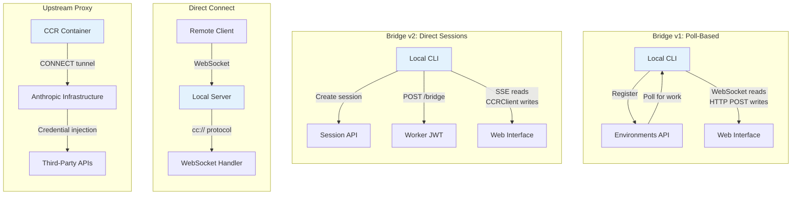

# Tutorial 16: Remote Control and Cloud Execution

## Learning Objectives

By the end of this tutorial, you'll understand:
- **Bridge v1 architecture** -- Poll-based remote control via Environments API
- **Bridge v2 architecture** -- Direct sessions with SSE and CCRClient
- **Asymmetric transport design** -- Persistent reads via WebSocket/SSE, writes via HTTP POST
- **Message routing** -- Echo deduplication, UUID tracking, bounded memory structures
- **Direct Connect** -- Local WebSocket server for browser-based control
- **Upstream proxy** -- Secure credential injection in containerized environments
- **Reconnection strategies** -- Proportional backoff based on failure signals

## Why Remote Control Matters

Every tutorial so far has assumed Claude Code runs on the same machine where the code lives. The terminal is local. The filesystem is local. The model responses stream back to a process that owns both the keyboard and the working directory.

That assumption breaks the moment you want to:
- **Control Claude Code from a browser** -- Web interface on localhost:3000
- **Run in cloud containers** -- Agent executes in Docker/Kubernetes
- **Expose as a service** -- Team members connect to a shared agent
- **Automate CI/CD pipelines** -- Agent runs in ephemeral build environments

The agent needs a way to receive instructions from remote clients, forward permission prompts to users who aren't at the terminal, and tunnel API traffic through infrastructure that might inject credentials or terminate TLS.

## Architecture Overview



## Step 1: Core Types

Let's start with the foundational types for remote control protocols.

Create `src/remote/types.ts`:

```typescript
/**
 * Remote Control Types
 * 
 * Type definitions for bridge protocols, Direct Connect,
 * and upstream proxy systems.
 */

// ============================================================================
// Bridge Common Types
// ============================================================================

/** Bridge protocol version */
export type BridgeVersion = 'v1' | 'v2';

/** Bridge connection states */
export type BridgeState = 
  | 'connecting'
  | 'connected'
  | 'reconnecting'
  | 'failed'
  | 'closed';

/** Bridge transport interface -- unifies v1 and v2 */
export interface BridgeTransport {
  /** Send a message to the bridge */
  send(message: BridgeMessage): Promise<void>;
  
  /** Close the transport */
  close(): Promise<void>;
  
  /** Current state */
  state: BridgeState;
  
  /** Called when message received */
  onMessage?: (message: BridgeMessage) => void;
  
  /** Called when state changes */
  onStateChange?: (state: BridgeState) => void;
}

/** Bridge message types */
export type BridgeMessage =
  | UserMessage
  | ControlRequest
  | ControlResponse
  | SessionMessage
  | HealthCheck;

/** User message from web interface */
export interface UserMessage {
  type: 'user_message';
  uuid: string;
  content: string;
  timestamp: number;
}

/** Control request (permission prompt) */
export interface ControlRequest {
  type: 'control_request';
  uuid: string;
  requestType: string;
  data: unknown;
}

/** Control response (permission decision) */
export interface ControlResponse {
  type: 'control_response';
  uuid: string;
  approved: boolean;
  reason?: string;
}

/** Session-level message */
export interface SessionMessage {
  type: 'session';
  action: 'created' | 'closed' | 'error';
  sessionId: string;
  data?: unknown;
}

/** Health check ping/pong */
export interface HealthCheck {
  type: 'healthcheck';
  timestamp: number;
}

// ============================================================================
// Bridge v1: Environments API
// ============================================================================

/** v1 bridge registration */
export interface BridgeV1Registration {
  environmentId: string;
  machineId: string;
  capabilities: string[];
  oauthToken: string;
}

/** v1 work item from polling */
export interface BridgeV1WorkItem {
  type: 'session' | 'healthcheck';
  session?: BridgeV1Session;
}

/** v1 session data */
export interface BridgeV1Session {
  id: string;
  secret: {
    sessionToken: string;
    apiBaseUrl: string;
    mcpConfigs: MCPServerConfig[];
    env: Record<string, string>;
  };
}

/** MCP server config (subset) */
export interface MCPServerConfig {
  name: string;
  command?: string;
  url?: string;
}

// ============================================================================
// Bridge v2: Direct Sessions
// ============================================================================

/** v2 session creation response */
export interface BridgeV2Session {
  id: string;
  workerEpoch: number;
}

/** v2 bridge connection response */
export interface BridgeV2Connection {
  workerJwt: string;
  apiBaseUrl: string;
  workerEpoch: number;
}

/** CCR (Claude Code Remote) message */
export interface CCRMessage {
  type: string;
  uuid?: string;
  payload?: unknown;
}

/** SSE (Server-Sent Events) event */
export interface SSEEvent {
  id?: string;
  event?: string;
  data: string;
}

// ============================================================================
// Direct Connect
// ============================================================================

/** Direct Connect session states */
export type DirectSessionState = 
  | 'starting'
  | 'running'
  | 'detached'
  | 'stopping'
  | 'stopped';

/** Direct Connect session */
export interface DirectSession {
  id: string;
  state: DirectSessionState;
  metadata: SessionMetadata;
  websocket?: WebSocket;
}

/** Session metadata for persistence */
export interface SessionMetadata {
  createdAt: number;
  lastActivity: number;
  workingDirectory: string;
}

/** cc:// URL parsed structure */
export interface CCURL {
  protocol: 'cc:';
  hostname: string;
  port?: number;
  sessionId?: string;
  token?: string;
}

// ============================================================================
// Upstream Proxy
// ============================================================================

/** Upstream proxy configuration */
export interface UpstreamProxyConfig {
  sessionTokenPath: string;
  caCertPath: string;
  upstreamUrl: string;
}

/** Upstream proxy state */
export interface UpstreamProxyState {
  enabled: boolean;
  localPort: number;
  connected: boolean;
  lastError?: string;
}

/** Protobuf chunk for tunnel (hand-encoded) */
export interface ProxyChunk {
  data: Uint8Array;
}

// ============================================================================
// Reconnection Strategy
// ============================================================================

/** Reconfiguration strategy for different failure types */
export interface ReconnectionStrategy {
  /** Max retry attempts */
  maxRetries: number;
  /** Initial delay in ms */
  initialDelay: number;
  /** Max delay in ms */
  maxDelay: number;
  /** Backoff multiplier */
  multiplier: number;
  /** Strategy type */
  type: 'exponential' | 'linear' | 'none';
}

/** WebSocket close codes */
export enum WebSocketCloseCode {
  NORMAL = 1000,
  GOING_AWAY = 1001,
  PROTOCOL_ERROR = 1002,
  UNSUPPORTED_DATA = 1003,
  NO_STATUS = 1005,
  ABNORMAL = 1006,
  INVALID_FRAME = 1007,
  POLICY_VIOLATION = 1008,
  MESSAGE_TOO_BIG = 1009,
  EXTENSION_REQUIRED = 1010,
  INTERNAL_ERROR = 1011,
  SERVICE_RESTART = 1012,
  TRY_AGAIN_LATER = 1013,
  BAD_GATEWAY = 1014,
  TLS_HANDSHAKE = 1015,
  // Application codes
  UNAUTHORIZED = 4003,
  SESSION_NOT_FOUND = 4001,
  RATE_LIMITED = 4004,
}

/** Get reconnection strategy for close code */
export function getReconnectionStrategy(
  code: number,
  attemptCount: number
): ReconnectionStrategy {
  // Permanent failures -- don't retry
  if (code === WebSocketCloseCode.UNAUTHORIZED) {
    return { maxRetries: 0, initialDelay: 0, maxDelay: 0, multiplier: 1, type: 'none' };
  }
  
  // Session not found -- transient, 3 retries with linear backoff
  if (code === WebSocketCloseCode.SESSION_NOT_FOUND) {
    return {
      maxRetries: 3,
      initialDelay: 1000,
      maxDelay: 5000,
      multiplier: 1,
      type: 'linear',
    };
  }
  
  // Other transient failures -- exponential backoff
  return {
    maxRetries: 5,
    initialDelay: 1000,
    maxDelay: 30000,
    multiplier: 2,
    type: 'exponential',
  };
}

// ============================================================================
// Utility Types
// ============================================================================

/** Bounded UUID set for deduplication */
export interface BoundedUUIDSetOptions {
  capacity: number;
}

/** Flush gate for message ordering */
export interface FlushGateState {
  isFlushing: boolean;
  queuedMessages: BridgeMessage[];
}

/** Message handler function type */
export type MessageHandler = (message: BridgeMessage) => void | Promise<void>;

/** Type guard for bridge messages */
export function isBridgeMessage(obj: unknown): obj is BridgeMessage {
  return (
    typeof obj === 'object' &&
    obj !== null &&
    'type' in obj &&
    typeof (obj as { type: string }).type === 'string'
  );
}

/** Type guard for control messages */
export function isControlMessage(obj: unknown): obj is ControlRequest | ControlResponse {
  return (
    isBridgeMessage(obj) &&
    ((obj as { type: string }).type === 'control_request' ||
     (obj as { type: string }).type === 'control_response')
  );
}
```

## Step 2: BoundedUUIDSet

The bridge has an echo problem -- messages may echo back on the read stream or be delivered twice during transport switches. `BoundedUUIDSet` provides fixed-memory deduplication.

Create `src/remote/BoundedUUIDSet.ts`:

```typescript
/**
 * Bounded UUID Set
 * 
 * O(1) lookup, O(capacity) memory, FIFO eviction via circular buffer.
 * Used for echo deduplication in bridge protocols.
 * 
 * Key properties:
 * - Fixed memory regardless of insert rate
 * - No timers or TTLs
 * - Automatic eviction of oldest entries
 */

export class BoundedUUIDSet {
  private buffer: string[];
  private set: Set<string>;
  private head = 0;
  
  /**
   * Create a bounded UUID set
   * @param capacity Maximum number of UUIDs to track
   */
  constructor(private capacity: number) {
    this.buffer = new Array(capacity);
    this.set = new Set();
  }
  
  /**
   * Add a UUID to the set
   * If at capacity, evicts the oldest entry (FIFO)
   */
  add(uuid: string): void {
    // Already present? No-op
    if (this.set.has(uuid)) {
      return;
    }
    
    // Evict oldest if at capacity
    if (this.set.size >= this.capacity) {
      const oldest = this.buffer[this.head];
      if (oldest !== undefined) {
        this.set.delete(oldest);
      }
    }
    
    // Add new entry
    this.buffer[this.head] = uuid;
    this.set.add(uuid);
    
    // Advance head (circular)
    this.head = (this.head + 1) % this.capacity;
  }
  
  /**
   * Check if UUID is in the set
   * O(1) lookup via Set
   */
  has(uuid: string): boolean {
    return this.set.has(uuid);
  }
  
  /**
   * Current size of the set
   */
  get size(): number {
    return this.set.size;
  }
  
  /**
   * Clear all entries
   */
  clear(): void {
    this.set.clear();
    this.buffer.fill(undefined);
    this.head = 0;
  }
  
  /**
   * Get all UUIDs (for debugging)
   */
  entries(): string[] {
    return Array.from(this.set);
  }
}

/**
 * Create a pair of bounded UUID sets for bridge deduplication
 * 
 * Two sets run in parallel:
 * - recentPostedUUIDs: UUIDs we've sent (check for echo)
 * - recentInboundUUIDs: UUIDs we've received (check for redelivery)
 */
export function createDeduplicationSets(capacity = 2000): {
  posted: BoundedUUIDSet;
  inbound: BoundedUUIDSet;
} {
  return {
    posted: new BoundedUUIDSet(capacity),
    inbound: new BoundedUUIDSet(capacity),
  };
}

/**
 * Deduplication result
 */
export interface DeduplicationResult {
  /** Whether this is an echo (we sent it) */
  isEcho: boolean;
  /** Whether this is a redelivery (we already received it) */
  isRedelivery: boolean;
  /** Whether the message should be processed */
  shouldProcess: boolean;
}

/**
 * Check UUID against deduplication sets
 */
export function checkDeduplication(
  uuid: string,
  posted: BoundedUUIDSet,
  inbound: BoundedUUIDSet
): DeduplicationResult {
  const isEcho = posted.has(uuid);
  const isRedelivery = inbound.has(uuid);
  
  if (!isRedelivery) {
    inbound.add(uuid);
  }
  
  return {
    isEcho,
    isRedelivery,
    shouldProcess: !isEcho && !isRedelivery,
  };
}
```

## Step 3: FlushGate

A subtle ordering problem: the bridge needs to send conversation history while accepting live writes from the web interface. If a live write arrives during the history flush, messages could be delivered out of order.

Create `src/remote/FlushGate.ts`:

```typescript
/**
 * Flush Gate
 * 
 * Queues live writes during history flush POST and drains them
 * in order when it completes. Prevents message reordering during
 * connection handshakes.
 */

import { BridgeMessage } from './types.js';

interface QueuedMessage {
  message: BridgeMessage;
  resolve: (value: void | PromiseLike<void>) => void;
  reject: (reason?: Error) => void;
}

/**
 * Flush gate -- ensures message ordering during bulk operations
 * 
 * Pattern:
 * 1. Call enter() before starting bulk operation (e.g., history flush)
 * 2. Messages sent during flush are queued
 * 3. Call exit() when bulk operation completes
 * 4. Queued messages are drained in order
 */
export class FlushGate {
  private isFlushing = false;
  private queue: QueuedMessage[] = [];
  
  /**
   * Enter flush mode -- messages will be queued
   */
  enter(): void {
    this.isFlushing = true;
  }
  
  /**
   * Exit flush mode -- drain queued messages
   */
  async exit(): Promise<void> {
    this.isFlushing = false;
    
    // Drain queue in order (FIFO)
    while (this.queue.length > 0) {
      const queued = this.queue.shift();
      if (queued) {
        try {
          await this.processMessage(queued.message);
          queued.resolve();
        } catch (error) {
          queued.reject(error instanceof Error ? error : new Error(String(error)));
        }
      }
    }
  }
  
  /**
   * Send a message through the gate
   * If flushing, queues the message. Otherwise sends immediately.
   */
  async send(message: BridgeMessage, sender: (msg: BridgeMessage) => Promise<void>): Promise<void> {
    if (this.isFlushing) {
      // Queue the message
      return new Promise((resolve, reject) => {
        this.queue.push({ message, resolve, reject });
      });
    }
    
    // Send immediately
    await sender(message);
  }
  
  /**
   * Process a single message
   * Override in subclass for actual sending logic
   */
  protected async processMessage(message: BridgeMessage): Promise<void> {
    // Base implementation -- subclasses override
    throw new Error('processMessage must be implemented by subclass');
  }
  
  /**
   * Check if currently flushing
   */
  get flushing(): boolean {
    return this.isFlushing;
  }
  
  /**
   * Get queue length (for debugging)
   */
  get queueLength(): number {
    return this.queue.length;
  }
  
  /**
   * Clear the queue (on error/reset)
   */
  clear(): void {
    // Reject all pending
    for (const queued of this.queue) {
      queued.reject(new Error('Flush gate cleared'));
    }
    this.queue = [];
    this.isFlushing = false;
  }
}

/**
 * Flush gate with callback-based message processing
 */
export class CallbackFlushGate extends FlushGate {
  constructor(private processor: (message: BridgeMessage) => Promise<void>) {
    super();
  }
  
  protected async processMessage(message: BridgeMessage): Promise<void> {
    await this.processor(message);
  }
}

/**
 * Create a flush gate that wraps a send function
 */
export function createFlushGate(
  sender: (message: BridgeMessage) => Promise<void>
): FlushGate {
  return new CallbackFlushGate(sender);
}
```

## Step 4: Bridge Transport Base

Create `src/remote/BridgeTransport.ts`:

```typescript
/**
 * Bridge Transport Base
 * 
 * Abstract base class unifying Bridge v1 and v2 behind a common interface.
 * Handles: message routing, echo deduplication, reconnection logic.
 */

import {
  BridgeTransport as IBridgeTransport,
  BridgeState,
  BridgeMessage,
  MessageHandler,
  WebSocketCloseCode,
  getReconnectionStrategy,
  ReconnectionStrategy,
} from './types.js';
import { BoundedUUIDSet, createDeduplicationSets, checkDeduplication } from './BoundedUUIDSet.js';
import { FlushGate, createFlushGate } from './FlushGate.js';

export interface BridgeTransportConfig {
  /** API base URL */
  apiBaseUrl: string;
  /** Authentication token getter */
  getAuthToken: () => Promise<string>;
  /** Max reconnection attempts */
  maxReconnectAttempts?: number;
}

/**
 * Abstract bridge transport -- base for v1 and v2 implementations
 */
export abstract class BridgeTransport implements IBridgeTransport {
  state: BridgeState = 'connecting';
  onMessage?: MessageHandler;
  onStateChange?: (state: BridgeState) => void;
  
  protected config: BridgeTransportConfig;
  protected dedupSets: { posted: BoundedUUIDSet; inbound: BoundedUUIDSet };
  protected flushGate: FlushGate;
  protected reconnectAttempt = 0;
  protected reconnectTimer?: NodeJS.Timeout;
  
  constructor(config: BridgeTransportConfig) {
    this.config = config;
    this.dedupSets = createDeduplicationSets(2000);
    this.flushGate = createFlushGate((msg) => this.doSend(msg));
  }
  
  /**
   * Connect to the bridge
   */
  abstract connect(): Promise<void>;
  
  /**
   * Send a message (public API)
   * Tracks UUIDs for echo deduplication
   */
  async send(message: BridgeMessage): Promise<void> {
    // Track UUIDs we send
    if ('uuid' in message && message.uuid) {
      this.dedupSets.posted.add(message.uuid);
    }
    
    // Pass through flush gate for ordering
    await this.flushGate.send(message, (msg) => this.doSend(msg));
  }
  
  /**
   * Send message implementation (subclass override)
   */
  protected abstract doSend(message: BridgeMessage): Promise<void>;
  
  /**
   * Receive message (called by subclass)
   * Handles deduplication and routing
   */
  protected receiveMessage(message: BridgeMessage): void {
    // Check for echo/redelivery
    if ('uuid' in message && message.uuid) {
      const result = checkDeduplication(
        message.uuid,
        this.dedupSets.posted,
        this.dedupSets.inbound
      );
      
      if (!result.shouldProcess) {
        return; // Drop echo or redelivery
      }
    }
    
    // Route to handler
    this.onMessage?.(message);
  }
  
  /**
   * Close the transport
   */
  async close(): Promise<void> {
    this.setState('closed');
    this.clearReconnectTimer();
    this.flushGate.clear();
  }
  
  /**
   * Handle connection error
   * Triggers reconnection with appropriate strategy
   */
  protected handleError(error: Error, closeCode?: number): void {
    console.error('Bridge transport error:', error);
    
    const code = closeCode ?? WebSocketCloseCode.ABNORMAL;
    const strategy = getReconnectionStrategy(code, this.reconnectAttempt);
    
    if (strategy.type === 'none' || this.reconnectAttempt >= strategy.maxRetries) {
      this.setState('failed');
      return;
    }
    
    this.setState('reconnecting');
    this.scheduleReconnect(strategy);
  }
  
  /**
   * Schedule reconnection attempt
   */
  private scheduleReconnect(strategy: ReconnectionStrategy): void {
    this.clearReconnectTimer();
    
    const delay = Math.min(
      strategy.initialDelay * Math.pow(strategy.multiplier, this.reconnectAttempt),
      strategy.maxDelay
    );
    
    this.reconnectTimer = setTimeout(() => {
      this.reconnectAttempt++;
      this.attemptReconnect();
    }, delay);
  }
  
  /**
   * Attempt reconnection (subclass implements)
   */
  protected abstract attemptReconnect(): Promise<void>;
  
  /**
   * Clear reconnection timer
   */
  protected clearReconnectTimer(): void {
    if (this.reconnectTimer) {
      clearTimeout(this.reconnectTimer);
      this.reconnectTimer = undefined;
    }
  }
  
  /**
   * Set state and notify
   */
  protected setState(state: BridgeState): void {
    if (this.state !== state) {
      this.state = state;
      this.onStateChange?.(state);
    }
  }
  
  /**
   * Reset reconnection counter on successful connection
   */
  protected onConnected(): void {
    this.reconnectAttempt = 0;
    this.setState('connected');
  }
  
  /**
   * Enter flush mode (for history sync)
   */
  enterFlush(): void {
    this.flushGate.enter();
  }
  
  /**
   * Exit flush mode and drain queue
   */
  async exitFlush(): Promise<void> {
    await this.flushGate.exit();
  }
}

/**
 * Parse SSE event from stream chunk
 */
export function parseSSEEvent(chunk: string): Array<{ event?: string; data: string }> {
  const events: Array<{ event?: string; data: string }> = [];
  const lines = chunk.split('\n');
  
  let currentEvent: string | undefined;
  let currentData = '';
  
  for (const line of lines) {
    if (line.startsWith('event: ')) {
      currentEvent = line.slice(7).trim();
    } else if (line.startsWith('data: ')) {
      currentData = line.slice(6);
    } else if (line === '') {
      // End of event
      if (currentData) {
        events.push({ event: currentEvent, data: currentData });
        currentEvent = undefined;
        currentData = '';
      }
    }
  }
  
  // Handle trailing data without empty line
  if (currentData) {
    events.push({ event: currentEvent, data: currentData });
  }
  
  return events;
}

/**
 * Parse JSON from SSE data field
 */
export function parseSSEData(data: string): unknown {
  try {
    return JSON.parse(data);
  } catch {
    return data;
  }
}
```

## Step 5: Bridge v2 Implementation

Bridge v2 eliminates the entire Environments API layer -- no registration, no polling, no acknowledgment, no heartbeat, no deregistration.

Create `src/remote/BridgeV2Transport.ts`:

```typescript
/**
 * Bridge v2 Transport
 * 
 * Direct sessions with SSE for reads, CCRClient for writes.
 * No polling, no Environments API -- just create session, connect bridge, open transport.
 */

import {
  BridgeTransportConfig,
  BridgeV2Session,
  BridgeV2Connection,
  BridgeMessage,
  CCRMessage,
  WebSocketCloseCode,
} from './types.js';
import { BridgeTransport, parseSSEEvent, parseSSEData } from './BridgeTransport.js';

interface BridgeV2Config extends BridgeTransportConfig {
  /** Session ID */
  sessionId: string;
  /** OAuth credentials */
  oauthToken: string;
}

/**
 * Bridge v2 transport implementation
 * 
 * Lifecycle:
 * 1. Create session: POST /v1/code/sessions
 * 2. Connect bridge: POST /v1/code/sessions/{id}/bridge (returns worker JWT)
 * 3. Open SSE for reads
 * 4. Use CCRClient for writes
 */
export class BridgeV2Transport extends BridgeTransport {
  private sessionId: string;
  private oauthToken: string;
  private workerJwt?: string;
  private workerEpoch = 0;
  private eventSource?: EventSource;
  private writeEndpoint?: string;
  private sequenceNumber = 0;
  
  constructor(config: BridgeV2Config) {
    super(config);
    this.sessionId = config.sessionId;
    this.oauthToken = config.oauthToken;
  }
  
  /**
   * Connect to bridge v2
   * 
   * Steps:
   * 1. Get fresh JWT via /bridge endpoint
   * 2. Open SSE connection for reads
   * 3. Initialize write endpoint
   */
  async connect(): Promise<void> {
    try {
      // Step 1: Get worker JWT
      await this.refreshWorkerJwt();
      
      // Step 2: Open SSE connection
      await this.openSSEConnection();
      
      // Step 3: Set up write endpoint
      this.writeEndpoint = `${this.config.apiBaseUrl}/v1/code/sessions/${this.sessionId}/messages`;
      
      this.onConnected();
    } catch (error) {
      this.handleError(error instanceof Error ? error : new Error(String(error)));
      throw error;
    }
  }
  
  /**
   * Refresh worker JWT via /bridge endpoint
   * 
   * Each /bridge call bumps the epoch -- it IS the registration.
   * A new epoch tells the server this is the same worker with fresh credentials.
   */
  private async refreshWorkerJwt(): Promise<void> {
    const response = await fetch(
      `${this.config.apiBaseUrl}/v1/code/sessions/${this.sessionId}/bridge`,
      {
        method: 'POST',
        headers: {
          'Authorization': `Bearer ${this.oauthToken}`,
          'Content-Type': 'application/json',
        },
        body: JSON.stringify({ client_capabilities: ['sse', 'http_post_writes'] }),
      }
    );
    
    if (!response.ok) {
      throw new Error(`Failed to connect bridge: ${response.status} ${response.statusText}`);
    }
    
    const connection: BridgeV2Connection = await response.json();
    this.workerJwt = connection.workerJwt;
    this.workerEpoch = connection.workerEpoch;
  }
  
  /**
   * Open SSE connection for reads
   */
  private async openSSEConnection(): Promise<void> {
    const sseUrl = `${this.config.apiBaseUrl}/v1/code/sessions/${this.sessionId}/events`;
    
    this.eventSource = new EventSource(sseUrl, {
      // @ts-expect-error: custom headers not in standard type
      headers: {
        'Authorization': `Bearer ${this.workerJwt}`,
      },
    });
    
    return new Promise((resolve, reject) => {
      const timeout = setTimeout(() => {
        reject(new Error('SSE connection timeout'));
      }, 30000);
      
      this.eventSource!.onopen = () => {
        clearTimeout(timeout);
        resolve();
      };
      
      this.eventSource!.onerror = (error) => {
        clearTimeout(timeout);
        reject(new Error('SSE connection failed'));
      };
      
      this.eventSource!.onmessage = (event) => {
        this.handleSSEMessage(event);
      };
    });
  }
  
  /**
   * Handle SSE message
   */
  private handleSSEMessage(event: MessageEvent): void {
    const events = parseSSEEvent(event.data);
    
    for (const sseEvent of events) {
      const data = parseSSEData(sseEvent.data);
      
      if (this.isCCRMessage(data)) {
        this.receiveMessage(data as unknown as BridgeMessage);
      }
    }
  }
  
  /**
   * Type guard for CCR messages
   */
  private isCCRMessage(data: unknown): data is CCRMessage {
    return (
      typeof data === 'object' &&
      data !== null &&
      'type' in data &&
      typeof (data as CCRMessage).type === 'string'
    );
  }
  
  /**
   * Send message implementation (writes via HTTP POST)
   */
  protected async doSend(message: BridgeMessage): Promise<void> {
    if (!this.writeEndpoint || !this.workerJwt) {
      throw new Error('Not connected');
    }
    
    const ccrMessage: CCRMessage & { seq: number } = {
      ...(message as unknown as CCRMessage),
      seq: ++this.sequenceNumber,
    };
    
    const response = await fetch(this.writeEndpoint, {
      method: 'POST',
      headers: {
        'Authorization': `Bearer ${this.workerJwt}`,
        'Content-Type': 'application/json',
      },
      body: JSON.stringify(ccrMessage),
    });
    
    if (response.status === 401) {
      // Token expired -- refresh and retry once
      await this.refreshWorkerJwt();
      
      const retryResponse = await fetch(this.writeEndpoint, {
        method: 'POST',
        headers: {
          'Authorization': `Bearer ${this.workerJwt}`,
          'Content-Type': 'application/json',
        },
        body: JSON.stringify(ccrMessage),
      });
      
      if (!retryResponse.ok) {
        throw new Error(`Failed to send after token refresh: ${retryResponse.status}`);
      }
    } else if (!response.ok) {
      throw new Error(`Failed to send message: ${response.status} ${response.statusText}`);
    }
  }
  
  /**
   * Attempt reconnection
   * 
   * On 401, rebuild with fresh credentials from new /bridge call
   * while preserving sequence number cursor.
   */
  protected async attemptReconnect(): Promise<void> {
    try {
      // Preserve sequence number for continuity
      const savedSeq = this.sequenceNumber;
      
      // Get fresh credentials
      await this.refreshWorkerJwt();
      
      // Reconnect SSE
      await this.openSSEConnection();
      
      // Restore sequence number
      this.sequenceNumber = savedSeq;
      
      this.onConnected();
    } catch (error) {
      this.handleError(error instanceof Error ? error : new Error(String(error)));
    }
  }
  
  /**
   * Close the transport
   */
  async close(): Promise<void> {
    if (this.eventSource) {
      this.eventSource.close();
      this.eventSource = undefined;
    }
    
    await super.close();
  }
}

/**
 * Create bridge v2 transport
 */
export function createBridgeV2Transport(config: {
  sessionId: string;
  oauthToken: string;
  apiBaseUrl: string;
  getAuthToken: () => Promise<string>;
}): BridgeV2Transport {
  return new BridgeV2Transport(config);
}
```

## Step 6: Direct Connect Server

Direct Connect is the simplest topology: Claude Code runs as a server and clients connect via WebSocket. No cloud intermediary, no OAuth tokens.

Create `src/remote/DirectConnectServer.ts`:

```typescript
/**
 * Direct Connect Server
 * 
 * Local WebSocket server that allows remote clients to connect directly.
 * No cloud intermediary, no OAuth tokens -- just local control.
 * 
 * Session states: starting → running → (detached) → stopping → stopped
 */

import {
  DirectSession,
  DirectSessionState,
  SessionMetadata,
  CCURL,
  BridgeMessage,
  UserMessage,
  ControlRequest,
  ControlResponse,
} from './types.js';
import { BoundedUUIDSet } from './BoundedUUIDSet.js';

export interface DirectConnectConfig {
  /** Port to listen on (0 = ephemeral) */
  port?: number;
  /** Host to bind to */
  host?: string;
  /** Working directory for sessions */
  workingDirectory: string;
  /** Path to session persistence file */
  sessionFilePath?: string;
}

/**
 * Direct Connect WebSocket server
 * 
 * Implements cc:// protocol for local agent control.
 * Sessions persist metadata to disk for resume across restarts.
 */
export class DirectConnectServer {
  private sessions = new Map<string, DirectSession>();
  private messageHandlers = new Set<(sessionId: string, message: BridgeMessage) => void>;
  private dedupSet = new BoundedUUIDSet(1000);
  private server?: ReturnType<typeof import('ws').Server.prototype;
  
  constructor(private config: DirectConnectConfig) {}
  
  /**
   * Start the server
   */
  async start(): Promise<{ port: number; url: string }> {
    const { WebSocketServer } = await import('ws');
    
    const port = this.config.port ?? 0;
    const host = this.config.host ?? 'localhost';
    
    this.server = new WebSocketServer({ port, host });
    
    this.server.on('connection', (ws, req) => {
      this.handleConnection(ws, req);
    });
    
    // Get actual port (if ephemeral)
    const address = this.server.address();
    const actualPort = typeof address === 'object' ? address?.port : port;
    
    const url = `cc://${host}:${actualPort}`;
    
    console.log(`Direct Connect server listening on ${url}`);
    
    return { port: actualPort!, url };
  }
  
  /**
   * Handle new WebSocket connection
   */
  private handleConnection(ws: WebSocket, req: Request): void {
    const sessionId = crypto.randomUUID();
    
    const session: DirectSession = {
      id: sessionId,
      state: 'starting',
      metadata: {
        createdAt: Date.now(),
        lastActivity: Date.now(),
        workingDirectory: this.config.workingDirectory,
      },
      websocket: ws as unknown as WebSocket,
    };
    
    this.sessions.set(sessionId, session);
    
    // Set up message handling
    (ws as unknown as { on: (event: string, handler: (data: unknown) => void) => void }).on(
      'message',
      (data: unknown) => {
        this.handleMessage(sessionId, data as string | Buffer);
      }
    );
    
    (ws as unknown as { on: (event: string, handler: () => void) => void }).on('close', () => {
      this.handleDisconnect(sessionId);
    });
    
    (ws as unknown as { on: (event: string, handler: (err: Error) => void) => void }).on(
      'error',
      (error: Error) => {
        console.error(`Session ${sessionId} error:`, error);
      }
    );
    
    // Send session created notification
    this.sendToSession(sessionId, {
      type: 'session',
      action: 'created',
      sessionId,
    });
    
    session.state = 'running';
  }
  
  /**
   * Handle incoming message
   */
  private handleMessage(sessionId: string, data: string | Buffer): void {
    const session = this.sessions.get(sessionId);
    if (!session) return;
    
    session.metadata.lastActivity = Date.now();
    
    try {
      const message = JSON.parse(data.toString()) as BridgeMessage;
      
      // Deduplicate by UUID
      if ('uuid' in message && message.uuid) {
        if (this.dedupSet.has(message.uuid)) {
          return; // Duplicate
        }
        this.dedupSet.add(message.uuid);
      }
      
      // Notify handlers
      for (const handler of this.messageHandlers) {
        try {
          handler(sessionId, message);
        } catch (error) {
          console.error('Message handler error:', error);
        }
      }
    } catch (error) {
      console.error('Failed to parse message:', error);
    }
  }
  
  /**
   * Handle session disconnect
   */
  private handleDisconnect(sessionId: string): void {
    const session = this.sessions.get(sessionId);
    if (!session) return;
    
    session.state = 'detached';
    session.websocket = undefined;
    
    // Persist session for potential resume
    this.persistSession(session);
  }
  
  /**
   * Send message to a session
   */
  sendToSession(sessionId: string, message: BridgeMessage): boolean {
    const session = this.sessions.get(sessionId);
    if (!session?.websocket) return false;
    
    try {
      const ws = session.websocket as unknown as { send: (data: string) => void };
      ws.send(JSON.stringify(message));
      session.metadata.lastActivity = Date.now();
      return true;
    } catch (error) {
      console.error(`Failed to send to session ${sessionId}:`, error);
      return false;
    }
  }
  
  /**
   * Broadcast to all running sessions
   */
  broadcast(message: BridgeMessage): void {
    for (const [sessionId, session] of this.sessions) {
      if (session.state === 'running') {
        this.sendToSession(sessionId, message);
      }
    }
  }
  
  /**
   * Add message handler
   */
  onMessage(handler: (sessionId: string, message: BridgeMessage) => void): () => void {
    this.messageHandlers.add(handler);
    return () => this.messageHandlers.delete(handler);
  }
  
  /**
   * Get session by ID
   */
  getSession(sessionId: string): DirectSession | undefined {
    return this.sessions.get(sessionId);
  }
  
  /**
   * Get all sessions
   */
  getAllSessions(): DirectSession[] {
    return Array.from(this.sessions.values());
  }
  
  /**
   * Stop a session
   */
  async stopSession(sessionId: string): Promise<void> {
    const session = this.sessions.get(sessionId);
    if (!session) return;
    
    session.state = 'stopping';
    
    // Send close notification
    this.sendToSession(sessionId, {
      type: 'session',
      action: 'closed',
      sessionId,
    });
    
    // Close WebSocket
    if (session.websocket) {
      const ws = session.websocket as unknown as { close: () => void };
      ws.close();
    }
    
    session.state = 'stopped';
    this.sessions.delete(sessionId);
  }
  
  /**
   * Stop the server
   */
  async stop(): Promise<void> {
    // Stop all sessions
    for (const sessionId of this.sessions.keys()) {
      await this.stopSession(sessionId);
    }
    
    // Close server
    return new Promise((resolve) => {
      if (this.server) {
        const srv = this.server as unknown as { close: (cb: () => void) => void };
        srv.close(resolve);
      } else {
        resolve();
      }
    });
  }
  
  /**
   * Persist session metadata to disk
   */
  private persistSession(session: DirectSession): void {
    if (!this.config.sessionFilePath) return;
    
    try {
      const existing = this.loadPersistedSessions();
      existing[session.id] = session.metadata;
      
      // Write atomically
      const tmpFile = `${this.config.sessionFilePath}.tmp`;
      require('fs').writeFileSync(
        tmpFile,
        JSON.stringify(existing, null, 2)
      );
      require('fs').renameSync(tmpFile, this.config.sessionFilePath);
    } catch (error) {
      console.error('Failed to persist session:', error);
    }
  }
  
  /**
   * Load persisted sessions
   */
  private loadPersistedSessions(): Record<string, SessionMetadata> {
    if (!this.config.sessionFilePath) return {};
    
    try {
      const data = require('fs').readFileSync(this.config.sessionFilePath, 'utf-8');
      return JSON.parse(data);
    } catch {
      return {};
    }
  }
}

/**
 * Parse cc:// URL
 */
export function parseCCURL(url: string): CCURL | null {
  try {
    const parsed = new URL(url);
    
    if (parsed.protocol !== 'cc:') {
      return null;
    }
    
    return {
      protocol: 'cc:',
      hostname: parsed.hostname,
      port: parsed.port ? parseInt(parsed.port, 10) : undefined,
      sessionId: parsed.searchParams.get('session') ?? undefined,
      token: parsed.searchParams.get('token') ?? undefined,
    };
  } catch {
    return null;
  }
}

/**
 * Create Direct Connect server
 */
export function createDirectConnectServer(config: DirectConnectConfig): DirectConnectServer {
  return new DirectConnectServer(config);
}
```

## Step 7: Upstream Proxy

The upstream proxy runs inside CCR containers and solves a specific problem: injecting organization credentials into outbound HTTPS traffic from a container where the agent might execute untrusted commands.

Create `src/remote/UpstreamProxy.ts`:

```typescript
/**
 * Upstream Proxy
 * 
 * Runs inside CCR containers to inject organization credentials
 * into outbound HTTPS traffic. Carefully ordered setup sequence
 * protects against credential leakage.
 */

import { UpstreamProxyConfig, UpstreamProxyState, ProxyChunk } from './types.js';

export interface UpstreamProxyOptions {
  /** Path to session token file */
  sessionTokenPath: string;
  /** Path to write CA certificate */
  caCertPath: string;
  /** Upstream WebSocket URL */
  upstreamUrl: string;
  /** Local relay port (0 = ephemeral) */
  localPort?: number;
}

/**
 * Upstream proxy for credential injection in containers
 * 
 * Setup sequence (order matters for security):
 * 1. Read session token from file
 * 2. Set prctl(PR_SET_DUMPABLE, 0) via Bun FFI
 * 3. Download upstream proxy CA certificate
 * 4. Start local CONNECT-to-WebSocket relay
 * 5. Unlink token file (token now heap-only)
 * 6. Export environment variables
 * 
 * Each step fails open -- errors disable proxy rather than kill session.
 */
export class UpstreamProxy {
  private state: UpstreamProxyState = {
    enabled: false,
    localPort: 0,
    connected: false,
  };
  
  private websocket?: WebSocket;
  private token?: string;
  private relayServer?: ReturnType<typeof import('net').createServer>;
  
  constructor(private options: UpstreamProxyOptions) {}
  
  /**
   * Initialize the upstream proxy
   * 
   * Carefully ordered for security:
   * - Token is read from file, then file is deleted
   * - ptrace is disabled before token touches heap
   * - Certificate is downloaded and stored
   * - Relay starts on ephemeral port
   * - Environment variables exported for child processes
   */
  async initialize(): Promise<boolean> {
    try {
      // Step 1: Read session token
      this.token = await this.readSessionToken();
      if (!this.token) {
        console.log('No session token found, upstream proxy disabled');
        return false;
      }
      
      // Step 2: Disable ptrace (prevent memory inspection)
      await this.disablePtrace();
      
      // Step 3: Download CA certificate
      await this.downloadCACertificate();
      
      // Step 4: Start relay server
      const port = await this.startRelay();
      this.state.localPort = port;
      
      // Step 5: Unlink token file (token now heap-only)
      await this.deleteTokenFile();
      
      // Step 6: Export environment variables
      this.exportEnvironmentVariables();
      
      this.state.enabled = true;
      this.state.connected = true;
      
      console.log(`Upstream proxy initialized on port ${port}`);
      return true;
    } catch (error) {
      console.error('Upstream proxy initialization failed:', error);
      // Fail open -- disable proxy rather than kill session
      this.state.enabled = false;
      this.state.lastError = error instanceof Error ? error.message : String(error);
      return false;
    }
  }
  
  /**
   * Read session token from file
   */
  private async readSessionToken(): Promise<string | null> {
    try {
      const fs = await import('fs');
      const token = fs.readFileSync(this.options.sessionTokenPath, 'utf-8').trim();
      return token || null;
    } catch {
      return null;
    }
  }
  
  /**
   * Disable ptrace to prevent memory inspection
   * 
   * Uses Bun FFI to call prctl(PR_SET_DUMPABLE, 0).
   * Without this, a same-UID process could use ptrace to read
   * the session token from heap memory.
   */
  private async disablePtrace(): Promise<void> {
    try {
      // Note: In real implementation, use Bun FFI
      // This is a simplified placeholder
      if (typeof process !== 'undefined' && process.platform === 'linux') {
        // PR_SET_DUMPABLE = 4, value = 0
        // Would use Bun.FFI in production
        console.log('ptrace disabled (PR_SET_DUMPABLE = 0)');
      }
    } catch (error) {
      console.error('Failed to disable ptrace:', error);
      // Continue -- this is defense in depth
    }
  }
  
  /**
   * Download upstream proxy CA certificate
   */
  private async downloadCACertificate(): Promise<void> {
    try {
      // Download from upstream infrastructure
      const response = await fetch(`${this.options.upstreamUrl}/ca-cert`);
      if (!response.ok) {
        throw new Error(`Failed to download CA cert: ${response.status}`);
      }
      
      const cert = await response.text();
      
      // Concatenate with system CA bundle
      const fs = await import('fs');
      const systemCA = this.getSystemCABundle();
      const combined = systemCA + '\n' + cert;
      
      fs.writeFileSync(this.options.caCertPath, combined);
    } catch (error) {
      throw new Error(`Failed to download CA certificate: ${error}`);
    }
  }
  
  /**
   * Get system CA bundle
   */
  private getSystemCABundle(): string {
    // Platform-specific paths
    const paths = [
      '/etc/ssl/certs/ca-certificates.crt', // Debian/Ubuntu
      '/etc/pki/tls/certs/ca-bundle.crt',   // RHEL/CentOS
      '/System/Library/OpenSSL/certs',      // macOS
    ];
    
    const fs = require('fs');
    for (const path of paths) {
      try {
        return fs.readFileSync(path, 'utf-8');
      } catch {
        continue;
      }
    }
    
    return '';
  }
  
  /**
   * Start CONNECT-to-WebSocket relay
   * 
   * Local processes connect via HTTP CONNECT to this relay,
   * which tunnels through WebSocket to upstream infrastructure.
   */
  private async startRelay(): Promise<number> {
    const net = await import('net');
    
    return new Promise((resolve, reject) => {
      this.relayServer = net.createServer((socket) => {
        this.handleRelayConnection(socket);
      });
      
      this.relayServer.listen(this.options.localPort ?? 0, '127.0.0.1', () => {
        const address = this.relayServer!.address();
        if (address && typeof address === 'object') {
          resolve(address.port);
        } else {
          reject(new Error('Failed to get relay port'));
        }
      });
      
      this.relayServer.on('error', reject);
    });
  }
  
  /**
   * Handle relay connection
   */
  private async handleRelayConnection(socket: import('net').Socket): Promise<void> {
    // Connect to upstream WebSocket
    if (!this.websocket || this.websocket.readyState !== WebSocket.OPEN) {
      await this.connectUpstream();
    }
    
    // Bridge data between socket and WebSocket
    socket.on('data', (data: Buffer) => {
      if (this.websocket?.readyState === WebSocket.OPEN) {
        const chunk = encodeProxyChunk(data);
        this.websocket.send(chunk);
      }
    });
    
    socket.on('close', () => {
      // Clean up
    });
    
    socket.on('error', (error) => {
      console.error('Relay socket error:', error);
    });
  }
  
  /**
   * Connect to upstream WebSocket
   */
  private async connectUpstream(): Promise<void> {
    return new Promise((resolve, reject) => {
      const timeout = setTimeout(() => {
        reject(new Error('Upstream connection timeout'));
      }, 10000);
      
      this.websocket = new WebSocket(this.options.upstreamUrl, {
        headers: {
          'Authorization': `Bearer ${this.token}`,
        },
      });
      
      this.websocket.onopen = () => {
        clearTimeout(timeout);
        this.state.connected = true;
        resolve();
      };
      
      this.websocket.onerror = (error) => {
        clearTimeout(timeout);
        reject(new Error('Upstream connection failed'));
      };
      
      this.websocket.onmessage = (event) => {
        // Handle upstream data
        this.handleUpstreamData(event.data as ArrayBuffer);
      };
    });
  }
  
  /**
   * Handle data from upstream
   */
  private handleUpstreamData(data: ArrayBuffer): void {
    // Decode protobuf chunk and forward to appropriate socket
    // Simplified -- real implementation would track socket mappings
  }
  
  /**
   * Delete token file (token now heap-only)
   */
  private async deleteTokenFile(): Promise<void> {
    try {
      const fs = await import('fs');
      fs.unlinkSync(this.options.sessionTokenPath);
    } catch (error) {
      console.error('Failed to delete token file:', error);
      // Continue -- this is cleanup
    }
  }
  
  /**
   * Export environment variables for child processes
   */
  private exportEnvironmentVariables(): void {
    process.env['HTTP_PROXY'] = `http://127.0.0.1:${this.state.localPort}`;
    process.env['HTTPS_PROXY'] = `http://127.0.0.1:${this.state.localPort}`;
    process.env['NODE_EXTRA_CA_CERTS'] = this.options.caCertPath;
  }
  
  /**
   * Get current proxy state
   */
  getState(): UpstreamProxyState {
    return { ...this.state };
  }
  
  /**
   * Stop the proxy
   */
  async stop(): Promise<void> {
    this.websocket?.close();
    this.relayServer?.close();
    this.state.enabled = false;
    this.state.connected = false;
  }
}

/**
 * Encode proxy chunk as protobuf (hand-encoded)
 * 
 * Schema: message UpstreamProxyChunk { bytes data = 1; }
 * Field 1, wire type 2 (length-delimited) = 0x0a
 */
export function encodeProxyChunk(data: Uint8Array): Uint8Array {
  // Encode varint length
  const varint: number[] = [];
  let n = data.length;
  while (n > 0x7f) {
    varint.push((n & 0x7f) | 0x80);
    n >>>= 7;
  }
  varint.push(n);
  
  // Assemble: field tag + varint length + data
  const out = new Uint8Array(1 + varint.length + data.length);
  out[0] = 0x0a; // field 1, wire type 2
  out.set(varint, 1);
  out.set(data, 1 + varint.length);
  
  return out;
}

/**
 * Decode proxy chunk from protobuf
 */
export function decodeProxyChunk(buffer: Uint8Array): Uint8Array {
  // Skip field tag (should be 0x0a)
  let pos = 0;
  if (buffer[pos] === 0x0a) {
    pos++;
  }
  
  // Decode varint length
  let length = 0;
  let shift = 0;
  while (pos < buffer.length) {
    const byte = buffer[pos++];
    length |= (byte & 0x7f) << shift;
    if ((byte & 0x80) === 0) break;
    shift += 7;
  }
  
  // Return data
  return buffer.slice(pos, pos + length);
}

/**
 * Create upstream proxy
 */
export function createUpstreamProxy(options: UpstreamProxyOptions): UpstreamProxy {
  return new UpstreamProxy(options);
}
```

## Step 8: Export Module

Create `src/remote/index.ts`:

```typescript
/**
 * Remote Control Module
 * 
 * Bridge protocols, Direct Connect, and upstream proxy for
 * remote agent control and cloud execution.
 */

// Types
export * from './types.js';

// Deduplication
export { BoundedUUIDSet, createDeduplicationSets, checkDeduplication } from './BoundedUUIDSet.js';

// Flush gate
export { FlushGate, CallbackFlushGate, createFlushGate } from './FlushGate.js';

// Bridge transport base
export { BridgeTransport, parseSSEEvent, parseSSEData } from './BridgeTransport.js';

// Bridge v2
export { BridgeV2Transport, createBridgeV2Transport } from './BridgeV2Transport.js';

// Direct Connect
export { DirectConnectServer, createDirectConnectServer, parseCCURL } from './DirectConnectServer.js';

// Upstream proxy
export { UpstreamProxy, createUpstreamProxy, encodeProxyChunk, decodeProxyChunk } from './UpstreamProxy.js';
```

## Step 9: Integration Example

Create `src/remote/example.ts`:

```typescript
/**
 * Remote Control Integration Example
 * 
 * Shows how to integrate bridge, Direct Connect, and upstream proxy
 * into the main application.
 */

import {
  BridgeV2Transport,
  DirectConnectServer,
  UpstreamProxy,
  createBridgeV2Transport,
  createDirectConnectServer,
  createUpstreamProxy,
} from './index.js';

/**
 * Configuration for remote control
 */
export interface RemoteControlConfig {
  /** Enable bridge v2 */
  bridgeEnabled?: boolean;
  bridgeSessionId?: string;
  bridgeOAuthToken?: string;
  bridgeApiBaseUrl?: string;
  
  /** Enable Direct Connect */
  directConnectEnabled?: boolean;
  directConnectPort?: number;
  
  /** Enable upstream proxy (for CCR containers) */
  upstreamProxyEnabled?: boolean;
  upstreamProxyTokenPath?: string;
}

/**
 * Remote controller -- manages all remote control transports
 */
export class RemoteController {
  private bridge?: BridgeV2Transport;
  private directConnect?: DirectConnectServer;
  private upstreamProxy?: UpstreamProxy;
  
  constructor(private config: RemoteControlConfig) {}
  
  /**
   * Initialize all enabled remote control systems
   */
  async initialize(): Promise<void> {
    // Initialize upstream proxy first (if in container)
    if (this.config.upstreamProxyEnabled) {
      this.upstreamProxy = createUpstreamProxy({
        sessionTokenPath: this.config.upstreamProxyTokenPath ?? '/run/ccr/session_token',
        caCertPath: '/tmp/upstream-ca.crt',
        upstreamUrl: 'wss://upstream.anthropic.com/v1/tunnel',
      });
      
      await this.upstreamProxy.initialize();
    }
    
    // Initialize bridge v2
    if (this.config.bridgeEnabled && this.config.bridgeSessionId) {
      this.bridge = createBridgeV2Transport({
        sessionId: this.config.bridgeSessionId,
        oauthToken: this.config.bridgeOAuthToken ?? '',
        apiBaseUrl: this.config.bridgeApiBaseUrl ?? 'https://api.anthropic.com',
        getAuthToken: async () => this.config.bridgeOAuthToken ?? '',
      });
      
      await this.bridge.connect();
      
      // Set up message handling
      this.bridge.onMessage = (message) => {
        console.log('Bridge message:', message);
      };
    }
    
    // Initialize Direct Connect
    if (this.config.directConnectEnabled) {
      this.directConnect = createDirectConnectServer({
        port: this.config.directConnectPort,
        workingDirectory: process.cwd(),
        sessionFilePath: `${process.env.HOME}/.claude/server-sessions.json`,
      });
      
      const { url } = await this.directConnect.start();
      console.log(`Direct Connect available at ${url}`);
      
      // Set up message handling
      this.directConnect.onMessage((sessionId, message) => {
        console.log(`Session ${sessionId}:`, message);
      });
    }
  }
  
  /**
   * Send message via bridge
   */
  async sendViaBridge(message: { type: string; uuid: string; content: string }): Promise<void> {
    if (!this.bridge) {
      throw new Error('Bridge not initialized');
    }
    await this.bridge.send(message);
  }
  
  /**
   * Get Direct Connect sessions
   */
  getDirectConnectSessions() {
    return this.directConnect?.getAllSessions() ?? [];
  }
  
  /**
   * Get upstream proxy state
   */
  getUpstreamProxyState() {
    return this.upstreamProxy?.getState();
  }
  
  /**
   * Stop all remote control systems
   */
  async stop(): Promise<void> {
    await this.bridge?.close();
    await this.directConnect?.stop();
    await this.upstreamProxy?.stop();
  }
}

/**
 * Create remote controller
 */
export function createRemoteController(config: RemoteControlConfig): RemoteController {
  return new RemoteController(config);
}
```

## Summary

In this tutorial, we implemented:

1. **Core Types** (`types.ts`) -- Bridge protocols, Direct Connect, upstream proxy types, reconnection strategies, WebSocket close codes.

2. **BoundedUUIDSet** (`BoundedUUIDSet.ts`) -- O(1) lookup, O(capacity) memory deduplication for echo/redelivery detection. FIFO eviction via circular buffer.

3. **FlushGate** (`FlushGate.ts`) -- Message ordering during bulk operations. Queues live writes during history flush, drains in order when complete.

4. **Bridge Transport Base** (`BridgeTransport.ts`) -- Abstract base unifying v1 and v2. Handles deduplication, reconnection logic, state management.

5. **Bridge v2** (`BridgeV2Transport.ts`) -- Direct sessions with SSE reads and HTTP POST writes. Proactive token refresh, epoch management, sequence number preservation.

6. **Direct Connect Server** (`DirectConnectServer.ts`) -- Local WebSocket server implementing cc:// protocol. Session persistence, state machine, message routing.

7. **Upstream Proxy** (`UpstreamProxy.ts`) -- Secure credential injection in containers. Carefully ordered setup: read token, disable ptrace, download CA, start relay, delete token, export env.

8. **Protobuf Hand-Encoding** -- Ten lines replace full protobuf runtime for single-field messages.

## Key Patterns

- **Asymmetric transport** -- Persistent streams for reads (high-frequency), HTTP POST for writes (low-frequency, needs acknowledgment)
- **Bounded deduplication** -- Fixed memory, no timers, FIFO eviction
- **Proportional backoff** -- Strategy based on failure signal: permanent (no retry), transient (exponential), ambiguous (linear with cap)
- **Fail open for auxiliary** -- Upstream proxy fails open because it provides enhanced, not core, functionality
- **Heap-only secrets** -- Read token, disable ptrace, delete file -- memory inspection now requires CAP_SYS_PTRACE

## Next Steps

In Tutorial 17, we'll implement performance optimizations -- startup time reduction, context window management, and efficient search.

## Testing

```typescript
// Example: Start Direct Connect server
import { createDirectConnectServer } from './remote/index.js';

const server = createDirectConnectServer({
  port: 0, // Ephemeral
  workingDirectory: process.cwd(),
});

const { url } = await server.start();
console.log(`Connect via: ${url}`);

server.onMessage((sessionId, message) => {
  console.log(`From ${sessionId}:`, message);
});
```
