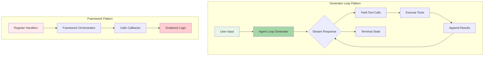
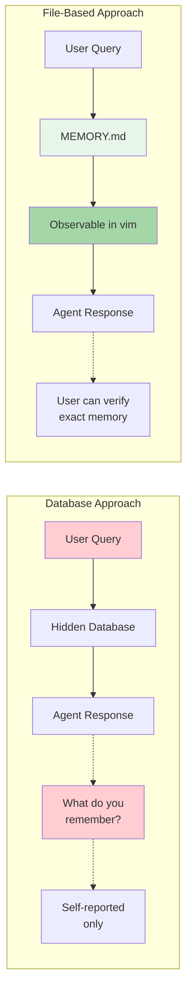
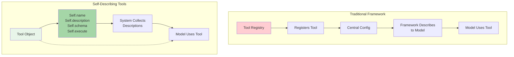
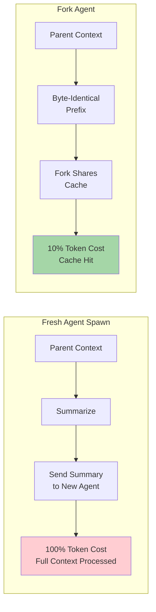
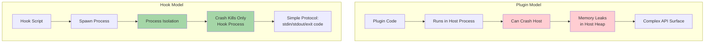
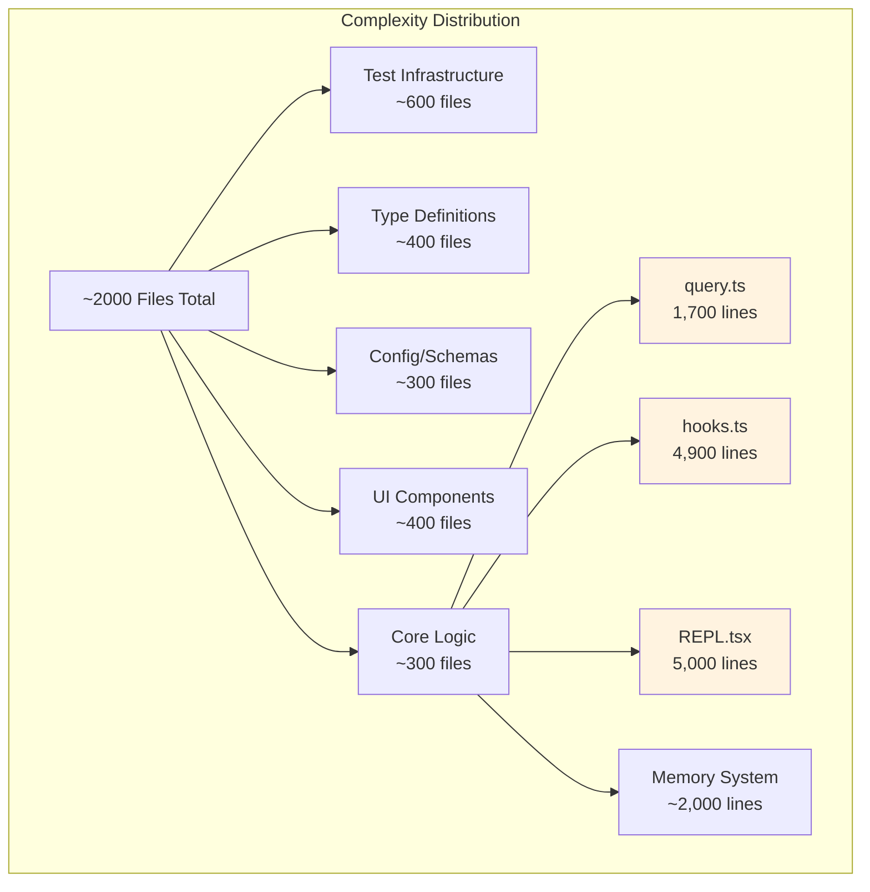
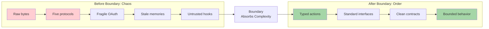
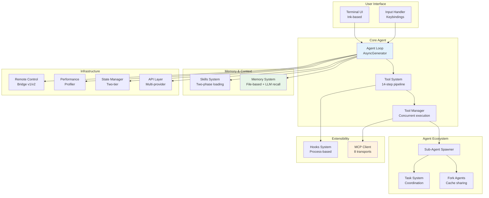

# Tutorial 18: Final Integration - What We Learned

## Learning Objectives

By the end of this tutorial, you'll understand:
- **Five Architectural Bets** - The design decisions that distinguish Claude Code from other agent frameworks
- **Transferable Patterns** - What generalizes to any agentic system vs. what is Claude Code-specific
- **Complexity Analysis** - Understanding the cost of 1,700+ files and where complexity concentrates
- **Future Trends** - Where agentic systems are heading based on Claude Code's architecture
- **The Core Lesson** - Push complexity to boundaries, keep interiors clean

## Course Retrospective

Seventeen tutorials. Sixteen source files. Nearly two thousand lines of implementation across the agent loop, tool system, memory layer, UI, MCP client, and performance optimizations. We've built a functional AI coding agent from first principles.

Now we step back and ask: what did we actually learn?

## The Five Architectural Bets

Claude Code is not the only agentic system. It is not the first. But it made five architectural bets that distinguish it from the landscape of agent frameworks. After building equivalent systems ourselves, these bets deserve examination.

### Bet 1: The Generator Loop Over Callbacks

Most agent frameworks give you a pipeline: define tools, register handlers, let the framework orchestrate. The developer writes callbacks. The framework decides when to call them.

Claude Code does the opposite. The `query()` function is an async generator -- the developer owns the loop. The model streams a response, the generator yields tool calls, the caller executes them, appends results, and the generator loops. There is one function, one data flow, one place where every interaction passes through.

The 10 terminal states and 7 continuation states of the generator's return type encode every possible outcome:



The bet was that a single generator function, even one that grew to 1,700 lines, would be more comprehensible than a distributed callback graph. After our implementation, the bet paid off:

- **Single point of understanding** - When you want to know why a session ended, you look at one function
- **Exhaustive handling** - The type system enforces that every terminal state is handled
- **Visible control flow** - Interactions are explicit in the code, not implicit between callbacks
- **Testable** - The generator can be unit tested by driving it with specific inputs

A callback architecture would scatter this logic across dozens of files, and the interactions between callbacks would be implicit rather than visible in the control flow.

Our implementation in T04 and T05 demonstrates this pattern:

```typescript
// src/agent/query.ts - The generator loop
export async function* agentLoopGenerator(
  context: AgentContext
): AsyncGenerator<AgentStreamEvent, AgentResult, ToolResult[]> {
  while (true) {
    // 1. Stream response from model
    const stream = await context.api.streamMessages(messages, tools);
    
    for await (const event of stream) {
      if (event.type === 'content') {
        yield { type: 'content', content: event.content };
      }
      if (event.type === 'tool_use') {
        yield { type: 'tool_call', tool: event.tool };
      }
    }
    
    // 2. Wait for caller to execute tools
    const results: ToolResult[] = yield { type: 'needs_execution' };
    
    // 3. Append results and loop
    messages.push({ role: 'user', content: formatResults(results) });
  }
  
  // 4. Return terminal state
  return { type: 'completed', summary: generateSummary(messages) };
}
```

### Bet 2: File-Based Memory Over Databases

Chapter 11 made the case in detail, but the architectural significance extends beyond memory. The decision to use plain Markdown files instead of SQLite, a vector database, or a cloud service was a bet on transparency over capability.

A database would support richer queries, faster lookups, and transactional guarantees. Files provide none of that. What files provide is trust.



A user who opens `~/.claude/projects/myapp/memory/MEMORY.md` in vim and sees exactly what the agent remembers about them has a fundamentally different relationship with the system than a user who must ask the agent "what do you remember?" and hope the answer is complete.

The file-based design makes the agent's knowledge state externally observable, not just self-reported. This matters more than query performance. The LLM-powered recall system compensates for the storage simplicity with retrieval intelligence -- a Sonnet side-query selecting five relevant memories from a manifest is more precise than embedding similarity and requires zero infrastructure.

Our implementation from T11:

```typescript
// src/memory/recall.ts - LLM-powered file recall
export async function recallMemories(
  query: string,
  config: MemoryConfig
): Promise<Memory[]> {
  // 1. Read the manifest (just a text file)
  const manifest = await readFile(config.manifestPath, 'utf-8');
  
  // 2. Sonnet side-query to select relevant memories
  const selectorPrompt = `
    Given these memory titles and the user query, 
    select the 5 most relevant memories.
    
    Query: "${query}"
    
    Available memories:
    ${manifest}
    
    Return a JSON array of memory IDs.
  `;
  
  const response = await apiClient.query({
    model: 'claude-sonnet-4-20250514',
    messages: [{ role: 'user', content: selectorPrompt }],
    max_tokens: 500,
  });
  
  // 3. Read only the selected memory files
  const selectedIds = JSON.parse(response.content);
  return await Promise.all(
    selectedIds.map(id => readMemoryFile(config.memoryDir, id))
  );
}
```

### Bet 3: Self-Describing Tools Over Central Orchestrators

Agent frameworks typically provide a tool registry: you describe your tools in a central configuration, and the framework presents them to the model. Claude Code's tools describe themselves.

Each `Tool` object carries its own:
- Name and description
- Input schema (JSON Schema)
- Prompt contribution (context to add when tool is available)
- Concurrency safety flag
- Execution logic



This bet pays off in extensibility. MCP tools become first-class citizens by implementing the same interface. A tool from an MCP server and a built-in tool are indistinguishable to the model. The system does not need a separate "MCP tool adapter" layer -- the wrapping produces a standard `Tool` object, and from that point forward, the existing tool pipeline handles it.

From T06 and T15:

```typescript
// src/tools/types.ts - Self-describing tool interface
export interface Tool {
  name: string;
  description: string;
  inputSchema: JSONSchema;
  
  /** Additional context when tool is available */
  promptContribution?: string;
  
  /** Whether this tool can run concurrently with others */
  isReadOnly: boolean;
  
  /** Execution function */
  execute(input: unknown): Promise<ToolResult>;
}

// MCP tools become first-class by implementing the interface
export function wrapMcpTool(mcpTool: McpTool): Tool {
  return {
    name: mcpTool.name,
    description: mcpTool.description,
    inputSchema: mcpTool.inputSchema,
    isReadOnly: mcpTool.annotations?.readOnlyHint ?? false,
    
    async execute(input) {
      const result = await mcpClient.callTool(mcpTool.name, input);
      return { success: true, output: result.content };
    },
  };
}
```

### Bet 4: Fork Agents for Cache Sharing

Chapter 9 covered the fork mechanism: a sub-agent that starts with the parent's full conversation in its context window, sharing the parent's prompt cache.

This is not a convenience optimization -- it is an architectural bet that the cache sharing model is worth the complexity of fork lifecycle management.

The alternative -- spawning a fresh agent with a summary of the conversation -- is simpler but expensive. Every fresh agent pays the full cost of processing its context from scratch.



A forked agent gets the parent's cached prefix for free (a 90% discount on input tokens), making it economical to spawn agents for small tasks: memory extraction, code review, verification passes.

The background memory extraction agent (Chapter 11) runs after every query loop turn, and its cost is marginal precisely because it shares the parent's cache. Without fork-based cache sharing, that agent would be prohibitively expensive.

From T09:

```typescript
// src/agents/fork.ts - Cache-sharing fork implementation
export async function forkAgent(
  parent: AgentContext,
  options: ForkOptions
): Promise<ForkedAgent> {
  // 1. Capture parent's conversation state
  const prefix = getByteIdenticalPrefix(parent.messages);
  
  // 2. Create child with shared cache
  const child = await createAgent({
    api: parent.api,
    model: parent.model,
    systemPrompt: parent.systemPrompt,
    messages: [...prefix.messages, ...(options.additionalMessages ?? [])],
    promptCache: prefix.cacheKey,  // Shares parent's cache!
  });
  
  return {
    ...child,
    parentId: parent.id,
    cacheShared: true,
    
    // Cleanup: close child without affecting parent cache
    async close() {
      await child.close({ preserveCache: true });
    },
  };
}

// Usage: Background memory extraction is cheap
async function runBackgroundExtraction(parent: AgentContext) {
  const fork = await forkAgent(parent, {
    additionalMessages: [{
      role: 'user',
      content: 'Extract any new facts worth remembering from this conversation.'
    }]
  });
  
  // Cost: ~10% of fresh agent because cache is shared
  const result = await fork.run();
  await fork.close();
  
  return result;
}
```

### Bet 5: Hooks Over Plugins

Most extensibility systems use plugins -- code that registers capabilities and runs within the host process. Claude Code uses hooks -- external processes that run at lifecycle points and communicate through exit codes and JSON on stdin/stdout.



The bet is that process isolation is worth the overhead:
- A plugin can crash the host. A hook crashes its own process.
- A plugin can leak memory into the host's heap. A hook's memory dies with its process.
- A plugin requires an API surface that must be versioned and maintained. A hook requires stdin, stdout, and an exit code -- a protocol that has been stable since 1971.

The overhead is real: spawning a process per hook invocation costs milliseconds that an in-process callback would not. The -70% fast path for internal callbacks shows that the system knows this cost matters. But for external hooks, the isolation guarantee makes the system safer to extend.

From T12:

```typescript
// src/hooks/manager.ts - Process-based hooks
export async function runHook(
  hook: HookConfig,
  context: HookContext
): Promise<HookResult> {
  // 1. Spawn hook as separate process
  const proc = spawn(hook.command, hook.args, {
    cwd: context.cwd,
    env: { ...process.env, ...hook.env },
    stdio: ['pipe', 'pipe', 'pipe'],
  });
  
  // 2. Send context as JSON
  proc.stdin.write(JSON.stringify(context));
  proc.stdin.end();
  
  // 3. Wait for completion
  const [exitCode, stdout] = await Promise.all([
    new Promise<number>((resolve) => proc.on('close', resolve)),
    new Promise<string>((resolve) => {
      let data = '';
      proc.stdout.on('data', chunk => data += chunk);
      proc.stdout.on('close', () => resolve(data));
    }),
  ]);
  
  // 4. Parse result
  if (exitCode !== 0) {
    return { type: 'blocked', reason: stdout };
  }
  
  return { type: 'allowed', result: JSON.parse(stdout) };
}

// Security: Snapshot at startup prevents runtime modification
const hookSnapshot = loadHookConfigsSync();  // Loaded once at startup
export function getHooks(): readonly HookConfig[] {
  return hookSnapshot;  // Frozen, never changes
}
```

## Transferable Patterns vs. Claude Code Specifics

Not every pattern generalizes. Some are consequences of scale, resources, or specific constraints.

### Patterns That Transfer to Any Agent

**The Generator Loop Pattern**

Any agent that streams responses, handles tool calls, and manages multiple terminal states benefits from making the loop explicit. The discriminated union return type -- encoding exactly why the loop stopped -- eliminates an entire class of "why did the agent stop?" debugging sessions.

```typescript
// Transferable to any agent framework
export type AgentResult =
  | { type: 'completed'; summary: string }
  | { type: 'tool_limit_reached'; partialResults: ToolResult[] }
  | { type: 'token_budget_exceeded'; usage: TokenUsage }
  | { type: 'user_interrupted' }
  | { type: 'error'; error: Error }
  | { type: 'needs_permission'; pendingTools: ToolCall[] };
```

**File-Based Memory with LLM Recall**

The principle -- simple storage combined with intelligent retrieval -- applies to any agent that persists knowledge across sessions. The four-type taxonomy (user, feedback, project, reference) and the derivability test are reusable design heuristics.

```typescript
// Reusable design: Can this be re-derived?
function shouldRemember(fact: string, context: ProjectContext): boolean {
  // If derivable from current codebase, don't remember
  if (isInCodebase(fact, context)) return false;
  
  // If about user preferences, remember
  if (isUserPreference(fact)) return true;
  
  // If project convention, remember
  if (isProjectConvention(fact)) return true;
  
  return false;
}
```

**Asymmetric Read/Write Channels for Remote Execution**

When reads are high-frequency streams and writes are low-frequency RPCs, separating them is correct regardless of the specific transport protocol.

**Bitmap Pre-Filters for Search**

Any agent searching a large file index benefits from a 26-bit letter bitmap as a pre-filter. Four bytes per entry, one integer comparison per candidate.

```typescript
// Reusable optimization
export function createCharBitmap(text: string): number {
  let bitmap = 0;
  for (const char of text.toLowerCase()) {
    const index = char.charCodeAt(0) - 97; // 'a' = 0
    if (index >= 0 && index < 26) {
      bitmap |= 1 << index;
    }
  }
  return bitmap;
}

export function mightMatch(query: string, entryBitmap: number): boolean {
  const queryBitmap = createCharBitmap(query);
  return (queryBitmap & entryBitmap) === queryBitmap;
}
```

**Prompt Cache Stability**

If your agent uses an API with prompt caching, structuring the prompt with stable content first and volatile content last is not an optimization -- it is an architectural decision that determines your cost structure.

```typescript
// Transferable pattern: Stable prefix, volatile suffix
function buildCachedPrompt(context: PromptContext): Message[] {
  return [
    // Stable: system prompt (cached)
    { role: 'system', content: SYSTEM_PROMPT },
    
    // Stable: tool definitions (cached)
    { role: 'system', content: formatToolDefinitions(context.tools) },
    
    // Stable: project context (cached)
    { role: 'system', content: context.projectSummary },
    
    // Volatile: conversation history (not cached)
    ...context.recentMessages,
    
    // Volatile: current query (not cached)
    { role: 'user', content: context.currentQuery },
  ];
}
```

### Patterns Specific to Claude Code's Scale

**The Forked Terminal Renderer**

Claude Code forked Ink and reimplemented the rendering pipeline with packed typed arrays, pool-based interning, and cell-level diffing because it needed 60fps streaming in a terminal. Most agents render to a web interface or simple log output. The engineering investment only makes sense when terminal rendering is your primary UI and you stream at high frequency.

**The 50+ Startup Profiling Checkpoints**

Meaningful when you have hundreds of thousands of users and 0.5% sampling produces statistically significant data. For a smaller agent, a simpler timing system suffices.

**Eight MCP Transport Types**

Claude Code supports stdio, SSE, HTTP, WebSocket, SDK, two IDE variants, and a Claude.ai proxy because it must integrate with every deployment topology. Most agents need stdio and HTTP.

**The Hooks Snapshot Security Model**

Freezing hook configuration at startup and never re-reading it implicitly is a defense against a specific threat: malicious repository code modifying hooks after the user accepts the trust dialog. This matters when your agent runs in arbitrary repositories. An agent that only runs in trusted environments can use simpler hook management.

## The Cost of Complexity

Nearly two thousand files. What does that buy, and what does it cost?

The file count is misleading as a complexity metric. Much of it is test infrastructure, type definitions, configuration schemas, and the forked Ink renderer. The actual behavioral complexity concentrates in a small number of high-density files.



The complexity comes from three sources:

**Protocol Diversity (Accidental Complexity)**

Supporting five terminal keyboard protocols, eight MCP transport types, four remote execution topologies, and seven configuration scopes is inherently complex. This complexity comes from the environment (terminal fragmentation, MCP transport evolution), not from the problem being solved.

**Performance Optimization (Justified Complexity)**

The pool-based rendering, bitmap search pre-filters, sticky cache latches, and speculative tool execution each add complexity in exchange for measurable performance gains. Every optimization was preceded by profiling data. The risk is that optimizations accumulate and interact.

**Behavioral Tuning (Prompt Complexity)**

The memory system's prompt instructions, staleness warnings, verification protocol -- these are not code complexity. They are prompt complexity. When the model's behavior changes between versions, prompt instructions need re-tuning. The eval infrastructure is the defense against regression.

## Where Agentic Systems Are Heading

Four trends are visible from the patterns in Claude Code:

### Trend 1: MCP as the Universal Protocol

A standardized protocol for tool discovery and invocation means that tools built for one agent work with any agent. The ecosystem effects are obvious: an MCP server for Postgres, once built, serves every agent that speaks MCP.

**Implication:** If you are defining a custom tool protocol, you are probably making a mistake. MCP is good enough, it is getting better, and the ecosystem advantages compound over time.

### Trend 2: Multi-Agent Coordination

Claude Code's sub-agent system, task coordination, and fork mechanism are early implementations of multi-agent patterns. They solve specific problems but also reveal the fundamental challenge: coordination overhead.

Every message between agents consumes tokens. Every fork shares a cache but adds a conversation branch that the parent must eventually reconcile.

**Implication:** The pressure will shift from "how do we coordinate multiple agents?" to "how do we make one agent capable enough that coordination is unnecessary?" Both approaches will coexist.

### Trend 3: Persistent Memory

Claude Code's memory system is version 1 of persistent agent memory. Future memory systems will likely add:
- Structured retrieval (specific facts, not whole files)
- Cross-project transfer learning
- Collaborative memory with sync and conflict resolution

The open question is whether the file-based approach scales. At 200 memories per project, it works. At 2,000 memories per project, the manifest becomes too large for the Sonnet side-query approach.

### Trend 4: Autonomous Operation

The KAIROS mode, background memory extraction, auto-dream consolidation, speculative tool execution -- these are all steps toward autonomous operation. The agent does useful work without being asked.

**The constraint is trust.** Autonomous operation requires the user to trust that the agent will do the right thing when unattended. The file-based memory, observable hook system, staleness warnings, and permission dialogs all exist because trust must be earned, not assumed.

## The Core Lesson: Push Complexity to Boundaries

The deepest pattern in Claude Code is not any single technique. It is the recurring decision to **push complexity to the boundaries**.

| Boundary | Absorbs | Exports |
|----------|---------|---------|
| **Rendering** | Raw bytes, cell updates, diffing | Clean terminal output |
| **Input** | Five keyboard protocols, key combinations | Typed `ParsedKey` actions |
| **Memory** | Markdown files, staleness, recall selection | Relevant context |
| **Hooks** | External scripts, security concerns | Allow/block decisions |
| **MCP** | Eight transports, OAuth, JSON-RPC | Standard `Tool` objects |
| **Agent Loop** | Terminal states, tool system | Stream, collect, execute, repeat |

Each boundary absorbs chaos and exports order:



On one side of each boundary, the world is messy. On the other side, the world is typed, bounded, and exhaustively handled.

**If you are building an agentic system, this is the transferable lesson.** Not the specific techniques -- you may not need pool-based rendering or KAIROS mode or eight MCP transports. But the principle:

> Define your boundaries, absorb complexity there, and keep everything between them clean.

The boundaries are where the engineering is hard. The interior is where the engineering is pleasant. Design for pleasant interiors, and invest your complexity budget at the edges.

## Complete System Architecture

After 18 tutorials, here is the complete architecture we've built:



## Summary Checklist

We've built a complete AI coding agent:

- ✅ **Bootstrap** - DI container, state management, config
- ✅ **API Layer** - Multi-provider client, streaming, error recovery
- ✅ **Agent Loop** - AsyncGenerator pattern, 10 terminal states
- ✅ **Tool System** - Self-describing tools, 14-step pipeline
- ✅ **Concurrent Execution** - Partition algorithm, read/write safety
- ✅ **Context Compression** - 4-layer reduction strategy
- ✅ **Sub-Agent Spawner** - AgentTool, lifecycle management
- ✅ **Fork Agents** - Byte-identical prefix, cache sharing
- ✅ **Task Coordination** - State machine, coordinator mode
- ✅ **Memory System** - File-based, LLM recall, staleness
- ✅ **Skills System** - Two-phase loading, lifecycle hooks
- ✅ **Terminal UI** - Custom Ink renderer, double-buffer
- ✅ **Input Handling** - Key parsing, keybindings, vim mode
- ✅ **MCP Protocol** - 8 transports, OAuth, tool wrapping
- ✅ **Remote Control** - Bridge v1/v2, cloud execution
- ✅ **Performance** - Profiling, caching, search optimization
- ✅ **Final Integration** - What we learned, where we're going

## Next Steps

The source code is open. The architecture is documented. The crab has the map in its claw.

**To continue learning:**
1. Read the actual Claude Code source code with this architecture as your guide
2. Extend the system with your own tools and integrations
3. Contribute to MCP -- the ecosystem grows through participation
4. Build your own agent using these patterns

**Remember the core lesson:** Push complexity to boundaries. Keep interiors clean. Trust is earned through transparency.

Go build something amazing.
