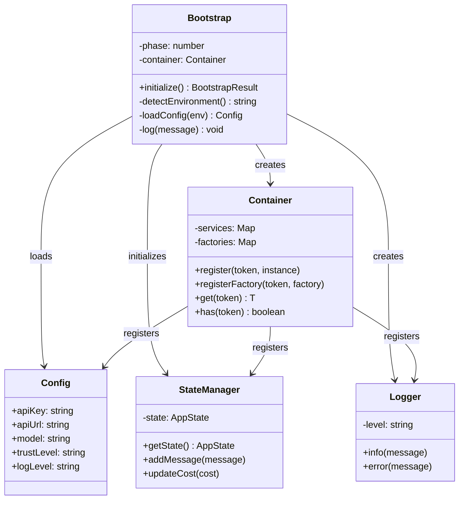
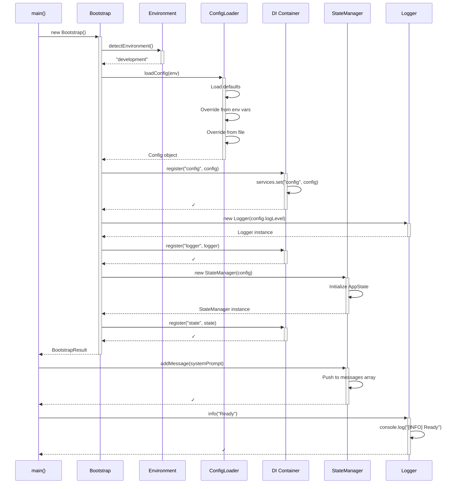

# Tutorial 1: Bootstrap Architecture - Building the Foundation

## Learning Objectives

By the end of this tutorial, you will understand:
- **Why** we need a bootstrap pipeline (not just `main()`)
- **Dependency Injection** as a way to build modular systems
- **Separation of Concerns** between configuration, state, and services
- How to structure an AI agent for **testability** and **extensibility**

---

## The Problem: Why Not Just Write `main()`?

Imagine you're building a house. You could just start hammering nails:

```typescript
// ❌ The "Just Start Coding" approach
function main() {
  const api = new ClaudeAPI(process.env.API_KEY);
  const state = { messages: [] };
  const ui = new TerminalUI();
  // ... wait, what about permissions?
  // ... where do we load config from?
  // ... how do we test this?
}
```

**Problems with this approach:**
1. **Tight Coupling** - Everything depends on everything
2. **Hard to Test** - Can't swap out real API for mock
3. **No Lifecycle** - When do we validate? When do we setup?
4. **Trust Issues** - Security decisions scattered everywhere

---

## The Solution: Bootstrap Pipeline

Think of the bootstrap as **construction phases**:

```
Phase 1: Site Survey       → Detect environment
Phase 2: Blueprint         → Load configuration  
Phase 3: Foundation        → Register services
Phase 4: Framework         → Initialize state
Phase 5: Security Check    → Setup trust boundary
```

Each phase has **one job** and **one output**.

---

## Architecture Overview



---

## The Sequence: What Happens During Bootstrap?



---

## Concept Deep-Dive: Dependency Injection

### The Problem: Hard-Coded Dependencies

```typescript
// ❌ Without DI - tightly coupled
class Agent {
  private api = new ClaudeAPI();     // Can't test without real API
  private state = new StateManager(); // Can't mock state
  
  async chat(message: string) {
    return this.api.send(message);   // What if API is down?
  }
}
```

**Testing this is impossible** without hitting the real Claude API (expensive!).

### The Solution: Inject Dependencies

```typescript
// ✅ With DI - loosely coupled
class Agent {
  constructor(
    private api: ClaudeAPIInterface,    // Interface, not implementation
    private state: StateManagerInterface // Can be mocked
  ) {}
  
  async chat(message: string) {
    return this.api.send(message);       // Works with real OR mock
  }
}
```

**Benefits:**
- 🧪 **Testable**: Pass mock API in tests
- 🔄 **Swappable**: Change API provider without touching Agent
- 🧩 **Modular**: Each piece has clear boundaries

---

## Concept Deep-Dive: The Container Pattern

Think of the Container as a **Service Registry** - like a phone book for your app:

```
┌─────────────────────────────────────┐
│           CONTAINER                │
├─────────────────────────────────────┤
│  "config"    → Config instance     │
│  "logger"    → Logger instance     │
│  "state"     → StateManager        │
│  "api"       → ClaudeAPI           │
└─────────────────────────────────────┘
```

**Why this matters:**
- **Single Source of Truth**: Everyone asks the Container
- **Lazy Loading**: Create services only when needed
- **Lifecycle Management**: Container manages startup/shutdown

---

## Code Implementation

### Step 1: The Container (Our Service Registry)

```typescript
// src/di/container.ts

/**
 * Container - Dependency Injection Container
 * 
 * Think of this as a "service registry" or "phone book" for your application.
 * Instead of creating dependencies inside classes (tight coupling), we:
 * 1. Register services in the container during bootstrap
 * 2. Retrieve them when needed (loose coupling)
 * 
 * This enables:
 * - Testability: Swap real services for mocks in tests
 * - Modularity: Each service doesn't know how others are created
 * - Lifecycle management: Container manages service lifetime
 */
export class Container {
  // Store actual service instances (singletons)
  private services = new Map<string, any>();
  
  // Store factory functions for lazy initialization
  private factories = new Map<string, () => any>();

  /**
   * Register an existing instance (eager initialization)
   * Use this when the service should be created immediately
   * 
   * Example: container.register('config', loadedConfig);
   */
  register<T>(token: string, instance: T): void {
    this.services.set(token, instance);
  }

  /**
   * Register a factory function (lazy initialization)
   * Use this when the service should be created on first use
   * 
   * Example: container.registerFactory('api', () => new ClaudeAPI(config));
   */
  registerFactory<T>(token: string, factory: () => T): void {
    this.factories.set(token, factory);
  }

  /**
   * Retrieve a service by token
   * Returns existing instance OR creates from factory
   * 
   * @throws Error if token not found
   */
  get<T>(token: string): T {
    // Check if instance already exists
    if (this.services.has(token)) {
      return this.services.get(token) as T;
    }

    // Create from factory if available
    if (this.factories.has(token)) {
      const instance = this.factories.get(token)!();
      this.services.set(token, instance); // Cache for future calls
      return instance as T;
    }

    throw new Error(`Service not found: ${token}`);
  }

  /**
   * Check if a service is registered
   */
  has(token: string): boolean {
    return this.services.has(token) || this.factories.has(token);
  }
}
```

**Key Insight**: The Container decouples "who creates services" from "who uses services".

---

### Step 2: Configuration System

```typescript
// src/config/config.ts

/**
 * Configuration Interface
 * 
 * Why an interface? So we can:
 * 1. Type-check config throughout the app
 * 2. Mock config in tests
 * 3. Have multiple config sources (env, file, defaults)
 */
export interface Config {
  // API settings
  apiKey: string;           // Claude API key (from env var)
  apiUrl: string;           // API endpoint
  model: string;            // Which Claude model
  maxTokens: number;        // Max response length
  
  // Trust & Security
  trustLevel: 'strict' | 'normal' | 'permissive';
  requirePermissions: boolean;  // Ask before executing commands?
  
  // Observability
  logLevel: 'debug' | 'info' | 'warn' | 'error';
  
  // Feature Flags
  enableSubAgents: boolean;   // Allow spawning sub-agents?
  enableMCP: boolean;         // MCP protocol support?
  enableMemory: boolean;      // Persistent memory?
}

/**
 * ConfigLoader - Loads configuration from multiple sources
 * 
 * Priority (highest to lowest):
 * 1. Environment variables (runtime overrides)
 * 2. Config file (.claude-code/config.json)
 * 3. Default values
 * 
 * This allows:
 * - Local development with defaults
 * - Production with env vars
 * - User customization via config file
 */
export class ConfigLoader {
  constructor(private env: string) {}

  async load(): Promise<Config> {
    // Step 1: Start with sensible defaults
    const config: Config = {
      apiKey: '',  // Will be loaded from env
      apiUrl: 'https://api.anthropic.com/v1',
      model: 'claude-3-sonnet-20240229',
      maxTokens: 8192,  // Claude default
      trustLevel: 'normal',
      requirePermissions: true,  // Safe default
      logLevel: 'info',
      enableSubAgents: true,
      enableMCP: true,
      enableMemory: true
    };

    // Step 2: Override from config file (if exists)
    try {
      const fileConfig = await this.loadFromFile();
      Object.assign(config, fileConfig);
    } catch {
      // No config file - that's fine, use defaults
    }

    // Step 3: Override from environment variables (highest priority)
    if (process.env.CLAUDE_API_KEY) {
      config.apiKey = process.env.CLAUDE_API_KEY;
    }
    if (process.env.CLAUDE_MODEL) {
      config.model = process.env.CLAUDE_MODEL;
    }
    if (process.env.CLAUDE_LOG_LEVEL) {
      config.logLevel = process.env.CLAUDE_LOG_LEVEL as Config['logLevel'];
    }

    // Step 4: Validation (fail fast on missing critical config)
    if (!config.apiKey) {
      throw new Error('CLAUDE_API_KEY environment variable is required');
    }

    return config;
  }

  private async loadFromFile(): Promise<Partial<Config>> {
    // In real implementation, would read from ~/.claude-code/config.json
    // For now, return empty (use defaults)
    return {};
  }
}
```

**Key Insight**: Config loading has **priority order** - env vars beat files, files beat defaults.

---

### Step 3: State Management

```typescript
// src/state/state-manager.ts

import { Config } from '../config/config';

/**
 * Message - A single message in the conversation
 */
export interface Message {
  id: string;              // Unique identifier
  role: 'user' | 'assistant' | 'system';
  content: string;       // The actual text
  timestamp: Date;         // When it was sent
  metadata?: Record<string, any>;  // Extra data (tokens, cost, etc.)
}

/**
 * AppState - All mutable state in the application
 * 
 * Why centralize state?
 * 1. Single source of truth
 * 2. Easy to persist/restore
 * 3. Clear data flow
 * 4. Time-travel debugging possible
 */
export interface AppState {
  conversation: {
    messages: Message[];      // Chat history
    contextWindow: number;    // How much context we're using
    tokenCount: number;       // Approximate token count
  };
  session: {
    startTime: Date;          // When session started
    totalCost: number;        // Running cost estimate
    totalTokens: number;      // Total tokens used
  };
}

/**
 * StateManager - Manages application state
 * 
 * Acts as a "state database" for the agent.
 * All state mutations go through here (centralized).
 */
export class StateManager {
  private state: AppState;

  constructor(private config: Config) {
    this.state = this.initializeState();
  }

  /**
   * Create initial state
   */
  private initializeState(): AppState {
    return {
      conversation: {
        messages: [],
        contextWindow: 0,
        tokenCount: 0
      },
      session: {
        startTime: new Date(),
        totalCost: 0,
        totalTokens: 0
      }
    };
  }

  /**
   * Get read-only copy of current state
   * Returns copy to prevent direct mutation
   */
  getState(): Readonly<AppState> {
    // Create shallow copy to prevent external mutation
    return Object.freeze({ ...this.state });
  }

  /**
   * Get just the conversation state
   */
  getConversation(): Readonly<AppState['conversation']> {
    return Object.freeze({ ...this.state.conversation });
  }

  /**
   * Add a message to the conversation
   * This is how all messages enter the system
   */
  addMessage(message: Message): void {
    this.state.conversation.messages.push(message);
    this.updateTokenCount();
    this.updateContextWindow();
  }

  /**
   * Update total cost
   * Called after each API request
   */
  updateCost(cost: number): void {
    this.state.session.totalCost += cost;
  }

  /**
   * Approximate token count
   * Real implementation would use tiktoken
   */
  private updateTokenCount(): void {
    // Rough approximation: 1 token ≈ 4 characters
    this.state.conversation.tokenCount = this.state.conversation.messages
      .reduce((acc, msg) => acc + Math.ceil(msg.content.length / 4), 0);
  }

  /**
   * Update context window tracking
   */
  private updateContextWindow(): void {
    // Would track actual tokens sent to API
    this.state.conversation.contextWindow = this.state.conversation.tokenCount;
  }
}
```

**Key Insight**: StateManager is the **single source of truth** - all state flows through here.

---

### Step 4: Logger (Observability)

```typescript
// src/utils/logger.ts

/**
 * Logger - Application logging with levels
 * 
 * Why levels? Control verbosity:
 * - debug: Everything (development)
 * - info: Important events (production default)
 * - warn: Potential issues
 * - error: Failures
 */
export class Logger {
  constructor(private level: string) {}

  debug(msg: string, meta?: any): void {
    if (this.level === 'debug') {
      console.log(`[DEBUG] ${msg}`, meta || '');
    }
  }

  info(msg: string, meta?: any): void {
    if (['debug', 'info'].includes(this.level)) {
      console.log(`[INFO] ${msg}`, meta || '');
    }
  }

  warn(msg: string, meta?: any): void {
    if (['debug', 'info', 'warn'].includes(this.level)) {
      console.warn(`[WARN] ${msg}`, meta || '');
    }
  }

  error(msg: string, error?: Error): void {
    console.error(`[ERROR] ${msg}`, error || '');
  }
}
```

---

### Step 5: The Bootstrap Orchestrator

```typescript
// src/bootstrap.ts

import { Container } from './di/container';
import { Config, ConfigLoader } from './config/config';
import { StateManager } from './state/state-manager';
import { Logger } from './utils/logger';

/**
 * BootstrapResult - Everything needed to start the agent
 */
export interface BootstrapResult {
  container: Container;      // Service registry
  config: Config;            // App configuration
  state: StateManager;       // State management
  logger: Logger;            // Logging utility
}

/**
 * Bootstrap - 5-Phase Initialization Pipeline
 * 
 * Think of this as the "construction foreman" that:
 * 1. Prepares the site (environment detection)
 * 2. Reads the blueprints (config loading)
 * 3. Builds foundation (service registration)
 * 4. Frames the structure (state initialization)
 * 5. Adds security (trust boundary)
 */
export class Bootstrap {
  private phase: number = 0;
  private container: Container = new Container();

  async initialize(): Promise<BootstrapResult> {
    // Phase 1: Environment Detection
    this.phase = 1;
    const env = this.detectEnvironment();
    this.log(`Environment detected: ${env}`);

    // Phase 2: Configuration Loading
    this.phase = 2;
    const config = await this.loadConfig(env);
    this.container.register('config', config);
    this.log(`Configuration loaded (model: ${config.model})`);

    // Phase 3: Service Registration
    this.phase = 3;
    const logger = new Logger(config.logLevel);
    this.container.register('logger', logger);
    this.log('Services registered');

    // Phase 4: State Initialization
    this.phase = 4;
    const state = new StateManager(config);
    this.container.register('state', state);
    this.log('State initialized');

    // Phase 5: Trust Boundary Setup
    this.phase = 5;
    // Security decisions made here, frozen after
    this.log('Trust boundary established');

    this.log('Bootstrap complete ✓');
    
    return {
      container: this.container,
      config,
      state,
      logger
    };
  }

  /**
   * Phase 1: Detect which environment we're running in
   */
  private detectEnvironment(): 'development' | 'production' | 'test' {
    if (process.env.NODE_ENV === 'test') return 'test';
    if (process.env.NODE_ENV === 'production') return 'production';
    return 'development';
  }

  /**
   * Phase 2: Load configuration from all sources
   */
  private async loadConfig(env: string): Promise<Config> {
    const configLoader = new ConfigLoader(env);
    return configLoader.load();
  }

  /**
   * Helper: Log with phase number
   */
  private log(message: string): void {
    console.log(`[Bootstrap Phase ${this.phase}] ${message}`);
  }
}
```

---

### Step 6: Entry Point

```typescript
// src/index.ts

import { Bootstrap } from './bootstrap';

/**
 * Main Entry Point
 * 
 * This is the ONLY place we create a Bootstrap instance.
 * Everything else is injected.
 */
async function main() {
  console.log('🚀 Starting Claude Code TypeScript...\n');
  
  // Initialize system
  const bootstrap = new Bootstrap();
  const { config, state, logger } = await bootstrap.initialize();
  
  // Log startup info
  logger.info('Agent initialized');
  logger.info(`Model: ${config.model}`);
  logger.info(`Trust Level: ${config.trustLevel}`);
  logger.info(`Log Level: ${config.logLevel}`);
  
  // Add system message (the "personality" prompt)
  state.addMessage({
    id: 'system-1',
    role: 'system',
    content: 'You are Claude Code, an AI coding assistant. Help users write, understand, and improve code.',
    timestamp: new Date()
  });
  
  logger.info('System prompt loaded');
  console.log('\n✓ Agent ready for commands\n');
  
  // TODO: Next tutorial - add the Agent Loop
}

// Run it
main().catch(err => {
  console.error('Fatal error:', err);
  process.exit(1);
});
```

---

## Running the Code

```bash
# Install dependencies
npm install typescript ts-node @types/node

# Compile
npx tsc --init

# Run
npx ts-node src/index.ts
```

**Expected Output:**
```
🚀 Starting Claude Code TypeScript...

[Bootstrap Phase 1] Environment detected: development
[Bootstrap Phase 2] Configuration loaded (model: claude-3-sonnet-20240229)
[Bootstrap Phase 3] Services registered
[Bootstrap Phase 4] State initialized
[Bootstrap Phase 5] Trust boundary established
[Bootstrap Phase 5] Bootstrap complete ✓
[INFO] Agent initialized
[INFO] Model: claude-3-sonnet-20240229
[INFO] Trust Level: normal
[INFO] Log Level: info
[INFO] System prompt loaded

✓ Agent ready for commands
```

---

## Testing the Bootstrap

```typescript
// tests/bootstrap.test.ts

import { Bootstrap } from '../src/bootstrap';

describe('Bootstrap', () => {
  it('should initialize with correct phases', async () => {
    const bootstrap = new Bootstrap();
    const result = await bootstrap.initialize();
    
    expect(result.config).toBeDefined();
    expect(result.state).toBeDefined();
    expect(result.logger).toBeDefined();
    expect(result.container).toBeDefined();
  });

  it('should load config from environment', async () => {
    process.env.CLAUDE_API_KEY = 'test-key';
    process.env.CLAUDE_MODEL = 'claude-3-opus';
    
    const bootstrap = new Bootstrap();
    const { config } = await bootstrap.initialize();
    
    expect(config.apiKey).toBe('test-key');
    expect(config.model).toBe('claude-3-opus');
  });

  it('should throw on missing API key', async () => {
    delete process.env.CLAUDE_API_KEY;
    
    const bootstrap = new Bootstrap();
    await expect(bootstrap.initialize()).rejects.toThrow('CLAUDE_API_KEY');
  });
});
```

---

## Architecture Decisions Explained

### Why 5 Phases?

| Phase | Purpose | Why Separate? |
|-------|---------|---------------|
| 1. Environment | Detect where we are | Different configs for dev/prod |
| 2. Config | Load settings | Everything else depends on config |
| 3. Services | Create utilities | Logger needed for everything |
| 4. State | Initialize data | Needs config for defaults |
| 5. Trust | Security setup | Happens AFTER everything ready |

**Each phase has clear inputs/outputs. No mixing concerns.**

### Why Dependency Injection?

**Without DI (tight coupling):**
```typescript
class Agent {
  private api = new ClaudeAPI();  // Can't change without editing Agent
  // ...
}
```

**With DI (loose coupling):**
```typescript
class Agent {
  constructor(private api: APIInterface) {}  // Inject any implementation
  // ...
}

// Can use real API
const agent = new Agent(new ClaudeAPI());

// Or mock in tests
const agent = new Agent(new MockAPI());
```

### Why Readonly State?

Prevents accidental mutations:
```typescript
const state = stateManager.getState();
state.conversation.messages.push(msg); // ❌ Compile error!
```

Forces all mutations through controlled methods:
```typescript
stateManager.addMessage(msg); // ✅ Only way to add messages
```

---

## Common Pitfalls

### ❌ Don't: Create services inside constructors
```typescript
// Bad - can't test
class Agent {
  private api = new ClaudeAPI(); // Hardcoded
}
```

### ✅ Do: Inject services
```typescript
// Good - can mock
class Agent {
  constructor(private api: ClaudeAPI) {} // Injected
}
```

### ❌ Don't: Access config directly from anywhere
```typescript
// Bad - scattered config access
function someFunction() {
  const key = process.env.CLAUDE_API_KEY; // ❌
}
```

### ✅ Do: Get config from container
```typescript
// Good - single source of truth
const config = container.get<Config>('config');
```

---

## What We Learned

1. **Bootstrap Pattern** - 5-phase initialization for predictable startup
2. **Dependency Injection** - Container manages service lifecycle
3. **Configuration Priority** - Env vars > Config file > Defaults
4. **State Centralization** - Single source of truth, controlled mutations
5. **Readonly Exports** - Prevent accidental state corruption

---

## Next Tutorial Preview

**T2: API Layer - Talking to Claude**

We'll build:
- Multi-provider API client (Claude, OpenAI, etc.)
- Streaming response handling
- Prompt caching
- Error recovery with exponential backoff

**The Agent Loop is coming! 🔄**

---

## Git Commit

```bash
git add .
git commit -m "T01: Bootstrap Architecture - DI container, config system, state manager

- 5-phase initialization pipeline
- Dependency injection container with lazy loading
- Multi-source configuration (env > file > defaults)
- Centralized state management with readonly exports
- Comprehensive documentation with diagrams"
```

**End of Tutorial 1**
