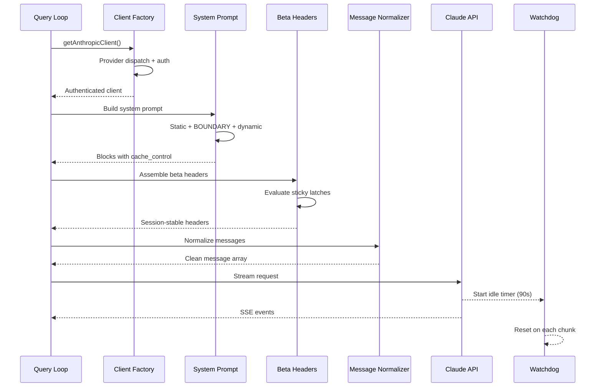
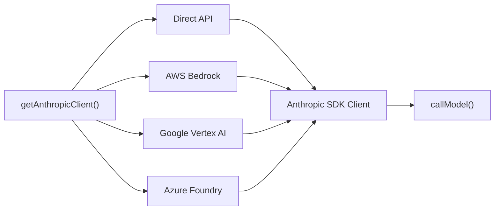
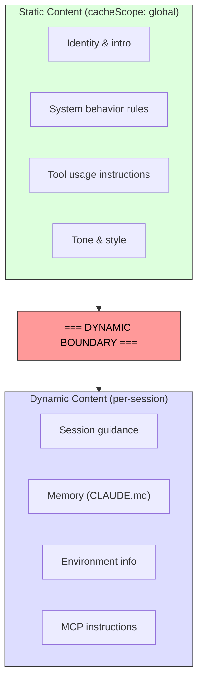
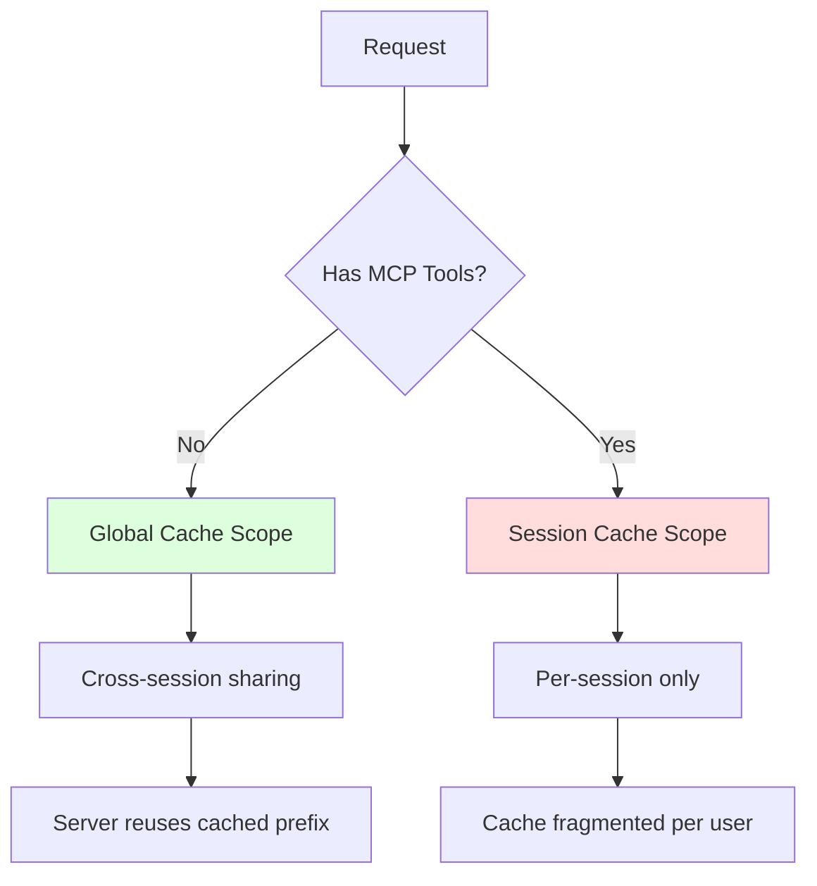
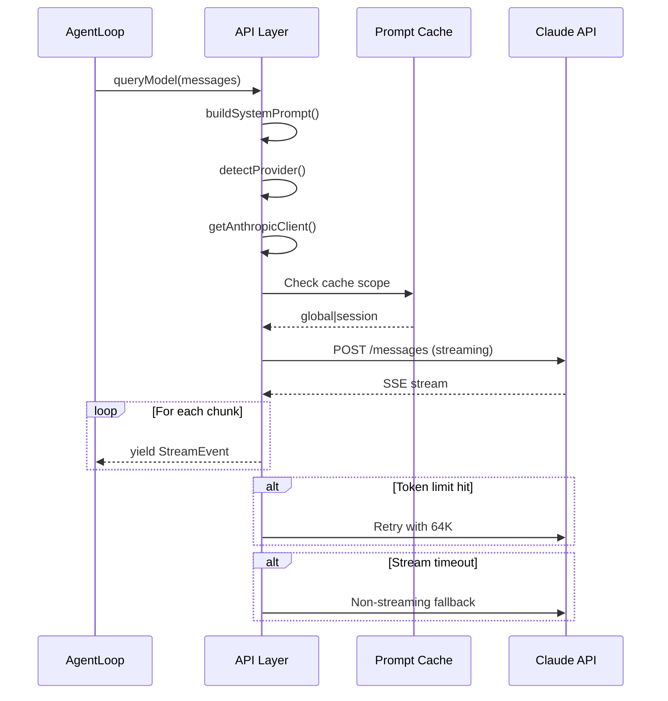

# Tutorial 4: The API Layer - Talking to Claude

## Learning Objectives

By the end of this tutorial, you'll understand:
- Multi-provider client factory pattern
- System prompt construction with cache optimization
- Streaming responses with failure detection
- The 8K→64K token escalation pattern
- Sticky latches for session-stable configuration

## What We're Building

The API layer handles more failure modes than any other part of the system. It routes through four cloud providers via a single transparent interface, constructs prompts with byte-level cache awareness, streams responses with active failure detection, and maintains session-stable invariants so mid-conversation changes don't cause performance cliffs.



## The Multi-Provider Client Factory

Claude Code supports four providers through a single interface:



### Implementation

```typescript
// src/api/client.ts

import Anthropic from '@anthropic-ai/sdk';
import { logger } from '../utils/logger.js';

export type Provider = 'direct' | 'bedrock' | 'vertex' | 'azure';

export interface ClientConfig {
  provider: Provider;
  apiKey?: string;
  region?: string;
  projectId?: string;
  endpoint?: string;
}

/**
 * Multi-Provider Client Factory
 * 
 * Returns an Anthropic SDK client configured for the target provider.
 * The rest of the codebase never branches on provider - it's transparent.
 */
export async function getAnthropicClient(config: ClientConfig): Promise<Anthropic> {
  logger.info(`Initializing ${config.provider} client`);

  switch (config.provider) {
    case 'direct':
      return new Anthropic({
        apiKey: config.apiKey || process.env.ANTHROPIC_API_KEY,
        fetch: buildFetch(),
      });

    case 'bedrock': {
      // Dynamic import - only load if needed
      const { AnthropicBedrock } = await import('@anthropic-ai/anthropic-bedrock');
      return new AnthropicBedrock({
        awsAccessKey: process.env.AWS_ACCESS_KEY_ID,
        awsSecretKey: process.env.AWS_SECRET_ACCESS_KEY,
        awsRegion: config.region || 'us-east-1',
      }) as unknown as Anthropic;
    }

    case 'vertex': {
      const { AnthropicVertex } = await import('@anthropic-ai/anthropic-vertex');
      return new AnthropicVertex({
        projectId: config.projectId!,
        region: config.region || 'us-east1',
      }) as unknown as Anthropic;
    }

    case 'azure': {
      const { AnthropicFoundry } = await import('@anthropic-ai/anthropic-foundry');
      return new AnthropicFoundry({
        endpoint: config.endpoint!,
        apiKey: config.apiKey!,
      }) as unknown as Anthropic;
    }

    default:
      throw new Error(`Unknown provider: ${config.provider}`);
  }
}

/**
 * Build fetch wrapper that injects client request ID
 * 
 * This lets us correlate timeouts with server-side logs.
 * The server never assigns IDs to timed-out requests.
 */
function buildFetch(): typeof fetch {
  const originalFetch = globalThis.fetch;
  
  return async (input: RequestInfo | URL, init?: RequestInit) => {
    const requestId = crypto.randomUUID();
    const headers = new Headers(init?.headers);
    
    // Only send to Anthropic endpoints
    const url = input.toString();
    if (url.includes('anthropic.com') || url.includes('api.anthropic')) {
      headers.set('x-client-request-id', requestId);
    }

    logger.debug(`Request ${requestId} started`);
    
    return originalFetch(input, {
      ...init,
      headers,
    });
  };
}

/**
 * Detect provider from environment
 */
export function detectProvider(): ClientConfig {
  if (process.env.ANTHROPIC_API_KEY) {
    return { provider: 'direct' };
  }
  if (process.env.AWS_REGION) {
    return { 
      provider: 'bedrock',
      region: process.env.AWS_REGION 
    };
  }
  if (process.env.GOOGLE_CLOUD_PROJECT) {
    return { 
      provider: 'vertex',
      projectId: process.env.GOOGLE_CLOUD_PROJECT 
    };
  }
  if (process.env.AZURE_OPENAI_ENDPOINT) {
    return { 
      provider: 'azure',
      endpoint: process.env.AZURE_OPENAI_ENDPOINT 
    };
  }
  
  throw new Error('No provider credentials found. Set ANTHROPIC_API_KEY or AWS_REGION.');
}
```

## System Prompt Construction

The system prompt is the most cache-sensitive artifact. Claude's API provides server-side prompt caching - identical prefixes across requests can be cached, saving latency and cost.

### The Dynamic Boundary Pattern



```typescript
// src/api/prompts.ts

export interface SystemPromptSection {
  content: string;
  cacheScope: 'global' | 'session';
}

/**
 * Build system prompt with cache-optimized structure
 * 
 * The prompt is split at the DYNAMIC BOUNDARY:
 * - Before: Static content (same for all users, globally cached)
 * - After: User-specific content (per-session cached)
 */
export function buildSystemPrompt(context: PromptContext): SystemPromptSection[] {
  const sections: SystemPromptSection[] = [];

  // === STATIC SECTIONS (globally cached) ===
  sections.push(
    {
      content: `You are Claude Code, an AI coding assistant.`,
      cacheScope: 'global',
    },
    {
      content: SYSTEM_BEHAVIOR_RULES,
      cacheScope: 'global',
    },
    {
      content: TOOL_USAGE_GUIDANCE,
      cacheScope: 'global',
    }
  );

  // === DYNAMIC BOUNDARY ===
  // Everything after this is user-specific

  // === DYNAMIC SECTIONS (per-session cached) ===
  if (context.sessionGuidance) {
    sections.push({
      content: context.sessionGuidance,
      cacheScope: 'session',
    });
  }

  if (context.memoryContent) {
    sections.push({
      content: `## Project Memory\n\n${context.memoryContent}`,
      cacheScope: 'session',
    });
  }

  sections.push({
    content: `## Environment\n- CWD: ${context.cwd}\n- Shell: ${context.shell}`,
    cacheScope: 'session',
  });

  if (context.mcpInstructions) {
    // DANGEROUS: MCP tools are user-specific and break global cache
    sections.push({
      content: `## MCP Tools\n\n${context.mcpInstructions}`,
      cacheScope: 'session',
    });
  }

  return sections;
}

const SYSTEM_BEHAVIOR_RULES = `## System Behavior

You are an agent that can:
- Read and write files
- Execute shell commands
- Search code
- Ask the user for clarification

Always explain your reasoning before taking action.`;

const TOOL_USAGE_GUIDANCE = `## Tool Usage

When you need to use a tool:
1. Explain why you're using it
2. Use the exact tool name and parameters
3. Wait for results before proceeding`;

export interface PromptContext {
  cwd: string;
  shell: string;
  sessionGuidance?: string;
  memoryContent?: string;
  mcpInstructions?: string;
}
```

## Streaming with Watchdog

TCP connections can die without notification. The SDK's request timeout only covers the initial fetch - once HTTP 200 arrives, nothing catches stalled streams.

```typescript
// src/api/streaming.ts

import { Anthropic } from '@anthropic-ai/sdk';
import { logger } from '../utils/logger.js';

export interface StreamConfig {
  client: Anthropic;
  model: string;
  messages: Anthropic.MessageParam[];
  system?: string;
  tools?: Anthropic.Tool[];
  maxTokens?: number;
}

export type StreamEvent =
  | { type: 'text'; content: string }
  | { type: 'tool_use'; id: string; name: string; input: unknown }
  | { type: 'tool_input'; id: string; partial: string }
  | { type: 'done' }
  | { type: 'error'; error: Error };

/**
 * Stream with idle watchdog
 * 
 * If no chunks arrive for 90 seconds, abort and retry.
 * This catches silent connection deaths.
 */
export async function* streamWithWatchdog(
  config: StreamConfig
): AsyncGenerator<StreamEvent> {
  const IDLE_TIMEOUT_MS = 90000;  // 90 seconds
  const WARNING_MS = 45000;       // 45 seconds
  
  let lastChunkTime = Date.now();
  let warningShown = false;
  let idleTimer: NodeJS.Timeout | null = null;
  let abortController = new AbortController();

  try {
    const stream = config.client.messages.stream({
      model: config.model,
      max_tokens: config.maxTokens || 8192,
      messages: config.messages,
      system: config.system,
      tools: config.tools,
    }, {
      signal: abortController.signal,
    });

    // Set up idle watchdog
    const checkIdle = () => {
      const idleTime = Date.now() - lastChunkTime;
      
      if (idleTime > WARNING_MS && !warningShown) {
        logger.warn('Stream idle warning - 45s without data');
        warningShown = true;
      }
      
      if (idleTime > IDLE_TIMEOUT_MS) {
        logger.error('Stream idle timeout - aborting');
        abortController.abort(new Error('Idle timeout'));
      }
    };

    idleTimer = setInterval(checkIdle, 5000);

    // Process stream events
    for await (const event of stream) {
      lastChunkTime = Date.now();

      switch (event.type) {
        case 'content_block_delta':
          if (event.delta.type === 'text_delta') {
            yield { type: 'text', content: event.delta.text };
          }
          break;

        case 'content_block_start':
          if (event.content_block.type === 'tool_use') {
            yield {
              type: 'tool_use',
              id: event.content_block.id,
              name: event.content_block.name,
              input: event.content_block.input,
            };
          }
          break;

        case 'content_block_stop':
          // Tool input complete
          break;

        case 'message_stop':
          yield { type: 'done' };
          break;
      }
    }

  } catch (error) {
    if ((error as Error).message.includes('Idle timeout')) {
      yield { type: 'error', error: new Error('Stream timed out after 90s idle') };
    } else {
      yield { type: 'error', error: error as Error };
    }
  } finally {
    if (idleTimer) clearInterval(idleTimer);
  }
}

/**
 * Non-streaming fallback
 * 
 * When streaming fails, retry with synchronous request.
 * This handles proxies that return HTTP 200 with non-SSE bodies.
 */
export async function queryNonStreaming(
  config: StreamConfig
): Promise<Anthropic.Message> {
  logger.info('Using non-streaming fallback');
  
  return config.client.messages.create({
    model: config.model,
    max_tokens: config.maxTokens || 8192,
    messages: config.messages,
    system: config.system,
    tools: config.tools,
    stream: false,
  });
}
```

## The Query Model Generator

The main `queryModel()` function orchestrates the full API call lifecycle:

```typescript
// src/api/query.ts

import { Anthropic } from '@anthropic-ai/sdk';
import { getAnthropicClient, ClientConfig } from './client.js';
import { buildSystemPrompt, PromptContext } from './prompts.js';
import { streamWithWatchdog, StreamEvent } from './streaming.js';
import { logger } from '../utils/logger.js';

export interface QueryParams {
  messages: Anthropic.MessageParam[];
  systemContext: PromptContext;
  clientConfig: ClientConfig;
  model?: string;
  tools?: Anthropic.Tool[];
  thinking?: boolean;
  thinkingBudget?: number;
}

export type QueryEvent =
  | StreamEvent
  | { type: 'system_prompt_built'; sections: number }
  | { type: 'client_initialized'; provider: string }
  | { type: 'retrying'; attempt: number; reason: string }
  | { type: 'token_escalation'; from: number; to: number };

/**
 * Query Model - Main API Entry Point
 * 
 * Async generator that yields events throughout the request lifecycle.
 * Handles retries, token escalation, and streaming errors.
 */
export async function* queryModel(
  params: QueryParams
): AsyncGenerator<QueryEvent> {
  const model = params.model || 'claude-3-5-sonnet-20241022';
  
  // Step 1: Build system prompt
  const systemSections = buildSystemPrompt(params.systemContext);
  yield { type: 'system_prompt_built', sections: systemSections.length };
  
  // Combine sections into single system string
  const systemPrompt = systemSections
    .map(s => s.content)
    .join('\n\n');

  // Step 2: Initialize client
  const client = await getAnthropicClient(params.clientConfig);
  yield { type: 'client_initialized', provider: params.clientConfig.provider };

  // Step 3: Assemble beta headers with sticky latches
  const betaHeaders = assembleBetaHeaders(params);

  // Step 4: Try streaming first
  let attempt = 0;
  const maxAttempts = 2;

  while (attempt < maxAttempts) {
    attempt++;
    
    try {
      yield* streamWithWatchdog({
        client,
        model,
        messages: params.messages,
        system: systemPrompt,
        tools: params.tools,
        maxTokens: 8192,  // Start with 8K
      });
      
      return;  // Success
      
    } catch (error) {
      const errorMsg = (error as Error).message;
      
      // Handle specific error cases
      if (errorMsg.includes('output length limit')) {
        // Escalate to 64K
        yield { type: 'token_escalation', from: 8192, to: 64000 };
        yield* streamWithWatchdog({
          client,
          model,
          messages: params.messages,
          system: systemPrompt,
          tools: params.tools,
          maxTokens: 64000,
        });
        return;
      }
      
      if (attempt < maxAttempts) {
        yield { 
          type: 'retrying', 
          attempt, 
          reason: errorMsg 
        };
      } else {
        throw error;
      }
    }
  }
}

/**
 * Sticky Beta Headers
 * 
 * Once a beta header is sent, it stays sent for the session.
 * This prevents mid-session cache invalidation.
 */
const stickyLatches: Map<string, boolean> = new Map();

function assembleBetaHeaders(params: QueryParams): string[] {
  const headers: string[] = [];

  // Thinking mode - sticky latch
  if (params.thinking) {
    stickyLatches.set('thinking', true);
  }
  if (stickyLatches.get('thinking')) {
    headers.push('thinking-128k-2024-11-01');
  }

  // Other beta features with sticky latches
  // ...

  return headers;
}
```

## Prompt Cache Strategy



```typescript
// src/api/cache.ts

/**
 * Cache scope determines how the server caches the prompt prefix
 */
export type CacheScope = 'global' | 'session';

export interface CacheConfig {
  scope: CacheScope;
  ttlMinutes: number;
}

/**
 * Determine cache scope based on request characteristics
 * 
 * MCP tools are user-specific and fragment the global cache,
 * so they force session scope.
 */
export function determineCacheScope(hasMcpTools: boolean): CacheConfig {
  if (hasMcpTools) {
    return {
      scope: 'session',
      ttlMinutes: 60,
    };
  }
  
  return {
    scope: 'global',
    ttlMinutes: 60 * 24,  // 24 hours for global
  };
}

/**
 * Calculate potential savings from cache hit
 */
export function estimateCacheSavings(
  promptTokens: number,
  cacheHit: boolean
): { savedTokens: number; costReduction: number } {
  if (!cacheHit) {
    return { savedTokens: 0, costReduction: 0 };
  }
  
  // Cache reads are 10% of input cost
  const savedTokens = promptTokens * 0.9;
  const costReduction = savedTokens * 0.0000015;  // Approximate
  
  return { savedTokens, costReduction };
}
```

## Integration with Agent Loop

```typescript
// src/api/index.ts

export { getAnthropicClient, detectProvider } from './client.js';
export { buildSystemPrompt } from './prompts.js';
export { queryModel } from './query.js';
export { streamWithWatchdog } from './streaming.js';

// Usage in agent loop:
// import { queryModel, detectProvider } from './api/index.js';
// 
// const clientConfig = detectProvider();
// const stream = queryModel({
//   messages,
//   systemContext: { cwd: process.cwd(), shell: 'zsh' },
//   clientConfig,
// });
```

## Key Patterns for Junior Devs

### Why the 8K→64K Escalation?

```typescript
// Default: 8K output tokens
maxTokens: 8192

// If we hit the limit:
if (outputTruncated) {
  // Escalate to 64K for retry
  maxTokens: 64000
}
```

**Why not just use 64K always?**
- 99% of responses are under 4K tokens
- 64K costs 8x more
- 8K is the right default; 64K is safety net

### Why Sticky Latches?

```typescript
// BAD: Headers change mid-session
Turn 1: thinking=true  → Header sent
Turn 5: thinking=false → Header NOT sent (BUSTS CACHE!)

// GOOD: Sticky latches
Turn 1: thinking=true  → Latch set → Header sent
Turn 5: thinking=false → Latch still true → Header still sent (cache preserved)
```

### Provider Transparency

```typescript
// Same code works for all providers
const client = await getAnthropicClient({ provider: 'bedrock' });
// ...later, same code path...
const client = await getAnthropicClient({ provider: 'direct' });
```

The rest of your code never checks `if (provider === 'bedrock')`.

## Complete Flow Diagram



## What We Learned

1. **Provider Factory** - Single interface for 4 cloud providers
2. **Cache Boundary** - Split static/dynamic content for optimal caching
3. **Idle Watchdog** - Detect silent connection failures
4. **Token Escalation** - Start small (8K), escalate to 64K when needed
5. **Sticky Latches** - Session-stable headers preserve cache

## Next: Tool System 🔧

T5 will implement the 14-step tool execution pipeline!

---

**Git Commit:**
```bash
git add .
git commit -m "T04: API Layer - Multi-provider client, cache-optimized prompts, streaming with watchdog, token escalation"
```
